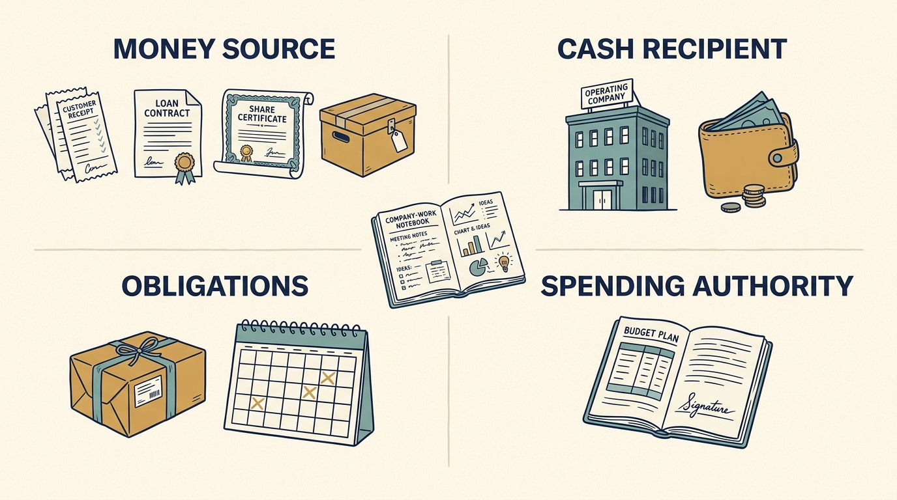

**Financing means arranging the money a company needs.** The source decides what it must deliver, repay or give up. A budget says how much may be spent; the terms say when, with whose approval and what is owed.

**Figure 1:** *Trace the source, the recipient (the operating company, meaning the business doing the work, or a selling owner), the obligations and the authority before promising company work.*

Larkspur, a fictional software company, needs €100,000 to finish a dispatch feature (it assigns jobs to field workers) by 1 March for three customers. Customers can pay for a product not yet delivered. A lender, also an investor, can supply a loan: the **principal** is the amount borrowed; **interest** is the charge for it. Owners can supply **equity**, ownership with no fixed repayment. **Selling** an asset, something the company owns, raises cash once.

A **share** is a unit of ownership. Buying **new shares** from a company funds the company; buying a founder’s **existing shares** (a founder started the company) pays the founder.

**The same €100,000 different ways and consequences.** A customer **prepayment**, cash paid before delivery, makes 1 March a contract term, with one month’s service refunded if it slips. A bank loan at a fixed 6% a year means 36 monthly repayments of about €3,040, starting before the customers pay. New shares give an investor about 10%, a seat on the board that oversees the company, a block on unplanned spending above €50,000 and an expected eventual sale.

Larkspur chose the prepayment. Two engineers, already paid from subscriptions, build it in four weeks (eight **engineer-weeks**, one engineer’s week each) by 13 February. The customers’ cash pays for the map-data licence (permission to use that data), contractors and a €10,000 overrun reserve. The board records its support; the chief executive signs within her delegated permission.

The loan was rejected as policy: repayments twice the €1,500 a month left after running costs would rest on the reserve and uncollected customer money. The share issue was rejected because its rights outlast the feature.

Nothing is promised until she countersigns the orders. If fewer than three are signed by 15 January, or the estimate exceeds twelve engineer-weeks, she signs nothing until the plan fits. Two customers still keep the original release, the version made available on 1 March, if the board approves a €35,000 loan (about €1,065 a month, inside the surplus), loan and orders are signed by 23 January and the schedule still fits. With one customer no affordable loan closes the gap, so the release shrinks to what that cash funds.

On a **stock exchange**, a market for trading shares, investors pay one another, not the company. A **public company**, whose shares trade there, publishes financial information under its rules; a **private company**’s shares do not trade there. [S55: Public-company reporting](https://www.investor.gov/introduction-investing/investing-basics/how-stock-markets-work/public-companies)

Investor labels are orientation, not terms. A **fund** pools money invested for others: **venture** funds buy under half of a young business's shares, **growth** funds back established ones, a **buyout** buys control and a **corporate** investor is another company. [[raise-what-you-need]] compares them.

Ask of every funding source **who receives the cash**, **what obligations come with it** and **who approves its use**. [[announcement-is-not-a-budget]] asks the same of a €100 million announcement.
