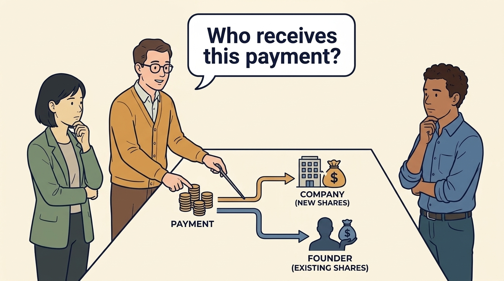
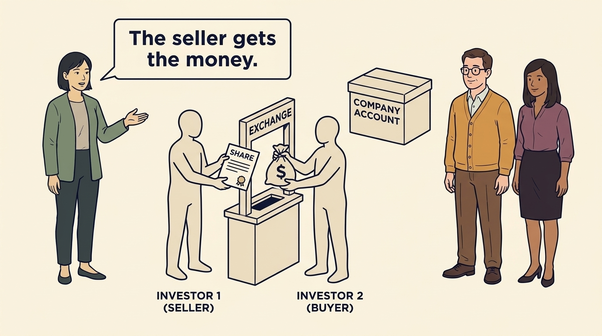
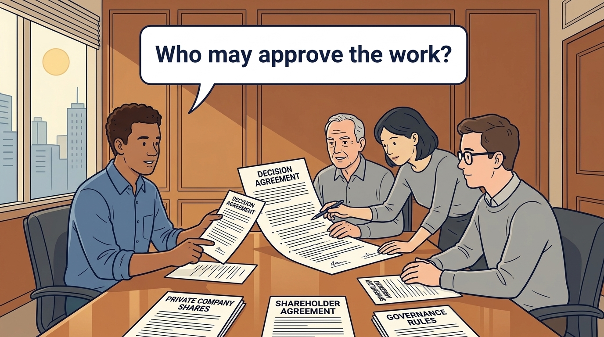

<!-- comic-style
{
  "cast": "MORGAN: a thoughtful investor technology adviser with short dark hair and a green jacket, used in the fund scenarios. ALEX: a practical CTO with curly hair and blue rolled-up sleeves. SAM: a CFO with round glasses and an amber cardigan. PRIYA: a product leader with straight dark hair and plum sleeves. INES: a CEO with short grey hair and a navy jacket. All are fictional; none represents a person in a real case.",
  "style": "Clean editorial explainer comic, dark ink outlines, restrained green, blue, and amber accents on warm white, generous space, readable short speech bubbles, expressive people and simple physical metaphors. No photorealism, logos, dense charts, or title text. Keep the same character appearances throughout the journal."
}
-->

**Comic.** Product and engineering leaders usually meet money as a budget. The panels show why, once investors are involved, the source of the money matters more than the amount: each source arrives with rights, repayment dates or an expected sale that decide what the budget can be spent on.

Morgan is an investor’s adviser in the fund scenarios; Alex leads technology, Priya leads product, and Sam leads finance. All are fictional. Comparative scenarios use separate assumptions. Historical cases are discussed through documents; the scenes do not reenact real events.

<!-- comic-panel
{
  "id": "01-scene",
  "status": "generated",
  "asset": "assets/images/00-how-companies-get-money/comic-01-scene.jpeg",
  "aspect_ratio": "16:9",
  "prompt": "Panel 1 of an explainer comic. Alex and Sam compare customer payments, a loan, owner funding and an asset sale on four cards. Use one speech bubble with the exact words: \"What comes with the money?\" Convey: Customers, loans, owners and asset sales are four common sources of company cash. Each brings different obligations; other sources, such as eligible grants, also exist.",
  "alt": "Comic panel: Alex and Sam compare customer payments, a loan, owner funding and an asset sale on four cards.",
  "caption": "Customers, loans, owners and asset sales are four common sources of company cash. Each brings different obligations; other sources, such as eligible grants, also exist.",
  "generation": {
    "model": "gemini-3-pro-image-preview",
    "reference_id": "owned-cast-20260913",
    "sha256": "3e154000bf946501d3eb98b0494070a6d1a40384d1b799fd891ecb59cbfb39ea"
  }
}
-->

**Panel 1:** Customers, loans, owners and asset sales are four common sources of company cash. Each brings different obligations; other sources, such as eligible grants, also exist.

*Dialogue:* “What comes with the money?”

<!-- comic-panel
{
  "id": "02-scene",
  "status": "generated",
  "asset": "assets/images/00-how-companies-get-money/comic-02-scene.jpeg",
  "aspect_ratio": "16:9",
  "prompt": "Panel 2 of an explainer comic. Sam traces one payment to a company issuing shares and another to a founder selling existing shares. Use one speech bubble with the exact words: \"Who receives this payment?\" Convey: A share is a unit of ownership. Buying new shares can fund the company; buying a founder’s existing shares pays the founder.",
  "alt": "Comic panel: Sam traces one payment to a company issuing shares and another to a founder selling existing shares.",
  "caption": "A share is a unit of ownership. Buying new shares can fund the company; buying a founder’s existing shares pays the founder.",
  "generation": {
    "model": "gemini-3-pro-image-preview",
    "reference_id": "owned-cast-20260913",
    "sha256": "e650b8b43df11cd7f045608cb336288613610e9e89ef542fdbdb8309e1e53a65"
  }
}
-->

**Panel 2:** A share is a unit of ownership. Buying new shares can fund the company; buying a founder’s existing shares pays the founder.

*Dialogue:* “Who receives this payment?”

<!-- comic-panel
{
  "id": "03-scene",
  "status": "generated",
  "asset": "assets/images/00-how-companies-get-money/comic-03-scene.jpeg",
  "aspect_ratio": "16:9",
  "prompt": "Panel 3 of an explainer comic. Morgan shows two investors trading a share through an exchange while the company account remains separate. Use one speech bubble with the exact words: \"The seller gets the money.\" Convey: A stock exchange is a market for trading shares. Investors buying existing shares normally pay the seller, rather than the company.",
  "alt": "Comic panel: Morgan shows two investors trading a share through an exchange while the company account remains separate.",
  "caption": "A stock exchange is a market for trading shares. Investors buying existing shares normally pay the seller, rather than the company.",
  "generation": {
    "model": "gemini-3-pro-image-preview",
    "reference_id": "owned-cast-20260913",
    "sha256": "7f807dc3d3a39a71ca81c191dfba49341fe184bf82d0fa64e1cc09742479d9cd"
  }
}
-->

**Panel 3:** A stock exchange is a market for trading shares. Investors buying existing shares normally pay the seller, rather than the company.

*Dialogue:* “The seller gets the money.”

<!-- comic-panel
{
  "id": "04-scene",
  "status": "generated",
  "asset": "assets/images/00-how-companies-get-money/comic-04-scene.jpeg",
  "aspect_ratio": "16:9",
  "prompt": "Panel 4 of an explainer comic. Alex places a company report, a share-price chart and a bank balance side by side. Use one speech bubble with the exact words: \"These tell us different things.\" Convey: Public companies publish financial information under the rules that apply to them. A public share price and reported profit are different from available cash.",
  "alt": "Comic panel: Alex places a company report, a share-price chart and a bank balance side by side.",
  "caption": "Public companies publish financial information under the rules that apply to them. A public share price and reported profit are different from available cash.",
  "generation": {
    "model": "gemini-3-pro-image-preview",
    "reference_id": "owned-cast-20260913",
    "sha256": "ba598073a1c44c6b3155490f8c451c6e6bca6a40013eb93526f27dc9355ce501"
  }
}
-->

**Panel 4:** Public companies publish financial information under the rules that apply to them. A public share price and reported profit are different from available cash.

*Dialogue:* “These tell us different things.”

<!-- comic-panel
{
  "id": "05-scene",
  "status": "generated",
  "asset": "assets/images/00-how-companies-get-money/comic-05-scene.jpeg",
  "aspect_ratio": "16:9",
  "prompt": "Panel 5 of an explainer comic. Three owners review their private company’s decision agreement with Alex. Use one speech bubble with the exact words: \"Who may approve the work?\" Convey: A private company’s shares do not trade on a public stock market. Its owners and decision rules still need to be understood.",
  "alt": "Comic panel: Three owners review their private company’s decision agreement with Alex.",
  "caption": "A private company’s shares do not trade on a public stock market. Its owners and decision rules still need to be understood.",
  "generation": {
    "model": "gemini-3-pro-image-preview",
    "reference_id": "owned-cast-20260913",
    "sha256": "047aef9491805dda0f0cdba897420e7f37ec88450ed2f14760bce3ab48ad76ee"
  }
}
-->

**Panel 5:** A private company’s shares do not trade on a public stock market. Its owners and decision rules still need to be understood.

*Dialogue:* “Who may approve the work?”

<!-- comic-panel
{
  "id": "06-scene",
  "status": "generated",
  "asset": "assets/images/00-how-companies-get-money/comic-06-scene.jpeg",
  "aspect_ratio": "16:9",
  "prompt": "Panel 6 of an explainer comic. Priya and Alex compare four ownership cards with Sam, keeping the company budget separate. Use one speech bubble with the exact words: \"What can we actually commit to?\" Convey: Venture, growth, buyout and corporate arrangements can bring different money, rights and expectations. Establish the actual terms before promising company work.",
  "alt": "Comic panel: Priya and Alex compare four ownership cards with Sam, keeping the company budget separate.",
  "caption": "Venture, growth, buyout and corporate arrangements can bring different money, rights and expectations. Establish the actual terms before promising company work.",
  "generation": {
    "model": "gemini-3-pro-image-preview",
    "reference_id": "owned-cast-20260913",
    "sha256": "dfd52e441ef63329397ed6f89279d3f623120c39d4a964b002a871ecbf7efce0"
  }
}
-->

**Panel 6:** Venture, growth, buyout and corporate arrangements can bring different money, rights and expectations. Establish the actual terms before promising company work.

*Dialogue:* “What can we actually commit to?”
