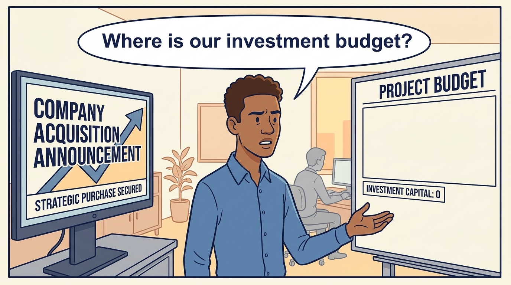
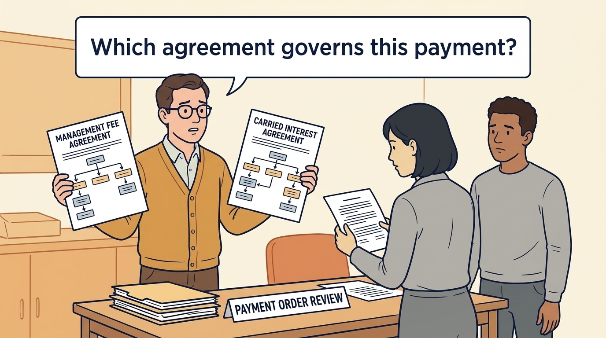

<!-- comic-style
{
  "cast": "MORGAN: a thoughtful investor technology adviser with short dark hair and a green jacket, used in the fund scenarios. ALEX: a practical CTO with curly hair and blue rolled-up sleeves. SAM: a CFO with round glasses and an amber cardigan. PRIYA: a product leader with straight dark hair and plum sleeves. INES: a CEO with short grey hair and a navy jacket. All are fictional; none represents a person in a real case.",
  "style": "Clean editorial explainer comic, dark ink outlines, restrained green, blue, and amber accents on warm white, generous space, readable short speech bubbles, expressive people and simple physical metaphors. No photorealism, logos, dense charts, or title text. Keep the same character appearances throughout the journal."
}
-->

**Comic.** An announcement describes a transaction, not a budget, and its headline may be a valuation, an estimate of what the company is worth, rather than money that changes hands. The panels follow a fictional investment announcement to show what has to be established before a hire can be authorized: how much cash reaches the business, when it arrives at closing (the day the deal completes and payments are made) and who can approve its use. Those questions apply under every ownership arrangement; the deal structure decides the answers.

Morgan is an investor’s adviser in the fund scenarios; Alex leads technology, Priya leads product, Sam leads finance and Ines is the chief executive officer (CEO). An investment fund is a pool of investors’ money managed under agreed rules. All are fictional. Comparative scenarios use separate assumptions. Historical cases are discussed through documents; the scenes do not reenact real events.

<!-- comic-panel
{
  "id": "01-scene",
  "status": "generated",
  "asset": "assets/images/01-announcement-is-not-a-budget/comic-01-scene.jpeg",
  "aspect_ratio": "16:9",
  "prompt": "Panel 1 of an explainer comic. Alex sees a large acquisition announcement beside an empty project budget. Use one speech bubble with the exact words: \"Where is our investment budget?\" Convey: An announcement that investors are buying shares (units of ownership) does not establish how much new cash the company receives.",
  "alt": "Comic panel: Alex sees a large acquisition announcement beside an empty project budget.",
  "caption": "An announcement that investors are buying shares (units of ownership) does not establish how much new cash the company receives.",
  "generation": {
    "model": "gemini-3-pro-image-preview",
    "reference_id": "owned-cast-20260913",
    "sha256": "512c6e5c9a242f4fd840519d349b29e95566ca83a902c755312007910fed8a49"
  }
}
-->

**Panel 1:** An announcement that investors are buying shares (units of ownership) does not establish how much new cash the company receives.

*Dialogue:* “Where is our investment budget?”

<!-- comic-panel
{
  "id": "02-scene",
  "status": "generated",
  "asset": "assets/images/01-announcement-is-not-a-budget/comic-02-scene.jpeg",
  "aspect_ratio": "16:9",
  "prompt": "Panel 2 of an explainer comic. Sam places four separate folders on a table. Use one speech bubble with the exact words: \"These are different entities.\" Convey: The investment firm manages a fund, a pool of investors’ money. A holding company is a company set up to own the operating business, the one that serves customers. These four organizations, or entities, have separate obligations.",
  "alt": "Comic panel: Sam places four separate folders on a table.",
  "caption": "The investment firm manages a fund, a pool of investors’ money. A holding company is a company set up to own the operating business, the one that serves customers. These four organizations, or entities, have separate obligations.",
  "generation": {
    "model": "gemini-3-pro-image-preview",
    "reference_id": "owned-cast-20260913",
    "sha256": "af36f045f91180a6ae8e72f8008ce640d1a100aecaa13e094b97a88bf4ea534a"
  }
}
-->

**Panel 2:** The investment firm manages a fund, a pool of investors’ money. A holding company is a company set up to own the operating business, the one that serves customers. These four organizations, or entities, have separate obligations.

*Dialogue:* “These are different entities.”

<!-- comic-panel
{
  "id": "03-scene",
  "status": "generated",
  "asset": "assets/images/01-announcement-is-not-a-budget/comic-03-scene.jpeg",
  "aspect_ratio": "16:9",
  "prompt": "Panel 3 of an explainer comic. Morgan watches a fund investor read a request to supply promised money. Use one speech bubble with the exact words: \"Committed does not mean transferred.\" Convey: A commitment is a promise to supply money. A capital call requests payment from an investor in the fund. Nothing moves until the investor pays.",
  "alt": "Comic panel: Morgan watches a fund investor read a request to supply promised money.",
  "caption": "A commitment is a promise to supply money. A capital call requests payment from an investor in the fund. Nothing moves until the investor pays.",
  "generation": {
    "model": "gemini-3-pro-image-preview",
    "reference_id": "owned-cast-20260913",
    "sha256": "f9879c8c37425afb0a3c2e5d9c83e477adc72b80473d8c6981dcab12942fdc6c"
  }
}
-->

**Panel 3:** A commitment is a promise to supply money. A capital call requests payment from an investor in the fund. Nothing moves until the investor pays.

*Dialogue:* “Committed does not mean transferred.”

<!-- comic-panel
{
  "id": "04-scene",
  "status": "generated",
  "asset": "assets/images/01-announcement-is-not-a-budget/comic-04-scene.jpeg",
  "aspect_ratio": "16:9",
  "prompt": "Panel 4 of an explainer comic. Alex follows a payment toward a selling shareholder. Use one speech bubble with the exact words: \"The seller receives this payment.\" Convey: Buying an existing shareholder’s shares pays that seller. Of the money paid for shares, payment for newly issued shares goes to the issuing company; payment for existing shares goes to the seller. So this purchase does not directly fund the company’s product work.",
  "alt": "Comic panel: Alex follows a payment toward a selling shareholder.",
  "caption": "Buying an existing shareholder’s shares pays that seller. Of the money paid for shares, payment for newly issued shares goes to the issuing company; payment for existing shares goes to the seller. So this purchase does not directly fund the company’s product work.",
  "generation": {
    "model": "gemini-3-pro-image-preview",
    "reference_id": "owned-cast-20260913",
    "sha256": "67c2954722b42f4c722815360c1c79f2bf56761b36dbfe405c7d104f9d9825b1"
  }
}
-->

**Panel 4:** Buying an existing shareholder’s shares pays that seller. Of the money paid for shares, payment for newly issued shares goes to the issuing company; payment for existing shares goes to the seller. So this purchase does not directly fund the company’s product work.

*Dialogue:* “The seller receives this payment.”

<!-- comic-panel
{
  "id": "05-scene",
  "status": "generated",
  "asset": "assets/images/01-announcement-is-not-a-budget/comic-05-scene.jpeg",
  "aspect_ratio": "16:9",
  "prompt": "Panel 5 of an explainer comic. Sam holds two agreements showing different payment orders. Use one speech bubble with the exact words: \"Which agreement governs this payment?\" Convey: A management fee pays the investment firm for managing the fund’s investments. Carried interest, also called carry, is the firm’s share of investment profits: the gain after investment costs and the deductions the fund agreement allows, paid in the order that agreement sets. Company executives’ own shares follow a separate agreement.",
  "alt": "Comic panel: Sam holds two agreements showing different payment orders.",
  "caption": "A management fee pays the investment firm for managing the fund’s investments. Carried interest, also called carry, is the firm’s share of investment profits: the gain after investment costs and the deductions the fund agreement allows, paid in the order that agreement sets. Company executives’ own shares follow a separate agreement.",
  "generation": {
    "model": "gemini-3-pro-image-preview",
    "reference_id": "owned-cast-20260913",
    "sha256": "e6cf378d952480c447020b1367bd00f81822321b95d0bf15a079357496d27603"
  }
}
-->

**Panel 5:** A management fee pays the investment firm for managing the fund’s investments. Carried interest, also called carry, is the firm’s share of investment profits: the gain after investment costs and the deductions the fund agreement allows, paid in the order that agreement sets. Company executives’ own shares follow a separate agreement.

*Dialogue:* “Which agreement governs this payment?”

<!-- comic-panel
{
  "id": "06-scene",
  "status": "generated",
  "asset": "assets/images/01-announcement-is-not-a-budget/comic-06-scene.jpeg",
  "aspect_ratio": "16:9",
  "prompt": "Panel 6 of an explainer comic. Alex and Sam sit at a table with four cards labelled VENTURE, GROWTH, BUYOUT and CORPORATE beside a folder labelled COMPANY BUDGET; Sam points at the folder. Use one speech bubble with the exact words: \"Which money can fund our team?\" Convey: The cards name four kinds of investor: venture (funding young businesses), growth (funding the expansion of established ones), buyout (buying control of a company) and corporate (another operating company). In the fictional share issue, investors paid €8 million (€8m) for new Larkspur shares at closing. Transaction costs, the legal and advisory fees of arranging the deal, took €0.4m and left €7.6m for the company. The board’s approved plan allows four new engineering hires, so Ines, the CEO, could authorize three within it. Alex’s original request for five was one more than the plan allows and would have needed the consent of the investor director, the board member the investors appointed. A purchase of existing shares would have paid the seller instead. A corporate owner’s budget needs its own approval.",
  "alt": "Comic panel: Alex and Sam sit at a table with cards labelled venture, growth, buyout and corporate beside a company-budget folder, asking which money can fund the team.",
  "caption": "The cards name four kinds of investor: venture (funding young businesses), growth (funding the expansion of established ones), buyout (buying control of a company) and corporate (another operating company). In the fictional share issue, investors paid €8 million (€8m) for new Larkspur shares at closing. Transaction costs, the legal and advisory fees of arranging the deal, took €0.4m and left €7.6m for the company. The board’s approved plan allows four new engineering hires, so Ines, the CEO, could authorize three within it. Alex’s original request for five was one more than the plan allows and would have needed the consent of the investor director, the board member the investors appointed. A purchase of existing shares would have paid the seller instead. A corporate owner’s budget needs its own approval.",
  "generation": {
    "model": "gemini-3-pro-image-preview",
    "reference_id": "owned-cast-20260913",
    "sha256": "6ccad1514665d0ea06070053d73f768634e474843a3402998bf44fe3f2c3a557"
  }
}
-->

**Panel 6:** The cards name four kinds of investor: venture (funding young businesses), growth (funding the expansion of established ones), buyout (buying control of a company) and corporate (another operating company). In the fictional share issue, investors paid €8 million (€8m) for new Larkspur shares at closing. Transaction costs, the legal and advisory fees of arranging the deal, took €0.4m and left €7.6m for the company. The board’s approved plan allows four new engineering hires, so Ines, the CEO, could authorize three within it. Alex’s original request for five was one more than the plan allows and would have needed the consent of the investor director, the board member the investors appointed. A purchase of existing shares would have paid the seller instead. A corporate owner’s budget needs its own approval.

*Dialogue:* “Which money can fund our team?”
