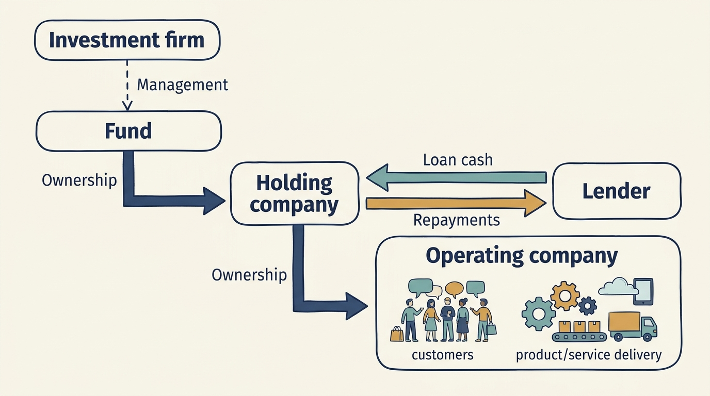
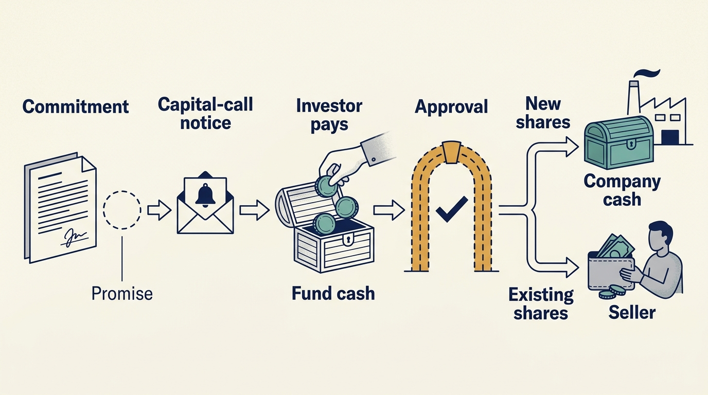

> **IN THIS SECTION, YOU WILL:** Learn how to understand who owns the company, who supplies its money, and who can decide how it is used.

> **WHY IS THIS IMPORTANT:** Leaders who plan hiring against a headline figure plan against money the company may never see; the announcement describes a change of ownership, not a budget.

> **KEY POINTS:**
>
> * Find out **who receives the investment money**. Buying a founder’s shares pays the founder; buying new shares can put money into the company.
> * **Separate the organizations involved**. The investment firm, its fund, the company used to hold the investment, and the business serving customers can have different money and obligations.
> * Distinguish **an estimate from a payment**. Saying an investment is worth more does not mean its owners have received cash, and a headline figure does not authorize a hire until the payer, the approver and the conditions are on one page.

 
Your company announces a €100 million investment. It's natural to expect a larger hiring or product budget. But the announcement may describe money paid to selling shareholders, repayment of old loans and transaction costs. Only the part actually supplied to the business increases its cash directly.

An announcement describes a transaction. To turn it into a hiring plan, establish how much cash reaches the business, when it arrives and who can authorize its use. These questions matter under every ownership arrangement. A transaction changes the conditions of the answer: the headline figure describes a change of ownership, and the amount that reaches the business depends on how the deal was structured. A product or engineering leader who plans hiring against the announcement rather than the deal terms is planning against money the company may never see.

[[customers-lenders-investors]] traced €100,000 through a prepayment, a loan and a share issue. This chapter does the same at transaction scale. It compares a minority funding round, a fund-backed buyout and corporate ownership, explains the fund structure behind one of them, and ends with the one-page record that turns Alex's hiring assumption into an authorized plan.

## Map the Arrangement Before Relying on the Money

Consider three alternative, fictional Larkspur announcements. In each, Alex wants to hire three engineers for onboarding. The number in the announcement cannot approve those hires.

| Announcement | Where money goes under these assumptions | What Alex needs to establish |
| --- | --- | --- |
| Investors buy €8m of newly issued minority shares | The company receives €8m before transaction costs | Which operating plan is approved, what consents apply and how long that plan can be funded |
| A fund buys the founder’s shares for €40m | The selling founder receives the purchase money | Whether separate company funding exists and which payments the new financing requires |
| A corporate group buys Larkspur | Selling shareholders receive the agreed share price | Which group entity funds future work and how the local budget relates to the parent’s priorities |

If an existing investor joins another round, that doesn't mean every shareholder contributes again. If a corporate investment is a minority stake, it doesn't automatically make the company part of the parent’s operating hierarchy. Draw the actual arrangement.

Use one page to identify the shareholder, the entity supplying cash, the person authorized to commit it and any conditions before payment. Include the date by which a promised decision must arrive for the engineering plan to stay feasible. The end of this chapter shows that page completed for the first announcement.

The next sections explain a fund-backed arrangement in detail. Venture and growth investors can also use funds; corporate and individual owners may use different structures. Don't invent a fund, a holding company or a fixed sale deadline when the arrangement has none.

## A Fund-Backed Buyout Can Involve Four Separate Organizations

A useful starting map separates four types of **entity**, meaning an organization or legal body. Actual transactions can have more layers, several investors and different arrangements. The map's purpose is to locate money and responsibilities, not to assume everyone shares one bank account.

| Entity | What it is | Main responsibilities or interests |
| --- | --- | --- |
| **Investment firm** (financial sponsor, manager) | Employs the investment and operating professionals; may manage several funds. | Manage investments, meet obligations to fund investors and sustain its own business |
| **Fund** | An investment vehicle with its own investors, committed capital, investment scope and agreed term. | Invest and distribute proceeds under its governing agreements |
| **Holding vehicle** | A company set up to hold the investment; it may also borrow. | Hold ownership and meet its own obligations |
| **Portfolio company** | The operating business: sells to customers, employs people and pays suppliers. | Serve customers, meet obligations and sustain the business |

The map below shows how money moves between them in a fund-backed buyout. It's conceptual, not a legal organization chart, and it illustrates one form of investor ownership, not every form. Read the arrows from the investors and lenders toward the business, then follow investment proceeds back to the fund’s investors:

---begin mermaid---
flowchart TD
  LP[Limited partners] -->|Capital commitments and calls| F[Fund]
  M[Investment manager] -->|Investment and ownership work| F
  F -->|Equity investment| H[Acquisition or holding vehicle]
  L[Lenders] -->|Contractual financing| H
  H -->|Ownership| C[Portfolio company]
  CU[Customers] -->|Payments for products and services| C
  C -->|Permitted payments to owners| H
  B[Future buyer] -->|Payment for the portfolio company's shares| H
  H -->|Investment proceeds| F
  F -->|Distributions under the waterfall| LP
---end mermaid---

The sale route needs one clarification, because beginners should not have to infer which shares change hands. In this diagram the future buyer purchases the **portfolio company's shares from the holding vehicle**, so the payment lands in the holding vehicle, which repays its lenders and passes what remains to the fund. In other transactions the buyer purchases the holding vehicle itself from the fund, and the payment goes to the fund directly with the borrowing still attached to what was bought. Either way, the buyer pays for existing shares; the payment comes from that buyer, not from the company's customers, and none of it is new money for the operating business unless the agreement says so. A real financing review also needs the intermediate companies, taxes, lender protections and any other investors.

Two consequences follow from the map.

**"The firm has capital" is not a statement about you.** A firm may be raising a €2 billion fund while the fund that owns your company is fully invested and near the end of its life. Those are different pots. An investment from the new fund would need its own justification and approvals under the relevant agreements; it isn't an automatic source of support for the older fund’s company.

**Locate the borrowing as well as the cash.** Debt can sit in a holding company, an operating company or several entities. The company’s **balance sheet**, a statement of assets, obligations and equity at a date, needs reading at the relevant level. Payments required elsewhere in the ownership structure may still depend on cash from the operating business. Ask finance to explain those connections.

So before accepting a cloud migration budget, ask **which entity pays the invoice** and who can commit its money. Before relying on a promise of support, ask **by what mechanism the capital would actually arrive**. Before sharing customer data with anyone at the owner, ask who is receiving it and under what authority. Common ownership answers none of these.

**Figure 1:** *Map the legal entities and their obligations before assuming one organization can use another’s money.*

## Commitments Are Promises, Not Payments

The money in the fund comes from **limited partners**, or LPs — pension funds, insurers, endowments, university funds. An **endowment** is a pool of assets invested to support an institution, such as a university. These investors supply fund capital; whether any of it reaches a company’s technology budget depends on the transaction. In the common partnership form, the **general partner**, or GP, holds the management responsibilities and powers under the fund arrangements. The investment firm often acts as the fund's manager under a separate agreement, and "GP" is used informally for the firm; which body actually approves an investment is whatever those agreements say.

In a common arrangement, an LP doesn't pay its entire promised investment at once. It makes a **commitment**: a promise to supply money when asked, under agreed conditions. When the fund needs money for an investment, it issues a **capital call**.

Follow one fictional LP with a €10 million commitment:

| | Event | Cash to the LP |
| --- | --- | ---: |
| Year 1 | Commits €10m. No money moves. | — |
| Year 1 | First capital call: €2m requested, LP pays. | −€2m |
| Year 3 | The fund raises its estimates of what its companies are worth. | **€0** |
| Year 7 | A company is sold; proceeds are distributed. | +€3.5m |

The row that matters is year 3. **A valuation increase pays nobody.** It's an estimate, not a transfer, and the LP can't spend it. That distinction runs through the whole book: the moment a company is said to be worth more is not the moment anyone receives anything.

An agreement may let the fund reinvest proceeds or require an investor to return an earlier payment under stated conditions. Those details change cash timing. The basic distinction stands: a promise, a payment and a valuation estimate are three different events.

A fund's life includes fundraising, investing, supporting companies, selling investments or otherwise receiving proceeds, and eventually closing the fund. These phases overlap. The investment period and the fund's overall term are different clocks; extensions and reinvestment provisions depend on the agreement. The **Institutional Limited Partners Association (ILPA)** represents investors in private funds. Its principles are recommendations, not terms binding every fund. [S02: ILPA principles](https://ilpa.org/wp-content/uploads/2019/06/ILPA-Principles-3.0_2019.pdf)

For a company leader, the relevant question isn't simply how long private equity usually holds a company. It's how much time and flexibility this ownership structure has, and **what happens if an intended exit is delayed**.

**Figure 2:** *Committed capital, cash in a fund and cash available to a company are different states.*

## Fees and Profit Sharing Shape Incentives

The manager is paid through a **management fee**, which supports its business under the agreed fee basis, and may receive **carried interest**, a contractual share of investment profits paid out in an order set by a **distribution waterfall**. Carry is different from a company's executive bonus and different again from management's shares in that company. These terms shape which requests a company receives and when: a fund near the end of its term, or a manager whose profit share depends on a realization, has reasons to prefer some kinds of work over others. [[different-bets]] examines those incentives, [[three-different-returns]] the return measures behind them, and the optional reference [[fund-economics]] carries the worked waterfall with the preferred return, catch-up and clawback for readers who want the mechanics.

Fees, allocation of shared expenses and related-party services also create conflicts. The SEC's guide explicitly discusses the possibility that the manager's interests differ from those of its funds. [S01: SEC investor guide](https://www.investor.gov/introduction-investing/investing-basics/investment-products/private-investment-funds/private-equity) A company leader should therefore ask who funds an operating intervention and whether the provider has a financial interest in the recommendation. Useful support can still involve a conflict that needs to be understood.

## Owning a Company Does Not Mean Running It

An owner’s influence over the company and an executive’s authority to act for it come from different roles and agreements.

An **investment committee** is the body authorized to approve investments for the fund under its arrangements. A company’s **board** oversees the business within its own authority, while executives manage day-to-day work. Buying a company, approving its annual plan and signing a customer contract are different decisions. Share ownership alone doesn't give every shareholder authority to sign contracts for the company. Financing agreements may also require lender approval for particular actions. When someone says "the investor wants X," the useful reply is: which body, exercising which right, and can they actually require it?

Some investment firms employ an investor's technology adviser who may contribute to both investment and company discussions; this book's example of such a role is the Technology Principal, Morgan. The role's authority must be established in each forum; neither a venture investor nor a corporate owner necessarily provides an equivalent role. [[investors-adviser]] develops the role; [[decide-who-decides]] works through the decision rights in detail.

## Alex's Hire: The Completed Funding-and-Authority Record

Return to the first announcement: investors buy €8m of newly issued minority shares in Larkspur. Alex proposed three onboarding engineers the day the announcement went out. Here is the one-page record Sam and Alex completed three weeks later, with the source of each entry. All figures are fictional.

| Field | Entry | Where the information came from |
| --- | --- | --- |
| Proposed commitment | Three onboarding engineers starting 1 November; about €300,000 a year recurring | Alex |
| Paying entity | Larkspur, the operating company, from its own bank account | Finance: the subscription agreement names Larkspur as the issuer and recipient |
| Cash state | Subscription agreement signed 20 September; €8m received 3 October; €0.4m transaction costs paid; €7.6m net added to Larkspur's cash | Finance: bank statement and the closing statement |
| Approver | The Larkspur board, under the shareholders' agreement. The board approved the year-one operating plan on 10 October; hires within that plan need no further consent | Board minutes; shareholders' agreement read by legal |
| Conditions | Spending above €250,000 outside the approved plan needs the consent of the investor's director. The plan includes four engineering hires in year one, so Alex's three fall within it | Legal: shareholders' agreement, consent schedule |
| Runway effect | The €7.6m funds the approved plan for about 24 months at planned spending; the three hires are inside that plan | Finance: cash plan |
| Decision date | Offers out by 15 October for a 1 November start | Alex |

**The decision.** Ines, as CEO, authorizes the three offers on 12 October within the approved plan; no separate investor consent is needed. The alternatives were rejected on the record: hiring five engineers, Alex's first proposal, would have taken the year-one engineering headcount above the plan and required the investor director's consent; waiting for the "innovation budget" the announcement seemed to promise was rejected because no such budget exists in any agreement. Funding is the €7.6m net received, not the €8m announced. The scarce capacity is recruiting time and the onboarding team's ability to absorb three people at once. The evidence that would reopen the decision: a revision of the board-approved plan, first-quarter onboarding volume below the plan's assumption, or net cash below the €7.6m the closing statement shows.

Had the second announcement been the real one, the record would look different in its first three rows: the €40m paid the founder, Larkspur's own cash did not change, and the paying entity for any new hire would have been Larkspur out of existing earnings or a separate funding commitment that the record would have to name, with its own approver and conditions. The page is the same; the answers are what change.

## From Money and Authority to Value

Customer payments sustain the operating business. Investors, lenders and future buyers can also bring cash into the wider arrangement. Keeping those sources separate explains why a well-funded investor and a cash-constrained company can coexist.

You can now trace who supplies cash, who receives it and which body makes a decision, and you have seen the record that turns an announcement into an authorized hire. The next question is how people estimate the value of the business and its shares, because the announced €100 million was a valuation before it was anything else. That needs three basic financial ideas, sales, profit and cash, which we develop in [[valuation-is-an-estimate]].

## Questions to Consider

1. *Can you complete the record above for your own arrangement: which entity pays, which figures are commitments, payments received or valuation estimates, who can commit the money and what conditions apply before payment?*
2. *When someone says “the investor has capital”, which pot are they describing: the fund that owns your company, a different fund or the firm’s own business?*
3. *Where does the borrowing sit in your structure, and which of the operating company’s cash flows are needed to service it?*
4. *When you hear “the investor wants X”, do you know which body, exercising which right, is behind the request and whether it can actually require it?*

## To Probe Further

- **[Buyouts: A Primer](https://www.nber.org/papers/w29502)** — Tim Jenkinson, Hyeik Kim and Michael Weisbach, National Bureau of Economic Research working paper, 2021. *The four-entity map in this chapter in fuller academic form, covering how buyout funds are organised and how general partners and company managers are paid.*
- **[Model Limited Partnership Agreement](https://ilpa.org/industry-guidance/templates-standards-model-documents/model-limited-partnership-agreement/)** — Institutional Limited Partners Association, 2019, revised 2020. *Free model fund agreements so you can read the actual clauses behind commitments, capital calls, the distribution waterfall and clawback, as investors would prefer them.*
- **[The Economics of Private Equity Funds](https://academic.oup.com/rfs/article-abstract/23/6/2303/1569783)** — Andrew Metrick and Ayako Yasuda, Review of Financial Studies, 2010. *Data on 238 funds showing that most of a manager's expected revenue comes from fixed fees rather than carry, the numbers behind the fee and profit-sharing mechanics summarized here and worked through in the fund-economics reference.*
- **[Eclipse of the Public Corporation](https://hbr.org/1989/09/eclipse-of-the-public-corporation)** — Michael C. Jensen, Harvard Business Review, 1989. *The original case for the ownership structure this chapter maps, written by its most prominent advocate, so read it as advocacy rather than a test of the model.*
- **[Patient Capital: The Challenges and Promises of Long-Term Investing](https://press.princeton.edu/books/paperback/9780691217086/patient-capital)** — Victoria Ivashina and Josh Lerner, Princeton University Press, 2019 (paperback 2021). *The limited partners' side of the arrangement, which explains why a fund's life and exit timing create pressure on a company at all.*
