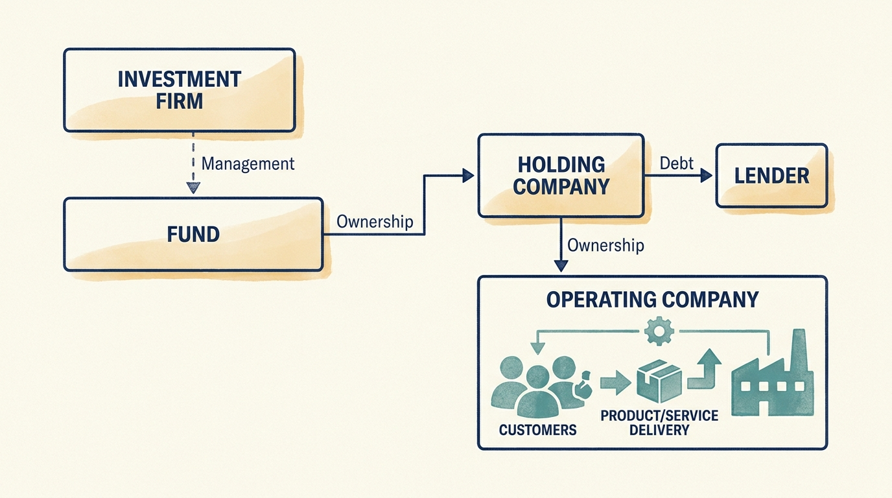
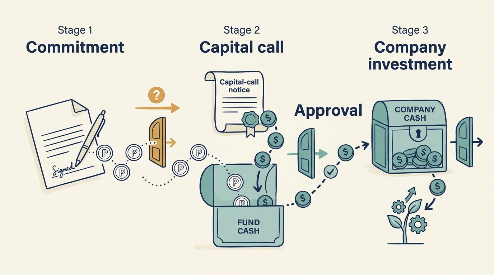

> **KEY POINTS:**
>
> * Find out **who receives the investment money**. Buying a founder’s shares pays the founder; buying new shares can put money into the company.
> * **Separate the organizations involved**. The investment firm, its fund, the company used to hold the investment, and the business serving customers can have different money and obligations.
> * Distinguish **an estimate from a payment**. Saying an investment is worth more does not mean its owners have received cash.

 
Your company announces a €100 million investment. It is natural to expect a larger hiring or product budget. But the announcement may describe money paid to selling shareholders, repayment of old loans, and transaction costs. Only the part actually supplied to the business increases its cash directly.

In a company with no outside investor, the budget is roughly what the business earns and chooses to spend. An investment transaction breaks that link. The headline figure describes a change of ownership, and the amount that reaches the business depends on how the deal was structured. A product or engineering leader who plans hiring against the announcement rather than the deal terms is planning against money the company may never see.

[[how-companies-get-money]] introduced the difference between funding a company and buying its existing shares. We will now compare a minority funding round, a fund-backed buyout and corporate ownership. Then we examine the fund structure in more depth so you can distinguish an investor’s capacity from money committed to your company.

## Map the Arrangement Before Relying on the Money

Consider three alternative, fictional Larkspur announcements. In each, Alex wants to hire engineers for onboarding. The number in the announcement cannot approve those hires.

| Announcement | Where money goes under these assumptions | What Alex needs to establish |
| --- | --- | --- |
| Investors buy €8m of newly issued minority shares | The company receives €8m before transaction costs | Which operating plan is approved, what consents apply and how long that plan can be funded |
| A fund buys the founder’s shares for €40m | The selling founder receives the purchase money | Whether separate company funding exists and which payments the new financing requires |
| A corporate group buys Larkspur | Selling shareholders receive the agreed share price | Which group entity funds future work and how the local budget relates to the parent’s priorities |

If an existing investor participates in another round, that does not mean every shareholder contributes again. If a corporate investment is a minority stake, it does not automatically make the company part of the parent’s operating hierarchy. Draw the actual arrangement.

Use one page to identify the shareholder, the entity supplying cash, the person authorized to commit it and any conditions before payment. Include the date on which a promised decision must arrive for the engineering plan to remain feasible. The exercise converts ownership information into something a leader can act on.

The next sections explain a fund-backed arrangement in detail. Venture and growth investors can also use funds; corporate and individual owners may use different structures. Do not invent a fund, a holding company or a fixed sale deadline when the arrangement has none.

## A Fund-Backed Buyout Can Involve Four Separate Organizations

A useful starting map separates four types of **entity**, meaning an organization or legal body. Actual transactions can have more layers, several investors and different arrangements. The purpose of this map is to locate money and responsibilities, rather than assume that everyone shares one bank account.

| Entity | What it is | Main responsibilities or interests |
| --- | --- | --- |
| **Investment firm** (sponsor, manager) | Employs the investment and operating professionals; may manage several funds. | Manage investments, meet obligations to fund investors and sustain its own business |
| **Fund** | An investment vehicle with its own investors, committed capital, investment scope and agreed term. | Invest and distribute proceeds under its governing agreements |
| **Holding vehicle** | A company set up to hold the investment; it may also borrow. | Hold ownership and meet its own obligations |
| **Portfolio company** | The operating business: sells to customers, employs people and pays suppliers. | Serve customers, meet obligations and sustain the business |

Two consequences follow immediately.

**"The firm has capital" is not a statement about you.** A firm may be raising a €2 billion fund while the fund that owns your company is fully invested and near the end of its life. Those are different pots. An investment from the new fund would need its own justification and approvals under the relevant agreements; it is not an automatic source of support for the older fund’s company.

**Locate the borrowing as well as the cash.** Debt can sit in a holding company, an operating company, or several entities. The company’s **balance sheet**, a statement of assets, obligations and equity at a date, needs to be read at the relevant level. Payments required elsewhere in the ownership structure may still depend on cash from the operating business. Ask finance to explain those connections.

So before accepting a cloud migration budget, ask **which entity pays the invoice** and who can commit its money. Before relying on a promise of support, ask **by what mechanism the capital would actually arrive**. Before sharing customer data with anyone at the owner, ask who is receiving it and under what authority. Common ownership answers none of these.

**Figure 1:** *Map the legal entities and their obligations before assuming one organization can use another’s money.*

## Commitments Are Promises, Not Payments

The money in the fund comes from **limited partners**, or LPs — pension funds, insurers, endowments, university funds. An **endowment** is a pool of assets invested to support an institution, such as a university. These investors supply fund capital; whether any of it reaches a company’s technology budget depends on the transaction. The **general partner**, or GP, is the entity that manages the fund and makes the investment decisions.

In a common arrangement, an LP does not pay its entire promised investment at once. It makes a **commitment**: a promise to supply money when asked, under agreed conditions. When the fund needs money for an investment, it issues a **capital call**.

Follow one fictional LP with a €10 million commitment:

| | Event | Cash to the LP |
| --- | --- | ---: |
| Year 1 | Commits €10m. No money moves. | — |
| Year 1 | First capital call: €2m requested, LP pays. | −€2m |
| Year 3 | The fund raises its estimates of what its companies are worth. | **€0** |
| Year 7 | A company is sold; proceeds are distributed. | +€3.5m |

The row that matters is year 3. **A valuation increase pays nobody.** It is an estimate, not a transfer, and the LP cannot spend it. That distinction runs through the whole book: the moment a company is said to be worth more is not the moment anyone receives anything.

An agreement may allow the fund to reinvest proceeds or require an investor to return an earlier payment under stated conditions. Those details change cash timing. The basic distinction remains: a promise, a payment and a valuation estimate are three different events.

A fund's life includes fundraising, investing, supporting companies, selling investments or otherwise receiving proceeds, and eventually closing the fund. These phases overlap. The investment period and the fund's overall term are different clocks; extensions and reinvestment provisions depend on the agreement. The **Institutional Limited Partners Association (ILPA)** represents investors in private funds. Its principles offer recommendations on these matters; they are not terms binding every fund. [S02: ILPA principles](https://ilpa.org/wp-content/uploads/2019/06/ILPA-Principles-3.0_2019.pdf)

For a company leader, the relevant question is not simply how long private equity usually holds a company. It is how much time and flexibility this ownership structure has, and **what happens if an intended exit is delayed**.

**Figure 2:** *Committed capital, cash in a fund and cash available to a company are different states.*

## How Fees and Profit Sharing Work

A **management fee** supports the manager's business under the agreed fee basis. **Carried interest**, or carry, is a contractual share of investment profits allocated to the GP or other entitled recipients. Carry is different from a company's executive bonus and different again from management's shares in that company.

A **distribution waterfall** sets the order in which money coming out of a fund is paid. Take €160 of proceeds from €100 originally contributed, in a deliberately simple arrangement with no fees or taxes:

| Step | Who gets it | Amount |
| --- | --- | ---: |
| 1. Return the capital | LPs get their €100 back first | €100 |
| 2. Split the €60 profit | 20% carry to the GP | €12 |
| | remainder to the LPs | €48 |
| | **LPs receive in total** | **€148** |

In this example, the LPs receive their original €100 before the profit is shared. Actual agreements can distribute profits at different stages. They may include a **preferred return**, a threshold before specified profit sharing begins; a **catch-up**, a rule allowing the manager to receive a larger share of the next payments; or a **clawback**, a requirement to return excess profit distributions. The preferred return is not a guaranteed investment return. The 20% rate here is an illustrative assumption.

Fees, allocation of shared expenses, and related-party services also create conflicts. The SEC's guide explicitly discusses the possibility that the manager's interests differ from those of its funds. [S01: SEC investor guide](https://www.investor.gov/introduction-investing/investing-basics/investment-products/private-investment-funds/private-equity) A portfolio leader should therefore ask who funds an operating intervention and whether the provider has a financial interest in the recommendation. Useful support can still involve a conflict that needs to be understood.

## Owning a Company Does Not Mean Running It

An owner’s influence over the company and an executive’s authority to act for it come from different roles and agreements.

An **investment committee** is the body authorized to approve investments for the fund under its arrangements. A company’s **board** oversees the business within its own authority, while executives manage day-to-day work. Buying a company, approving its annual plan and signing a customer contract are different decisions. Share ownership alone does not give every shareholder authority to sign contracts for the company. Financing agreements may also require lender approval for particular actions. When someone says "the investor wants X," the useful reply is: which body, exercising which right, and can they actually require it?

Some firms employ a Technology Principal, a technology adviser who may contribute to both investment and company discussions. The role’s authority must be established in each forum; neither a venture investor nor a corporate owner necessarily provides an equivalent role. [[technology-principal]] develops the role; [[governance]] works through the decision rights in detail.

The map below illustrates a fund-backed buyout, not every form of investor ownership. It is conceptual, not a legal organization chart. Read the arrows from the investors and lenders toward the business, then follow investment proceeds back to the fund’s investors:

---begin mermaid---
flowchart TD
  LP[Limited partners] -->|Capital commitments and calls| F[Fund]
  M[Investment manager] -->|Investment and ownership work| F
  F -->|Equity investment| H[Acquisition or holding vehicle]
  L[Lenders] -->|Contractual financing| H
  H -->|Ownership| C[Portfolio company]
  CU[Customers] -->|Payments for products and services| C
  C -->|Permitted payments to owners| H
  B[Future buyer] -->|Payment for shares on sale| H
  H -->|Investment proceeds| F
  F -->|Distributions under the waterfall| LP
---end mermaid---

The diagram simplifies the structure. A real financing review also needs the intermediate companies, taxes, lender protections and any other investors. The future buyer is shown separately because payment for existing shares comes from that buyer, rather than from the company’s customers.

Customer payments sustain the operating business. Investors, lenders and future buyers can also bring cash into the wider arrangement. Keeping those sources separate helps explain why a well-funded investor and a cash-constrained company can coexist.

You can now trace who supplies cash, who receives it and which body makes a decision. The next question is how people estimate the value of the business and its shares. That requires three basic financial ideas—sales, profit and cash—which we develop in [[valuation-and-architecture]].
