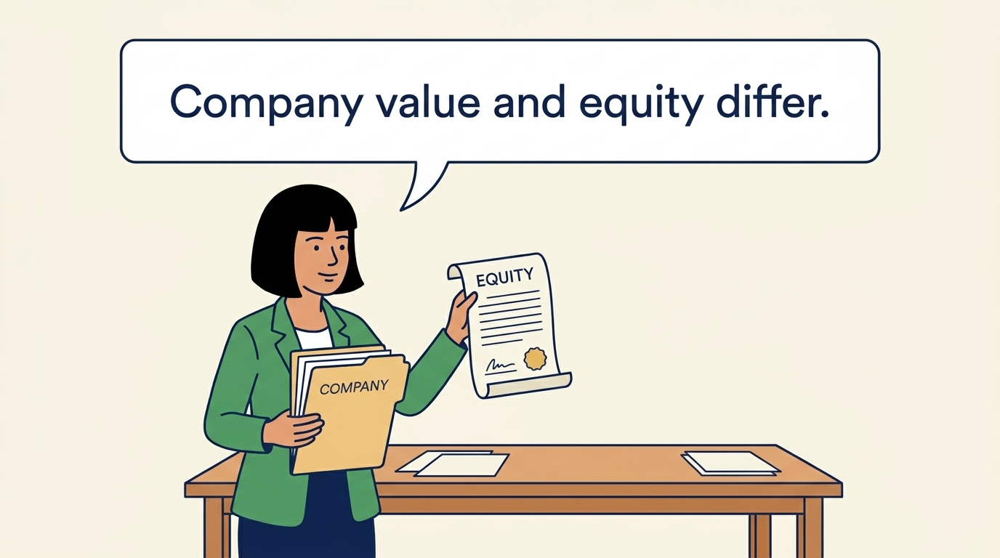
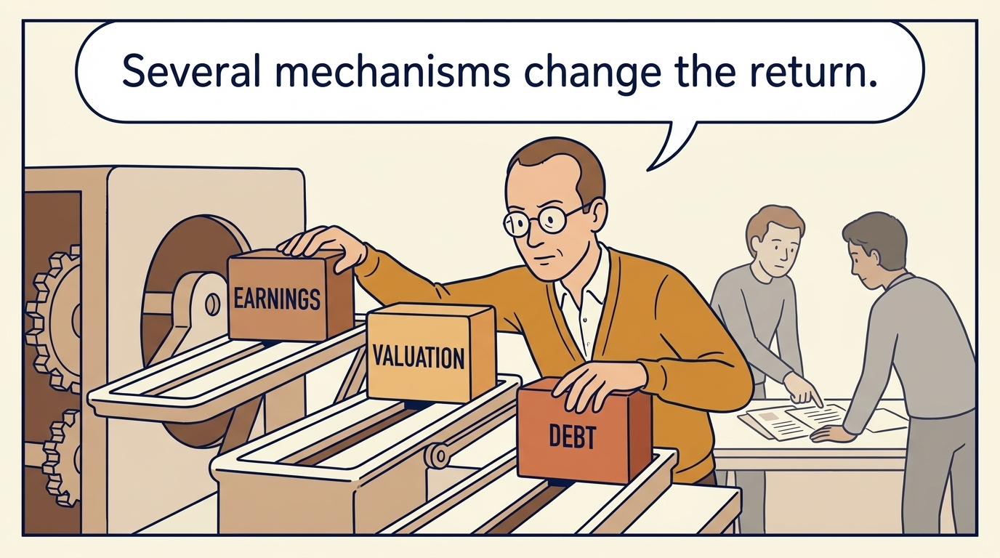
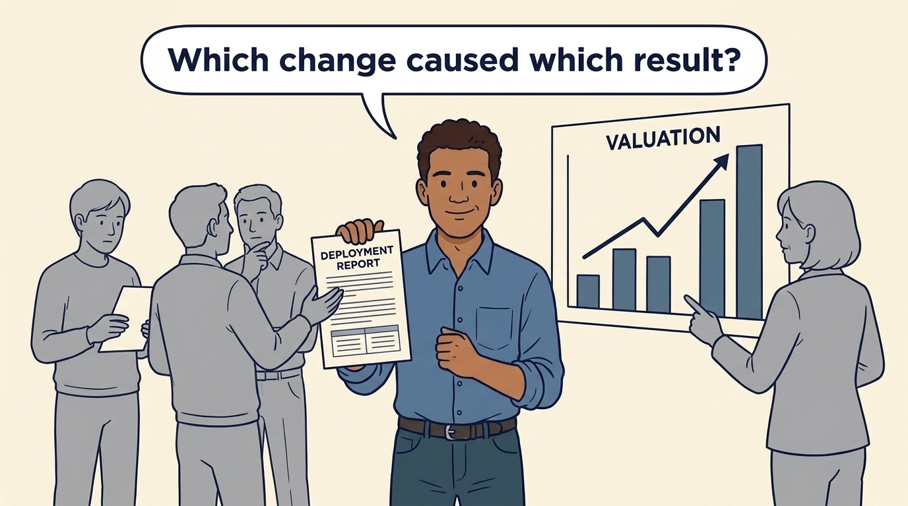
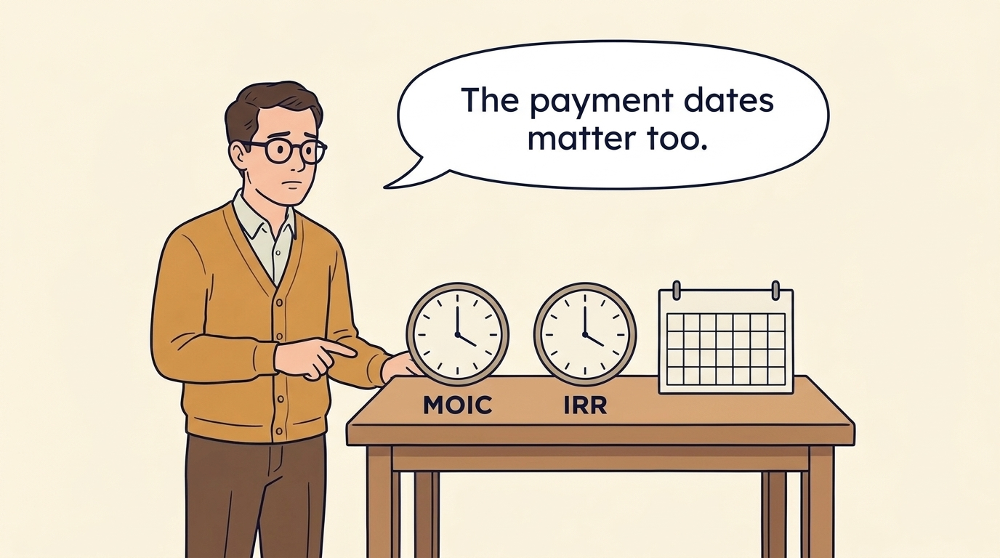
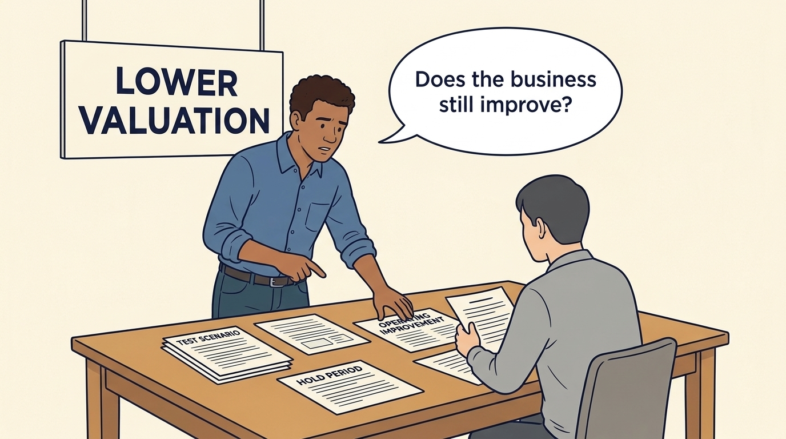

<!-- comic-style
{
  "cast": "MORGAN: a thoughtful investor technology adviser with short dark hair and a green jacket, used in the fund scenarios. ALEX: a practical CTO with curly hair and blue rolled-up sleeves. SAM: a CFO with round glasses and an amber cardigan. PRIYA: a product leader with straight dark hair and plum sleeves. INES: a CEO with short grey hair and a navy jacket. All are fictional; none represents a person in a real case.",
  "style": "Clean editorial explainer comic, dark ink outlines, restrained green, blue, and amber accents on warm white, generous space, readable short speech bubbles, expressive people and simple physical metaphors. No photorealism, logos, dense charts, or title text. Keep the same character appearances throughout the journal."
}
-->

**Comic.** Leaders inside the company judge progress by customers and earnings. The panels show how an investor judges the same company by the return on its holding, and why requests that seem hard to justify from the business often follow from the price paid, the borrowing and the timing of a sale.

Morgan is an investor’s adviser in the fund scenarios; Alex leads technology, Priya leads product, and Sam leads finance. All are fictional. Comparative scenarios use separate assumptions. Historical cases are discussed through documents; the scenes do not reenact real events.

<!-- comic-panel
{
  "id": "01-scene",
  "status": "generated",
  "asset": "assets/images/02-three-different-returns/comic-01-scene.jpeg",
  "aspect_ratio": "16:9",
  "prompt": "Panel 1 of an explainer comic. Morgan places a business model beside a share certificate. Use one speech bubble with the exact words: \"Company value and equity differ.\" Convey: Enterprise value estimates the operating business’s value. Equity value is the shareholders’ part after relevant debt, cash and other adjustments.",
  "alt": "Comic panel: Morgan holds a company folder and a separate equity certificate.",
  "caption": "Enterprise value estimates the operating business’s value. Equity value is the shareholders’ part after relevant debt, cash and other adjustments.",
  "generation": {
    "model": "gemini-3-pro-image-preview",
    "reference_id": "owned-cast-20260913",
    "sha256": "59fd4db0497298adb6145f37e768acbfc6820f15e5ac2000bd7038fdbec94790"
  }
}
-->

**Panel 1:** Enterprise value estimates the operating business’s value. Equity value is the shareholders’ part after relevant debt, cash and other adjustments.

*Dialogue:* “Company value and equity differ.”

<!-- comic-panel
{
  "id": "02-scene",
  "status": "generated",
  "asset": "assets/images/02-three-different-returns/comic-02-scene.jpeg",
  "aspect_ratio": "16:9",
  "prompt": "Panel 2 of an explainer comic. Sam moves earnings, valuation, and debt blocks independently. Use one speech bubble with the exact words: \"Several mechanisms change the return.\" Convey: An investment return compares what the investor receives or still holds with what it invested. Business performance, prices, borrowing and time all matter.",
  "alt": "Comic panel: Sam moves earnings, valuation, and debt blocks independently.",
  "caption": "An investment return compares what the investor receives or still holds with what it invested. Business performance, prices, borrowing and time all matter.",
  "generation": {
    "model": "gemini-3-pro-image-preview",
    "reference_id": "owned-cast-20260913",
    "sha256": "75a33807a01a2097d2ef1c0c05d617ba9e5a08e37262a22b9b22a343263ff39e"
  }
}
-->

**Panel 2:** An investment return compares what the investor receives or still holds with what it invested. Business performance, prices, borrowing and time all matter.

*Dialogue:* “Several mechanisms change the return.”

<!-- comic-panel
{
  "id": "03-scene",
  "status": "generated",
  "asset": "assets/images/02-three-different-returns/comic-03-scene.jpeg",
  "aspect_ratio": "16:9",
  "prompt": "Panel 3 of an explainer comic. Alex proudly holds a deployment report beside rising valuation. Use one speech bubble with the exact words: \"Which change caused which result?\" Convey: A software improvement may help the business. A higher sale price alone does not show how much that improvement contributed.",
  "alt": "Comic panel: Alex proudly holds a deployment report beside rising valuation.",
  "caption": "A software improvement may help the business. A higher sale price alone does not show how much that improvement contributed.",
  "generation": {
    "model": "gemini-3-pro-image-preview",
    "reference_id": "owned-cast-20260913",
    "sha256": "71dcb1d334787d4f56a8888b18dc734e024a14032dbcd856aae8110657e3cefc"
  }
}
-->

**Panel 3:** A software improvement may help the business. A higher sale price alone does not show how much that improvement contributed.

*Dialogue:* “Which change caused which result?”

<!-- comic-panel
{
  "id": "04-scene",
  "status": "generated",
  "asset": "assets/images/02-three-different-returns/comic-04-scene.jpeg",
  "aspect_ratio": "16:9",
  "prompt": "Panel 4 of an explainer comic. Sam compares two clocks beside the same proceeds. Use one speech bubble with the exact words: \"The payment dates matter too.\" Convey: MOIC compares value received or held with money invested. IRR is an annual return measure that also accounts for payment dates.",
  "alt": "Comic panel: Sam compares MOIC and IRR clock symbols, with a calendar beside IRR to emphasize payment timing.",
  "caption": "MOIC compares value received or held with money invested. IRR is an annual return measure that also accounts for payment dates.",
  "generation": {
    "model": "gemini-3-pro-image-preview",
    "reference_id": "owned-cast-20260913",
    "sha256": "81793b059630282a48b03ff7b75d7d8aa2ea5a7e36561cd7f1ff0cee97337672"
  }
}
-->

**Panel 4:** MOIC compares value received or held with money invested. IRR is an annual return measure that also accounts for payment dates.

*Dialogue:* “The payment dates matter too.”

<!-- comic-panel
{
  "id": "05-scene",
  "status": "generated",
  "asset": "assets/images/02-three-different-returns/comic-05-scene.jpeg",
  "aspect_ratio": "16:9",
  "prompt": "Panel 5 of an explainer comic. Sam starts a new worksheet labelled Minority example, apart from the earlier buyout calculation, while Alex counts share blocks. Use one speech bubble with the exact words: \"New funding can change the percentage.\" Convey: Separate fictional minority example: 200 of 1,000 shares is 20%. Another issue raises the total to 1,250, reducing the holding to 16%. With equal rights, €20m of sale proceeds gives this investor €3.2m.",
  "alt": "Comic panel: Sam starts a new worksheet labelled Minority example, apart from the earlier buyout calculation, while Alex counts share blocks.",
  "caption": "Separate fictional minority example: 200 of 1,000 shares is 20%. Another issue raises the total to 1,250, reducing the holding to 16%. With equal rights, €20m of sale proceeds gives this investor €3.2m.",
  "generation": {
    "model": "gemini-3-pro-image-preview",
    "reference_id": "owned-cast-20260913",
    "sha256": "56f8700a539e19790d2bea218b6a423a6cf91b89cd8da873e14c2909d747079b"
  }
}
-->

**Panel 5:** Separate fictional minority example: 200 of 1,000 shares is 20%. Another issue raises the total to 1,250, reducing the holding to 16%. With equal rights, €20m of sale proceeds gives this investor €3.2m.

*Dialogue:* “New funding can change the percentage.”

<!-- comic-panel
{
  "id": "06-scene",
  "status": "generated",
  "asset": "assets/images/02-three-different-returns/comic-06-scene.jpeg",
  "aspect_ratio": "16:9",
  "prompt": "Panel 6 of an explainer comic. Alex tests the plan beneath a lower valuation sign. Use one speech bubble with the exact words: \"Does the business still improve?\" Convey: Test whether the operating improvement remains useful if the sale price is lower or the owner holds the business longer.",
  "alt": "Comic panel: Alex tests the plan beneath a lower valuation sign.",
  "caption": "Test whether the operating improvement remains useful if the sale price is lower or the owner holds the business longer.",
  "generation": {
    "model": "gemini-3-pro-image-preview",
    "reference_id": "owned-cast-20260913",
    "sha256": "87683dc57dd3822d65b2a81add19fdee63e8d8cab3ded94b6578844d5e911b99"
  }
}
-->

**Panel 6:** Test whether the operating improvement remains useful if the sale price is lower or the owner holds the business longer.

*Dialogue:* “Does the business still improve?”
