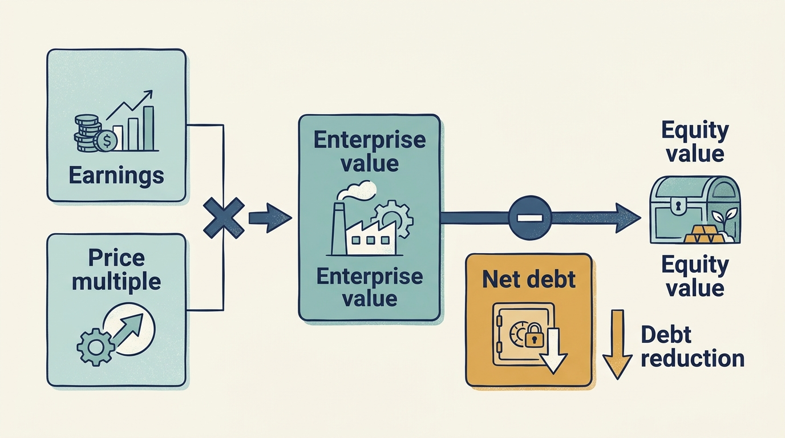
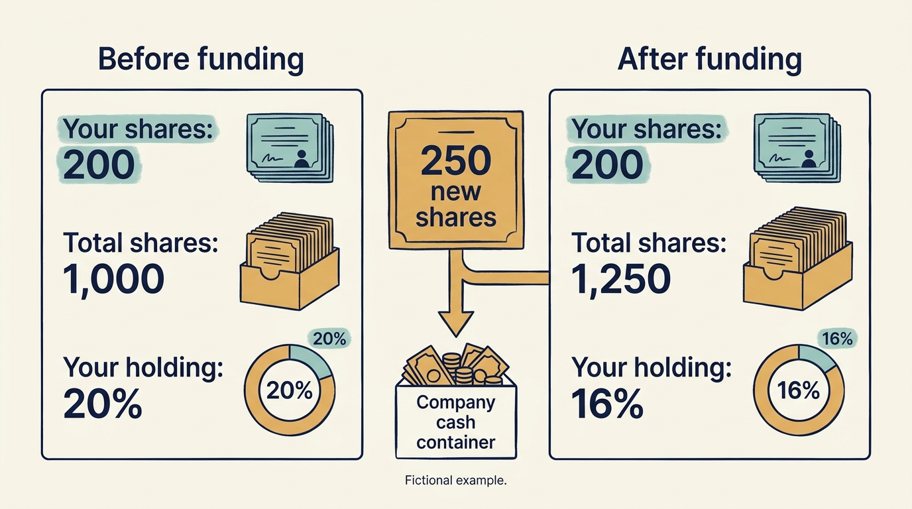

> **IN THIS SECTION, YOU WILL:** See how the same company performance produces three different investor returns, and learn what engineering can and cannot claim credit for in a sale gain.

> **WHY INVESTORS CARE:** A fund manager reports investment returns to its fund investors, and those returns combine company performance with entry price, financing and exit terms; that is why it works the price, leverage and timing levers, and why it needs management’s claims about engineering to be ones it can defend in that report.

> **WHY YOU SHOULD CARE:** Investor returns are often treated as a scorecard for product and engineering, yet price, borrowing and timing can change the result without any change in the work; that misreading shapes what you are asked to do.

> **KEY POINTS:**
>
> * Improving the business is **only part of an investment result**. Purchase price, borrowing, sale price, timing and ownership dilution also decide what the investor gets back.
> * **Hold the company’s performance fixed** and the fund’s sale proceeds, and its multiple of the money invested, can still more than double, because only the price a buyer pays at exit changed.
> * Explain the **technology contribution step by step**. Evidence about customers, costs and cash is needed before assigning part of a sale gain to engineering.

 
A company grows its earnings, yet its investor earns less than expected. Another company becomes more fragile while an investor receives a profit. To understand either result, we need to follow the investment as well as the business.

An **investment return** compares what an investor receives, or still holds, with what it invested. Return measures answer different questions about amount and timing. Until an investment is sold, part of a reported return can depend on an estimate of its value.

Leaders inside the company judge progress by customers served, products shipped and earnings. An investor judges the same company by the return on its holding, which also depends on the price it paid, the money it borrowed and when it sells. That is why an investor can press for a change that a product or engineering leader can’t justify from the business alone: the request often follows from the mechanics of the investment rather than from the product. Understanding those mechanics makes such requests easier to anticipate and to question.

## One Operating Result, Three Investor Outcomes

Here is the whole argument in one table. In a fictional buyout, a fund buys a company for €100 million, using €60 million of borrowed money and €40 million of its own. Over five years the company raises its annual EBITDA from €10 million to €15 million (EBITDA is earnings before interest, taxes, depreciation and amortization, an earnings subtotal defined fully below) and repays €20 million of the debt from its own cash. Everything about the company’s performance is now fixed. The only thing that varies is the price, expressed as a multiple of EBITDA, that a buyer pays at exit.

| Exit multiple | Fund receives | Multiple of its €40m |
| --- | ---: | ---: |
| 7× | €65m | 1.6× |
| 10× | €110m | 2.75× |
| 12× | €140m | 3.5× |

Same engineering team, same customers, same earnings growth, and a result that ranges from a modest gain to more than triple the money. The rest of the chapter teaches the arithmetic behind those three rows, then uses it to show what a product or engineering leader can and can’t claim credit for. [[valuation-is-an-estimate]] introduced the measures; this chapter follows the investment from purchase to sale.

In the calculations, “earnings growth” means an increase in the specified earnings measure. It doesn’t by itself establish better products or customer service. Postponing maintenance, for example, can raise current earnings while creating problems later.

## The Base Buyout: Measures and Arithmetic

Three definitions from [[valuation-is-an-estimate]] carry the calculation. **EBITDA** is earnings before interest, taxes, depreciation and amortization, an earnings subtotal that excludes those four kinds of charge. An **EBITDA multiple** is the price a buyer pays per euro of those annual earnings: a business earning €3 million that sells for €30 million sold at 10× EBITDA. The multiple packs a buyer’s expectations about growth and risk into a single number; it states a price, it doesn’t promise ten years of cash. And what the *business* is worth and what the *shareholders* get are different amounts, because lenders also have a claim on the business:

**Equity value = enterprise value − net debt.**

Enterprise value is the value of the operating business, and net debt is borrowings less the cash included in the calculation. We leave out other claims and transaction adjustments for this example.

Now the base case in full. The fictional company has annual EBITDA of **€10 million**. A fund agrees to buy it at **10× EBITDA**, giving an **enterprise value of €100 million**. The purchase uses **€60 million of acquisition debt and €40 million of fund equity**. The debt belongs to the acquisition structure and is supported by cash from the business. Using borrowing this way is called **leverage**; this example is a leveraged buyout. A buyout doesn’t have to use this level of borrowing.

Five years pass. EBITDA reaches €15 million: earnings improved by half, and for now we take no view on whether the company itself got better. It also pays down €20 million of debt from its own cash. The fund sells at the same 10× multiple.

Amounts are in millions of euros. Assume no cash is available to offset debt at entry or exit. Ignore fees, taxes on the sale, changes in the fund’s ownership percentage and payments to owners before the sale; [[obligations-before-budget]] examines the fuller cash bridge.

| Item | Entry | Calculation | Exit | Calculation |
| --- | ---: | --- | ---: | --- |
| Annual EBITDA | 10 | Operating earnings | 15 | After five years of earnings growth |
| EBITDA multiple | 10× | Price agreed per €1 of EBITDA | 10× | Assumed unchanged |
| Enterprise value | 100 | 10 × 10 | 150 | 15 × 10 |
| Net debt | 60 | Borrowed to fund the purchase | 40 | 60 − 20 repaid from cash |
| Equity value | 40 | 100 − 60 | 110 | 150 − 40 |

**Annual EBITDA and enterprise value each grew by 50%. The fund’s €40 million investment produced a €70 million gain, or 175%.** It put in €40 million and took out €110 million.

The €70 million equity gain separates into two parts, reflecting both earnings and financing:

- **€50 million** because the business earns more (€5m more EBITDA, at 10×)
- **€20 million** because the debt shrank, so less of the sale price goes to lenders

Two common measures describe this result. **MOIC**, the multiple on invested capital, compares what the investor received or still holds with what it invested; in this fully realized example, MOIC is proceeds divided by total capital invested: €110m / €40m = **2.75×**. **IRR**, the internal rate of return, expresses the result as an annual rate that accounts for when each payment happened. With one investment and one receipt five years later, it is (110 / 40) raised to the power of 1/5, minus 1: about **22.4%**. If money is invested or received at several dates, the calculation must include each dated payment. MOIC tells you how much; IRR tells you how fast, given those payment dates. Neither tells you whether the company is better.

One caution on the €20 million of debt repayment: it had to come from somewhere. **Paying it from operating cash** is a real achievement. An asset sale or additional investor funding can also reduce debt, but each has different consequences. Selling an asset gives up its future benefits; adding equity increases the money invested. Leaving that additional equity out of the return calculation overstates the result.

## Vary the Multiple, the Timing and the Direction

Return to the preview table, now with the annual return added. The operating assumptions are unchanged: EBITDA still reaches €15 million, debt still falls to €40 million. Varying only the exit multiple produces markedly different investment results.

| Exit multiple | Business worth | Fund receives | MOIC on its €40m | Annual return |
| --- | ---: | ---: | ---: | ---: |
| 7× | €105m | €65m | 1.6× | 10.2% |
| 10× | €150m | €110m | 2.75× | 22.4% |
| 12× | €180m | €140m | 3.5× | 28.5% |

**The same engineering team, the same customers, the same year-on-year earnings growth, and between the first row and the third the fund’s proceeds and its MOIC more than double, from €65m and 1.6× to €140m and 3.5×, while the annual rate rises from about 10% to about 28%.** Calling the 7× outcome a failed transformation would confuse the company’s work with its entry price and the price available at exit. Calling the 12× outcome proof of exceptional engineering makes the identical mistake in reverse. This exercise varies the multiple without saying why it moved; in practice a multiple can reflect the company’s prospects and a particular buyer’s expectations as well as general market conditions, which is exactly why the transaction alone can’t separate those explanations.

Timing has the same effect. Turning €40 million into €80 million is 2× either way, but do it in three years and that is about 26% a year; take seven years and it is about 10%. IRR exposes the speed, given the dates of the payments. It can’t tell you how much money was made, how much risk remains, or whether the business is any good.

Leverage magnifies the change in value relative to the fund’s smaller initial equity contribution, and it magnifies losses too. For a **separate downside scenario**, assume enterprise value falls to €80 million and no debt is repaid, leaving €60 million owed. Equity value is then €20 million, against the fund’s original €40 million investment. **The business lost a fifth of its value; the fund lost half of its money.**

## Why the Bridge Can’t Say “Engineering Created €30 Million”

Now suppose earnings and price move together: EBITDA grows from €10m to €15m *and* the buyer pays 12× instead of 10×. Enterprise value goes from €100m to €180m. Where did that €80 million come from?

| Source | Amount | |
| --- | ---: | --- |
| The business earns more | €50m | €5m extra EBITDA, at the old 10× |
| Buyers pay more per euro | €20m | the extra 2×, on the original €10m |
| Both at once | €10m | the extra 2× on the extra €5m |
| **Total** | **€80m** | |

That third row is the awkward one. It exists only because both things changed together, and no rule says whether it belongs to the operating team or to the price. Assigning €60m to operations and €20m to the multiple is a **convention, not a measurement**, and a report that quietly folds the interaction into the operations column makes the same work look better.

This is where a claim such as “our platform work created €30 million of company value” runs into trouble. Ask how it would be justified. At the entry multiple, the bridge attributes €50 million to higher earnings. Allocating the €10 million interaction row differently changes that accounting attribution; none of those conventions identifies engineering’s causal share. The bridge then stops. It separates earnings from price; it doesn’t separate the platform work from the pricing changes, sales hiring, cost reductions or postponed maintenance that also moved EBITDA over five years. A transaction bridge answers “how much of the gain came from earnings rather than from the multiple.” It can’t answer “how much of the earnings came from engineering.” That causal question needs evidence gathered on the way, not read off the sale.

The shortcut behind all this, enterprise value = EBITDA × multiple, is a negotiating and comparison device, not a law of nature. What a buyer will actually pay depends on expected future cash, growth, risk, market conditions and its alternatives. Keep three kinds of change distinct when reading any result:

**Operational improvement** changes the company’s ability to serve customers and generate cash, the area most directly connected to product and engineering work. Better onboarding might reduce implementation effort and allow additional sales. Improved reliability might reduce customer losses. Neither automatically creates the value assumed in a spreadsheet, and neither shows up in EBITDA on any fixed schedule.

**Financial structuring** changes the allocation, timing or risk of claims. Borrowing can reduce the equity needed at entry. Refinancing can change interest costs or maturity dates. A debt-funded dividend can distribute cash earlier while leaving a larger debt burden. Such changes can be rational; their benefits and risks must be measured separately from product improvement.

**Multiple changes** alter the price assigned to a unit of earnings. A stronger business might deserve a higher multiple. A rising market might also raise it. The transaction alone can’t separate those explanations. The broader literature describes leverage, governance and operating interventions as interacting parts of buyout ownership. [S03: Kaplan and Strömberg](https://www.nber.org/system/files/working_papers/w14207/w14207.pdf)

**Figure 1:** *Explain operating, valuation and financing effects separately before attributing an investment gain to technology.*

## Two Extensions: Dilution and a Corporate Owner

### A Minority Investor’s Return Can Change With Further Funding

The buyout used borrowing. A minority investment without borrowing shows a different mechanism. In a separate fictional example, Larkspur has 800 identical shares. A new investor pays €2m for 200 new shares, giving it 20% of the resulting 1,000 shares. This corresponds to the €8m pre-money and €10m post-money equity valuation explained in the previous chapter.

Later, another investor buys 250 newly issued shares. The first investor buys none. It still owns 200 shares, but the total is now 1,250, so its holding falls to 16%. This reduction in ownership percentage is **dilution**. The company receives additional capital in that round; the first investor hasn’t received a payment.

Suppose the company is eventually sold for €20m of equity proceeds available to these shareholders. Assume identical payment rights, no further shares, no interim distributions and no fees or taxes. The first investor receives 16% × €20m = €3.2m on its €2m investment: **1.6 times the money invested**. Had it bought additional shares, those payments would also belong in the return calculation.

An increase in company value therefore doesn’t translate mechanically into the same increase for an early shareholder. Further funding, ownership changes and payment priorities matter. **Preferences** are rights affecting which shares receive proceeds first or on different terms. With different rights, a simple percentage calculation may be wrong. For a company leader, another funding round has two consequences to discuss: the work its cash makes possible and the changes to ownership or expectations it brings.

**Figure 2:** *A lower ownership percentage does not, by itself, show whether the investor’s holding has gained or lost value.*

### A Corporate Owner May Expect Benefits Elsewhere

In a fictional strategic acquisition, the buyer wants Larkspur’s scheduling product to help retain customers of its maintenance equipment. The buyer may value that effect even if Larkspur’s separate profit changes little. Alex and Priya still need to establish the commercial chain: which customers will use the combined offering, what must be integrated, and who funds support and development.

A group-wide benefit isn’t automatically a local product budget. Ask the corporate owner to name the business unit accountable for the expected benefit and to fund the work and continuing obligations. Keep direct shareholder returns, expected group benefits and the company’s own operating results visible separately. The proposed mechanism must be tested; a strategic rationale doesn’t prove it works. A corporate parent’s internal investment review can also use different measures from a fund and need not have the same distribution or sale arrangements.

## What Technology Can and Cannot Claim Credit For

Start with the observable change, not the sale price. Which customer task improved? What costs changed? What investment was required? A **chief financial officer**, or **CFO**, leads the financial work and can help connect those observations to company earnings and cash. The investment team can then examine their possible valuation implications. [[roadmap-to-revenue]] develops that chain in Part III.

One distinction from the investor’s side helps in reading the pressure you receive. Where the owner is a fund, its manager reports to the fund’s investors, the limited partners, both the cash it has already returned to them and its estimate of the value of holdings it hasn’t yet sold; the estimate can still move, and pressure on a company often comes from the gap between the two. A corporate owner or an individual shareholder has no such report, though each has its own reasons to watch the same gap. [[fund-economics]] (optional depth) explains the management fee, profit share and distribution rules that decide how much of a return reaches those investors, and the ratios and borrowing arrangements behind the report.

The worked example gives a useful test for a proposed improvement: does its business case still hold if the sale price is lower or the owner holds the company longer? The answer separates a sustainable operating benefit from a result that depends heavily on the exit price.

If the return depends this much on price, borrowing and timing, the next question is how much borrowing, and which kind of investor, a company should take on for the work it actually has to do. That is the subject of [[raise-what-you-need]].

## Questions to Consider

1. *If your company’s earnings grew by half over five years, how would the investor’s return change under a lower exit multiple, a longer holding period or an additional funding round? Which of these can your team influence?*
2. *Which of your current initiatives would still justify itself if the sale price were lower or the owner held the company longer than planned?*
3. *The last time technology was credited with creating company value, how much of the gain was operating improvement, how much financing effect and how much a change in what buyers were paying? What evidence gathered along the way supports the engineering share?*
4. *If your owner is a corporate group, which business unit is accountable for the group-wide benefit attributed to your product, and who funds the work needed to deliver it?*

## To Probe Further

- **[Venture Deals: Be Smarter Than Your Lawyer and Venture Capitalist](https://www.venturedeals.com/)** — Brad Feld and Jason Mendelson, Wiley, 4th edition, 2019. *A venture investor’s explanation of liquidation preferences, dilution and the other payment rights this chapter mentions only in a sentence.*
- **[Do Buyouts (Still) Create Value?](https://www.nber.org/papers/w14187)** — Shourun Guo, Edith Hotchkiss and Weihong Song, National Bureau of Economic Research working paper, 2008 (Journal of Finance, 2011). *The empirical version of this chapter’s value bridge, separating buyout returns into operating gains, multiple changes and tax effects.*
- **[Private Equity Performance: A Survey](https://www.annualreviews.org/content/journals/10.1146/annurev-financial-111914-041858)** — Steven Kaplan and Berk Sensoy, Annual Review of Financial Economics, 2015. *Optional depth: a summary of how fund returns are measured and how interim valuations compare with realized results, background for the received-cash versus unsold-estimate distinction that [[fund-economics]] develops.*
- **[Distortion or Cash Flow Management? Understanding Credit Facilities in Private Equity Funds](https://papers.ssrn.com/sol3/papers.cfm?abstract_id=3434112)** — Pierre Schillinger, Reiner Braun and Jeroen Cornel, SSRN working paper, 2019. *Optional depth: simulations showing that a fund’s borrowing can lift its measured IRR substantially without changing company value, the same timing point this chapter makes with the three-year and seven-year comparison.*
