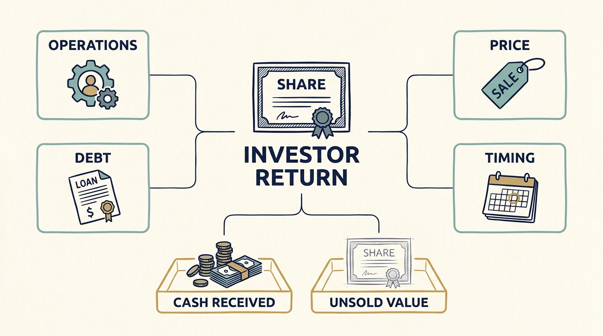

**An investment return compares what an investor receives or still holds with what it put in.** The company’s operating performance contributes to that result, alongside purchase price, borrowing, sale price and timing. Better earnings do not by themselves establish better products or a good investor result. Many investor requests that seem hard to justify from the business follow from the mechanics of the investment.

**Figure 1:** *Explain the return’s drivers and distinguish cash from estimated value.*

In a fictional buyout, a fund pays €100 million for a company with €10 million of annual **EBITDA** (earnings before interest, taxes, depreciation and amortization), using €60 million of borrowed money and €40 million of its own; borrowing in this way is **leverage**. Over five years EBITDA rises to €15 million and €20 million of debt is repaid from operating cash. Hold all of that fixed and vary only the price a buyer pays at exit, expressed as a **multiple** of EBITDA. At 7× the fund receives €65 million after the remaining €40 million of debt, 1.6 times its money, about 10% a year. At 10× it receives €110 million, 2.75×, about 22% a year. At 12× it receives €140 million, 3.5×, about 28% a year. Operating assumptions unchanged, the return more than doubles. Calling the 7× outcome a failed transformation, or the 12× outcome proof of exceptional engineering, makes the same mistake in opposite directions.

In the base case, equity value is enterprise value less net debt: €150 million less €40 million gives €110 million. The €70 million gain splits into €50 million from higher earnings at the unchanged multiple and €20 million from lower debt. **MOIC**, the multiple on invested capital, is €110 million divided by €40 million, 2.75×, in this fully realized example; **IRR** accounts for payment timing: about 22.4% a year here. Leverage **magnifies losses too**: in a separate downside scenario the business loses a fifth of its value, €80 million with €60 million still owed, and the fund loses half its money.

When earnings and multiple move together, the bridge needs a third row. From 10× on €10 million to 12× on €15 million, enterprise value rises €80 million: €50 million from earnings, €20 million from the higher multiple and €10 million from both at once. Assigning that interaction is a convention, not a measurement. That is why “engineering created €30 million” cannot be read off a sale: the bridge separates earnings from price, not engineering from the pricing, sales and cost changes that also moved earnings.

Two extensions follow: a later funding round can dilute an early investor from 20% to 16% of the proceeds, and a corporate owner’s expected group benefits need an accountable unit and a separately funded case. Keep a fund’s cash already returned separate from its estimates of unsold holdings; [[fund-economics]] is optional depth.

**A technology contribution claim needs evidence** gathered along the way, and a proposed improvement should still justify itself at a lower sale price or a longer hold. Next, how much borrowing and which investor fit the work: [[raise-what-you-need]].
