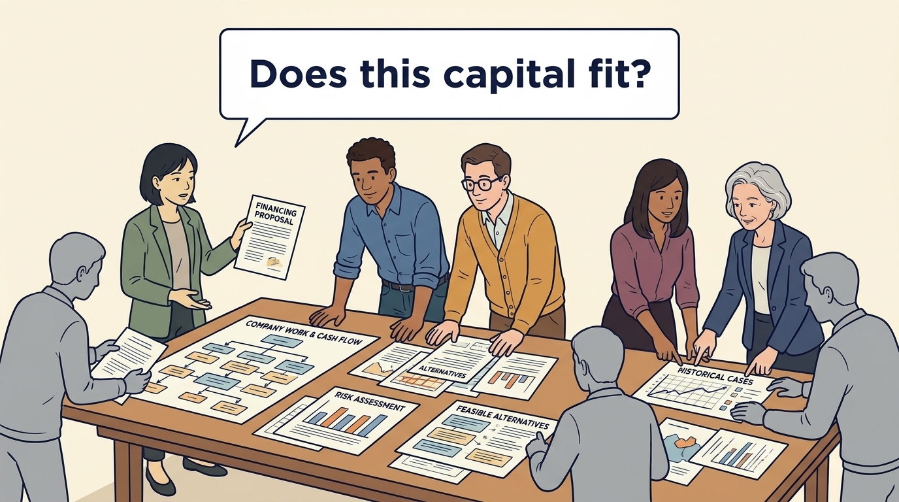

<!-- comic-style
{
  "cast": "MORGAN: a thoughtful investor technology adviser with short dark hair and a green jacket, used in the fund scenarios. ALEX: a practical CTO with curly hair and blue rolled-up sleeves. SAM: a CFO with round glasses and an amber cardigan. PRIYA: a product leader with straight dark hair and plum sleeves. INES: a CEO with short grey hair and a navy jacket. All are fictional; none represents a person in a real case.",
  "style": "Clean editorial explainer comic, dark ink outlines, restrained green, blue, and amber accents on warm white, generous space, readable short speech bubbles, expressive people and simple physical metaphors. No photorealism, logos, dense charts, or title text. Keep the same character appearances throughout the journal."
}
-->

**Comic.** Product and engineering leaders rarely choose the investor but inherit the choice. The panels compare capital arrangements to show how each one sets the expected pace, the tolerable loss and whether the plan is judged against a sale or continued ownership.

Morgan is an investor’s adviser in the fund scenarios; Alex leads technology, Priya leads product, and Sam leads finance. All are fictional. Comparative scenarios use separate assumptions. Historical cases are discussed through documents; the scenes do not reenact real events.

<!-- comic-panel
{
  "id": "01-scene",
  "status": "generated",
  "asset": "assets/images/03-investment-fit/comic-01-scene.jpeg",
  "aspect_ratio": "16:9",
  "prompt": "Panel 1 of an explainer comic. Alex holds a promising prototype with unanswered customer notes. Use one speech bubble with the exact words: \"We still need to learn.\" Convey: A young product may need money and time to learn whether enough customers will pay.",
  "alt": "Comic panel: Alex holds a promising prototype with unanswered customer notes.",
  "caption": "A young product may need money and time to learn whether enough customers will pay.",
  "generation": {
    "model": "gemini-3-pro-image-preview",
    "reference_id": "owned-cast-20260913",
    "sha256": "2093695c886b611cd9ecf5101f41abbad3b49ec8ea74fbdd85e8b3fadf2a8ec6"
  }
}
-->

**Panel 1:** A young product may need money and time to learn whether enough customers will pay.

*Dialogue:* “We still need to learn.”

<!-- comic-panel
{
  "id": "02-scene",
  "status": "generated",
  "asset": "assets/images/03-investment-fit/comic-02-scene.jpeg",
  "aspect_ratio": "16:9",
  "prompt": "Panel 2 of an explainer comic. The same team faces an implementation queue. Use one speech bubble with the exact words: \"Demand exceeds our delivery capacity.\" Convey: Money for expansion helps only if the company can turn demand into customers it can serve well.",
  "alt": "Comic panel: The same team faces an implementation queue.",
  "caption": "Money for expansion helps only if the company can turn demand into customers it can serve well.",
  "generation": {
    "model": "gemini-3-pro-image-preview",
    "reference_id": "owned-cast-20260913",
    "sha256": "331c7eb24ffbdf3c134a07f2a9aa6d6c6e85bd4b702d9c28bd57f5be3d4d9621"
  }
}
-->

**Panel 2:** Money for expansion helps only if the company can turn demand into customers it can serve well.

*Dialogue:* “Demand exceeds our delivery capacity.”

<!-- comic-panel
{
  "id": "03-scene",
  "status": "generated",
  "asset": "assets/images/03-investment-fit/comic-03-scene.jpeg",
  "aspect_ratio": "16:9",
  "prompt": "Panel 3 of an explainer comic. A founder places a retirement calendar beside a healthy business. Use one speech bubble with the exact words: \"Ownership is the question here.\" Convey: A retiring founder may want to sell their shares even when the company itself has enough cash.",
  "alt": "Comic panel: Sam reviews a retirement calendar beside an established-company model and a share-sale agreement.",
  "caption": "A retiring founder may want to sell their shares even when the company itself has enough cash.",
  "generation": {
    "model": "gemini-3-pro-image-preview",
    "reference_id": "owned-cast-20260913",
    "sha256": "71355f9bbe58c9365d9cfa6e2c228e9f9abc134e7d670c2794742862db1c0fc6"
  }
}
-->

**Panel 3:** A retiring founder may want to sell their shares even when the company itself has enough cash.

*Dialogue:* “Ownership is the question here.”

<!-- comic-panel
{
  "id": "04-scene",
  "status": "generated",
  "asset": "assets/images/03-investment-fit/comic-04-scene.jpeg",
  "aspect_ratio": "16:9",
  "prompt": "Panel 4 of an explainer comic. Sam compares a minority stake with a substantial approval key. Use one speech bubble with the exact words: \"Read the rights, too.\" Convey: Owning a small share of a company can still bring important approval rights. Read the agreement as well as the percentage.",
  "alt": "Comic panel: Sam compares a minority stake with a substantial approval key.",
  "caption": "Owning a small share of a company can still bring important approval rights. Read the agreement as well as the percentage.",
  "generation": {
    "model": "gemini-3-pro-image-preview",
    "reference_id": "owned-cast-20260913",
    "sha256": "ab1ab87ebef276a2d611677d0110f243615691239d6b52034f97ac15878a3ec8"
  }
}
-->

**Panel 4:** Owning a small share of a company can still bring important approval rights. Read the agreement as well as the percentage.

*Dialogue:* “Read the rights, too.”

<!-- comic-panel
{
  "id": "05-scene",
  "status": "generated",
  "asset": "assets/images/03-investment-fit/comic-05-scene.jpeg",
  "aspect_ratio": "16:9",
  "prompt": "Panel 5 of an explainer comic. Priya sorts owner, rights, money and event cards into four clearly separated groups. Use one speech bubble with the exact words: \"These answer different questions.\" Convey: Investor type, control, financing and transaction context are different dimensions. A carve-out describes separation; a turnaround describes a problem to solve. Neither identifies the owner.",
  "alt": "Comic panel: Priya sorts owner, rights, money and event cards into four clearly separated groups.",
  "caption": "Investor type, control, financing and transaction context are different dimensions. A carve-out describes separation; a turnaround describes a problem to solve. Neither identifies the owner.",
  "generation": {
    "model": "gemini-3-pro-image-preview",
    "reference_id": "owned-cast-20260913",
    "sha256": "1bb523f7ddfe274bb07777cdb59104412fa8c001787268e328cc97de41e3b7b8"
  }
}
-->

**Panel 5:** Investor type, control, financing and transaction context are different dimensions. A carve-out describes separation; a turnaround describes a problem to solve. Neither identifies the owner.

*Dialogue:* “These answer different questions.”

<!-- comic-panel
{
  "id": "06-scene",
  "status": "generated",
  "asset": "assets/images/03-investment-fit/comic-06-scene.jpeg",
  "aspect_ratio": "16:9",
  "prompt": "Panel 6 of an explainer comic. The team matches a financing proposal to the company's work. Use one speech bubble with the exact words: \"Does this capital fit?\" Convey: Choose a financing arrangement by examining the company’s work, cash needs, risks and feasible alternatives.",
  "alt": "Comic panel: The team matches a financing proposal to the company's work.",
  "caption": "Choose a financing arrangement by examining the company’s work, cash needs, risks and feasible alternatives.",
  "generation": {
    "model": "gemini-3-pro-image-preview",
    "reference_id": "owned-cast-20260913",
    "sha256": "54dbcb3f2a17c16539b83570b165b321547924905ece8bf8b87bbb9a36cde868"
  }
}
-->

**Panel 6:** Choose a financing arrangement by examining the company’s work, cash needs, risks and feasible alternatives.

*Dialogue:* “Does this capital fit?”
