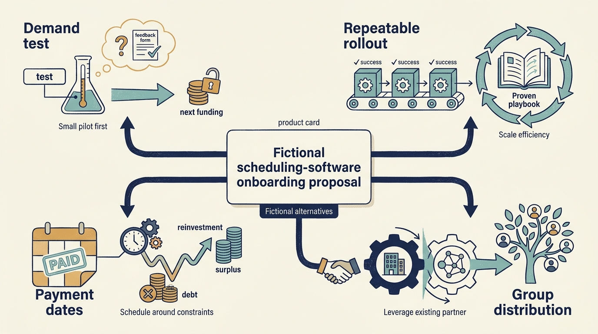
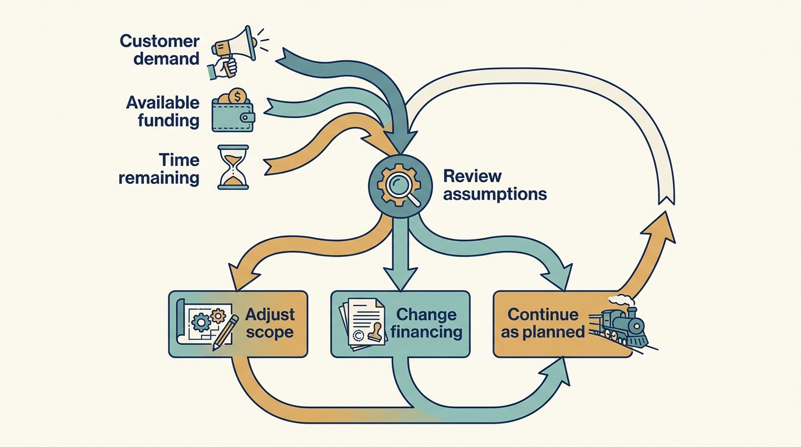

> **KEY POINTS:**
>
> * Begin with the **problem the money must solve**. Funding expansion, paying a retiring founder and separating a business from a larger company require different arrangements.
> * Examine the **terms behind the investor’s label**. Who gains control, how much cash reaches the company, and how long can the work take?
> * The proposed **plan and investor must fit** each other. Changing the financing or continuing without a new owner can both be reasonable outcomes.

 
A business has customers and a useful product. Its founder might want money to expand it, or might want to retire and sell their shares. Those are different needs, even if both conversations begin with “we need an investor.”

The preceding chapters explained funding, ownership, valuation and returns. We can now use those ideas to compare investment arrangements. Begin with the work the company needs to do, then examine which source of money can support it.

Product and engineering leaders rarely choose the investor, but they inherit the consequences of the choice. The type of capital sets the pace at which results are expected, how much loss the owner can tolerate, and whether the plan is judged against a sale in a few years or against continued ownership. A migration or a product bet that fits one arrangement can be unaffordable or unwanted under another. Knowing which arrangement the company is in tells you which kind of plan you are being asked to write.

There is no required journey from one investor type to the next. The examples below describe alternative situations, including remaining under the existing ownership.

## Separate the Owner, the Financing and the Situation

A founder might need personal cash from selling shares while the company needs no new funding. Another company may need money to learn whether customers want its product. A third may need investment to serve demand it already has.

**Investor type** describes who supplies ownership capital and what they seek. **Control** concerns the rights to decide. **Financing** concerns the money and its obligations. **Transaction context** describes an event such as a funding round, acquisition or separation. These dimensions interact, but none replaces the others.

The table proposes questions for comparing arrangements. Its operating consequences are conditional judgments, not evidence that all investors in a category behave alike.

| Arrangement | Work the money may need to support | What the leader should test |
| --- | --- | --- |
| Venture funding | Learning whether a repeatable business can be built | What evidence can arrive before current cash runs short, and what happens if another round does not close? |
| Growth funding | Expanding demand, delivery and leadership capacity | Which part of growth is already repeatable, and what must be funded to repeat it elsewhere? |
| Buyout ownership | Transferring control and carrying out a new operating plan | How much cash reaches the company, what rights change and what financing constrains reinvestment? |
| Corporate minority investment | A financial or commercial relationship with another business | Which product and information requests serve the wider customer base, and which chiefly serve the investor? |
| Corporate acquisition | Running the business within a new parent | What stays local, what must integrate and which group budget funds the dependencies? |
| Continued founder or family ownership | Funding an agreed plan from existing resources or additional finance | Which growth pace and concentration of risk are acceptable to the current owners? |

The funding descriptions build on the introductory guides in [[how-companies-get-money]]. Their practical implications here are questions for evaluating your circumstances.

A **carve-out** separates a business from a parent; it can be bought by a fund, another company or another ownership group. A **turnaround** addresses serious operating or financial problems; it does not identify the investor. An **acquisition** purchases a company or assets and may use cash, borrowing or shares. Label these conditions separately so that an integration deadline or a cash crisis does not get mistaken for a universal feature of the owner.

## Compare Alternative Larkspur Decisions

Assume Larkspur has little evidence that customers will pay for a new scheduling service. Priya proposes a small paid trial; Alex designs only the systems needed to learn safely. Funding that requires immediate, predictable cash generation would be difficult to reconcile with that uncertainty.

In another scenario, customers already buy the product, but implementation staff cannot keep up. Expansion money may fund a repeatable onboarding process and leadership capacity. Hiring more salespeople before fixing that constraint would promise customers service the company cannot yet deliver.

In a third scenario, a founder wants to retire. A buyout can transfer ownership while preserving the company. If the financing requires substantial cash payments, the proposed product transition also needs a funded path through a downside. The word “buyout” alone cannot tell Alex whether the plan is feasible.

Finally, suppose a corporate investor offers access to its distribution channel but asks for an exclusive feature. Priya must compare expected channel demand with the customers and future partnerships the commitment could displace. A useful investor relationship can still require a narrower commercial agreement.

These are alternatives, not a ladder every company must climb. Choose or renegotiate the arrangement around the work and the rights needed to carry it out.

**Figure 1:** *The company’s funding, authority and intended outcome determine the plan.*

## Revisit the Fit When the Plan Changes

An arrangement that fitted the original plan may become restrictive when demand slows, a migration takes longer or a new market requires more investment. Recheck the remaining cash, repayment dates, approval rights and investor expectations against the revised work.

The difference can be substantial within one investor category. Annual interest of €4 million leaves €3 million less for other uses than interest of €1 million, all else equal. Neither figure establishes affordability on its own: the company also needs to fund tax, investment and the timing of customer payments. [[cash-and-constraints]] follows those obligations through a worked example.

The answer need not be another ownership transaction. The company might change its pace, stage an investment or renegotiate financing. Remaining founder-owned, accepting minority funding or selling to a **strategic buyer**, another operating business buying it for commercial reasons, are alternatives to assess against the work ahead.

**Figure 2:** *Investment fit needs reassessment when the assumptions supporting the work change.*

## Control Is More Than a Percentage

A majority investor can have substantial influence, but the actual exercise of control depends on agreements and governance. A minority investor may negotiate approval rights over financing, acquisitions, budgets, or a sale. The product leader who sees a small ownership percentage and assumes little influence can misread the situation.

Similarly, a founder retaining shares does not mean the founder retains the same role. A founder selling shares does not mean the company receives growth capital. Economic ownership, operating authority, and the use of cash should be drawn as separate maps before they are described as alignment.

For technology planning, **request the relevant decision boundaries** in understandable language. Who approves material hiring? Who funds a product transition if the original plan proves wrong? Which decisions need board or shareholder consent? Legal advisers should resolve contractual interpretation; the operating team still needs to know how to work within the resulting boundaries.

## The Investor Has Constraints Too

A fund may understand an industry well but have insufficient capacity for follow-on funding. It may have the right capital but little practical support. It may have operating experts whose experience comes from companies much larger than the target. These are hypotheses to test through specific evidence, not conclusions to infer from a brand.

The survey by Gompers, Kaplan, and Mukharlyamov asked 79 private equity investors about valuation, financing, governance, and value creation. Respondents emphasized growth more than cost reduction in their anticipated value creation. That is useful evidence about stated practice; it is not an audit of what each investor delivered. [S04: PE practitioner survey](https://www.nber.org/papers/w21133)

For an experienced leader, investor fit is therefore a two-sided assessment. Can the company meet the investment expectations while **continuing to serve customers and fund necessary work**? Can this investor supply the capital, decisions, and support required when the plan encounters difficulty?

## Readiness Is a Better Question Than Ambition

Ask what must be true for the proposed arrangement to work. Demand must support the growth plan. The organization must be able to absorb change. The financing must leave room for the required investment and a credible downside. The owners must agree on control and time horizons.

Any of three answers can be correct: the transaction should change, the plan should change, or the company should stay as it is. A business that decides against outside ownership has not failed a test — it has answered the question.

The useful question is **"what work must this business do next, and which ownership and funding arrangement can support it?"** The cash test follows in [[cash-and-constraints]]; the partnership assessment in [[investor-fit]].

## Questions to Consider

1. What work does your company need to do next: learn whether demand exists, repeat something that already works, transfer ownership or operate inside a parent? Does the current funding arrangement support that work?
2. Which of your investor’s rights matter most to your plan, regardless of ownership percentage: approval of hiring, budgets, financing, acquisitions or a sale?
3. If demand slowed or a migration took twice as long, which part of the arrangement would become restrictive first: cash, repayment dates, approval rights or investor expectations?
4. What constraints does your investor face, such as follow-on capacity, fund life or relevant experience? Which of these have you tested with evidence rather than inferred from reputation?
5. For your company today, would changing the plan, changing the financing or staying under current ownership be the more defensible answer, and who would need to agree?
