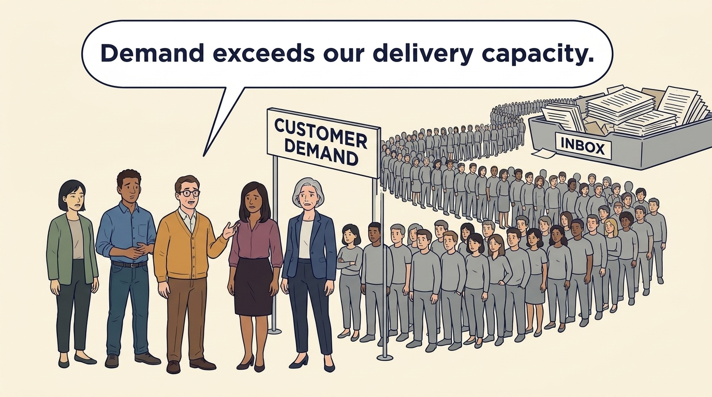
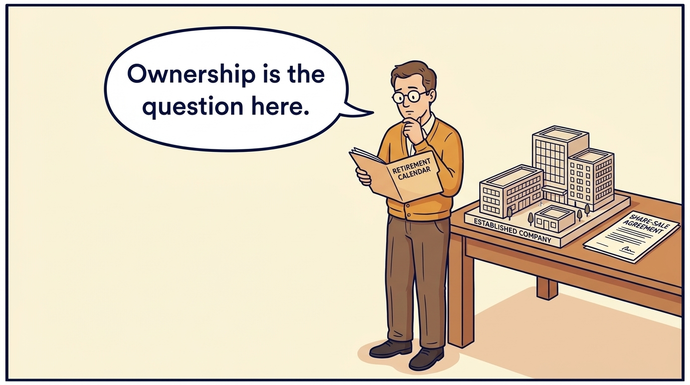
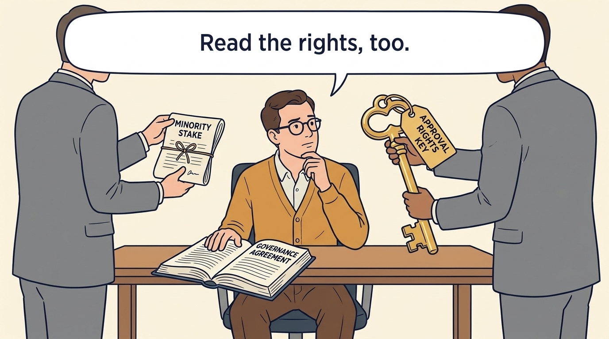
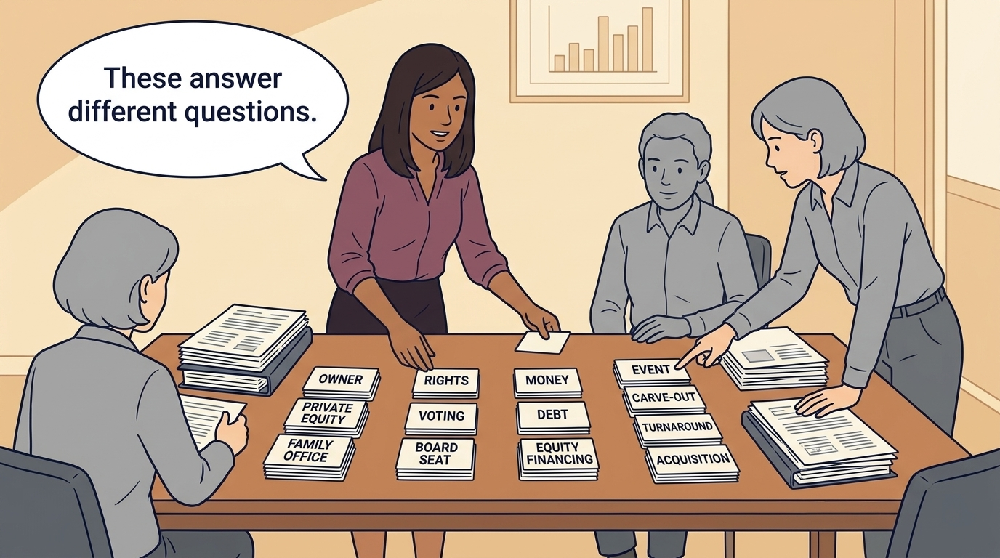

<!-- comic-style
{
  "cast": "MORGAN: a thoughtful investor technology adviser with short dark hair and a green jacket, used in the fund scenarios. ALEX: a practical CTO with curly hair and blue rolled-up sleeves. SAM: a CFO with round glasses and an amber cardigan. PRIYA: a product leader with straight dark hair and plum sleeves. INES: a CEO with short grey hair and a navy jacket. All are fictional; none represents a person in a real case.",
  "style": "Clean editorial explainer comic, dark ink outlines, restrained green, blue, and amber accents on warm white, generous space, readable short speech bubbles, expressive people and simple physical metaphors. No photorealism, logos, dense charts, or title text. Keep the same character appearances throughout the journal."
}
-->

**Comic.** Product and engineering leaders may not choose the investor but they inherit its terms, the conditions attached to the money, and it is those terms and the investor’s expectations that affect the pace, the tolerated losses and the time available for the plan. The panels size one piece of work, compare two arrangements that could fund it and show who can recommend and who can renegotiate.

Two words recur. **Equity** is money given to a company in exchange for a share of its ownership; the investor gets it back only if the company later pays out or is sold. A **loan** is money that must be repaid on fixed dates with interest, whatever happens, while the owners keep their shares. In the fictional Larkspur case the work is sized at €610,000; a bank offers a €750,000 loan, and a growth investor offers €2.5 million for a minority share, less than half the company, with the right to approve the annual budget.

Alex leads engineering, Priya leads product, Sam leads finance and Ines runs the company as its chief executive; Morgan, an adviser on the investor’s side in other chapters, does not appear here. All are fictional. Comparative scenarios use separate assumptions. Historical cases are discussed through documents; the scenes do not reenact real events.

<!-- comic-panel
{
  "id": "01-scene",
  "status": "generated",
  "asset": "assets/images/03-raise-what-you-need/comic-01-scene.jpeg",
  "aspect_ratio": "16:9",
  "prompt": "Panel 1 of an explainer comic. Alex holds a promising prototype with unanswered customer notes. Use one speech bubble with the exact words: \"We still need to learn.\" Convey: A young product may need money and time to learn whether enough customers will pay.",
  "alt": "Comic panel: Alex holds a promising prototype with unanswered customer notes.",
  "caption": "A young product may need money and time to learn whether enough customers will pay.",
  "generation": {
    "model": "gemini-3-pro-image-preview",
    "reference_id": "owned-cast-20260913",
    "sha256": "2093695c886b611cd9ecf5101f41abbad3b49ec8ea74fbdd85e8b3fadf2a8ec6"
  }
}
-->

**Panel 1:** A young product may need money and time to learn whether enough customers will pay.

*Dialogue:* “We still need to learn.”

<!-- comic-panel
{
  "id": "02-scene",
  "status": "generated",
  "asset": "assets/images/03-raise-what-you-need/comic-02-scene.jpeg",
  "aspect_ratio": "16:9",
  "prompt": "Panel 2 of an explainer comic. The same team faces an implementation queue. Use one speech bubble with the exact words: \"Demand exceeds our delivery capacity.\" Convey: Demand is not the problem; delivery is. Each new customer is set up by hand, so the queue of waiting customers grows. Alex and Priya size the fix at about €610,000: the €180,000 build plus the transition to the new step, a temporary specialist to keep customers moving, an allowance for estimates being wrong and runway, the time bought before the next decision.",
  "alt": "Comic panel: Alex, Priya, Sam and Ines face a long queue of waiting customers under a sign reading customer demand, beside an overflowing inbox.",
  "caption": "Demand is not the problem; delivery is. Each new customer is set up by hand, so the queue of waiting customers grows. Alex and Priya size the fix at about €610,000: the €180,000 build plus the transition to the new step, a temporary specialist to keep customers moving, an allowance for estimates being wrong and runway, the time bought before the next decision.",
  "generation": {
    "model": "gemini-3-pro-image-preview",
    "reference_id": "owned-cast-20260913",
    "sha256": "331c7eb24ffbdf3c134a07f2a9aa6d6c6e85bd4b702d9c28bd57f5be3d4d9621"
  }
}
-->

**Panel 2:** Demand is not the problem; delivery is. Each new customer is set up by hand, so the queue of waiting customers grows. Alex and Priya size the fix at about €610,000: the €180,000 build plus the transition to the new step, a temporary specialist to keep customers moving, an allowance for estimates being wrong and runway, the time bought before the next decision.

*Dialogue:* “Demand exceeds our delivery capacity.”

<!-- comic-panel
{
  "id": "03-scene",
  "status": "generated",
  "asset": "assets/images/03-raise-what-you-need/comic-03-scene.jpeg",
  "aspect_ratio": "16:9",
  "prompt": "Panel 3 of an explainer comic. A founder places a retirement calendar beside a healthy business. Use one speech bubble with the exact words: \"Ownership is the question here.\" Convey: A retiring founder may want to sell their shares, their units of ownership, even when the company itself has enough cash.",
  "alt": "Comic panel: Sam reviews a retirement calendar beside an established-company model and a share-sale agreement.",
  "caption": "A retiring founder may want to sell their shares, their units of ownership, even when the company itself has enough cash.",
  "generation": {
    "model": "gemini-3-pro-image-preview",
    "reference_id": "owned-cast-20260913",
    "sha256": "71355f9bbe58c9365d9cfa6e2c228e9f9abc134e7d670c2794742862db1c0fc6"
  }
}
-->

**Panel 3:** A retiring founder may want to sell their shares, their units of ownership, even when the company itself has enough cash.

*Dialogue:* “Ownership is the question here.”

<!-- comic-panel
{
  "id": "04-scene",
  "status": "generated",
  "asset": "assets/images/03-raise-what-you-need/comic-04-scene.jpeg",
  "aspect_ratio": "16:9",
  "prompt": "Panel 4 of an explainer comic. Sam compares a minority stake with a substantial approval key. Use one speech bubble with the exact words: \"Read the rights, too.\" Convey: Owning a small share of a company can still bring important approval rights. Read the agreement as well as the percentage. Sam weighs a minority stake, a share of less than half the company, against an approval-rights key, with an open governance agreement, the contract that says which decisions need whose consent, such as the annual budget or a senior hire.",
  "alt": "Comic panel: Sam sits between a rolled document labelled minority stake and a large key tagged approval rights, with a book labelled governance agreement open in front of him.",
  "caption": "Owning a small share of a company can still bring important approval rights. Read the agreement as well as the percentage. Sam weighs a minority stake, a share of less than half the company, against an approval-rights key, with an open governance agreement, the contract that says which decisions need whose consent, such as the annual budget or a senior hire.",
  "generation": {
    "model": "gemini-3-pro-image-preview",
    "reference_id": "owned-cast-20260913",
    "sha256": "ab1ab87ebef276a2d611677d0110f243615691239d6b52034f97ac15878a3ec8"
  }
}
-->

**Panel 4:** Owning a small share of a company can still bring important approval rights. Read the agreement as well as the percentage. Sam weighs a minority stake, a share of less than half the company, against an approval-rights key, with an open governance agreement, the contract that says which decisions need whose consent, such as the annual budget or a senior hire.

*Dialogue:* “Read the rights, too.”

<!-- comic-panel
{
  "id": "05-scene",
  "status": "generated",
  "asset": "assets/images/03-raise-what-you-need/comic-05-scene.jpeg",
  "aspect_ratio": "16:9",
  "prompt": "Panel 5 of an explainer comic. Priya sorts owner, rights, money and event cards into four clearly separated groups. Use one speech bubble with the exact words: \"These answer different questions.\" Convey: Investor type, control, financing and transaction context are different dimensions. The cards read, left to right: owner (private equity, a fund that buys ownership of companies not traded on a stock exchange; family office, a wealthy family’s own investment company); rights (voting; a board seat, membership of the group that oversees the company); money (debt, borrowed money to be repaid; equity financing, money exchanged for ownership); event (carve-out, separating a business from its parent; turnaround, repairing a business in serious trouble; acquisition, buying a company). Neither a carve-out nor a turnaround identifies the owner.",
  "alt": "Comic panel: Priya sorts labelled cards into four groups, owner, rights, money and event; the groups are transcribed in the caption.",
  "caption": "Investor type, control, financing and transaction context are different dimensions. The cards read, left to right: owner (private equity, a fund that buys ownership of companies not traded on a stock exchange; family office, a wealthy family’s own investment company); rights (voting; a board seat, membership of the group that oversees the company); money (debt, borrowed money to be repaid; equity financing, money exchanged for ownership); event (carve-out, separating a business from its parent; turnaround, repairing a business in serious trouble; acquisition, buying a company). Neither a carve-out nor a turnaround identifies the owner.",
  "generation": {
    "model": "gemini-3-pro-image-preview",
    "reference_id": "owned-cast-20260913",
    "sha256": "1bb523f7ddfe274bb07777cdb59104412fa8c001787268e328cc97de41e3b7b8"
  }
}
-->

**Panel 5:** Investor type, control, financing and transaction context are different dimensions. The cards read, left to right: owner (private equity, a fund that buys ownership of companies not traded on a stock exchange; family office, a wealthy family’s own investment company); rights (voting; a board seat, membership of the group that oversees the company); money (debt, borrowed money to be repaid; equity financing, money exchanged for ownership); event (carve-out, separating a business from its parent; turnaround, repairing a business in serious trouble; acquisition, buying a company). Neither a carve-out nor a turnaround identifies the owner.

*Dialogue:* “These answer different questions.”

<!-- comic-panel
{
  "id": "06-scene",
  "status": "generated",
  "asset": "assets/images/03-raise-what-you-need/comic-06-scene.jpeg",
  "aspect_ratio": "16:9",
  "prompt": "Panel 6 of an explainer comic. Ines, Sam, Alex and Priya stand around a table holding three large sheets side by side: a sheet titled WORK PLAN showing three simple stacked blocks, a sheet titled BANK LOAN showing a calendar with four marked repayment dates, and a sheet titled OWNERSHIP INVESTMENT showing a pie chart with one slice shaded and a small map with a second country flagged. Sam points at the bank-loan sheet; Ines holds a folder marked FOR THE BOARD. Use one speech bubble with the exact words: \"Does this funding fit the work?\" Convey: Two arrangements could fund the same €610,000 need: a €750,000 bank loan with fixed repayments, or €2.5 million from a growth investor in exchange for a minority share and a say over the budget, on a plan to enter a second country within eighteen months. With about €350,000 of yearly operating cash to meet the payments and no evidence yet of second-country demand, Ines and Sam recommend the loan, funding the work in stages, and the board approves it. The risk they accept is that the repayments are fixed whatever the pilot shows.",
  "alt": "Comic panel: Ines, Sam, Alex and Priya compare a work-plan sheet with a bank-loan sheet and an ownership-investment sheet; Sam points at the loan.",
  "caption": "Two arrangements could fund the same €610,000 need: a €750,000 bank loan with fixed repayments, or €2.5 million from a growth investor in exchange for a minority share and a say over the budget, on a plan to enter a second country within eighteen months. With about €350,000 of yearly operating cash to meet the payments and no evidence yet of second-country demand, Ines and Sam recommend the loan, funding the work in stages, and the board approves it. The risk they accept is that the repayments are fixed whatever the pilot shows.",
  "generation": {
    "model": "gemini-3-pro-image-preview",
    "reference_id": "owned-cast-20260913",
    "sha256": "e7a49c2c9a1e8362d5c8421e6e2ca9e621fd74fe6ec014bd79605b3c8c1ba411"
  }
}
-->

**Panel 6:** Two arrangements could fund the same €610,000 need: a €750,000 bank loan with fixed repayments, or €2.5 million from a growth investor in exchange for a minority share and a say over the budget, on a plan to enter a second country within eighteen months. With about €350,000 of yearly operating cash to meet the payments and no evidence yet of second-country demand, Ines and Sam recommend the loan, funding the work in stages, and the board approves it. The risk they accept is that the repayments are fixed whatever the pilot shows.

*Dialogue:* “Does this funding fit the work?”
