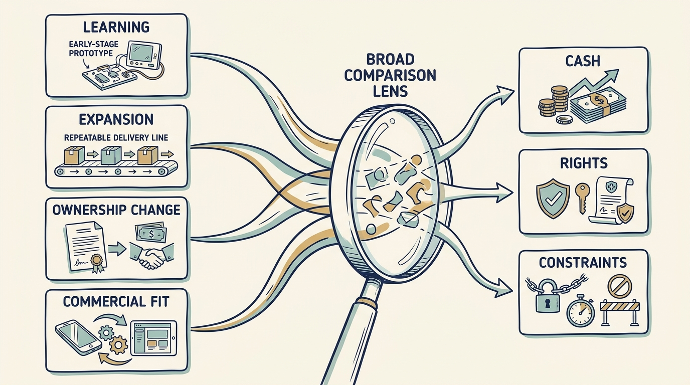

**Match the funding to the work.** Leaders who inherit the investor inherit its terms, the conditions attached to the money; those terms and expectations, not the category, set the pace, the tolerated losses and the plan’s time. Investor type, control rights, financing and the event faced (a carve-out separates a business from its parent; a turnaround repairs one in serious trouble; neither identifies the owner) are separate questions ([[customers-lenders-investors]]).

**Figure 1:** *Four different needs, learning from an early-stage prototype (a first working version of the product), expanding a delivery process that can be repeated, a change of ownership, and commercial fit (a partner whose products or customers complement the company’s), are each compared with the cash, the rights and the constraints an arrangement brings. Size the work first, then choose the arrangement that can fund it.*

**Size the need before naming the investor.** In the fictional Larkspur case customers are set up by hand and a queue grows. Alex, who leads engineering, and Priya, the product leader, size the fix at about **€610,000**: €180,000 to build a reusable setup step, €30,000 for its first year of maintenance, €90,000 of transition, €150,000 for a contract specialist for a year, a €70,000 allowance for wrong estimates and €90,000 of runway, six more months of the specialist and the old process should the evidence arrive late.

**€2.5 million of growth equity**, money exchanged for a share of ownership, brings a large reserve, but the investor would approve the annual budget and senior hires, and the money is raised on entering a second country within eighteen months, a pace the pilot (the new step’s small first trial with customers) has not earned. **A €750,000 four-year bank loan** keeps control with the current owners. Interest, the charge for borrowing, is 8% a year on the amount still owed; with €250,000 repaid yearly from year two, the fixed year-end payments are €60,000, €310,000, €290,000 and €270,000.

Larkspur generates about €350,000 of operating cash a year after tax and existing obligations, before interest on new borrowing. Ines, the chief executive, and Sam, who runs finance, recommend the loan: every payment is tested against that €350,000 alone, and year two, the tightest, leaves €40,000 to spare. If operating cash fell to €300,000 that year, retained year-one cash would still cover the payment; the downside consumes the cushion, not the work. Freed staff time is not repayment cash until a contract is cancelled or extra customer money arrives. Equity raised after a disappointing pilot might cost more of the company or be unavailable.

**The decision is dated.** At day 90 Priya measures the first eight customers set up with the new step, in staff hours per customer, from 80 today with 50 the target ([[roadmap-to-revenue]]); the board, which oversees the company, decides at day 100. Below 60 hours: request the expansion. 60 to 70: fund a data-quality step, correcting customer data before setup, and keep hiring deferred. Above 70: reopen hiring, the target or the equity conversation while cash remains.

Alex and Priya do not sign the financing; they bring the work, its cost, an alternative (two hires, about €300,000 a year) and the dated review. Ines and Sam renegotiate; the board approves.

**Control and partnership are separate questions** ([[decide-who-decides]], [[investor-under-pressure]]). When demand, funding or time changes, changing the deal, the plan or nothing can each be right; declining outside ownership is an answer, not a failure.
