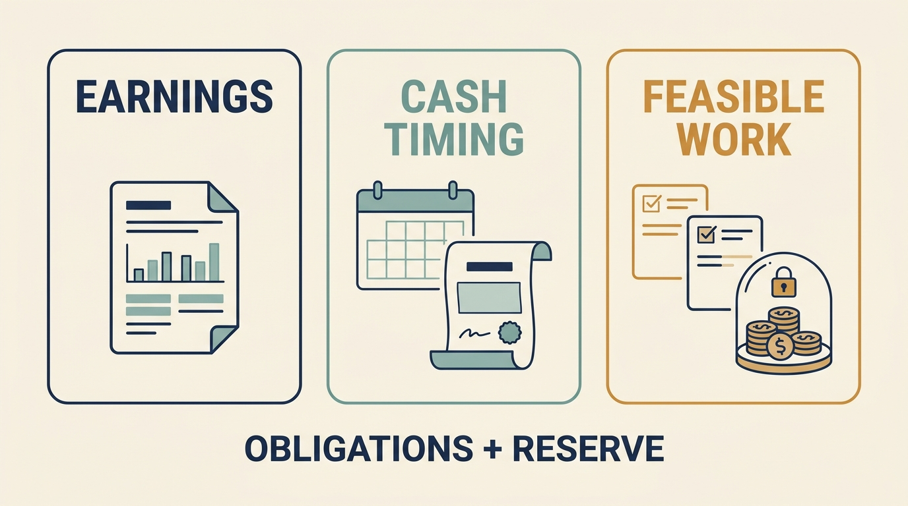

**Profit and available cash are different.** A company can report positive earnings while lacking money for a needed technology change. To understand why, follow the payments and their timing.

**Figure 1:** *Fund the transition against actual payments, timing and operating needs.*

**EBITDA** is earnings before interest, taxes, depreciation and amortization. Depreciation and amortization spread certain asset costs across accounting periods. EBITDA leaves out financing payments, income tax and some investment spending. Ordinary operating costs, including expensed engineering payroll, are already included.

**Capital expenditure** is spending on assets such as equipment or qualifying development. **Working capital**, in this example, is money tied up in unpaid customer invoices and inventory, less amounts owed to suppliers. Growth can require more of it when the business spends before collecting customer payments; customer prepayments can work differently.

The fictional Larkspur planning example starts with €10 million of EBITDA. Subtract €4 million of cash interest, €1 million of cash tax, €2 million of capital expenditure and €1 million of additional working capital. That leaves €2 million before repayment of the amount borrowed. Required repayment of €1.5 million leaves €0.5 million before other movements. A proposed €1 million program therefore needs staging, displaced spending or additional funding.

The table is a **simplified planning model**, not a universal payment order. Actual payment dates, existing cash and contractual restrictions also matter. Do not subtract an expense again if it is already included in the cash-flow figure you start from.

**Covenants** are conditions in loan agreements. A breach can require negotiation or give lenders additional rights, depending on the contract. **Maturity** is when borrowing is due; **refinancing** replaces it with new financing. A floating interest rate can also raise cash costs while business conditions weaken.

**Capitalization** records qualifying spending as an asset, with expenses recognized over time. It changes accounting timing, not whether the cash was spent. The chapter’s separate €1 million development example isolates that difference; it does not suggest managers can choose an accounting treatment without meeting the applicable criteria.

A separate Larkspur scenario has no acquisition debt: €3m of cash and monthly spending exceeding receipts by €250,000. At that unchanged **net cash burn**, simple **runway** is 12 months. Hires adding €100,000 monthly reduce it to about 8.6 months. Funding expected in nine months arrives too late under those assumptions. Real forecasts need payment dates and an operating reserve. Decide when to stage commitments or change course before an uncertain round becomes a cash crisis.

A useful proposal offers **feasible options** and shows their cash needs, people, dependencies and expected outcomes. It also explains what continues if funding or benefits disappoint. Having followed the money through Part I, turn to the authority to make these choices in [[part-2]] and [[governance]].
