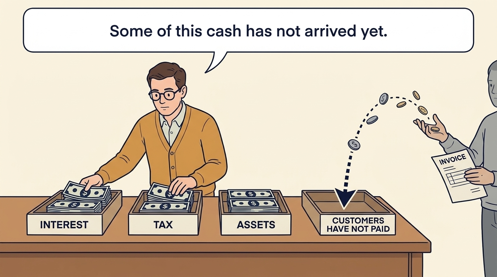
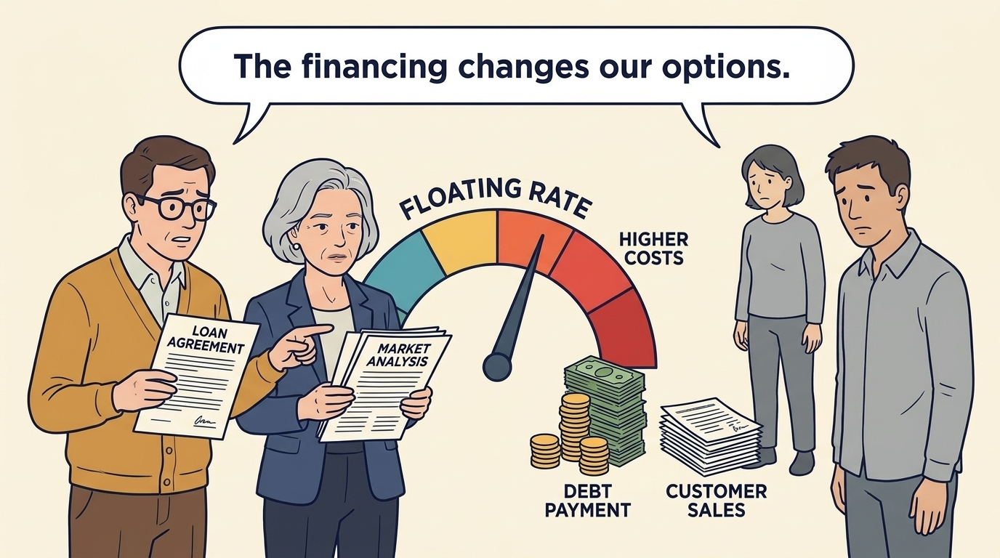
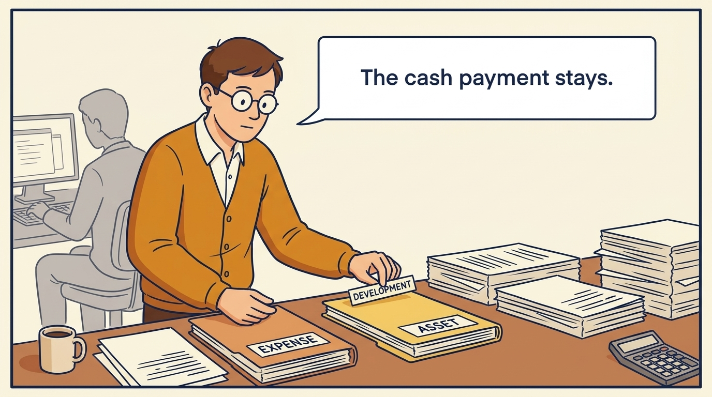
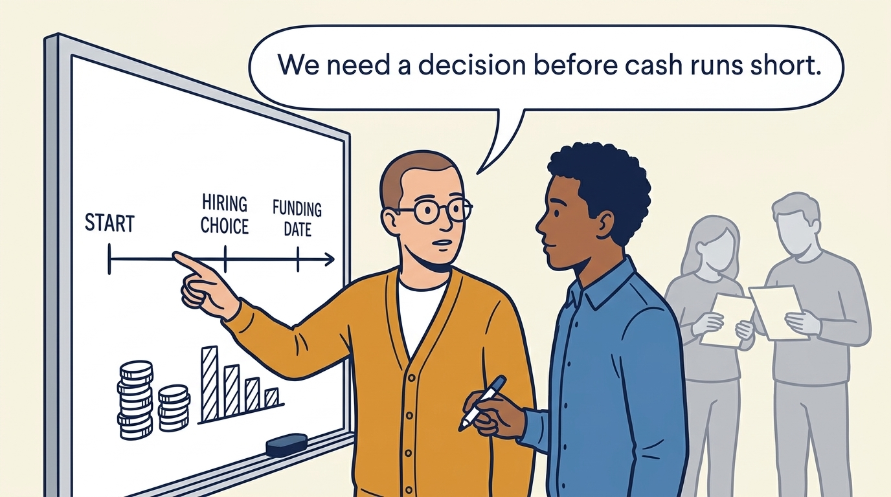
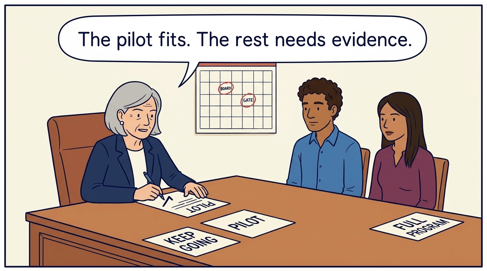

<!-- comic-style
{
  "cast": "MORGAN: a thoughtful investor technology adviser with short dark hair and a green jacket, used in the fund scenarios. ALEX: a practical CTO with curly hair and blue rolled-up sleeves. SAM: a CFO with round glasses and an amber cardigan. PRIYA: a product leader with straight dark hair and plum sleeves. INES: a CEO with short grey hair and a navy jacket. All are fictional; none represents a person in a real case.",
  "style": "Clean editorial explainer comic, dark ink outlines, restrained green, blue, and amber accents on warm white, generous space, readable short speech bubbles, expressive people and simple physical metaphors. No photorealism, logos, dense charts, or title text. Keep the same character appearances throughout the journal."
}
-->

**Comic.** Positive EBITDA does not establish the cash available for a new initiative. The panels follow one earnings figure through investment, tax, financing payments and working capital to the cash on hand, separate the payments that are obligations from the ones that are choices, and end with three priced options and a decision.

Morgan is an investor’s adviser in the fund scenarios; Alex leads technology, Priya leads product, and Sam leads finance. All are fictional. Comparative scenarios use separate assumptions. Historical cases are discussed through documents; the scenes do not reenact real events.

<!-- comic-panel
{
  "id": "01-scene",
  "status": "generated",
  "asset": "assets/images/04-obligations-before-budget/comic-01-scene.jpeg",
  "aspect_ratio": "16:9",
  "prompt": "Panel 1 of an explainer comic. Alex sees a positive earnings figure and reaches for a project budget. Use one speech bubble with the exact words: \"Can we fund the migration?\" Convey: EBITDA is earnings before interest, taxes, depreciation and amortization. The last two spread asset costs over time. This measure leaves out several cash obligations.",
  "alt": "Comic panel: Alex sees a positive earnings figure and reaches for a project budget.",
  "caption": "EBITDA is earnings before interest, taxes, depreciation and amortization. The last two spread asset costs over time. This measure leaves out several cash obligations.",
  "generation": {
    "model": "gemini-3-pro-image-preview",
    "reference_id": "owned-cast-20260913",
    "sha256": "5c28ad7f821e45a662d5336a938c2d8a75527b25af529ffdefd161365152d235"
  }
}
-->

**Panel 1:** EBITDA is earnings before interest, taxes, depreciation and amortization. The last two spread asset costs over time. This measure leaves out several cash obligations.

*Dialogue:* “Can we fund the migration?”

<!-- comic-panel
{
  "id": "02-scene",
  "status": "generated",
  "asset": "assets/images/04-obligations-before-budget/comic-02-scene.jpeg",
  "aspect_ratio": "16:9",
  "prompt": "Panel 2 of an explainer comic. Sam allocates cash to interest, tax, assets and unpaid customer invoices. Use one speech bubble with the exact words: \"These commitments also need cash.\" Convey: Subtract the payments and cash needs left outside that earnings measure. Interest and repayments are contractual; investment is a choice; payroll is already inside. The remainder may be much smaller than the headline.",
  "alt": "Comic panel: Sam allocates cash to interest, tax, assets and unpaid customer invoices.",
  "caption": "Subtract the payments and cash needs left outside that earnings measure. Interest and repayments are contractual; investment is a choice; payroll is already inside. The remainder may be much smaller than the headline.",
  "generation": {
    "model": "gemini-3-pro-image-preview",
    "reference_id": "owned-cast-20260913",
    "sha256": "d8098d80fd562ab070f229596b09c5cc564690a05ac4301b4db6aa519687eb67"
  }
}
-->

**Panel 2:** Subtract the payments and cash needs left outside that earnings measure. Interest and repayments are contractual; investment is a choice; payroll is already inside. The remainder may be much smaller than the headline.

*Dialogue:* “These commitments also need cash.”

<!-- comic-panel
{
  "id": "03-scene",
  "status": "generated",
  "asset": "assets/images/04-obligations-before-budget/comic-03-scene.jpeg",
  "aspect_ratio": "16:9",
  "prompt": "Panel 3 of an explainer comic. A floating-rate dial rises beside a debt payment. Use one speech bubble with the exact words: \"The financing changes our options.\" Convey: A floating-rate loan has an interest rate that can change. Higher borrowing costs can arrive while customer sales weaken.",
  "alt": "Comic panel: A floating-rate dial rises beside a debt payment.",
  "caption": "A floating-rate loan has an interest rate that can change. Higher borrowing costs can arrive while customer sales weaken.",
  "generation": {
    "model": "gemini-3-pro-image-preview",
    "reference_id": "owned-cast-20260913",
    "sha256": "9e7774b831d4a7782024b63c22c136fc9ca163883ea82f5dcb51225d0636d75d"
  }
}
-->

**Panel 3:** A floating-rate loan has an interest rate that can change. Higher borrowing costs can arrive while customer sales weaken.

*Dialogue:* “The financing changes our options.”

<!-- comic-panel
{
  "id": "04-scene",
  "status": "generated",
  "asset": "assets/images/04-obligations-before-budget/comic-04-scene.jpeg",
  "aspect_ratio": "16:9",
  "prompt": "Panel 4 of an explainer comic. Sam moves a development label between accounting folders. Use one speech bubble with the exact words: \"The cash payment stays.\" Convey: Capitalization records qualifying development as an asset, with expenses recognized over time. The company still pays for the work now.",
  "alt": "Comic panel: Sam moves a development label between accounting folders.",
  "caption": "Capitalization records qualifying development as an asset, with expenses recognized over time. The company still pays for the work now.",
  "generation": {
    "model": "gemini-3-pro-image-preview",
    "reference_id": "owned-cast-20260913",
    "sha256": "396ca0f3ed66005f5c6df0f10206b0b9b449a90719f8ebc5463042bda3b643ef"
  }
}
-->

**Panel 4:** Capitalization records qualifying development as an asset, with expenses recognized over time. The company still pays for the work now.

*Dialogue:* “The cash payment stays.”

<!-- comic-panel
{
  "id": "05-scene",
  "status": "generated",
  "asset": "assets/images/04-obligations-before-budget/comic-05-scene.jpeg",
  "aspect_ratio": "16:9",
  "prompt": "Panel 5 of an explainer comic. Sam and Alex begin a fresh cash timeline, with the hiring choice and funding date on separate markers. Use one speech bubble with the exact words: \"We need a decision before cash runs short.\" Convey: Separate fictional scenario: €3m of cash lasts 12 months at €250,000 monthly net burn. Hires adding €100,000 reduce simple runway to about 8.6 months, before funding expected in month nine.",
  "alt": "Comic panel: Sam and Alex begin a fresh cash timeline, with the hiring choice and funding date on separate markers.",
  "caption": "Separate fictional scenario: €3m of cash lasts 12 months at €250,000 monthly net burn. Hires adding €100,000 reduce simple runway to about 8.6 months, before funding expected in month nine.",
  "generation": {
    "model": "gemini-3-pro-image-preview",
    "reference_id": "owned-cast-20260913",
    "sha256": "d196b4ee5e477de688fe88cbd56ebd76dc6e265e8ee585945bc2f7b699fa775b"
  }
}
-->

**Panel 5:** Separate fictional scenario: €3m of cash lasts 12 months at €250,000 monthly net burn. Hires adding €100,000 reduce simple runway to about 8.6 months, before funding expected in month nine.

*Dialogue:* “We need a decision before cash runs short.”

<!-- comic-panel
{
  "id": "06-scene",
  "status": "generated",
  "asset": "assets/images/04-obligations-before-budget/comic-06-scene.jpeg",
  "aspect_ratio": "16:9",
  "prompt": "Panel 6 of an explainer comic. Alex and Ines fund the staged pilot from three priced options and set the cohort review date. Use one speech bubble with the exact words: \"A feasible plan beats an ambition.\" Convey: Three priced options, each with a decision date and a decider: continuity, a staged pilot, the full request. Under the stated assumptions the pilot is funded, €180,000 to build plus €30,000 of first-year maintenance; the day-90 cohort review and the board’s day-100 decision settle the rest.",
  "alt": "Comic panel: Alex reviews three priced options and a service-protection checklist beside a calendar marked with the cohort review.",
  "caption": "Three priced options, each with a decision date and a decider: continuity, a staged pilot, the full request. Under the stated assumptions the pilot is funded, €180,000 to build plus €30,000 of first-year maintenance; the day-90 cohort review and the board’s day-100 decision settle the rest.",
  "generation": {
    "model": "gemini-3-pro-image-preview",
    "reference_id": "owned-cast-20260913",
    "sha256": "f2a2aa606e0795fc9377c07b0464cda43e4218e410181f2114cf4a1d7cf2db81"
  }
}
-->

**Panel 6:** Three priced options, each with a decision date and a decider: continuity, a staged pilot, the full request. Under the stated assumptions the pilot is funded, €180,000 to build plus €30,000 of first-year maintenance; the day-90 cohort review and the board’s day-100 decision settle the rest.

*Dialogue:* “A feasible plan beats an ambition.”
