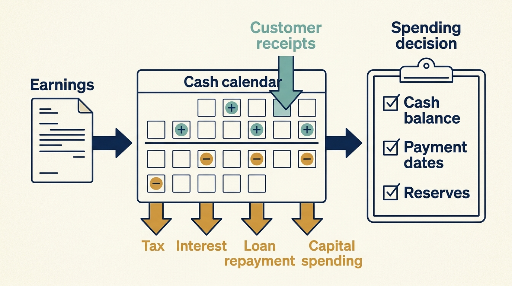

> **KEY POINTS:**
>
> * An earnings measure is **not a spending budget**. The business must still fund taxes, financing, investment and the timing gap between payments and receipts.
> * The next **funding or payment date** constrains today’s commitments. Examine cash after borrowing obligations and runway before another round; decide early what changes if funding or results disappoint.
> * Accounting **does not remove the cost of work**. Recording development as an asset changes its earnings treatment; the company still pays for it.

 
The board sees a growing measure of operating earnings. The engineering team is told there is no money for an essential migration. Both can be true. The budget discussion needs to explain what happens between recording earnings and having cash available for new work.

Without outside investors, the gap between earnings and cash is mostly an accounting matter. With them it becomes structural. Loan repayments, interest, fees and payments to owners are set by the financing, not the operating plan, and they are paid before a migration or a new team is funded. Product and engineering leaders who read only the earnings figure will misjudge how much of it is theirs to commit.

[[valuation-is-an-estimate]] distinguished earnings from cash in principle. This chapter works from earnings to the cash left after planned payments, then examines runway in a company spending more than it collects. Both calculations turn an investment request into a choice about timing and competing obligations.

Before the calculation, recall **EBITDA**: earnings before interest, income taxes, depreciation and amortization, the asset-accounting charges explained in [[valuation-is-an-estimate]]. It leaves out several payments a business must make.

**Capital expenditure**, often shortened to **capex**, is spending on assets such as equipment or qualifying software development. Recording qualifying spending as an asset is called **capitalization**. The cash is still spent even though the expense is recognized over time.

For this example, **working capital** means money tied up in unpaid customer invoices and inventory, less amounts owed to suppliers. An increase uses cash; a decrease can release it. Growth can increase that need if customers pay after the company incurs costs. Customer prepayments can produce the opposite result.

## From Earnings to the Cash You Can Actually Spend

Take Larkspur, the fictional scheduling-software company from [[raise-what-you-need]], now a few years past its buyout and carrying the borrowing that funded it. The fictional annual planning example below uses millions of euros and is separate from the generic buyout calculation in [[three-different-returns]]. It is a simplified management model, not a cash-flow statement prepared under formal accounting rules. EBITDA already includes expensed payroll and ordinary operating costs; capitalized development is listed separately so those cash payments don't look as if they've disappeared.

| Cash bridge | €m |
| --- | ---: |
| EBITDA | 10.0 |
| Cash interest | −4.0 |
| Cash tax | −1.0 |
| Capital expenditure, including capitalized development | −2.0 |
| Additional working capital | −1.0 |
| Cash available before debt principal and distributions | 2.0 |
| Required repayment of the amount borrowed (principal) | −1.5 |
| Remaining cash before other movements | 0.5 |

Larkspur's engineering leader wants €1 million for the onboarding automation. EBITDA is €10 million. **After the payments in this annual model, €0.5 million remains.** Existing cash, reserves, payment dates and obligations left out of the model still need checking before committing it. The initiative might displace another investment, require borrowing or equity, or be staged over time. Calling the constraint short-term thinking doesn't resolve it. Neither does declaring the initiative unaffordable without asking whether it protects future cash.

The working-capital line explains why sales growth can absorb cash. Larkspur grew, so more customers owed it money at year end than at the start: about €1 million more invoiced but not yet collected. The sales are recorded, the cash isn't in. In this scenario, growth increased the cash tied up in customer invoices.

More generally, working capital is money tied up in the operating cycle. A company can recognize revenue before collecting invoices, or pay suppliers before customers pay it. Annual subscription prepayments work the other way and produce cash before the revenue is recognized. These timing differences can be economically helpful while still creating future service obligations.

**Figure 1:** *An annual residual is a planning result; available cash also depends on balances, obligations and dates.*

## A Company Without Acquisition Debt Can Still Run Out of Time

Consider a separate fictional Larkspur scenario with no acquisition debt. The company has €3m of unrestricted cash and spends €600,000 a month while collecting €350,000. **Net cash burn** is the difference: €250,000 a month. At that rate, cash lasts 12 months. That estimate is its **runway**.

Alex proposes hires that raise monthly cash spending by €100,000, with no immediate increase in receipts. Net burn becomes €350,000 and simple runway falls to about 8.6 months. The board expects another funding round in nine months. On these assumptions, the hires make the plan depend on money arriving before it's currently expected.

| Planning assumption | Net monthly burn | Simple runway on €3m |
| --- | ---: | ---: |
| Current spending and receipts | €250,000 | 12 months |
| New hires, no immediate extra receipts | €350,000 | About 8.6 months |

Real cash forecasts need payment dates, taxes, one-off costs, restricted cash, revenue uncertainty and a minimum operating reserve. A company should act before the bank balance reaches zero. This calculation isolates the choice; it isn't a recommendation to hold a particular reserve or fundraising schedule.

The leadership response is to agree what evidence the hires would produce, stage commitments where possible and decide when to change course if funding stays uncertain. Sam and Alex should put the next decision date ahead of the point where notice periods, customer obligations or fixed contracts make the plan expensive to reverse. An investor's intention to join another round is not cash received or a binding commitment with understood conditions.

Under corporate ownership, replace the hoped-for round with the relevant parent-company allocation and approval. Under profitable growth, include the timing of customer receipts and the spending needed to serve them. In each case, the proposal needs a funded path through the next important decision.

**Figure 2:** *Make the next funding decision and the fallback plan visible before taking on permanent commitments.*

## Debt Changes the Consequences of Being Wrong

Interest is the cost of borrowing. Principal repayment returns the borrowed amount. The **maturity date** is when a loan is due for repayment. Meeting it can require **refinancing**, replacing the loan with a new one, even if every interest payment was made on time.

**Covenants** are contractual conditions attached to borrowing. A covenant might, for example, cap net debt divided by EBITDA at 5×. This is a **leverage ratio**: it compares borrowing, after included cash, with a defined annual earnings measure. If the ratio breaches the agreed limit, the contract may give lenders additional rights, subject to its terms and any chance to remedy the breach. The company may need to negotiate a waiver, pay extra fees or change its financing or spending plan. **This is why one bad quarter can freeze a migration budget that was approved in the last one.** Exact definitions and consequences live in the financing documents, and they vary.

A simple downside scenario shows the operating significance. Suppose a company carries €60 million of **floating-rate debt**, borrowing whose interest rate moves with the market, so the cost can rise without anything changing inside the business. At 6% annually, interest is €3.6 million. At 9%, it becomes €5.4 million. (These are round numbers for the rate illustration, not Larkspur's €4.0 million above.) The €1.8 million difference can consume more cash than an entire technology initiative. If EBITDA also falls, the company faces weaker earnings and higher financing costs at the same time. This is arithmetic under stated assumptions, not a forecast of interest rates.

A lender's leverage calculation may use a different EBITDA definition from management's operating report. It might include an anticipated **synergy**, a benefit expected from combining acquired businesses, before that benefit produces cash. Leaders should know both the contractual measure and a conservative view of the business's ability to pay.

This is why a technical value-creation plan should include **a downside funding path**. Which work continues during a revenue miss? **Which commitments cannot be unwound?** What is the latest date to act before a dependency becomes a crisis? A roadmap without these answers assumes a financial environment the company may not have.

## Accounting Changes the Picture, Not the Work

Under **IAS 38**, the international accounting standard covering intangible assets, research expenditure is expensed; development expenditure that meets specified criteria is recognized as an intangible asset. The treatment depends on the facts and applicable standards. It isn't a discretionary device for meeting an EBITDA target. [S07: IAS 38 overview](https://www.ifrs.org/issued-standards/list-of-standards/ias-38-intangible-assets/)

To isolate the accounting effect, consider a separate €1 million development-spending example. The table compares recognizing the spending immediately as an expense with recognizing it as an asset. In practice the applicable criteria decide the treatment; management can't simply choose the column with higher EBITDA:

| | Expensed | Capitalized |
| --- | ---: | ---: |
| EBITDA | 9.0 | 10.0 |
| Cash paid out | −1.0 | −1.0 |

The same engineers did the same work and the same €1 million left the bank. Only the earnings presentation moved, by a full million, before later amortization. A technology leader who reports an EBITDA improvement should ask whether the work became more effective, whether the accounting changed, or both.

The point isn't that capitalization is suspicious. It's that useful performance comparisons reconcile the policy and include the cash needed to sustain the product. A company investing responsibly can look weaker on a short-period earnings measure than a company deferring necessary work.

Adjusted earnings need the same discipline. The SEC distinguishes plain EBITDA from measures carrying further adjustments, which need their own label and reconciliation. [S06: SEC non-GAAP guidance](https://www.sec.gov/rules-regulations/staff-guidance/corporation-finance-interpretations/non-gaap-financial-measures) Separating an unusual restructuring charge can help analysis. Repeatedly excluding the costs of recurring acquisitions can obscure the economics of a business whose strategy depends on them. Keep a reconciliation, examine recurrence, and ask what expenditure the next owner will still need.

## Preserve the Capacity to Absorb a Setback

Debt can make an attractive acquisition possible and sharpen attention to cash. It can also reduce the capacity to withstand surprises. The evidence doesn't justify assuming that sponsor ownership always removes financial support: Bernstein, Lerner, and Mezzanotti found greater investment and financing inflows among PE-backed companies relative to peers during the 2008 crisis, with stronger effects when sponsors had more resources. That is evidence of a conditional support mechanism, not a promise of rescue. [S10: Bernstein et al., crisis study](https://www.nber.org/system/files/working_papers/w23626/w23626.pdf)

For planning, distinguish committed support from hopeful support. An owner who has supplied capital before may choose differently this time. A fund's portfolio construction and remaining commitments matter. So does the relative attractiveness of rescuing this company versus investing elsewhere.

Product and engineering leaders should also distinguish reversible savings from capability losses. Turning off unused environments reduces waste. Removing the people who understand a fragile billing platform may create a deferred cost larger than the immediate payroll reduction. Estimate the transition cost, state the uncertainty, and agree the service and delivery indicators that would reveal damage.

The historical Toys R Us case in [[toys-r-us]] makes this distinction concrete. Its fiscal 2016 release reports positive adjusted EBITDA alongside negative operating cash flow and substantial capital expenditure. [S35: Toys R Us fiscal 2016 results](https://www.sec.gov/Archives/edgar/data/1005414/000100541417000010/truq4-16earningsreleaseexh.htm) That combination doesn't identify the cause of failure, but it rules out using the earnings headline as the available reinvention budget.

## Bring Choices, Not an Unpriced Wish List

A useful proposal offers a minimum continuity option, a staged improvement and a more ambitious investment. Each should show cash timing, required capacity, dependencies, expected outcome, and what would trigger a stop or expansion. The CFO checks financial consistency; product and engineering leaders explain the consequences of each option.

The question becomes: which plan gives the company the strongest feasible ability to serve customers and meet its obligations? That is more demanding than maximizing an earnings measure. It's also a much stronger basis for arguing that technology deserves investment.

The cash bridge explains why positive earnings can coexist with an unfunded migration. It is a planning calculation, not a universal payment priority: ordinary engineering salaries are already in operating costs, and actual payment dates and restrictions matter.

Part I has followed the money from funding to company cash. Part II asks who can decide how that cash and the company's people are used. Begin with [[part-2]], then [[decide-who-decides]].

## Questions to Consider

1. *Starting from your company’s operating earnings, which payments come before a new initiative can be funded: interest, tax, capital expenditure, working capital, principal repayment, distributions? Do you know what remains?*
2. *If your company spends more than it collects, what is its runway, when is the next funding decision, and by what date must you act before commitments become expensive to reverse?*
3. *Which covenants or financing conditions apply to your company, and what would a single weak quarter do to next year’s technology budget?*
4. *Does your roadmap include a downside funding path: which work continues during a revenue miss, which commitments cannot be unwound and the latest date to act?*
5. *When engineering reports an improvement in earnings, can you tell whether the work became more effective, the accounting treatment changed, or both?*
6. *Which proposed savings in your plan are reversible reductions of waste, and which would remove capability that costs more to rebuild later?*

## To Probe Further

- **[Financial Intelligence, Revised Edition: A Manager's Guide to Knowing What the Numbers Really Mean](https://store.hbr.org/product/financial-intelligence-revised-edition-a-manager-s-guide-to-knowing-what-the-numbers-really-mean/10833)** — Karen Berman, Joe Knight and John Case, Harvard Business Review Press, 2013. *A manager's guide to the three financial statements that explains why a profitable company can still be short of cash, the gap this chapter's cash bridge exposes.*
- **[Default Alive or Default Dead?](https://paulgraham.com/aord.html)** — Paul Graham, October 2015. *A short essay on whether a company reaches profitability on current spending and growth, which states the second Larkspur scenario as a founder's habit of mind.*
- **[IAS 7 Statement of Cash Flows](https://www.ifrs.org/issued-standards/list-of-standards/ias-7-statement-of-cash-flows/)** — IFRS Foundation, standard overview, undated. *The standard behind a formal cash-flow statement, for moving from this chapter's simplified management bridge to the statement your finance team actually prepares.*
- **[Leveraged Loan Primer](https://pitchbook.com/leveraged-commentary-data/leveraged-loan-primer)** — PitchBook LCD (Leveraged Commentary & Data), living guide. *A free introduction to floating-rate pricing, leverage ratios and covenant types, which explains the mechanics behind this chapter's covenant and floating-rate examples in more detail.*
- **[Financial Stability Report – June 2024](https://www.bankofengland.co.uk/financial-stability-report/2024/june-2024)** — Bank of England, June 2024. *Section 6 on vulnerabilities in private equity gives a regulator's system-level view of the refinancing risk this chapter asks you to preserve setback capacity against.*
