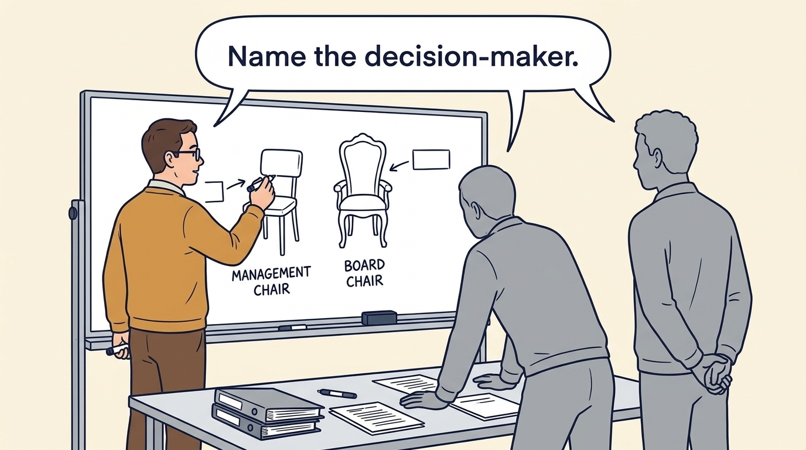
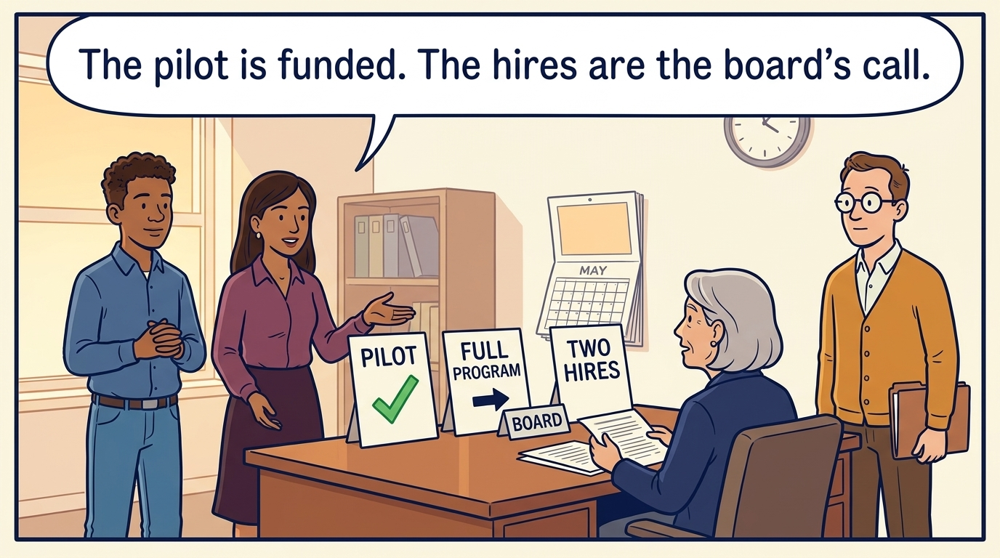
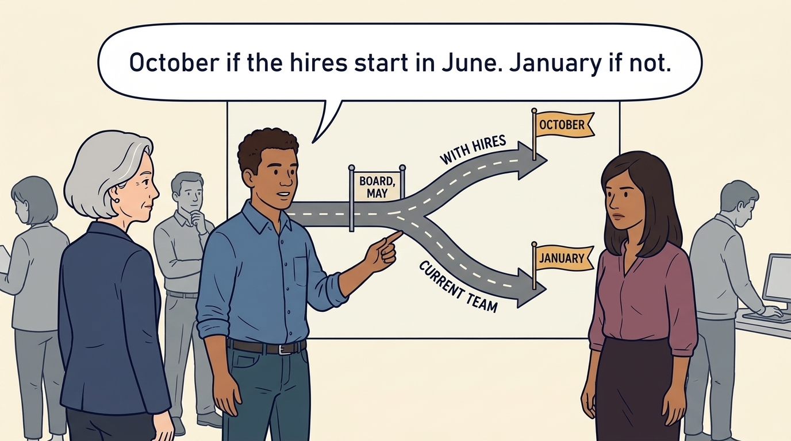
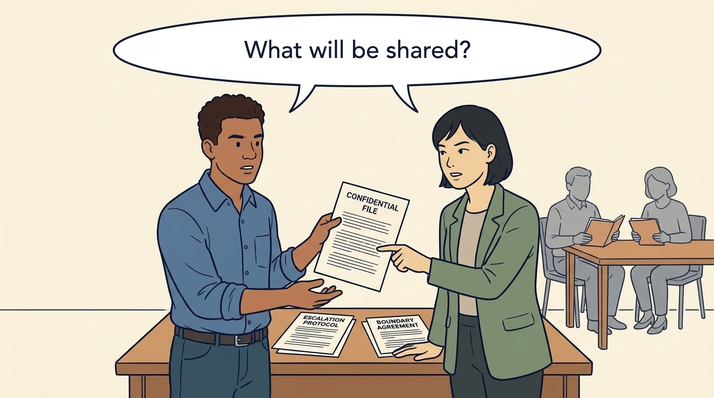
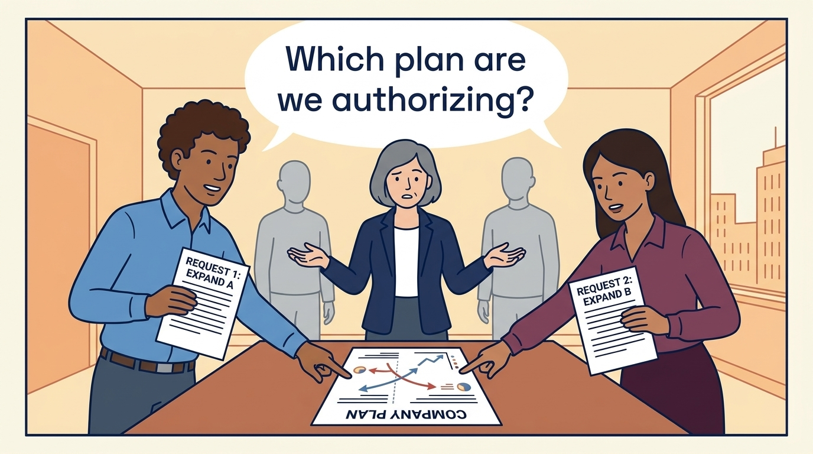

<!-- comic-style
{
  "cast": "MORGAN: a thoughtful investor technology adviser with short dark hair and a green jacket, used in the fund scenarios. ALEX: a practical CTO with curly hair and blue rolled-up sleeves. SAM: a CFO with round glasses and an amber cardigan. PRIYA: a product leader with straight dark hair and plum sleeves. INES: a CEO with short grey hair and a navy jacket. All are fictional; none represents a person in a real case.",
  "style": "Clean editorial explainer comic, dark ink outlines, restrained green, blue, and amber accents on warm white, generous space, readable short speech bubbles, expressive people and simple physical metaphors. No photorealism, logos, dense charts, or title text. Keep the same character appearances throughout the journal."
}
-->

**Comic.** An investment can change who is authorized to decide, and a suggestion from someone close to the investor can sound like an instruction. The panels start with a misheard cloud remark, which settles how far an adviser’s influence reaches, then follow a separate Larkspur onboarding proposal through a filled-in decision record, a deadline that passes, and the funded plan the team is told it is actually executing.

Morgan is an investor’s adviser in the fund scenarios; Alex leads technology, Priya leads product, and Sam leads finance. All are fictional. Comparative scenarios use separate assumptions. Historical cases are discussed through documents; the scenes do not reenact real events.

<!-- comic-panel
{
  "id": "01-scene",
  "status": "generated",
  "asset": "assets/images/05-decide-who-decides/comic-01-scene.jpeg",
  "aspect_ratio": "16:9",
  "prompt": "Panel 1 of an explainer comic. Alex receives a suggestion from Morgan while Sam compares the old and new decision map. Use one speech bubble with the exact words: \"Which decisions have actually changed?\" Convey: An investment can change authority, priorities and accountability. Morgan's cloud remark sounds like an instruction to Alex; the decision map shows Morgan holds no approval right.",
  "alt": "Comic panel: Alex receives a suggestion from Morgan while Sam compares the old and new decision map.",
  "caption": "An investment can change authority, priorities and accountability. Morgan’s cloud remark sounds like an instruction to Alex; the decision map shows Morgan holds no approval right.",
  "generation": {
    "model": "gemini-3-pro-image-preview",
    "reference_id": "owned-cast-20260913",
    "sha256": "e87aa673d9cfa5ebf9665e16588d167b49d43521b1b2fd82e7c1116403533775"
  }
}
-->

**Panel 1:** An investment can change authority, priorities and accountability. Morgan’s cloud remark sounds like an instruction to Alex; the decision map shows Morgan holds no approval right.

*Dialogue:* “Which decisions have actually changed?”

<!-- comic-panel
{
  "id": "02-scene",
  "status": "generated",
  "asset": "assets/images/05-decide-who-decides/comic-02-scene.jpeg",
  "aspect_ratio": "16:9",
  "prompt": "Panel 2 of an explainer comic. Sam draws separate chairs for management and board. Use one speech bubble with the exact words: \"Name the decision-maker.\" Convey: Fill in the record with names, thresholds and dates: who recommends, who is authorized to decide, who funds and by when. The fund's investment committee approved the investment; the company's board and executives approve company work.",
  "alt": "Comic panel: Sam draws separate chairs for management and board.",
  "caption": "Fill in the record with names, thresholds and dates: who recommends, who is authorized to decide, who funds and by when. The fund’s investment committee approved the investment; the company’s board and executives approve company work.",
  "generation": {
    "model": "gemini-3-pro-image-preview",
    "reference_id": "owned-cast-20260913",
    "sha256": "6e3c2a79955108f50dc1d60fe4ef371796c66b7a4efe815747c9e5320b065c49"
  }
}
-->

**Panel 2:** Fill in the record with names, thresholds and dates: who recommends, who is authorized to decide, who funds and by when. The fund’s investment committee approved the investment; the company’s board and executives approve company work.

*Dialogue:* “Name the decision-maker.”

<!-- comic-panel
{
  "id": "03-scene",
  "status": "generated",
  "asset": "assets/images/05-decide-who-decides/comic-03-scene.jpeg",
  "aspect_ratio": "16:9",
  "prompt": "Panel 3 of an explainer comic. Alex asks Morgan to explain a business constraint. Use one speech bubble with the exact words: \"Show me the consequence.\" Convey: A useful challenge asks which customer need the proposal serves, what the constraint costs and which other options could address it. The board does not become an architecture committee.",
  "alt": "Comic panel: Alex asks Morgan to explain a business constraint.",
  "caption": "A useful challenge asks which customer need the proposal serves, what the constraint costs and which other options could address it. The board does not become an architecture committee.",
  "generation": {
    "model": "gemini-3-pro-image-preview",
    "reference_id": "owned-cast-20260913",
    "sha256": "efd172a5598045c0adff272f45c36bd5401aaaa342981e292c1a89cc12155dbc"
  }
}
-->

**Panel 3:** A useful challenge asks which customer need the proposal serves, what the constraint costs and which other options could address it. The board does not become an architecture committee.

*Dialogue:* “Show me the consequence.”

<!-- comic-panel
{
  "id": "04-scene",
  "status": "generated",
  "asset": "assets/images/05-decide-who-decides/comic-04-scene.jpeg",
  "aspect_ratio": "16:9",
  "prompt": "Panel 4 of an explainer comic. A decision card circulates without finding the person authorized to act. Use one speech bubble with the exact words: \"Who can act before Friday?\" Convey: A decision process needs someone authorized to act before the relevant deadline, not only a name on an organization chart. An escalation route that takes six weeks is useless for a financing deadline.",
  "alt": "Comic panel: A decision card circulates without finding the person authorized to act.",
  "caption": "A decision process needs someone authorized to act before the relevant deadline, not only a name on an organization chart. An escalation route that takes six weeks is useless for a financing deadline.",
  "generation": {
    "model": "gemini-3-pro-image-preview",
    "reference_id": "owned-cast-20260913",
    "sha256": "e2f3bd16838e79f4e7606f033fde420d3fcf9bccd0eeffe6e6b42192ce12e2ea"
  }
}
-->

**Panel 4:** A decision process needs someone authorized to act before the relevant deadline, not only a name on an organization chart. An escalation route that takes six weeks is useless for a financing deadline.

*Dialogue:* “Who can act before Friday?”

<!-- comic-panel
{
  "id": "05-scene",
  "status": "generated",
  "asset": "assets/images/05-decide-who-decides/comic-05-scene.jpeg",
  "aspect_ratio": "16:9",
  "prompt": "Panel 5 of an explainer comic. Morgan and Alex agree an information-sharing boundary before a support assignment. Use one speech bubble with the exact words: \"What will be shared?\" Convey: Engineers should hear one set of priorities. Before a support assignment starts, name the accountable company leader and agree what the adviser will share, and with whom.",
  "alt": "Comic panel: Morgan and Alex agree an information-sharing boundary before a support assignment.",
  "caption": "Engineers should hear one set of priorities. Before a support assignment starts, name the accountable company leader and agree what the adviser will share, and with whom.",
  "generation": {
    "model": "gemini-3-pro-image-preview",
    "reference_id": "owned-cast-20260913",
    "sha256": "376863cf7abdd832ced0179b3cb73413e66e658d9ddc3a16bd026b147aaaa830"
  }
}
-->

**Panel 5:** Engineers should hear one set of priorities. Before a support assignment starts, name the accountable company leader and agree what the adviser will share, and with whom.

*Dialogue:* “What will be shared?”

<!-- comic-panel
{
  "id": "06-scene",
  "status": "generated",
  "asset": "assets/images/05-decide-who-decides/comic-06-scene.jpeg",
  "aspect_ratio": "16:9",
  "prompt": "Panel 6 of an explainer comic. Alex and Priya take two incompatible requests to Ines, with one company plan between them. Use one speech bubble with the exact words: \"Which plan are we authorizing?\" Convey: Several investors can make conflicting requests, and an approval can miss its date. Use the authorized forum. If the hiring approval has not arrived by May, the team executes the January plan, with the cash and engineer-weeks already authorized, and is told so in writing.",
  "alt": "Comic panel: Alex and Priya take two incompatible requests to Ines, with one company plan between them.",
  "caption": "Several investors can make conflicting requests, and an approval can miss its date. Use the authorized forum. If the hiring approval has not arrived by May, the team executes the January plan, with the cash and engineer-weeks already authorized, and is told so in writing.",
  "generation": {
    "model": "gemini-3-pro-image-preview",
    "reference_id": "owned-cast-20260913",
    "sha256": "a938709d98e4894598514b54242f6a6579d731ad6f64aff19af31e15121a457a"
  }
}
-->

**Panel 6:** Several investors can make conflicting requests, and an approval can miss its date. Use the authorized forum. If the hiring approval has not arrived by May, the team executes the January plan, with the cash and engineer-weeks already authorized, and is told so in writing.

*Dialogue:* “Which plan are we authorizing?”
