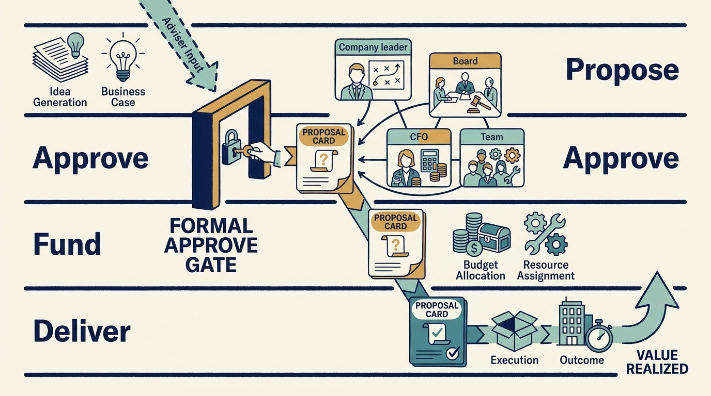

> **IN THIS SECTION, YOU WILL:** Learn to fill in who proposes, approves, funds and carries out a decision, and plan what happens when the approval does not arrive in time.

> **WHY IS THIS IMPORTANT:** A suggestion from someone close to the investor can start a project nobody approved, and an approval that never arrives can silently become a delivery failure; clear authority prevents both.

> **KEY POINTS:**
>
> * Agree **who is authorized to decide** before disagreement arises. A suggestion from someone close to the investor can sound like an instruction.
> * Fill in the record with **names, thresholds and dates**. “Management recommends, the board approves” tells nobody whom to call on a Tuesday, or by when.
> * Plan the **missed-deadline branch**. If the approval does not arrive, take the remaining options back to the person authorized to decide and tell the team which plan it is executing.

 
Morgan, the technology adviser working for the investment firm, mentions over coffee that the fictional software company Larkspur should probably change its cloud provider, the supplier of its rented computing services. Alex, the chief technology officer (**CTO**), hears an instruction from the new shareholder and starts planning a migration. Morgan thought they were offering an idea.

This is a problem of **governance**: the arrangements for making decisions, overseeing them and holding people responsible. Good intentions can’t replace an agreed decision process.

Informal influence and unclear delegation exist under any ownership; a founder’s offhand remark can start a project just as easily. An investment changes the conditions of the decision. It can add board seats, approval thresholds, **reserved matters** (decisions that require a specified party’s approval) and advisers who speak, or seem to speak, for a shareholder. Their requests are easy to overweight or underweight, and either mistake lands on product and engineering teams. Establish the actual authority, funding and deadline before committing.

Part I followed the money. This chapter begins Part II by examining what an investment can change about your authority and accountability. It works through one Larkspur decision from the misheard suggestion to a filled-in decision record, then to what happens when the approval it depends on is late.

The cast is fictional. Ines is Larkspur’s chief executive officer (**CEO**), Alex its CTO, Sam its chief financial officer (**CFO**) and Priya its product leader. Morgan is the **investor’s technology adviser**, the role this book calls the Technology Principal. Their titles describe their work; their actual approval rights need to be agreed.

## Establish What Has Changed

**Authority** means permission to make a particular decision. New ownership can change it directly through agreed rights, or change how people expect you to exercise it. Compare the arrangements before and after the investment using actual company documents and conversations with the responsible leaders.

| Area | What to establish |
| --- | --- |
| Ownership | Who now holds shares, and which rights come with them? |
| Priorities | Which customer, financial or operating outcomes are now expected, and why? |
| Approval | Which hiring, spending, product or transaction decisions need approval, from whom and by when? |
| Accountability | Who is accountable for each result, what resources have been committed and how will progress be assessed? |

Applied to the cloud suggestion, the table settles the matter in a minute. Larkspur’s board has authorized Ines to approve spending up to €500,000 (a fictional threshold). No reserved matter covers the choice of cloud provider. Morgan holds no approval right; the investment firm’s rights are exercised through its board seat. So the suggestion is an idea for Alex to evaluate, and a migration would need Ines’s approval or, above the threshold, the board’s. Alex records it as an option to cost, not as a plan, and tells Morgan so.

An investment doesn’t automatically change every entry. Recording what stayed the same helps when employees are unsure whether earlier authority still applies. If you inherited the ownership arrangement, begin with the decisions ahead rather than assuming you took part in agreeing the original terms.

Distinguishing the decision-makers matters because they approve different things. The fund’s **investment committee** approved the investment in Larkspur; it does not approve Larkspur’s hiring plan. The company’s board and executives approve company work. Operating professionals from the investment firm contribute expertise. Lenders can hold contractual rights that constrain all of them. The survey of private equity investors by Gompers and colleagues documents attention to governance, financing and value creation; it doesn’t establish a uniform organization chart. [S04: PE practitioner survey](https://www.nber.org/papers/w21133) KKR’s public description of Capstone, its in-house operating-support team, similarly places operating support alongside investment teams, boards and company management: a stated delivery model, not proof that every intervention succeeds. [S22: KKR Capstone description](https://www.kkr.com/approach/capstone)

## Write Down Who Decides What

Replace the generic diagram with names and rights. Priya and Alex want to spend €1 million automating **onboarding**, the setup needed before a customer can use the product. Their decision record looks like this:

| | Larkspur’s answer |
| --- | --- |
| Decision | Spend €1 million automating customer onboarding |
| Who recommends | Priya, the product leader, with Alex, the CTO |
| Who resolves trade-offs | Ines, the CEO |
| Investor adviser’s contribution | Test whether the 80-hour implementation figure holds across customer types; supply comparable onboarding patterns |
| Whose approval is needed | The board, because the amount exceeds the €500,000 Ines is authorized to approve |
| Response time | Two weeks: the budget cycle closes at month end |
| Evidence that would change the recommendation | Implementation effort that varies widely by customer type, which would favor a narrower first step |

This is the €1 million program discussed in [[obligations-before-budget]], not an approved commitment to spend it. The board still needs a feasible funding plan, and [[cannot-fund-everything]] shows why it may fund a smaller step first.

Names and thresholds make the record usable. A useful record also names a response time. **Escalation** means taking an unresolved issue to someone authorized to decide it. An escalation route that takes six weeks is useless for a financing deadline or a service failure. Treating every architectural disagreement as an emergency fails the other way: it stops company leadership from exercising judgment.

**Figure 1:** *Decision rights clarify how an idea becomes an authorized, funded commitment.*

Read as roles rather than names, the same record generalizes. The pattern below is a proposal to adapt to actual company documents, not an assertion that an investor’s adviser holds any of these rights.

| Decision | Company contribution | Investor adviser’s possible contribution | Approval to verify |
| --- | --- | --- | --- |
| Product priorities within an agreed budget | Product leader and CTO recommend; CEO resolves major trade-offs | Challenge assumptions and supply evidence | Executive delegation and any reserved matters |
| Material technology investment | Management prepares options and the financial case | Test technical feasibility and delivery dependencies | Board, shareholder or financing approvals where required |
| CTO appointment | CEO defines the need and the process | Help assess candidates and context | The actual appointment authority |
| Acquisition integration | Executives are accountable for the integration plan | Assess sequencing, capacity and reusable support | Transaction and operating governance |

## Several Investors Do Not Make One Decision-Maker

In a fictional minority round, Larkspur’s founder keeps most voting shares. One new investor receives a board seat; another receives specified approval rights. Alex is asked for three different versions of the hiring plan. The right response is to establish which forum can approve the company’s plan and bring the alternatives there. Adding all the requests to the roadmap would turn unresolved shareholder disagreement into the team’s delivery problem.

The National Venture Capital Association publishes separate model documents for share purchases, investor rights and voting arrangements. Its overview also describes time- or milestone-based funding mechanisms. This supports looking beyond an ownership percentage; it doesn’t establish the terms of any particular company’s agreement. [S61: NVCA model-document overview](https://nvca.org/model-legal-documents/)

With a controlling financial sponsor, ask which decisions remain delegated to management and which require approval. With a corporate parent, map the local board and executives alongside group product, security, finance and procurement functions. A minority corporate investment doesn’t by itself establish that group hierarchy.

**Record the source of each relevant authority**, the decision threshold and the response time in language the team can use. When shareholders disagree, the board or another authorized body has to resolve the choice; what that body is, and what happens in a deadlock, depends on the actual agreements. The product and engineering leader supplies the options, evidence and consequences. Shareholder disagreement can’t be resolved by silently promising incompatible work.

## Connect Technical Choices to the Business Outcome

Alex proposes rewriting Larkspur’s scheduling engine because it is hard to change. The board asks how that supports growth. Alex answers that the current stack is dated. The exchange produces heat but little information.

A better challenge asks for the constrained business outcome: which customer need can’t be served, how often the constraint bites and what it costs. Alex can then compare a focused change, a staged replacement and the full rewrite. Sam can compare their cash profiles with the €0.5 million remaining in the annual planning example ([[obligations-before-budget]]). The board can decide whether to fund an option and accept its risks. It hasn’t become an architecture committee; it has required the connection between an investment and the business plan to be made explicit.

The same discipline applies in reverse. “Cut engineering by 20%” isn’t a complete operating plan. Which work disappears? Which obligations remain? What happens to customer commitments and operational coverage? If the decision is still to cut, record its expected consequences rather than quietly converting them into impossible delivery promises.

## Make a Conditional Commitment Explicit, and Plan the Missed Deadline

Suppose Alex can deliver the onboarding change in October if two engineering hires start in June, or in January with current capacity. The board has approved the ambition but not the hiring budget, which the board must decide because the €1 million program exceeds Ines’s delegation. The operating record states both dates and the approval needed by May. “October, subject to funded capacity by May” is a decision proposal; an unconditional October promise would hide a dependency.

Now the likely failure: May arrives and the board has not decided. Silence does not resolve the question, so the record already says what happens. If the hiring approval has not arrived by May, Alex brings the January option back to Ines and communicates the currently authorized plan. Ines can escalate to the board chair for a decision between meetings or confirm January; either way the team is told, in writing, that January is the plan it is executing. Existing customer commitments still require an explicit decision: any promise made against the October date needs Ines to decide whether to renegotiate it, fund it from her own delegation or take it to the board. Nobody keeps working toward October on the assumption that money will appear.

Recorded, the decision reads: chosen option, January delivery with current capacity unless hiring is approved by May; alternatives rejected, an unconditional October promise and contractors funded from a budget that does not exist; funding, the two hires remain a board decision; scarce capacity, the current engineering team, which is fully assigned; authorized, Ines within her delegation and the board above it; evidence that would change it, a signed customer commitment tied to October, which would make the hiring decision urgent rather than optional.

**Figure 2:** *Record the condition, the person who can resolve it and the decision date.*

## Reporting That Asks for a Decision

A board report should connect material outcomes, interpretation and the decision needed. A traffic-light dashboard without an evidence trail can conceal more than it reveals: “green” might mean on time, within budget, lower risk or simply that no one has escalated a problem.

For the onboarding work, a fictional three-sentence update does the job: “Across the first eight customers, implementation effort fell from 80 to 62 hours, short of the 50 we assumed, and about 40% of the remaining hours trace to customer data quality rather than the product. We propose a data-quality step, €40,000 and four engineer-weeks, before deciding on further implementation hires. Decision requested: approve the €40,000 from the reserve at this meeting; the hiring decision returns at the next quarterly review.” The report shapes for the initiative and its outcomes are in the [[toolkit]]. Keep reporting effort visible; a monthly questionnaire that no decision depends on consumes the capacity the shareholder wants to improve.

## Parallel Instructions Need One Accountable Leader

Direct access to engineers can help during **due diligence**, the investigation before an investment, or during a clearly scoped support assignment. It becomes a problem when engineers receive priorities from the investor’s adviser, the CTO and the investment team at once: a parallel reporting line without a mandate or accountability. For any assignment, name the accountable company leader and route conflicting instructions back to that person. How an adviser’s influence and information should be used, including the boundaries of confidential coaching, is the subject of [[investors-adviser]]; the charter for a support assignment is in [[useful-engagement]].

## Disagreement Without Evasion

A leader should be able to say: “We can deliver the cost target, but not the current roadmap with it. Here are the choices.” An investor’s adviser should be able to say: “The evidence no longer supports the original thesis.” A board should be able to decide against a recommendation while recording what it is accepting.

A useful governance arrangement lets disagreement reach an accountable decision in time to act. The record should make clear who decided, which options were considered and what consequences were accepted.

Authority explains who can decide. It does not explain why the approver wants what they want. The next chapter reads the incentives behind the decision, what the executives’ shares, the fund’s carried interest and the employees’ jobs each stand to gain or lose: [[different-bets]].

## Questions to Consider

1. *For the most important technology decision ahead of your company, who recommends, who is authorized to decide, who funds, who implements, and by when? Can you name people rather than roles?*
2. *When an adviser from the investor makes a suggestion, how do your engineers know whether it is an idea, an assessment or an instruction?*
3. *Which of your current commitments depend on an approval or hire that has not yet arrived? Is the condition recorded, with the decision date and what happens if the date passes?*
4. *When shareholders or board members disagree, which forum resolves the choice? Are incompatible requests being carried into the team’s backlog instead?*

## To Probe Further

- **[Who Has the D?: How Clear Decision Roles Enhance Organizational Performance](https://hbr.org/2006/01/who-has-the-d-how-clear-decision-roles-enhance-organizational-performance)** — Paul Rogers and Marcia Blenko, Harvard Business Review, January 2006. *The Bain consultants' method behind this chapter's "who recommends, who decides, who implements" pattern, showing what goes wrong when several people believe they hold the decision.*
- **[Startup Boards: A Field Guide to Building and Leading an Effective Board of Directors, 2nd Edition](https://feld.com/archives/2022/06/book-startup-boards-2nd-edition-is-available/)** — Brad Feld, Matt Blumberg and Mahendra Ramsinghani, Wiley, 2022. *A practitioner account, from investors and a CEO, of how investor-backed boards work, which fills in the venture and growth cases this chapter only sketches.*
- **[The Wates Corporate Governance Principles for Large Private Companies](https://www.frc.org.uk/library/standards-codes-policy/corporate-governance/the-wates-corporate-governance-principles-for-large-private-companies/)** — Financial Reporting Council (UK), December 2018. *Six principles for private company boards, a reference for what a board is expected to do beyond what its shareholders ask of it.*
- **[Unlock value with PE portfolio company governance](https://www.deloitte.com/us/en/programs/center-for-board-effectiveness/articles/private-equity-portfolio-company-board-governance.html)** — Deloitte Center for Board Effectiveness, January 2026. *Advisory guidance for a sponsor-appointed board, covering composition, the split of board and management responsibilities, and dashboard reporting.*
