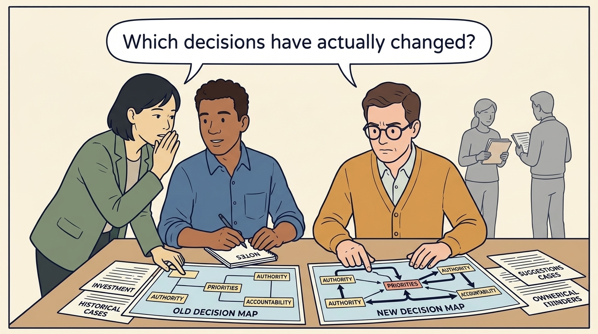
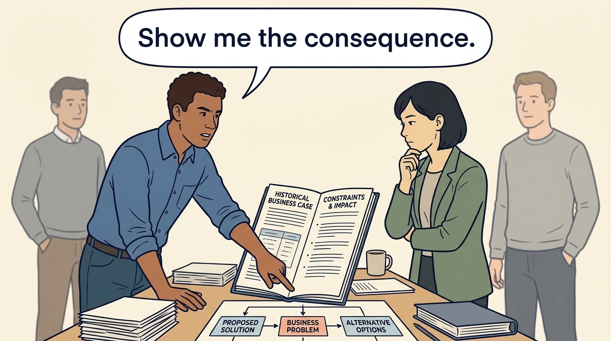
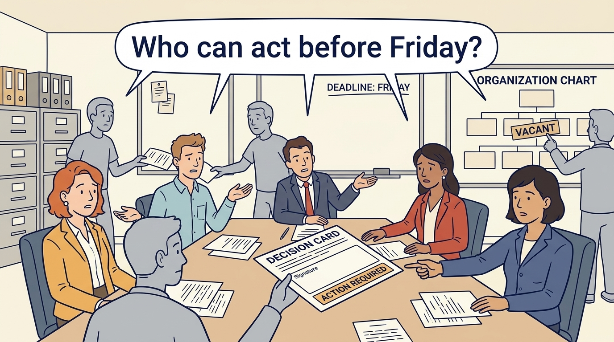

<!-- comic-style
{
  "cast": "MORGAN: a thoughtful investor technology adviser with short dark hair and a green jacket, used in the fund scenarios. ALEX: a practical CTO with curly hair and blue rolled-up sleeves. SAM: a CFO with round glasses and an amber cardigan. PRIYA: a product leader with straight dark hair and plum sleeves. INES: a CEO with short grey hair and a navy jacket. All are fictional; none represents a person in a real case.",
  "style": "Clean editorial explainer comic, dark ink outlines, restrained green, blue, and amber accents on warm white, generous space, readable short speech bubbles, expressive people and simple physical metaphors. No photorealism, logos, dense charts, or title text. Keep the same character appearances throughout the journal."
}
-->

**Comic.** An informal decision process can work under a founder. The panels show what an outside investor adds, from board seats and approval thresholds to advisers whose suggestions sound like instructions, and why the consequences of misreading them land on product and engineering teams.

Morgan is an investor’s adviser in the fund scenarios; Alex leads technology, Priya leads product, and Sam leads finance. All are fictional. Comparative scenarios use separate assumptions. Historical cases are discussed through documents; the scenes do not reenact real events.

<!-- comic-panel
{
  "id": "01-scene",
  "status": "generated",
  "asset": "assets/images/05-governance/comic-01-scene.jpeg",
  "aspect_ratio": "16:9",
  "prompt": "Panel 1 of an explainer comic. Alex receives a suggestion from Morgan while Sam compares the old and new decision map. Use one speech bubble with the exact words: \"Which decisions have actually changed?\" Convey: Investment can change authority, priorities and accountability. A suggestion from someone close to the new owner can sound like an instruction.",
  "alt": "Comic panel: Alex receives a suggestion from Morgan while Sam compares the old and new decision map.",
  "caption": "Investment can change authority, priorities and accountability. A suggestion from someone close to the new owner can sound like an instruction.",
  "generation": {
    "model": "gemini-3-pro-image-preview",
    "reference_id": "owned-cast-20260913",
    "sha256": "e87aa673d9cfa5ebf9665e16588d167b49d43521b1b2fd82e7c1116403533775"
  }
}
-->

**Panel 1:** Investment can change authority, priorities and accountability. A suggestion from someone close to the new owner can sound like an instruction.

*Dialogue:* “Which decisions have actually changed?”

<!-- comic-panel
{
  "id": "02-scene",
  "status": "generated",
  "asset": "assets/images/05-governance/comic-02-scene.jpeg",
  "aspect_ratio": "16:9",
  "prompt": "Panel 2 of an explainer comic. Sam draws separate chairs for management and board. Use one speech bubble with the exact words: \"Name the decision-maker.\" Convey: Governance sets out who decides, who oversees and who is responsible. Company leaders and advisers can have different roles.",
  "alt": "Comic panel: Sam draws separate chairs for management and board.",
  "caption": "Governance sets out who decides, who oversees and who is responsible. Company leaders and advisers can have different roles.",
  "generation": {
    "model": "gemini-3-pro-image-preview",
    "reference_id": "owned-cast-20260913",
    "sha256": "6e3c2a79955108f50dc1d60fe4ef371796c66b7a4efe815747c9e5320b065c49"
  }
}
-->

**Panel 2:** Governance sets out who decides, who oversees and who is responsible. Company leaders and advisers can have different roles.

*Dialogue:* “Name the decision-maker.”

<!-- comic-panel
{
  "id": "03-scene",
  "status": "generated",
  "asset": "assets/images/05-governance/comic-03-scene.jpeg",
  "aspect_ratio": "16:9",
  "prompt": "Panel 3 of an explainer comic. Alex asks Morgan to explain a business constraint. Use one speech bubble with the exact words: \"Show me the consequence.\" Convey: A useful challenge asks what business problem the proposal solves and what other options could address it.",
  "alt": "Comic panel: Alex asks Morgan to explain a business constraint.",
  "caption": "A useful challenge asks what business problem the proposal solves and what other options could address it.",
  "generation": {
    "model": "gemini-3-pro-image-preview",
    "reference_id": "owned-cast-20260913",
    "sha256": "efd172a5598045c0adff272f45c36bd5401aaaa342981e292c1a89cc12155dbc"
  }
}
-->

**Panel 3:** A useful challenge asks what business problem the proposal solves and what other options could address it.

*Dialogue:* “Show me the consequence.”

<!-- comic-panel
{
  "id": "04-scene",
  "status": "generated",
  "asset": "assets/images/05-governance/comic-04-scene.jpeg",
  "aspect_ratio": "16:9",
  "prompt": "Panel 4 of an explainer comic. A decision card circulates without finding its owner. Use one speech bubble with the exact words: \"Who can act before Friday?\" Convey: A decision process needs someone authorized to act before the relevant deadline, as well as a name on an organization chart.",
  "alt": "Comic panel: A decision card circulates without finding its owner.",
  "caption": "A decision process needs someone authorized to act before the relevant deadline, as well as a name on an organization chart.",
  "generation": {
    "model": "gemini-3-pro-image-preview",
    "reference_id": "owned-cast-20260913",
    "sha256": "e2f3bd16838e79f4e7606f033fde420d3fcf9bccd0eeffe6e6b42192ce12e2ea"
  }
}
-->

**Panel 4:** A decision process needs someone authorized to act before the relevant deadline, as well as a name on an organization chart.

*Dialogue:* “Who can act before Friday?”

<!-- comic-panel
{
  "id": "05-scene",
  "status": "generated",
  "asset": "assets/images/05-governance/comic-05-scene.jpeg",
  "aspect_ratio": "16:9",
  "prompt": "Panel 5 of an explainer comic. Morgan and Alex agree an information-sharing boundary. Use one speech bubble with the exact words: \"What will be shared?\" Convey: Escalation means taking an issue to someone who can act. Agree what information must be shared before a sensitive conversation.",
  "alt": "Comic panel: Morgan and Alex agree an information-sharing boundary.",
  "caption": "Escalation means taking an issue to someone who can act. Agree what information must be shared before a sensitive conversation.",
  "generation": {
    "model": "gemini-3-pro-image-preview",
    "reference_id": "owned-cast-20260913",
    "sha256": "376863cf7abdd832ced0179b3cb73413e66e658d9ddc3a16bd026b147aaaa830"
  }
}
-->

**Panel 5:** Escalation means taking an issue to someone who can act. Agree what information must be shared before a sensitive conversation.

*Dialogue:* “What will be shared?”

<!-- comic-panel
{
  "id": "06-scene",
  "status": "generated",
  "asset": "assets/images/05-governance/comic-06-scene.jpeg",
  "aspect_ratio": "16:9",
  "prompt": "Panel 6 of an explainer comic. Alex and Priya take two incompatible requests to Ines, with one company plan between them. Use one speech bubble with the exact words: \"Which plan are we authorizing?\" Convey: Several investors can make conflicting requests. Use the authorized decision forum and state which funding approval a delivery promise depends on.",
  "alt": "Comic panel: Alex and Priya take two incompatible requests to Ines, with one company plan between them.",
  "caption": "Several investors can make conflicting requests. Use the authorized decision forum and state which funding approval a delivery promise depends on.",
  "generation": {
    "model": "gemini-3-pro-image-preview",
    "reference_id": "owned-cast-20260913",
    "sha256": "a938709d98e4894598514b54242f6a6579d731ad6f64aff19af31e15121a457a"
  }
}
-->

**Panel 6:** Several investors can make conflicting requests. Use the authorized decision forum and state which funding approval a delivery promise depends on.

*Dialogue:* “Which plan are we authorizing?”
