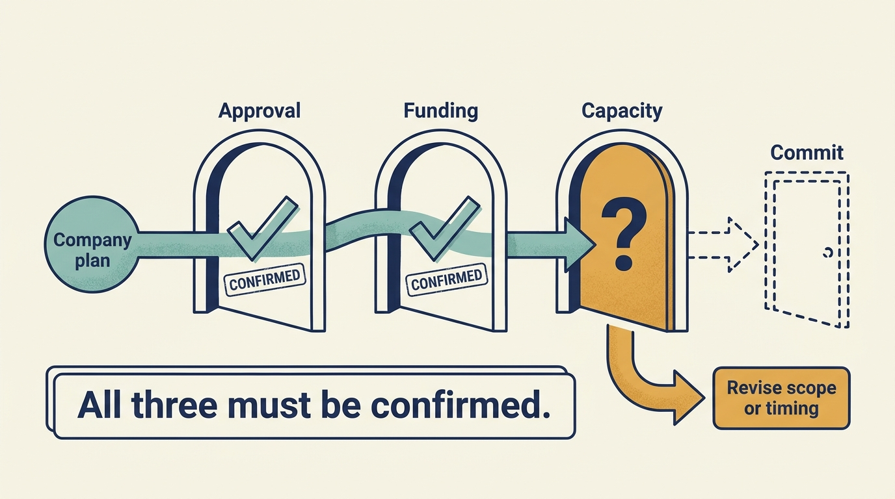

> **KEY POINTS:**
>
> * Agree **who may decide** before disagreement arises. A suggestion from someone close to the owner can sound like an instruction.
> * Make **changed expectations reviewable**. Agree who proposes, approves, funds and carries out the work, and how results will be assessed.
> * Use **reporting to resolve choices**. A report should explain what changed, why it matters and which decision is needed.

 
An adviser from the investment firm suggests changing the company’s cloud provider, the supplier of its rented computing services. The technology leader hears an instruction from the owner and begins planning. The adviser thought they were only offering an idea.

This is a problem of **governance**: the arrangements for making decisions, overseeing them and holding people responsible. Good intentions cannot replace an agreed decision process.

Part I followed the money. This chapter begins Part II by examining what investment can change about your authority and accountability. We first identify the changes, then establish who decides and how you can influence the plan through evidence and workable alternatives.

The examples return to the fictional software company Larkspur. Ines is its chief executive officer (**CEO**), Alex its chief technology officer (**CTO**), and Sam its chief financial officer (**CFO**). Morgan is the **Technology Principal**, a technology adviser working for the investment firm. Their titles describe their work; their actual approval rights need to be agreed.

## Establish What Has Changed

**Authority** means permission to make a particular decision. New ownership can change it directly through agreed rights, or change how people expect you to exercise it. Compare the arrangements before and after the investment using actual company documents and conversations with the responsible leaders.

| Area | What to establish |
| --- | --- |
| Ownership | Who now holds an interest, and which rights come with it? |
| Priorities | Which customer, financial or operating outcomes are now expected, and why? |
| Approval | Which hiring, spending, product or transaction decisions need approval, from whom and when? |
| Accountability | Who owns each result, what resources have been committed and how will progress be assessed? |

An investment does not automatically change every entry. Recording what stayed the same is useful when employees are unsure whether earlier authority still applies. If you inherited the ownership arrangement, begin with the decisions ahead rather than assuming you participated in agreeing the original terms.

You can also influence the expectations. Explain which commitments can coexist, **which compete for the same resources** and what would need to change. The purpose is to reach an accountable decision before the team treats an aspiration as an approved plan.

## Identify the Different Decision-Makers

The investment team develops and evaluates the investment case. A fund’s **investment committee** is the body authorized to approve investments within its **mandate**, the scope of work and decisions assigned to it. Operating professionals can contribute expertise and help companies execute. The company's board oversees matters within its authority, while executives lead the business. Lenders can have contractual rights that affect what any of these actors can do.

The survey of private equity investors by Gompers and colleagues documents attention to governance, financing, and value creation; it does not establish a uniform organization chart. [S04: PE practitioner survey](https://www.nber.org/papers/w21133) KKR's public description of Capstone, its in-house operating-support team, similarly places operating support in collaboration with investment teams, boards, and company management. This establishes a stated delivery model, not proof that every intervention succeeds. [S22: KKR Capstone description](https://www.kkr.com/approach/capstone)

For an individual engagement, replace the generic diagram with actual names and rights. Who recommends? Who decides? Who implements? Who supplies money? Who receives information? Who can escalate? One person may play several roles, but the roles still need to be distinguished.

## Several Investors Do Not Make One Decision-Maker

In a fictional minority round, Larkspur’s founder keeps most voting shares. One new investor receives a board seat; another receives specified approval rights. Alex is asked for three different versions of the hiring plan. The correct response is to establish which forum can approve the company’s plan and bring the alternatives there. Adding all the requests to the roadmap would turn unresolved ownership disagreement into the team’s delivery problem.

The National Venture Capital Association publishes separate model documents for share purchases, investor rights and voting arrangements. Its overview also describes time- or milestone-based funding mechanisms. This supports looking beyond an ownership percentage; the overview does not establish the terms of any particular company’s agreement. [S61: NVCA model-document overview](https://nvca.org/model-legal-documents/)

With a controlling sponsor, ask which decisions remain delegated to management and which require approval. With a corporate parent, map the local board and executives alongside group product, security, finance and procurement functions. A minority corporate investment does not by itself establish that group hierarchy.

**Record the source of each relevant authority**, the decision threshold and the response time in language the team can use. When investors disagree, the board or other authorized body must resolve the choice. The product and engineering leader supplies the options, evidence and consequences; ownership disagreement cannot be resolved by silently promising incompatible work.

## Write Down Who Decides What

The following is a proposed pattern to adapt to actual company documents. It is not an assertion that a Technology Principal has these rights.

| Decision | Company contribution | Principal's possible contribution | Approval to verify |
| --- | --- | --- | --- |
| Product priorities within an agreed budget | Product leader and CTO recommend; CEO resolves major trade-offs | Challenge assumptions and supply evidence | Executive delegation and any reserved matters (decisions requiring approval from a specified party) |
| Material technology investment | Management prepares options and financial case | Test technical feasibility and delivery dependencies | Board, shareholder, or financing approvals where required |
| CTO appointment | CEO defines need and process | Help assess candidates and context | Actual appointment authority |
| Cyber incident response | Designated incident leaders act under the response plan | Provide specialist access and ownership context | Emergency and disclosure protocols |
| Acquisition integration | Executives own the company integration plan | Assess sequencing, capacity, and reusable support | Transaction and operating governance |

That pattern is still generic. Filled in for Larkspur, a proposal to automate **onboarding**, the setup needed before a customer can use the product, looks like this:

| | Larkspur's actual answer |
| --- | --- |
| Decision | Spend €1 million automating customer onboarding |
| Who recommends | Priya, the product leader, with Alex, the CTO |
| Who resolves trade-offs | Ines, the CEO |
| Principal's contribution | Test whether the 80-hour implementation figure holds across customer types; supply comparable onboarding patterns |
| Whose approval is needed | Board, because the amount exceeds the €500,000 the board has authorized the CEO to approve |
| Response time | Two weeks — the budget cycle closes at month end |

This is the €1 million program discussed in [[cash-and-constraints]], not an approved commitment to spend it. The board still needs a feasible funding plan.

Names and thresholds make the record usable. "Management recommends, the board approves" tells Alex nothing about whom to call on a Tuesday, or by when.

A useful record also names a response time. **Escalation** means taking an unresolved issue to someone authorized to decide it. An escalation route that takes six weeks is inadequate for a financing deadline or service failure. Treating every architectural disagreement as an emergency has the opposite failure: it prevents company leadership from exercising judgment.

**Figure 1:** *Decision rights clarify how an idea becomes an authorized, funded commitment.*

## Connect Technical Choices to the Business Outcome

Alex proposes rewriting Larkspur's scheduling engine because it is difficult to change. The board asks how that supports growth. Alex answers that the current stack is dated. The exchange produces heat but little information.

A better challenge asks for the constrained business outcome: which customer need cannot be served, how often the constraint bites, and what it costs. Alex can then compare a focused change, a staged replacement and the full rewrite. The CFO can compare their cash profiles with the €0.5 million remaining in the annual planning example, then check cash balances, payment dates and reserves ([[cash-and-constraints]]). The board can decide whether to fund an option and accept its risks.

The board has not become an architecture committee. It has required the connection between an investment and the business plan to be made explicit. The technical team retains responsibility for explaining feasible choices and their consequences.

The same discipline applies in reverse. “Cut engineering by 20%” is not a complete operating plan. Which work disappears? Which obligations remain? What will happen to customer commitments and operational coverage? If the decision is still to cut, its expected consequences should be recorded rather than quietly converted into impossible delivery promises.

## Support Can Become a Shadow Hierarchy

Direct access to engineers can help during **due diligence**, the investigation before an investment, or during a clearly scoped support assignment. It can become destructive when portfolio staff receive competing priorities from the Principal, the CTO, and the investment team. A parallel reporting line then exists without an explicit mandate or accountability.

An **engagement charter** is a short agreement for a support assignment. Its governance purpose is to identify the accountable company leader, the adviser’s role and the decision boundaries. If the role changes, revisit the agreement. Part IV develops the practical scope, resources and handover in [[making-support-work]].

Hands-on work is not the same as taking over. A Principal might help diagnose a release failure with engineers, then return the improvement plan to the engineering leader. The test is whether company capability strengthens and responsibility remains understandable after the intervention ends.

## Reporting That Changes Decisions

A board report should connect material outcomes, interpretation, and decisions needed. A traffic-light dashboard without an evidence trail can conceal more than it reveals. “Green” might mean on time, within budget, lower risk, or simply no one has escalated a problem.

For a customer onboarding initiative, a compact report might show implementation time by **cohort**, a defined group of comparable customers tracked over time, the engineering effort per customer, time from signing the contract to receiving the customer’s payment, the cost of the intervention, and an unresolved dependency. The narrative should explain whether observed changes are consistent with the hypothesis and what management wants to do next.

Keep reporting effort visible. Requiring every company to produce the same large monthly questionnaire can consume the capacity the owner wants to improve. Standard definitions can be valuable; the amount and frequency of reporting should match the importance of the decisions and the information the company can reasonably produce.

## Make a Conditional Commitment Explicit

Suppose Alex can deliver the onboarding change in October if two hires start in June, or in January with current capacity. The board has approved the ambition but not the hiring budget. The operating record should state both dates and the approval needed by May. “October, subject to funded capacity by May” is a decision proposal; an unconditional October promise would conceal a dependency.

If the approval does not arrive, return to the authorized decision-maker **while alternatives still exist**. Explain whether scope, timing or another commitment must change. Keep customers’ existing obligations visible and tell the team which plan it is actually executing. This is how a leader exercises judgment within constrained authority.

**Figure 2:** *Record the condition, the person who can resolve it and the decision date.*

## Disagreement Without Evasion

A leader should be able to say: “We can deliver the cost target, but not the current roadmap with it. Here are the choices.” A Principal should be able to say: “The evidence no longer supports the original thesis.” A board should be able to decide against a recommendation while recording what it is accepting.

The difficult boundary is confidentiality. Coaching cannot carry an unlimited promise of secrecy if a material issue requires escalation under the engagement's obligations. Agree those boundaries early. Explain what information will be shared, with whom, and why; do not turn routine coaching into an undisclosed assessment channel.

A useful governance arrangement lets disagreement reach an accountable decision in time to act. The record should make clear who decided, which options were considered and what consequences were accepted.

Authority explains who can decide. The next chapter examines **incentives**, the rewards and consequences that influence what people choose: [[incentives]].
