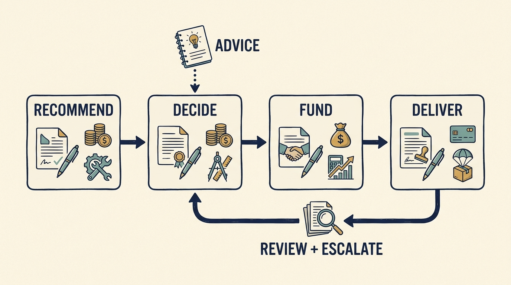

**Governance** is the arrangement for making decisions, overseeing them and holding people responsible. A new investment can change authority, priorities and accountability, while leaving some existing decisions with the same people. Establish what actually changed. Ownership can also make informal influence powerful. A suggestion from a **Technology Principal**, a technology adviser working for the investment firm, can be heard as an instruction even when neither person intends to change formal decision rights. Good governance makes the decision process explicit before disagreement becomes urgent.

**Figure 1:** *Make authority, resources and the route for disagreement explicit.*

Separate investment decisions, company board oversight, executive leadership, lender rights, and operating support. Actual arrangements differ. Public descriptions of operating teams show collaboration as a stated model, not a universal delegation of authority. [S22: KKR Capstone description](https://www.kkr.com/approach/capstone)

**For each consequential decision, name the roles.** Who recommends, decides, implements, funds, receives information, and escalates? Include a response time. A nominal approval route is inadequate if it cannot act before the decision becomes irreversible or a deadline passes.

Productive challenge asks management to connect a proposal to business outcomes and compare feasible options. It does not require board members to design the architecture. Equally, a cost target should identify what work stops and what consequences are accepted. Accountability is weakened when executives must deliver outcomes they were denied the resources or authority to pursue.

Hands-on help needs a **charter**, a short agreement stating the responsible company leader, problem, scope, expected output, duration, information access and how work returns to the company. If the Principal becomes an interim executive, make that a formal change rather than an accidental shadow reporting line. Company capability should become stronger and responsibility should remain understandable after the intervention.

**Reporting should support decisions**. Use consistent definitions and connect outcomes to interpretation, dependencies, and actions requested. A traffic-light status without an explanation can conceal disagreement about what success means. Keep the preparation burden visible and remove reporting that does not change a decision.

Confidential coaching also needs clear boundaries. Explain which important matters must be referred to someone with authority to act and distinguish support from performance assessment. Surprise use of coaching information can undermine the candid discussion the company needs.

With several minority investors, do not turn **conflicting requests into parallel company plans**. Identify the board or other authorized forum that can settle the choice. Under a corporate parent, distinguish group authority from local delegation. Make commitments conditional where necessary: an October delivery requiring hires in June needs a dated funding approval. If it does not arrive, return with revised scope, timing or displaced work while those options remain feasible.

The practical test is whether disagreement can reach a legitimate decision with **consequences understood**. Governance fails when authority is obscured, bad news is delayed, or accountability remains with people who were prevented from exercising judgment.
