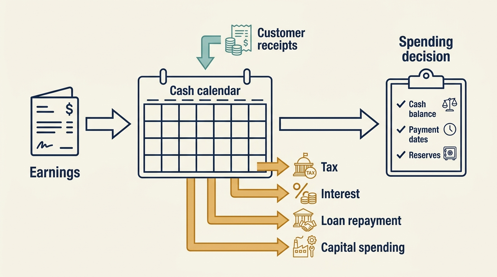
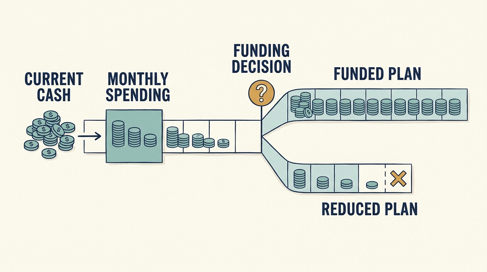

> **IN THIS SECTION, YOU WILL:** Learn to work from a positive earnings figure to the cash actually available, separate the payments the company must make from the ones it chooses, and price the options for an initiative the company can fund.

> **WHY INVESTORS CARE:** Interest on borrowing, tax and any growth in unpaid customer invoices come out of the same cash that would fund the product plan. An investor whose financing depends on that cash needs management to see the whole calculation before committing to any spending.

> **WHY YOU SHOULD CARE:** Positive earnings can coexist with an unfunded initiative. A leader who cannot find the cash behind a budget may make promises that the finance team cannot honor.

> **KEY POINTS:**
>
> * **A positive earnings figure does not establish the cash available** for a new initiative. Start from it, subtract investment, taxes, financing payments and any increase in what customers still owe, and add the cash already in the bank. Then check when that cash is available and what restrictions apply to it.
> * In that calculation, **separate the payments the company must make from the ones it chooses**. Ordinary payroll is already inside the earnings figure. Interest and loan repayments change only under the loan’s terms or with the lender’s agreement. Planned investment and proposed payouts to owners are decisions. Bring priced options with decision dates, not one unfunded request.
> * **Accounting does not remove the cost of work**, and a company spending more than it collects must make its decisions before its cash runs out. Recording development spending as an asset changes when the cost enters profit. The cash still leaves.

 
The **board**, the group of directors that oversees the company on the shareholders’ behalf, sees **operating earnings growing**: the profit from running the business, before the costs of financing and tax. At the same time, the **engineering team** is told there is **no money for an essential migration**, such as moving a core system onto newer technology. Both can be true, because earnings are not cash. To know how much of the earnings figure is yours to commit, work through the payments that come out of it, then compare the result with the cash the company actually holds, including when that cash is available and any restrictions on it. That step-by-step calculation from one figure to the other is called a **reconciliation**.

The **ownership arrangement** changes the inputs to that calculation. Borrowing taken on to buy the company adds **contractual interest** and **repayment dates**. A shareholders’ agreement, the contract among the owners, may require **payouts** to them or set **spending thresholds** above which their approval is needed. A corporate parent, the company that owns this one, may set an **allocation**: the budget it assigns to this company from the group’s total. Establish the actual payments, the authority and the dates before committing. The chapter [[valuation-is-an-estimate]] distinguished earnings from cash in principle; this chapter applies that distinction to one funding decision.

## EBITDA, Capex and Working Capital

The earnings figure most often used is **EBITDA**: earnings before interest, taxes, depreciation and amortization. **Interest** is the cost of borrowing, and taxes here means income taxes. **Depreciation and amortization** spread the **cost** of an asset across the years it is used, instead of counting it all in the year it was bought. Depreciation applies to physical assets, such as equipment; amortization applies to assets without physical form, such as software the company built. EBITDA leaves all four items out. It is a profit measure, not a bank balance, and it excludes several payments the business must still make.

**Capital expenditure**, or **capex**, is **spending on assets that will be used for years**, such as equipment, or software development that qualifies as an asset under **accounting rules**. Recording that spending as an asset, rather than as a cost of the year it happens, is called **capitalization**. The cash is still spent in full; only the timing of the cost in the profit figure changes.

**Working capital** is the money tied up in running the business day to day. In this simplified model, it is the invoices customers have not yet paid plus inventory (goods held for sale or use), minus the bills the company has not yet paid its suppliers. The calculation in the next section adjusts only for the **change** in working capital over the year, not the whole amount. For example, if customers owed €2 million at the start of the year and €3 million at the end, the adjustment is €1 million, not €3 million: sales recorded but not yet paid for. That cash arrives only when customers pay; writing off an invoice that will never be paid reduces the amount owed but brings in nothing. Growth can therefore increase the need for working capital when the company incurs costs before its customers pay. Customers who pay in advance have the opposite effect.

**Figure 1:** *Each term marks a gap between profit and cash: items EBITDA leaves out, spending paid now but expensed later, and sales not yet collected.*

## From Earnings to the Cash You Can Actually Spend

Take Larkspur, the fictional scheduling-software company from the chapter [[raise-what-you-need]], now a few years past its **buyout**, the purchase of the company by investors. Larkspur’s buyout was financed largely with borrowing, which makes it a **leveraged buyout**, and the company still carries that borrowing. The annual planning example below uses millions of euros and is this chapter’s own fictional scenario: it is separate from the generic buyout calculation in the chapter [[three-different-returns]], from the smaller funding comparison in the previous chapter and from the first-hundred-days ledger of Part VII, although it reuses the cost basis and decision rules of the pilot, the small trial priced in the next section. It is a simplified management model, not a cash-flow statement prepared under formal accounting rules. EBITDA already includes payroll and ordinary operating costs; capitalized development is listed separately so those cash payments stay visible.

| Cash bridge | €m |
| --- | ---: |
| EBITDA | 10.0 |
| Cash interest | −4.0 |
| Cash tax | −1.0 |
| Capital expenditure, including capitalized development | −2.0 |
| Additional working capital | −1.0 |
| Cash available before principal (repaying the amount borrowed) and payouts to owners (distributions) | 2.0 |
| Required repayment of the amount borrowed (principal) | −1.5 |
| Remaining cash before other movements | 0.5 |

Alex, who leads engineering, wants €1 million to automate customer onboarding, the work of setting each new customer up to use the software; the project is described in the next section. EBITDA is €10 million. **After the payments in this annual model, €0.5 million remains.** Existing cash, reserves, payment dates and obligations left out of the model still need checking before committing it. Calling the constraint short-term thinking doesn’t resolve it. Neither does declaring the initiative unaffordable without asking whether it protects future cash.

**The bridge is a planning calculation, not a universal payment priority.** Ordinary engineering salaries are already inside EBITDA; they are not queued behind interest. The lines below EBITDA are not all the same kind of thing. Some are obligations that move only under an agreement; some are management choices; one, payouts to the owners (**distributions**), is absent from this model and would be a proposal unless an agreement requires it.

| Line in the bridge | What it is | Who can change it, and how |
| --- | --- | --- |
| Payroll and ordinary operating costs | Already inside EBITDA; engineering salaries sit here | The operating plan; nothing below the line pays them |
| Cash interest and principal repayment | Contractual financing payments with dates | Under the loan’s terms, or through a waiver (the lender agreeing to set a requirement aside), an amendment (an agreed change to the contract) or a refinancing (replacing the loan with a new one, possibly from another lender); confirm which consents the agreement requires |
| Cash tax | A legal obligation | Tax rules and timing, not the operating plan |
| Capital expenditure, including capitalized development | Planned investment: a management choice, part of which may already be contracted | Management and the board, within contracts already signed |
| Additional working capital | A consequence of growth and payment terms | Collection terms, prepayments and the pace of growth |
| Owner distributions (none in this model) | A proposal, unless the shareholders’ agreement, or the terms of a class of shares with priority payment rights, requires them | The board and shareholders, under those agreements and the legal rules on distributions |

Larkspur grew, so more customers owed it money at year end than at the start: about €1 million more invoiced but not yet collected. The sales are recorded, the cash isn’t in. Annual subscriptions paid in advance work the other way and produce cash before the sale is counted as revenue, the income recorded in the accounts. These timing differences can be economically helpful while still creating future service obligations.

**Figure 2:** *An annual residual is a planning result; available cash also depends on balances, obligations and dates.*

## Three Priced Options for the €1 Million Initiative

**The project.** Larkspur sets each new customer up by hand: the implementation team configures the product for that customer. On the cost basis shared with the chapters [[roadmap-to-revenue]] and [[raise-what-you-need]], one setup takes about 80 staff hours; the target is 50. Alex asks for €1 million to automate the whole process within the year. The first candidate for automation is a reusable setup step that configures the common customer types once, instead of configuring each customer. Ines runs the company as its chief executive. Sam runs its finances. Priya, the product leader, would run the pilot.

**The assumptions.** The €0.5 million residual doesn’t decide the initiative. It sets the question: which version of the automation can the company fund this year, and who decides? Add three fictional assumptions to the model above. Larkspur enters the year with €0.3 million of cash above the minimum operating reserve the board treats as untouchable, so the year’s **discretionary capacity**, the forecast money not already reserved or committed, is about €0.8 million if nothing else changes. The loan carries a **leverage covenant**, a condition in the loan agreement that caps borrowing, net of the cash the agreement lets the company count, relative to EBITDA; it is tested at year end, and a breach can give the lender extra rights (the mechanics follow later in this chapter). The same agreement also restricts action: Larkspur may not take on new borrowing above a small permitted amount without the existing lender’s consent, whatever the ratio shows on the test date.

**What the pilot buys.** A **pilot** is a small trial: build one step, use it on a few customers and measure the result before spending more. The pilot in option 2 uses the shared cost basis: €180,000 to build the step and €30,000 a year to maintain it once it is in service. The €180,000 buys only what payroll does not already cover: contractor time for the customer-type templates, and the tools and services the build needs. None of the €210,000 sits inside the €2 million of planned capital expenditure in the bridge. It is additional spending, funded from the residual and the opening cash, regardless of the build’s accounting treatment.

**Who does the work.** Three Larkspur engineers build the step. Their salaries are already inside EBITDA, so their time is capacity taken from other planned work, not additional cash. An **engineer-week** is one engineer’s work for one week, so the pilot’s twelve engineer-weeks measure effort, not calendar time: three engineers for four weeks. One contract implementation specialist knows the current configurations. That engagement is in this year’s operating plan until the end of the first quarter, and the days the specialist spends explaining those configurations to the build come out of it. They are not billed again, so they cost the setup queue some of the specialist’s time in the first quarter, not extra cash. Extending the engagement beyond March is additional: €37,500 a quarter, €150,000 a year. The implementation team, also on payroll, sets up the first eight customers with the step as part of its normal work.

**The specialist after March.** The first-quarter engagement ends on 31 March, before either fallback date, so the specialist’s availability is arranged at approval rather than assumed. Sam adds one clause to that engagement: Larkspur may extend it once, for three months at the same €37,500, by giving notice by day 100. The firm holds that option open at no charge, and it lapses if unused; there is no reservation fee and no interim cost, and the specialist is not paid for the days between 31 March and the notice.

**The dates on each path.** If Ines exercises the option at day 100, the specialist returns from mid-April to mid-July, invoiced at €12,500 a month. Option 1 is a different arrangement, not a use of that one-quarter option. Choosing it at approval means Sam agrees a six-month extension with the firm on day 0, from 1 April to 30 September at the same rate, €75,000 in all; both peak quarters are secured then, with no gap.

**The mid-year fallback.** No option covers the mid-year fallback: on 30 June Sam asks the firm whether the same specialist, or another contractor briefed by the implementation team, is available for the third quarter at the same rate. If neither is, that fallback is not available, the implementation team carries the peak with the step as it stands, and the expansion question goes to the budget round. Either fallback therefore has two conditions: an available specialist and cash above the reserve on each payment date.

**What the pilot leaves out.** Migrating existing configurations and running the old and new processes side by side belong to a second stage and would be priced there, as the funding example in the chapter [[raise-what-you-need]] prices them.

**The calendar.** Day 0 is the first day of the financial year, when Ines approves. The step is usable from about day 35, in early February. The implementation team then sets up the first eight customers with it between day 35 and day 90. At day 90, 1 April, Priya measures the average staff hours per customer across that **cohort**, the group of eight customers measured together.

**The maintenance charge.** Maintenance is charged at €2,500 a month from the month the step enters service, so €27,500 of the first year’s €30,000 falls in this financial year and the last €2,500 in January. Ines reserves the full €30,000 at approval, so the €210,000 she approves is the pilot’s whole first-year cost.

**Who approves.** The board has delegated to Ines the authority to approve spending inside the approved plan up to a set limit. The €210,000 pilot is within that limit; the €1 million request is above it, so only the board could approve the full program. The board decides at day 100 what the pilot’s evidence funds next.

| The pilot at a glance | |
| --- | --- |
| Purpose | One reusable setup step for the common customer types, to move setup from about 80 staff hours per customer toward 50 |
| Additional cash | €210,000: €180,000 to build (contractors, tools, services) plus €30,000 of first-year maintenance; outside the €2 million of planned capital expenditure |
| Staff already paid | Three engineers for four weeks (twelve engineer-weeks), the implementation team, and the contract specialist’s first quarter |
| Approver | Ines, within the board’s delegated limit; the board decides at day 100 what the evidence funds next |
| Evidence date | Day 90, 1 April: Priya reports the eight-customer cohort’s average hours |
| Fallback | Extend the specialist for one quarter (€37,500) and defer the rest, if the specialist is available (held open by an option until day 100; asked afresh at mid-year) and Sam’s revised forecast covers each payment date |

**Scenario note.** The pilot’s cost basis and decision rules are shared with the chapter [[raise-what-you-need]] and the day-100 ledger of Part VII, and the onboarding constraint is supported by customer evidence, as in the chapter [[roadmap-to-revenue]]. The maintenance timing deliberately differs: those chapters place the first year of maintenance in the financial year after the step ships; here the charge starts the month the step enters service.

| Option | Additional cash reserved this year | Engineer-weeks | Next decision date | Who decides |
| --- | ---: | ---: | --- | --- |
| 1. Minimum continuity: extend the contract implementation specialist for the two peak quarters, the second and third, under a six-month extension agreed with the firm at approval (half of the €150,000 a year), and fix the two configuration defects that cause most rework | €75,000 | 3 | Mid-year planning review, 30 June, when first-half collections are known | Ines and Sam, within the delegated annual budget |
| 2. Staged improvement: build the reusable setup step as a pilot (€180,000) and reserve its first year of maintenance (€30,000), then review on the first cohort | €210,000 | 12 | Day 100, about 10 April: the board decides what the day-90 cohort result funds next; later dates are in the sequence below | Ines approves the pilot within the delegated limit; the board decides at day 100 |
| 3. Full request: the complete €1 million automation program in one year | €1,000,000 | 36 | Board meeting before the annual budget is fixed | The board; if new borrowing is needed, the existing lender, whose consent the loan agreement requires for debt above the permitted amount, and a lender willing to make the new loan; the shareholders, if new shares are sold to raise the money (new equity) |

**The choice.** Under these assumptions Ines approves option 2. Option 1 is rejected because it buys six months of specialist capacity, April to September, and leaves the dependency in place: the €75,000 recurs at the next peak, and nothing is learned about the setup step. Option 3 is rejected because it exceeds the year’s residual and the discretionary capacity before any evidence exists; funding it would mean displacing planned capital expenditure that is partly contracted, or new borrowing, which needs the existing lender’s consent under the loan’s restriction on further debt and a lender willing to advance it, for a benefit not yet measured.

**The decision record.**

- Funding: €210,000 from the year’s residual and opening cash, additional to the €2 million of planned capital expenditure. €180,000 is committed to the build at approval; the €30,000 of maintenance is reserved at approval and charged monthly once the step is in service. About €0.6 million of the €0.8 million discretionary capacity is left untouched.
- Scarce capacity: twelve engineer-weeks of the payroll engineers, and days of the one contract specialist who understands the current configurations, taken from an engagement that also serves the ordinary setup queue in the first quarter. Neither is additional cash.
- Fallback arranged: the specialist’s engagement gains a no-charge option to extend once for three months at €37,500, exercisable by notice by day 100; the mid-year fallback depends on availability confirmed on 30 June.
- Authorized: Ines, within the delegated limit. Sam confirms the cash timing against the year-end covenant test. The board is informed at its next meeting and decides at day 100.
- Accountable for the pilot: Priya.

**The sequence.** Each date has one purpose, and reviewing evidence, authorizing further work and releasing money are separate events:

1. Approval, day 0, the first day of the financial year: Ines approves the €210,000 pilot; €180,000 is committed to the build and €30,000 reserved for maintenance.
2. Day 35, early February: the step is usable; the implementation team begins setting up the eight cohort customers with it, and the monthly maintenance charge starts.
3. Day 90, 1 April: Priya reports the cohort’s average hours per customer. This is evidence, not a decision.
4. Day 100, about 10 April: the board decides what the evidence funds next: schedule a month-six review, redirect the next step to a data-quality fix (correcting missing or inconsistent customer records), or fall back, which means exercising the specialist option by that day. It releases no second-stage money.
5. About month six, the end of June, if scheduled: the second-stage gate. A further cohort at or below 50 hours with waiting time down qualifies a second stage for the board’s consideration; the stage still needs its own priced, funded approval. A miss returns the expansion question to the budget round.
6. The next annual budget round: the default forum for any expansion the board did not bring forward.

**What would change the decision.** A first cohort below 60 hours per customer at day 90, with customers paying on or ahead of plan, supports asking the board at day 100 to schedule the month-six review rather than wait for the budget round; the second stage is still released only after that gate and its own approval. A cohort between 60 and 70 hours, with much of the remaining effort traced to customer data quality rather than the setup step, would redirect the next step to a data-quality fix before any second stage. A cohort above 70 hours, or a weak first half in collections, would fall back to option 1’s specialist for one quarter, if available, and defer the rest.

**The fallback’s cash check.** The fallback is not a refund. Nothing of the build is cancellable; only the maintenance stops if the step is withdrawn. It has two triggers with different dates, so it needs two checks. Both use the same stated conventions: the €0.5 million residual arrives at about €125,000 a quarter in the base plan and is counted at each quarter end; about €90,000 of the build is paid by day 90 and the remaining €90,000 in two €45,000 instalments, on 30 June and 30 September; maintenance is charged €2,500 at the end of each month from February; and one quarter of the specialist costs €37,500 at the shared rate, paid as €12,500 a month.

*Check one, a poor cohort, decided at day 100 (about 10 April) with collections on plan.* Ines exercises the specialist option by day 100, so availability is secured; the question is cash.

| Day-100 check, collections on plan | € |
| --- | ---: |
| Cash above the reserve at the start of the year | 300,000 |
| First-quarter residual, counted on 31 March | +125,000 |
| Build paid by day 90 | −90,000 |
| Maintenance paid, February and March | −5,000 |
| **Cash above the reserve at day 100** | **330,000** |
| Still to pay: the rest of the build, 30 June and 30 September | 90,000 |
| Still to pay: the specialist, one quarter from mid-April | 37,500 |
| Still to pay: maintenance, April to December, if the step stays in service | 22,500 |
| **Pilot payments still due through December** | **150,000** |

The €330,000 covers the €150,000 still due through December, or €152,500 once January’s last €2,500 of the first maintenance year is included, even if the later quarters added no further surplus. On plan each later quarter adds about €125,000.

Three qualifications keep the check honest. It is a check on the pilot’s additional payments, not on the whole business. It assumes that ordinary payroll, tax, interest and other operating obligations keep being met from the operating plan, as the bridge assumes. And it counts the residual at quarter ends, a simplified timing convention, not proof that cash never dips inside a quarter.

The fallback is affordable if Sam’s forecast confirms collections are on plan. If April’s collections are already behind plan, Sam does not wait for June: at day 100 he reruns the forecast with the actual receipts, the payments already made and every remaining commitment, including the specialist’s €37,500 once the option is exercised, and Ines exercises the option only if that rerun shows cash above the reserve on each payment date. Check two below is a separate illustration decided at mid-year; its balances cannot be reused once the April option has been exercised.

*Check two, weak first-half collections, decided at mid-year, 30 June.* Here the original €0.8 million is no longer the test, because it assumed the collections that fell short. The check has three inputs: what the pilot has already paid, what it still owes, and how far collections stay behind plan.

Already paid by 30 June: €135,000 of the build and €12,500 of maintenance, February to June. That totals €147,500.

Still to pay after 30 June: €45,000 of the build on 30 September; €2,500 of maintenance a month if the step stays in service; and the €37,500 specialist for the third quarter, if the firm confirms on 30 June that the specialist or a briefed replacement is available.

This check assumes the day-100 option was not exercised. If it was, the specialist is already engaged until mid-July and the €37,500 is already committed, part of it paid before 30 June and the rest due in July. The balances below do not apply to that case; the test is Sam’s day-100 rerun, updated with the receipts and payments since.

The continuing shortfall is the third input. Sam’s revised forecast assumes the shortfall is not recovered this year and that collections stay behind plan at the same rate in the second half. If the first half was €150,000 behind, each later quarter is a further €75,000 behind; if it was €400,000 behind, a further €200,000. So the third-quarter residual is €125,000 planned less €75,000, which is €50,000, in the first case, and €125,000 less €200,000, which is −€75,000, in the second.

The 30 June balance is the €300,000 opening cash plus the €250,000 of residual planned for the first half, less the shortfall, less the €147,500 paid: €252,500 if €150,000 behind, €2,500 if €400,000 behind. The table then deducts each month’s payments and, on 30 September, adds the third-quarter residual.

| Date | Pilot payments due | Cash above the reserve if €150,000 behind plan | Cash above the reserve if €400,000 behind plan |
| --- | --- | ---: | ---: |
| 30 June, the decision | None; the €45,000 instalment is already paid | €252,500 | €2,500 |
| 31 July | Specialist €12,500, maintenance €2,500 | €237,500 | −€12,500 |
| 31 August | Specialist €12,500, maintenance €2,500 | €222,500 | −€27,500 |
| 30 September | Specialist €12,500, maintenance €2,500, build €45,000; third-quarter residual counted | €212,500 | −€162,500 |

If collections are €150,000 behind, the fallback fits on every payment date with room to spare, and the fourth quarter adds more. If they are €400,000 behind, cash crosses the protected reserve on 31 July, the fallback’s first payment date, and the negative third quarter takes it about €162,500 below by the end of September. Maintenance alone would leave nothing above the reserve by the end of July, so the fallback is not what breaks the plan; the collections are. Then the choice is a spending reduction elsewhere in the plan, a board decision to draw on the protected reserve, or new funding. The fallback is conditional on an available specialist and on the revised forecast showing cash above the reserve on each of these payment dates.

**Why the covenant is rechecked.** In the weak-collections case Sam must also recheck the year-end covenant test, for two reasons. Less cash in the bank raises **net debt**, borrowing less the cash the loan agreement lets the company count against it, and net debt is what the leverage covenant measures, whatever the cause of the shortfall. Whether EBITDA falls as well depends on the cause: customers paying recorded invoices late reduce cash but not recorded earnings, while lost sales, or invoices that will never be paid, reduce both.

Pricing three options turns “we can’t afford €1 million” into a decision someone can take. The chapter [[cannot-fund-everything]] extends the method to several projects competing for the same cash and the same engineer-weeks.

## A Company Without Acquisition Debt Can Still Run Out of Time

Consider a separate fictional Larkspur scenario with no acquisition debt; its cash, spending and dates belong to this scenario alone. The company has €3m of unrestricted cash, cash it may use for any purpose, and spends €600,000 a month while collecting €350,000. **Net cash burn** is the difference: €250,000 a month. At that rate, cash lasts 12 months. That estimate is its **runway**.

Alex proposes hires that raise monthly cash spending by €100,000, with no immediate increase in receipts. Net burn becomes €350,000 a month and simple runway falls to about 8.6 months. The board expects another **funding round**, an organized effort to raise new investment, in nine months. On these assumptions, the hires make the plan depend on money arriving before it’s expected.

| Planning assumption | Net monthly burn | Simple runway on €3m |
| --- | ---: | ---: |
| Current spending and receipts | €250,000 | 12 months |
| New hires, no immediate extra receipts | €350,000 | About 8.6 months |

Real cash forecasts need payment dates, taxes, one-time costs, restricted cash, uncertainty about future sales and a minimum operating reserve. A company should act before the bank balance reaches zero. This calculation isolates the choice; it isn’t a recommendation to hold a particular reserve or fundraising schedule.

The leadership response is to agree what evidence the hires would produce, stage commitments where possible and decide when to change course if funding stays uncertain. Sam and Alex should put the next decision date before notice periods, customer obligations or fixed contracts make the plan expensive to reverse. An investor’s intention to join another round is an expression of interest, not a contractual commitment with understood conditions and not cash received. The chapter [[the-financing-slipped]] works through a dated version of this decision when the expected round moves.

Under corporate ownership, replace the hoped-for round with the relevant parent-company allocation and approval. Under profitable growth, include the timing of customer receipts and the spending needed to serve them. In each case, the proposal needs a funded path through the next important decision.

**Figure 3:** *Make the next funding decision and the fallback plan visible before taking on permanent commitments.*

## Debt Changes the Consequences of Being Wrong

The **maturity date** is when a loan is due for repayment. Meeting it can require **refinancing**, replacing the loan with a new one, even if every interest payment was made on time.

**Covenants** are contractual conditions attached to borrowing. Some are tested periodically, such as a leverage ratio checked at year end; others restrict actions at any time, such as taking on new debt without the lender’s consent, which is why option 3 above needed the existing lender’s consent as well as a willing new lender.

A covenant might, for example, cap net debt divided by EBITDA at 5×, five times the year’s EBITDA. This is a **leverage ratio**. Net debt, as in the fallback check above, is borrowing less the cash the agreement allows to be counted against it, usually the company’s unrestricted cash. For example, €60 million of borrowing less €5 million of countable cash, against €10 million of EBITDA, is 5.5×, above a 5× cap.

If the ratio breaches the agreed limit, the contract may give lenders additional rights, subject to its terms and any chance to correct the breach. The company may need to negotiate a waiver, pay extra fees or change its financing or spending plan. **This is why one bad quarter can freeze a migration budget approved in the last one.** Exact definitions and consequences live in the financing documents, and they vary.

Suppose a company carries €60 million of **floating-rate debt**, borrowing whose interest rate moves with the market, so the cost can rise without anything changing inside the business. At 6% annually, interest is €3.6 million. At 9%, it becomes €5.4 million. (These are round numbers for the rate illustration, not Larkspur’s €4.0 million above.) The €1.8 million difference can consume more cash than an entire technology initiative. If EBITDA also falls, the company faces weaker earnings and higher financing costs at the same time. This is arithmetic under stated assumptions, not a forecast of interest rates.

A lender’s leverage calculation may use a different EBITDA definition from management’s operating report. It might include an anticipated **synergy**, a benefit expected from combining acquired businesses, before that benefit produces cash. Leaders should know both the contractual measure and a conservative view of the business’s ability to pay.

This is why the technology plan for improving the business, which investors call the value-creation plan, should include **a downside funding path**. Which work continues if sales fall short of plan? **Which commitments cannot be unwound?** What is the latest date to act before a dependency becomes a crisis? A work plan without these answers assumes a financial environment the company may not have.

## Accounting Changes the Picture, Not the Work

Under International Accounting Standard 38 (**IAS 38**), the international rule on intangible assets, assets without physical form such as software, research spending (investigating whether something is possible) is expensed, counted as a cost in the year’s profit; development spending (applying what is known to build a product or process) that meets specified criteria is recognized as an intangible asset instead. The treatment depends on the facts and applicable standards. It isn’t a discretionary device for meeting an EBITDA target. [S07: IAS 38 overview](https://www.ifrs.org/issued-standards/list-of-standards/ias-38-intangible-assets/)

To isolate the accounting effect, consider a separate €1 million development-spending example. In practice the applicable criteria decide the treatment; management can’t simply choose the column with higher EBITDA:

| Measure (illustrative amounts, € millions) | Expensed | Capitalized |
| --- | ---: | ---: |
| EBITDA | 9.0 | 10.0 |
| Cash paid out | −1.0 | −1.0 |

The same engineers did the same work, and the cash outflow is the same. Capitalization changes when costs enter profit; later amortization is excluded from EBITDA, so the EBITDA difference does not reverse in a later period, although other profit measures carry the amortization charge.

The point isn’t that capitalization is suspicious. It’s that useful performance comparisons reconcile the policy and include the cash needed to sustain the product. A company investing responsibly can look weaker on a short-period earnings measure than a company deferring necessary work.

**Adjusted earnings** need the same discipline. Adjusted EBITDA is EBITDA with further items added back or removed by the company’s own definition. Both are “non-GAAP” measures: they are not calculated under Generally Accepted Accounting Principles (GAAP), the standard set of accounting rules behind reported figures. The United States Securities and Exchange Commission (SEC), the US securities regulator, distinguishes plain EBITDA from such adjusted measures; each needs its own label and a reconciliation to the reported figures. [S06: SEC non-GAAP guidance](https://www.sec.gov/rules-regulations/staff-guidance/corporation-finance-interpretations/non-gaap-financial-measures) Separating an unusual one-time cost, such as the cost of reorganizing a business, can help analysis. Repeatedly excluding the costs of buying business after business can obscure the economics of a company whose strategy depends on those purchases. Keep a reconciliation, examine recurrence, and ask what expenditure the next owner will still need.

## Preserve the Capacity to Absorb a Setback

Debt can make an attractive acquisition possible and sharpen attention to cash. It can also reduce the capacity to withstand surprises. **Private equity (PE)** firms invest in companies outside the public stock markets, usually through a pooled fund, money combined from several investors; the firm backing a company is called its **sponsor**. The evidence doesn’t justify assuming that sponsor ownership always removes financial support.

Bernstein, Lerner and Mezzanotti compared almost 500 United Kingdom (UK) companies backed by private equity before the 2008 crisis with similar UK companies without such backing, matched on industry, size, profitability and borrowing. The PE-backed companies invested more and raised more debt and equity during the crisis, and the effect was stronger where the sponsors had more uninvested money available. That is evidence of a conditional support mechanism in one country and one crisis, not a promise of rescue. [S10: Bernstein et al., crisis study](https://www.nber.org/system/files/working_papers/w23626/w23626.pdf)

For planning, distinguish committed support from hopeful support: an investor who has supplied capital before may choose differently this time, and what matters is how much money the sponsor’s fund can still draw from its own investors and where else it could put it.

The historical Toys R Us case in the chapter [[toys-r-us]] shows the same gap in reported figures. Its results for fiscal 2016, the reporting year ended 28 January 2017, report positive adjusted EBITDA alongside negative **operating cash flow**, the cash generated or consumed by ordinary trading, and substantial capital expenditure. [S35: Toys R Us fiscal 2016 results](https://www.sec.gov/Archives/edgar/data/1005414/000100541417000010/truq4-16earningsreleaseexh.htm) That combination doesn’t identify the cause of failure, but it rules out using the earnings headline as the available reinvention budget.

What to do when expected funding does not arrive on time, and on which date each commitment stops being reversible, is the subject of the chapter [[the-financing-slipped]]. Choosing help that changes what the team can do, and naming the continuing dependence it leaves behind, is the subject of the chapter [[help-that-changes-capability]].

## Which Plan Can the Company Actually Carry?

Each option above named who decides; Part II asks where that authority comes from, what an approval record looks like and what to do when the people who must agree don’t. Begin with [[part-2]], then the chapter [[decide-who-decides]].

## Questions to Consider

1. *Starting from your company’s EBITDA, which lines come between it and the cash you could commit: interest, tax, capital expenditure, working capital, principal repayment, distributions? Which of them are obligations under an agreement, and which are choices?*
2. *For the initiative you want funded, what are the minimum-continuity, staged and full options, with their cash this year, their next decision date and the person authorized to decide each?*
3. *If your company spends more than it collects, what is its runway, when is the next funding decision, and by what date must you act before commitments become expensive to reverse?*
4. *When engineering reports an improvement in earnings, can you tell whether the work became more effective, the accounting treatment changed, or both?*

## To Probe Further

- **[Financial Intelligence, Revised Edition: A Manager's Guide to Knowing What the Numbers Really Mean](https://store.hbr.org/product/financial-intelligence-revised-edition-a-manager-s-guide-to-knowing-what-the-numbers-really-mean/10833)** — Karen Berman, Joe Knight and John Case, Harvard Business Review Press, 2013. *A manager's guide to the three financial statements that explains why a profitable company can still be short of cash, the gap this chapter's cash bridge exposes.*
- **[Default Alive or Default Dead?](https://paulgraham.com/aord.html)** — Paul Graham, October 2015. *A short essay on whether a company reaches profitability on current spending and growth, which states this chapter's runway scenario as a founder's habit of mind.*
- **[IAS 7 Statement of Cash Flows](https://www.ifrs.org/issued-standards/list-of-standards/ias-7-statement-of-cash-flows/)** — IFRS Foundation (International Financial Reporting Standards), standard overview, undated. *The standard behind a formal cash-flow statement, for moving from this chapter's simplified management bridge to the statement your finance team prepares.*
- **[Leveraged Loan Primer](https://pitchbook.com/leveraged-commentary-data/leveraged-loan-primer)** — PitchBook LCD (Leveraged Commentary & Data), living guide. *A free introduction to leveraged loans, loans to heavily indebted borrowers, covering floating-rate pricing, leverage ratios and covenant types, which explains the mechanics behind this chapter's covenant and floating-rate examples in more detail.*
- **[Financial Stability Report – June 2024](https://www.bankofengland.co.uk/financial-stability-report/2024/june-2024)** — Bank of England, June 2024. *Section 6 on vulnerabilities in private equity gives a regulator's system-level view of the refinancing risk, the difficulty of replacing loans when they fall due, that this chapter asks you to preserve setback capacity against.*
