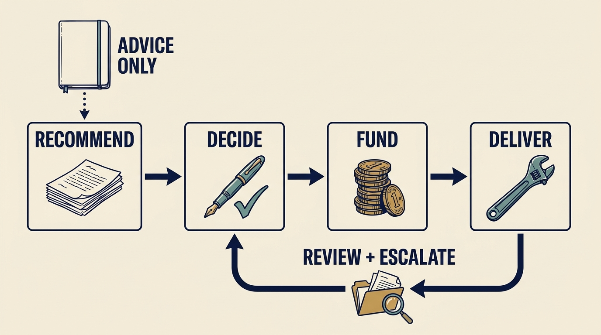

**Governance** is the arrangement for making decisions, overseeing them and holding people responsible. In a fictional case, Morgan, the investor’s technology adviser, suggests Larkspur change its cloud provider (its supplier of rented computing); Alex, who leads technology, hears an instruction and starts planning. Establish authority, funding and deadline first.

**Figure 1:** *Make authority, resources and the route for disagreement explicit. Advice enters the recommendation, not the decision. Review returns evidence to the decision-maker; to escalate is to take an unresolved choice to whoever is authorized to settle it.*

**Start by establishing what changed**: who holds shares (pieces of the company’s ownership) with what rights, expected outcomes, required approvals and accountability. Morgan holds no approval right; the investor acts through its seat on the board, the directors overseeing the company for shareholders. Ines, the chief executive, may approve a fictional €500,000 inside the approved plan. Whatever the amount, the board keeps reserve draws (spending money held for unplanned needs), changes to what an approved budget bundle funds, and permanent hires outside the staffing plan. The investor is a fund, money its firm manages for backers; its investment committee approved the investment, not Larkspur’s plans.

**Then fill in the record with names, thresholds and dates.** For the €1 million proposal to automate onboarding, the setup a new customer needs before use: Priya, the product leader, and Alex recommend; Ines resolves trade-offs; the board must decide within two weeks, since the amount exceeds Ines’s limit; funding is pending. With several investors, find the body that settles the choice; do not run **conflicting requests as parallel plans**.

**Make conditional commitments explicit.** The board declines the €1 million program this year but confirms the pilot, a small trial Ines approved on 1 January within her limit: €210,000 and twelve engineer-weeks (one engineer for twelve weeks). The step serves common customer types from February; the first eight customers are measured by 1 April. Completing the first stage adds templates (reusable sets of product settings) for the remaining customer types, so every new customer uses the step: next January with the current team, or October if two implementation hires, a board decision as permanent staff, start in June. Types the team cannot specify from the specialist’s written record stay manual until separately approved work completes them. The board decides the hires in May on first-quarter customer payments and the eight-customer report.

**Plan the missed deadline.** If the board has not approved the hires in May, or they cannot start in June, Alex takes the January option back to Ines; the team is told in writing that January, already funded and staffed, is the plan, and customer promises tied to October get an explicit decision.

**Report to ask for a decision.** At the April review: setup effort fell from 80 to 62 hours, not the 50 assumed; much of the rest is incomplete customer data; management proposes a €40,000 data-quality step from the reserve, which the board must approve because a reserve draw that adds a step changes what the budget funds.

Conflicting instructions go to one accountable company leader ([[investors-adviser]]). The next chapter reads the incentives: what managers’ shares, the fund manager’s share of investment profits and employees’ jobs stand to gain or lose ([[different-bets]]).
