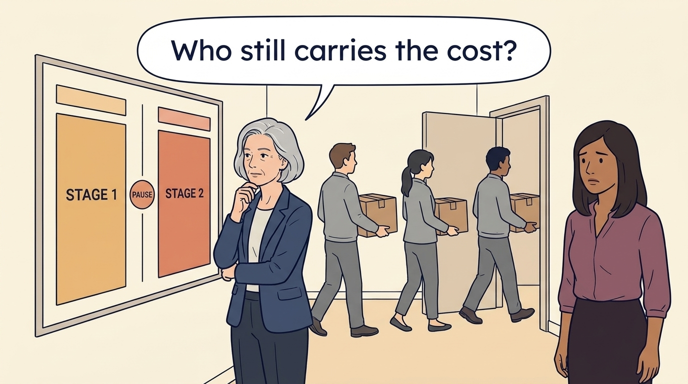

<!-- comic-style
{
  "cast": "MORGAN: a thoughtful investor technology adviser with short dark hair and a green jacket, used in the fund scenarios. ALEX: a practical CTO with curly hair and blue rolled-up sleeves. SAM: a CFO with round glasses and an amber cardigan. PRIYA: a product leader with straight dark hair and plum sleeves. INES: a CEO with short grey hair and a navy jacket. All are fictional; none represents a person in a real case.",
  "style": "Clean editorial explainer comic, dark ink outlines, restrained green, blue, and amber accents on warm white, generous space, readable short speech bubbles, expressive people and simple physical metaphors. No photorealism, logos, dense charts, or title text. Keep the same character appearances throughout the journal."
}
-->

**Comic.** When a fund (a pool of investors’ money run by a fund manager) buys into a company, the company’s leaders are often given shares, and the fund manager has its own pay: a share of the fund’s profits called carried interest. The panels first read what a share percentage can actually pay. They then follow one fictional proposal, closing a second support office, through four different bets: the executives’ shares, the fund manager’s profit share, the employees’ jobs and the customers’ contract renewals.

Morgan advises the investor; Alex leads technology, Priya leads product, Sam leads finance and Ines is the chief executive of Larkspur, a software company. All are fictional, and the examples use separate assumptions. The scenes do not reenact real events.

<!-- comic-panel
{
  "id": "01-scene",
  "status": "generated",
  "asset": "assets/images/06-different-bets/comic-01-scene.jpeg",
  "aspect_ratio": "16:9",
  "prompt": "Panel 1 of an explainer comic. Alex admires an equity percentage on an offer sheet. Use one speech bubble with the exact words: \"What does this actually pay?\" Convey: Shares are units of ownership in a company, also called equity. An ownership percentage does not establish a payment. The rights are usually earned over time, which is called vesting, and other conditions may have to be met first. Fictional example: a plan paying 5% of the sale money above a €100 million threshold pays €2 million when shareholders receive €140 million, not 5% of the whole.",
  "alt": "Comic panel: Alex points happily at the equity percentage on an offer sheet that also has boxes for a vesting schedule and conditions, while a colleague frowns at it.",
  "caption": "Shares are units of ownership in a company, also called equity. An ownership percentage does not establish a payment. The rights are usually earned over time, which is called vesting, and other conditions may have to be met first. Fictional example: a plan paying 5% of the sale money above a €100 million threshold pays €2 million when shareholders receive €140 million, not 5% of the whole.",
  "generation": {
    "model": "gemini-3-pro-image-preview",
    "reference_id": "owned-cast-20260913",
    "sha256": "1c86978c82888cef9e81e348dd71d85831674c089894fe6acc7ecb4cc707a48a"
  }
}
-->

**Panel 1:** Shares are units of ownership in a company, also called equity. An ownership percentage does not establish a payment. The rights are usually earned over time, which is called vesting, and other conditions may have to be met first. Fictional example: a plan paying 5% of the sale money above a €100 million threshold pays €2 million when shareholders receive €140 million, not 5% of the whole.

*Dialogue:* “What does this actually pay?”

<!-- comic-panel
{
  "id": "02-scene",
  "status": "generated",
  "asset": "assets/images/06-different-bets/comic-02-scene.jpeg",
  "aspect_ratio": "16:9",
  "prompt": "Panel 2 of an explainer comic. Sam shows Alex the exercise payment and sale receipt as separate amounts on a new worksheet. Use one speech bubble with the exact words: \"What would I pay before receiving anything?\" Convey: A separate fictional example. An option is a right to buy shares later at a price fixed today; using it is called exercising. Alex may buy 10,000 shares at €2 each, €20,000 in all. If a sale then pays €3 a share, €30,000, the gain is €10,000 before tax and fees. Ask whether the €20,000 must be paid before any sale money arrives.",
  "alt": "Comic panel: Alex and Sam examine a worksheet with two separate boxes, one for the exercise payment and one for the sale receipt.",
  "caption": "A separate fictional example. An option is a right to buy shares later at a price fixed today; using it is called exercising. Alex may buy 10,000 shares at €2 each, €20,000 in all. If a sale then pays €3 a share, €30,000, the gain is €10,000 before tax and fees. Ask whether the €20,000 must be paid before any sale money arrives.",
  "generation": {
    "model": "gemini-3-pro-image-preview",
    "reference_id": "owned-cast-20260913",
    "sha256": "217f14749bfe157b9872a3db9aefb452e70ff550e84f2e8b9d8890118264f1af"
  }
}
-->

**Panel 2:** A separate fictional example. An option is a right to buy shares later at a price fixed today; using it is called exercising. Alex may buy 10,000 shares at €2 each, €20,000 in all. If a sale then pays €3 a share, €30,000, the gain is €10,000 before tax and fees. Ask whether the €20,000 must be paid before any sale money arrives.

*Dialogue:* “What would I pay before receiving anything?”

<!-- comic-panel
{
  "id": "03-scene",
  "status": "generated",
  "asset": "assets/images/06-different-bets/comic-03-scene.jpeg",
  "aspect_ratio": "16:9",
  "prompt": "Panel 3 of an explainer comic. Sam stands between two separate easel boards placed far apart, with clear empty space between them and no line, arrow or connector joining them. The left board is headed COMPANY SALE and shows one arrow from a small office building down to a row of small figures labelled SHAREHOLDERS. The right board is headed FUND PROFITS and shows one arrow from a plain money bag with no currency symbol or lettering on it splitting into two boxes labelled FUND INVESTORS and FUND MANAGER. Alex looks from one board to the other. No other words on the boards. Use one speech bubble with the exact words: \"Two sets of rules. Two payouts.\" Convey: Two separate sets of rules divide two separate pots of money. When a company is sold, its own rules divide the sale money among its shareholders, the company’s leaders included. A fund’s agreement divides the fund’s profits between the fund’s investors and the fund manager, whose share is called carried interest. The same sale can therefore pay a leader’s shares and the manager’s carried interest very differently.",
  "alt": "Comic panel: Alex and Sam stand between two unconnected boards. One, headed Company sale, shows an arrow from a company building to its shareholders; the other, headed Fund profits, shows a money bag splitting between fund investors and the fund manager.",
  "caption": "Two separate sets of rules divide two separate pots of money. When a company is sold, its own rules divide the sale money among its shareholders, the company’s leaders included. A fund’s agreement divides the fund’s profits between the fund’s investors and the fund manager, whose share is called carried interest. The same sale can therefore pay a leader’s shares and the manager’s carried interest very differently.",
  "generation": {
    "model": "gemini-3-pro-image-preview",
    "reference_id": "owned-cast-20260913",
    "sha256": "e34b8b725de932d9b80e46d13f1cbdce82b88d7de182332b72a8ce8bfd76efed"
  }
}
-->

**Panel 3:** Two separate sets of rules divide two separate pots of money. When a company is sold, its own rules divide the sale money among its shareholders, the company’s leaders included. A fund’s agreement divides the fund’s profits between the fund’s investors and the fund manager, whose share is called carried interest. The same sale can therefore pay a leader’s shares and the manager’s carried interest very differently.

*Dialogue:* “Two sets of rules. Two payouts.”

<!-- comic-panel
{
  "id": "04-scene",
  "status": "generated",
  "asset": "assets/images/06-different-bets/comic-04-scene.jpeg",
  "aspect_ratio": "16:9",
  "prompt": "Panel 4 of an explainer comic. A team races a metric while customers wait nearby. Use one speech bubble with the exact words: \"The measure changed our behavior.\" Convey: Rewards change behavior. A bonus for growth in revenue, the money earned from sales, can be earned with discounts and promises that leave new customers waiting. Pair the target with checks on what it could damage: whether existing customers keep paying, and how long new customers wait. If the bonus still rewards the damaging sale, change the bonus rule; measuring the damage is not enough.",
  "alt": "Comic panel: A team crowds around a rising chart headed Metric while customers sit and stand in a waiting area, checking their watches.",
  "caption": "Rewards change behavior. A bonus for growth in revenue, the money earned from sales, can be earned with discounts and promises that leave new customers waiting. Pair the target with checks on what it could damage: whether existing customers keep paying, and how long new customers wait. If the bonus still rewards the damaging sale, change the bonus rule; measuring the damage is not enough.",
  "generation": {
    "model": "gemini-3-pro-image-preview",
    "reference_id": "owned-cast-20260913",
    "sha256": "a270b15f6da699cf5f1a3c888bd172a117231628187cfe664b31893ca6290fa8"
  }
}
-->

**Panel 4:** Rewards change behavior. A bonus for growth in revenue, the money earned from sales, can be earned with discounts and promises that leave new customers waiting. Pair the target with checks on what it could damage: whether existing customers keep paying, and how long new customers wait. If the bonus still rewards the damaging sale, change the bonus rule; measuring the damage is not enough.

*Dialogue:* “The measure changed our behavior.”

<!-- comic-panel
{
  "id": "05-scene",
  "status": "generated",
  "asset": "assets/images/06-different-bets/comic-05-scene.jpeg",
  "aspect_ratio": "16:9",
  "prompt": "Panel 5 of an explainer comic. Morgan places an exit calendar beside a longer product commitment. Use one speech bubble with the exact words: \"Whose horizon governs this choice?\" Convey: Fictional scenario. Larkspur’s board, encouraged by the investor, proposes closing a second support office of fourteen people within nine months. The fund wants the saving to show in the company’s profits before it sells its holding, its exit, in two to four years. But the thirty customers that office supports must decide whether to renew their contracts in the next six months, and they will use the product long after the exit. A horizon is the time frame a party plans for.",
  "alt": "Comic panel: Morgan places a small desk calendar headed Exit calendar beside a long paper roll headed Product commitment, long-term, while two colleagues think it over.",
  "caption": "Fictional scenario. Larkspur’s board, encouraged by the investor, proposes closing a second support office of fourteen people within nine months. The fund wants the saving to show in the company’s profits before it sells its holding, its exit, in two to four years. But the thirty customers that office supports must decide whether to renew their contracts in the next six months, and they will use the product long after the exit. A horizon is the time frame a party plans for.",
  "generation": {
    "model": "gemini-3-pro-image-preview",
    "reference_id": "owned-cast-20260913",
    "sha256": "7e5f821f531c897357deddfc475c5e95369f7cc80bd712c28a7d18bff0fa41c6"
  }
}
-->

**Panel 5:** Fictional scenario. Larkspur’s board, encouraged by the investor, proposes closing a second support office of fourteen people within nine months. The fund wants the saving to show in the company’s profits before it sells its holding, its exit, in two to four years. But the thirty customers that office supports must decide whether to renew their contracts in the next six months, and they will use the product long after the exit. A horizon is the time frame a party plans for.

*Dialogue:* “Whose horizon governs this choice?”

<!-- comic-panel
{
  "id": "06-scene",
  "status": "generated",
  "asset": "assets/images/06-different-bets/comic-06-scene.jpeg",
  "aspect_ratio": "16:9",
  "prompt": "Panel 6 of an explainer comic. Ines stands at a wall planner that shows two large blocks labelled STAGE 1 and STAGE 2 with a small PAUSE sign between them. Behind her, three unnamed employees in grey carry plain unlabelled moving boxes toward a door. Priya watches them leave with concern. No other words, charts or documents. Use one speech bubble with the exact words: \"Who still carries the cost?\" Convey: Ines, the chief executive, recommends a slower closure in two stages over twelve months, and the board approves it. Three specialists who know the customers’ setups are paid to stay, and before each stage she checks renewals and support waiting time and can pause. It costs more and delays the saving. If the saving lasts, a later sale could pay the executives and the fund more. Eleven employees are told now that their jobs will end, six at month six and five at month twelve, and none of that sale money reaches them. The record says who benefits and who carries the cost.",
  "alt": "Comic panel: Ines stands at a wall planner showing Stage 1 and Stage 2 with a Pause sign between them, while three employees carry plain boxes toward the door and Priya watches with concern.",
  "caption": "Ines, the chief executive, recommends a slower closure in two stages over twelve months, and the board approves it. Three specialists who know the customers’ setups are paid to stay, and before each stage she checks renewals and support waiting time and can pause. It costs more and delays the saving. If the saving lasts, a later sale could pay the executives and the fund more. Eleven employees are told now that their jobs will end, six at month six and five at month twelve, and none of that sale money reaches them. The record says who benefits and who carries the cost.",
  "generation": {
    "model": "gemini-3-pro-image-preview",
    "reference_id": "owned-cast-20260913",
    "sha256": "efd6519236c0d932e65c90aad1b62c76f3d10a4c0b637d17fd80e80bd7a2d95f"
  }
}
-->

**Panel 6:** Ines, the chief executive, recommends a slower closure in two stages over twelve months, and the board approves it. Three specialists who know the customers’ setups are paid to stay, and before each stage she checks renewals and support waiting time and can pause. It costs more and delays the saving. If the saving lasts, a later sale could pay the executives and the fund more. Eleven employees are told now that their jobs will end, six at month six and five at month twelve, and none of that sale money reaches them. The record says who benefits and who carries the cost.

*Dialogue:* “Who still carries the cost?”
