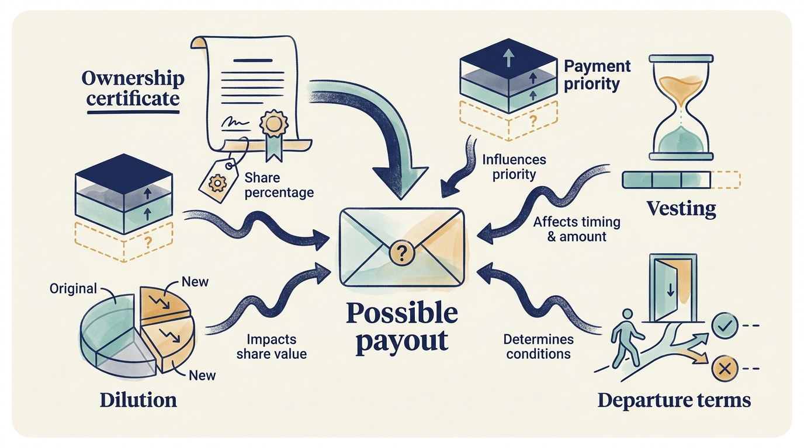

> **KEY POINTS:**
>
> * Shared ownership **does not create identical interests**. Executives, investors, employees and customers have different exposure, rights and time horizons.
> * A **share percentage is only the beginning**. Payment priorities, conditions for earning rights, future share issues and departure terms determine the possible outcome.
> * Measure **what the incentives might damage**. Pair growth and earnings goals with customer outcomes, service quality and continued capacity to invest.

 
“We are all shareholders now” can describe a useful common interest. It can also conceal very different risks, rights and time horizons.

[[decide-who-decides]] established who may decide. **Incentives** are the rewards and consequences that encourage a particular choice.

In ordinary product and engineering work, incentives mostly mean performance targets and pay. Investor ownership adds a second layer: equity that pays out at a sale, targets tied to the investment case, and a fund whose interests differ from those of executives and employees in timing and risk. Product and engineering leaders need to read that layer because it shapes which proposals get approved and which behavior their own targets reward.

This chapter examines ownership-based rewards first, then the behavior targets encourage, and finally the effects on people outside the reward arrangement.

An **executive** is a senior leader responsible for managing the business, and may have most of their wealth and future employment tied to one company. A fund holds several investments. The manager earns fees and may receive **carried interest**, a contractual share of investment profits. Employees without equity can bear reorganization costs without sharing in the proceeds when the investor sells its holding, an **exit**. Customers can depend on a product long after the investor has sold.

Alignment is therefore a design problem, not something ownership confers automatically. Start by asking which behavior an incentive rewards, when it rewards it, and who bears the consequences if the behavior harms someone else.

## Three Different Equity Stories

A founder might **roll over** part of their investment: keep shares or reinvest some of the sale proceeds into the new ownership arrangement. A manager might buy shares with personal money. Another executive might receive **options**, rights to buy shares on stated terms, or a share-based incentive whose payout depends on earning the rights over time or meeting conditions, known as **vesting**, and on specified value thresholds. These arrangements can produce very different results even when everyone is described as having management equity.

The documents determine which shares receive money first (**preferences**), how issuing more equity changes existing ownership or payouts (**dilution**), and what happens to a participant’s rights when they leave (**leaver provisions**). Different share classes can carry different payment and decision rights. Legal and tax treatment depends on jurisdiction and the actual instrument. The practical task is to request worked outcomes and understand the exposure, not infer rights from a headline percentage.

In a fictional example, a manager is entitled to 5% of qualifying equity proceeds above a €100 million threshold. At €140 million of qualifying equity proceeds, 5% of the €40 million excess is €2 million. That is not 5% of €140 million. The real plan may calculate the pool differently; the example shows why the denominator, threshold and payment order matter.

Ask for scenarios covering a weak exit, a good exit, a refinancing, an additional acquisition funded with equity, and departure before exit. Ask which assumptions change the answer. A percentage without a **waterfall**, the order and formula for allocating proceeds, and a dilution explanation is incomplete information.

**Figure 1:** *Understand the conditions around an equity award before estimating its outcome.*

## Ask What Happens Before a Sale as Well as At One

A manager joining a venture-funded company needs scenarios for another round, a lower-priced round and no near-term chance to sell. A leader in a buyout may need to understand the value threshold above which management participates and the treatment of money rolled into the deal. Under a corporate parent, rewards may depend on parent shares, business-unit targets or integration milestones. These are possible arrangements to investigate, not standard packages guaranteed by investor type.

Take a fictional option example. Alex has vested rights to buy 10,000 shares at €2 each. A hypothetical sale pays €3 per underlying ordinary share, after the relevant priorities, and the options can be exercised or settled on those terms. Gross value after the €20,000 exercise cost is €10,000, before tax or fees. Quoting “10,000 shares worth €30,000” would omit the cost of obtaining them. A future round can also change the fully diluted ownership percentage, the percentage after including the specified options and other rights to shares.

Ask finance and the relevant advisers to show which assumptions determine payment and whether cash is required before any proceeds are available. For team communication, distinguish an illustrative value from money employees can receive. A funding announcement can change a valuation while leaving employees without a sale opportunity.

## Your Shares and the Fund's Carry Are Two Separate Bets

Company management equity rewards an outcome in a particular company under its own terms. Fund carry is allocated under the fund's profit-sharing arrangements. A successful company can sit within a disappointing fund, and fund economics can differ from what an executive experiences.

The Institutional Limited Partners Association (ILPA), which represents investors in private funds, addresses alignment through matters including the general partner’s own capital commitment, fee economics, carry and governance. These principles represent the perspective of investors in the fund; they don't cover every employee or customer interest. [S02: ILPA principles](https://ilpa.org/wp-content/uploads/2019/06/ILPA-Principles-3.0_2019.pdf) The product leader's task is to add the company and customer consequences to the discussion, not assume a fund-level alignment mechanism covers them.

Timing creates further differences. An investment partner may want a sale that produces a realized result. A founder may prefer continued independence. A CTO may need a transition to run through several product releases. None of these preferences is illegitimate. They become dangerous when one is presented as everyone's objective.

## Measures Can Reward the Wrong Work

Suppose a company rewards executives solely for this year's adjusted EBITDA: earnings before interest, taxes, depreciation and amortization, with further stated exclusions. This is a measure of earnings, not cash after every obligation. A product transition will reduce earnings this year and protect a major customer segment next year. The incentive encourages delay even if delay reduces the business's long-term value.

Adding revenue growth isn't enough if growth can be bought through heavy discounts or unprofitable implementation commitments. Adding release frequency isn't enough if teams can split work into trivial releases. Adding customer retention isn't enough if customers are trapped temporarily and service deterioration will emerge later.

Use a small set of connected measures with **guardrails**, limits intended to reveal or prevent harmful side effects. Pair revenue growth with **retention**, whether customers stay, and **contribution**, revenue less the specified costs of serving them. Pair cost reduction with service quality and future delivery capacity. Pair technical progress with customer use. The measures don't remove judgment; they narrow the range of misleading stories.

A compensation plan also needs to distinguish outcomes people can influence from **conditions they cannot control**. It is reasonable for owners to care about exit value. It is much less useful to treat a general fall in market multiples as proof that the engineering organization failed.

**Figure 2:** *Watch the outcomes a target could damage as well as the result it rewards.*

## A Leadership Change Needs a Hypothesis

Changing a CTO can be necessary when the company's needs have changed or leadership is ineffective. It can also be a convenient explanation for an unrealistic investment plan. Before recommending replacement, state a **hypothesis**, an explanation that can be checked: what must new leadership enable, and what evidence shows that capability is missing?

Does the leader make sound decisions but lack product management support? Is delivery blocked by unstable commercial commitments? Does the company need a different organizational scale? Has the board asked for incompatible outcomes? A diagnosis that begins and ends with the individual may miss the system around them.

This isn't an argument against accountability. It's an argument for **a testable account of what new leadership would change**. Recruitment then follows a role design rather than a search for someone willing to repeat the plan more confidently.

## Make Bad News Reportable Early

A reporting culture should reward early discovery of a failed assumption. That takes more than asking for transparency. If every admission leads straight to blame, people learn to report activity and defer interpretation.

A useful quarterly review separates three judgments: the quality of the original decision given the available evidence, the quality of execution, and the result. An intelligent experiment can fail. A poorly justified decision can get lucky. Treating both simply as green or red teaches the wrong lesson.

For product and engineering leaders, this is a practical test of credibility. Investors need an account of what their capital supports; teams need an account of what they're expected to deliver and why. **Use the same facts in both conversations**. An adviser can help communicate the evidence, but can't make incompatible promises consistent.

## Who Is Missing From the Alignment Story?

Employees may value stable work, development, fair treatment and a viable company after exit. Customers may value continuity, reasonable prices, data portability and trustworthy service. Lenders prioritize contractual repayment and protections. These interests can conflict even when management and the sponsor share equity upside.

A proposed decision record should therefore include the expected distribution of benefits and burdens. A price increase can improve margin while reducing affordability. A platform consolidation can reduce costs while forcing customers into an inferior migration. Such a decision needs an explicit justification and mitigation, not a claim that enterprise value makes everyone better off.

Read an incentive plan as a set of possible outcomes: who receives a reward, what must happen first, and who bears the costs. Holding shares or sharing targets doesn't settle those questions.

We now have two ways to examine a partnership: its decision rights and its incentives. The next chapter uses both to assess a particular investor: [[investor-under-pressure]].

## Questions to Consider

1. *For your own equity or incentive arrangement, have you seen worked outcomes for a weak exit, a good exit, a refinancing, an equity-funded acquisition and your departure before exit?*
2. *Which measures does your compensation reward this year, and what work could those measures encourage you to delay or overdo?*
3. *What guardrail measures would reveal the damage if your growth, cost or delivery targets were pursued too hard?*
4. *Whose time horizon is driving the current plan: the fund’s, the founder’s, the executives’ or the customers’? Which of these is being presented as everyone’s objective?*
5. *When an assumption fails in your company, is it reported early? What happens to the person who reports it?*
6. *Who bears costs from the current plan without sharing in its rewards: employees, customers, suppliers or lenders? Is that trade-off recorded anywhere?*

## To Probe Further

- **[The Holloway Guide to Equity Compensation](https://www.holloway.com/g/equity-compensation)** — Joshua Levy and Joe Wallin, Holloway, 2022 edition. *Works through the mechanics behind Alex's option example in far more detail, from vesting and dilution to exercise cost and fully diluted percentages.*
- **[Managerial Incentives and Value Creation: Evidence from Private Equity](https://www.nber.org/papers/w14331)** — Phillip Leslie and Paul Oyer, NBER Working Paper 14331, 2008. *Evidence that private-equity-owned companies carry much stronger management incentives but show little sign of better operating performance, useful when someone argues equity alone explains results.*
- **[The Economics of Private Equity Funds](https://academic.oup.com/rfs/article-abstract/23/6/2303/1569783)** — Andrew Metrick and Ayako Yasuda, Review of Financial Studies, 2010. *Puts numbers on the fund side of "your shares and the fund's carry are two separate bets", showing that fees rather than carry are the larger share.*
- **[On the folly of rewarding A, while hoping for B](https://journals.aom.org/doi/10.5465/AME.1995.9503133466)** — Steven Kerr, Academy of Management Executive, 1995 reprint of the 1975 article. *The classic short paper on reward systems that pay for one behavior while hoping for another, a vocabulary for the "measures can reward the wrong work" section.*
- **[Thinking in Bets: Making Smarter Decisions When You Don't Have All the Facts](https://www.penguinrandomhouse.com/books/552885/thinking-in-bets-by-annie-duke/)** — Annie Duke, Portfolio, 2018. *A book on separating the quality of a decision from the quality of its outcome, which is the distinction this chapter asks a quarterly review to make.*
