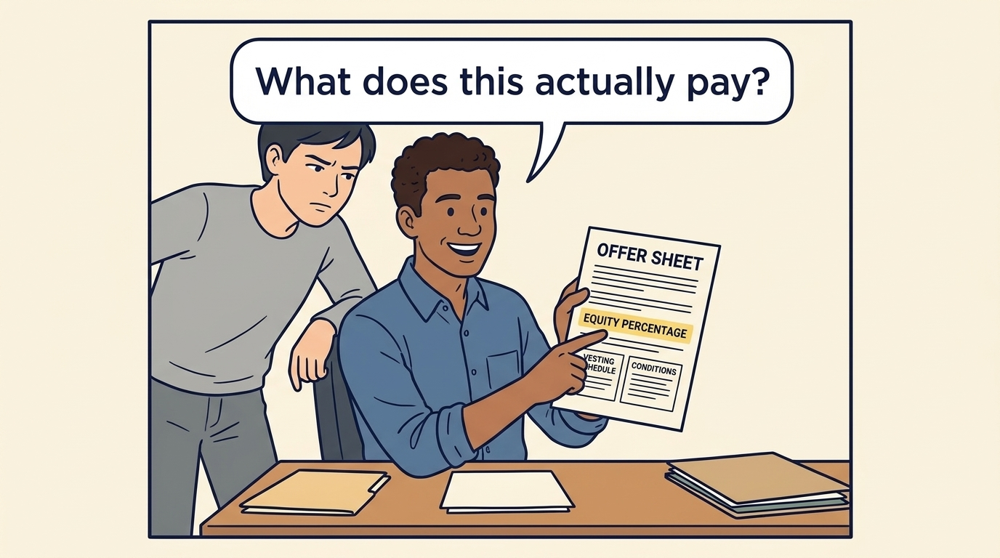
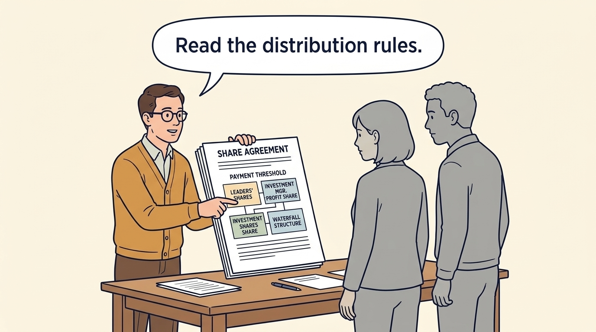
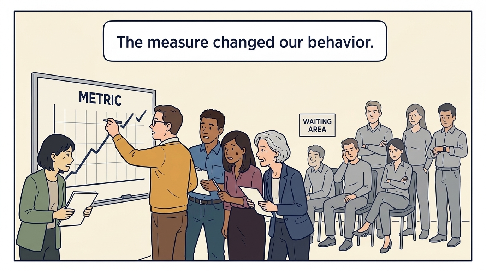
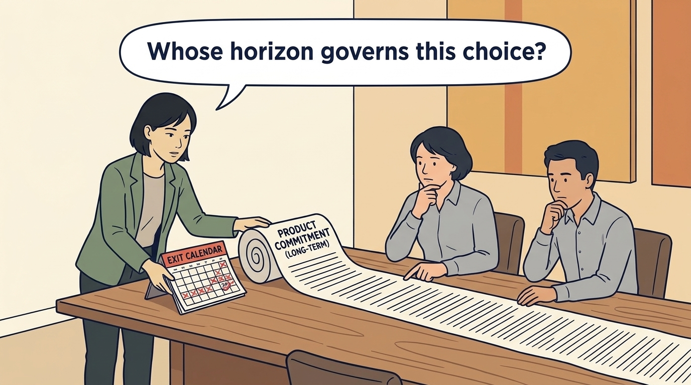
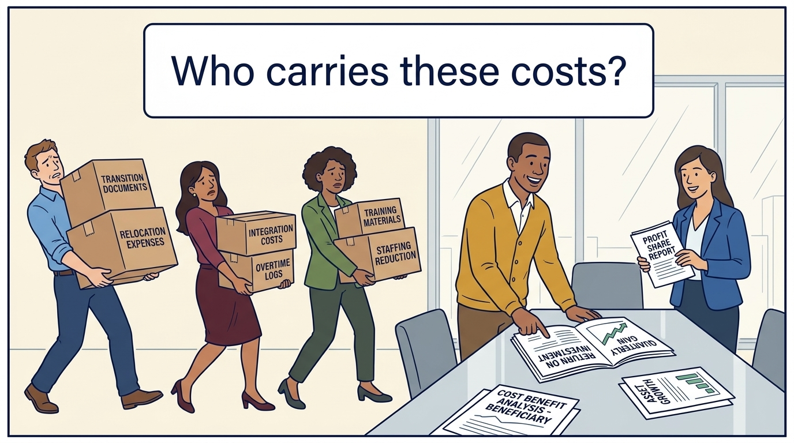
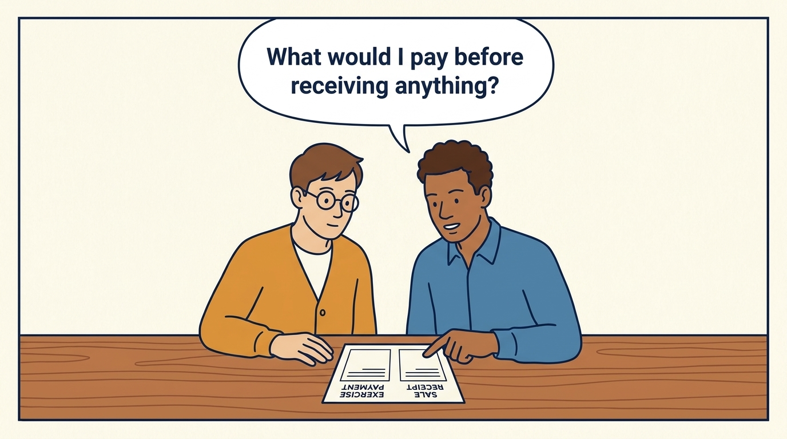

<!-- comic-style
{
  "cast": "MORGAN: a thoughtful investor technology adviser with short dark hair and a green jacket, used in the fund scenarios. ALEX: a practical CTO with curly hair and blue rolled-up sleeves. SAM: a CFO with round glasses and an amber cardigan. PRIYA: a product leader with straight dark hair and plum sleeves. INES: a CEO with short grey hair and a navy jacket. All are fictional; none represents a person in a real case.",
  "style": "Clean editorial explainer comic, dark ink outlines, restrained green, blue, and amber accents on warm white, generous space, readable short speech bubbles, expressive people and simple physical metaphors. No photorealism, logos, dense charts, or title text. Keep the same character appearances throughout the journal."
}
-->

**Comic.** In ordinary product and engineering work, incentives mean targets and pay. The panels show the second layer investor ownership adds, including equity that pays out at a sale and a fund with its own timing, and how it shapes which proposals get approved.

Morgan is an investor’s adviser in the fund scenarios; Alex leads technology, Priya leads product, and Sam leads finance. All are fictional. Comparative scenarios use separate assumptions. Historical cases are discussed through documents; the scenes do not reenact real events.

<!-- comic-panel
{
  "id": "01-scene",
  "status": "generated",
  "asset": "assets/images/06-incentives/comic-01-scene.jpeg",
  "aspect_ratio": "16:9",
  "prompt": "Panel 1 of an explainer comic. Alex admires an equity percentage on an offer sheet. Use one speech bubble with the exact words: \"What does this actually pay?\" Convey: An ownership percentage does not establish a payment. The agreement may include thresholds and conditions that must be met first.",
  "alt": "Comic panel: Alex admires an equity percentage on an offer sheet.",
  "caption": "An ownership percentage does not establish a payment. The agreement may include thresholds and conditions that must be met first.",
  "generation": {
    "model": "gemini-3-pro-image-preview",
    "reference_id": "owned-cast-20260913",
    "sha256": "1c86978c82888cef9e81e348dd71d85831674c089894fe6acc7ecb4cc707a48a"
  }
}
-->

**Panel 1:** An ownership percentage does not establish a payment. The agreement may include thresholds and conditions that must be met first.

*Dialogue:* “What does this actually pay?”

<!-- comic-panel
{
  "id": "02-scene",
  "status": "generated",
  "asset": "assets/images/06-incentives/comic-02-scene.jpeg",
  "aspect_ratio": "16:9",
  "prompt": "Panel 2 of an explainer comic. Sam points to a payment threshold in a share agreement. Use one speech bubble with the exact words: \"Read the distribution rules.\" Convey: Company leaders’ shares and the investment manager’s profit share follow different rules. A payment waterfall sets the order and calculation of payments.",
  "alt": "Comic panel: Sam points to a payment threshold in a share agreement.",
  "caption": "Company leaders’ shares and the investment manager’s profit share follow different rules. A payment waterfall sets the order and calculation of payments.",
  "generation": {
    "model": "gemini-3-pro-image-preview",
    "reference_id": "owned-cast-20260913",
    "sha256": "e8335f481155dfe1892804e347ba5bdf2ffea0565af519c111cf11ae9345e019"
  }
}
-->

**Panel 2:** Company leaders’ shares and the investment manager’s profit share follow different rules. A payment waterfall sets the order and calculation of payments.

*Dialogue:* “Read the distribution rules.”

<!-- comic-panel
{
  "id": "03-scene",
  "status": "generated",
  "asset": "assets/images/06-incentives/comic-03-scene.jpeg",
  "aspect_ratio": "16:9",
  "prompt": "Panel 3 of an explainer comic. A team races a metric while customers wait nearby. Use one speech bubble with the exact words: \"The measure changed our behavior.\" Convey: An incentive is a reward or consequence that influences behavior. A target can encourage a reported result while damaging customer service.",
  "alt": "Comic panel: A team races a metric while customers wait nearby.",
  "caption": "An incentive is a reward or consequence that influences behavior. A target can encourage a reported result while damaging customer service.",
  "generation": {
    "model": "gemini-3-pro-image-preview",
    "reference_id": "owned-cast-20260913",
    "sha256": "a270b15f6da699cf5f1a3c888bd172a117231628187cfe664b31893ca6290fa8"
  }
}
-->

**Panel 3:** An incentive is a reward or consequence that influences behavior. A target can encourage a reported result while damaging customer service.

*Dialogue:* “The measure changed our behavior.”

<!-- comic-panel
{
  "id": "04-scene",
  "status": "generated",
  "asset": "assets/images/06-incentives/comic-04-scene.jpeg",
  "aspect_ratio": "16:9",
  "prompt": "Panel 4 of an explainer comic. Morgan places an exit calendar beside a longer product commitment. Use one speech bubble with the exact words: \"Whose horizon governs this choice?\" Convey: An investor planning a sale and a team supporting a longer customer commitment can reasonably care about different dates.",
  "alt": "Comic panel: Morgan places an exit calendar beside a longer product commitment.",
  "caption": "An investor planning a sale and a team supporting a longer customer commitment can reasonably care about different dates.",
  "generation": {
    "model": "gemini-3-pro-image-preview",
    "reference_id": "owned-cast-20260913",
    "sha256": "7e5f821f531c897357deddfc475c5e95369f7cc80bd712c28a7d18bff0fa41c6"
  }
}
-->

**Panel 4:** An investor planning a sale and a team supporting a longer customer commitment can reasonably care about different dates.

*Dialogue:* “Whose horizon governs this choice?”

<!-- comic-panel
{
  "id": "05-scene",
  "status": "generated",
  "asset": "assets/images/06-incentives/comic-05-scene.jpeg",
  "aspect_ratio": "16:9",
  "prompt": "Panel 5 of an explainer comic. Employees carry transition boxes while investors review returns. Use one speech bubble with the exact words: \"Who carries these costs?\" Convey: Employees may bear transition costs without receiving a share of the investment gain. Record who benefits and who carries the burden.",
  "alt": "Comic panel: Employees carry transition boxes while investors review returns.",
  "caption": "Employees may bear transition costs without receiving a share of the investment gain. Record who benefits and who carries the burden.",
  "generation": {
    "model": "gemini-3-pro-image-preview",
    "reference_id": "owned-cast-20260913",
    "sha256": "20da90dd4e6ebb77113a203191f3d83b2e205643a1f208a54f0f21477c8c1c8a"
  }
}
-->

**Panel 5:** Employees may bear transition costs without receiving a share of the investment gain. Record who benefits and who carries the burden.

*Dialogue:* “Who carries these costs?”

<!-- comic-panel
{
  "id": "06-scene",
  "status": "generated",
  "asset": "assets/images/06-incentives/comic-06-scene.jpeg",
  "aspect_ratio": "16:9",
  "prompt": "Panel 6 of an explainer comic. Sam shows Alex the exercise payment and sale receipt as separate amounts on a new worksheet. Use one speech bubble with the exact words: \"What would I pay before receiving anything?\" Convey: Separate fictional option example: 10,000 shares costing €2 each to exercise and paying €3 each on sale leave €10,000 before tax or fees, under the stated terms. A percentage or valuation is incomplete.",
  "alt": "Comic panel: Alex and Sam examine the exercise-payment and sale-receipt sections of an incentive worksheet.",
  "caption": "Separate fictional option example: 10,000 shares costing €2 each to exercise and paying €3 each on sale leave €10,000 before tax or fees, under the stated terms. A percentage or valuation is incomplete.",
  "generation": {
    "model": "gemini-3-pro-image-preview",
    "reference_id": "owned-cast-20260913",
    "sha256": "217f14749bfe157b9872a3db9aefb452e70ff550e84f2e8b9d8890118264f1af"
  }
}
-->

**Panel 6:** Separate fictional option example: 10,000 shares costing €2 each to exercise and paying €3 each on sale leave €10,000 before tax or fees, under the stated terms. A percentage or valuation is incomplete.

*Dialogue:* “What would I pay before receiving anything?”
