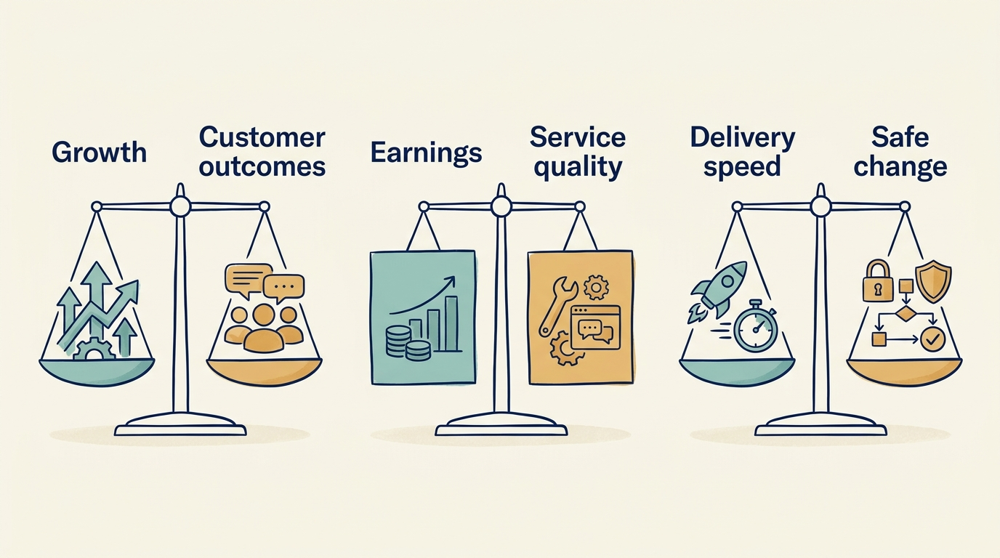

> **IN THIS SECTION, YOU WILL:** Learn how three things that are all called “a stake in the company” differ: management equity (the shares and share-linked awards held by a company’s leaders), fund carry (the fund manager’s share of the fund’s profits) and an employee’s job. You will also learn how to pair a target with the measure it could damage.

> **WHY INVESTORS CARE:** Investors give company leaders shares so that the leaders gain when the company’s value grows. A fund’s own investors give the fund’s manager a share of the fund’s profits, called carried interest or carry, for the same reason. If a payout rule rewards a damaging choice, the investor pays for it twice: once in the outcome and again in the cost of the incentive.

> **WHY YOU SHOULD CARE:** “We are all shareholders now” hides the fact that executives, the fund, employees and customers can gain and lose different things from the same decision. Incentives you misread will steer choices you did not intend.

> **KEY POINTS:**
>
> * Shared ownership **does not create identical interests**. Executives, the fund, employees and customers can gain or lose different things, hold different rights and plan for different time frames. A single proposal to close a support location makes the four bets visible.
> * A **share percentage is only the beginning**. What an award can pay depends on who is paid first, when the rights are earned, how many new shares are issued later and what happens if the holder leaves. The rules that divide a company’s sale money are also separate from the rules that divide a fund’s profits.
> * Pair a target with **the measure it could damage**, and change the payout rule if it still rewards the damaging choice. Measurement alone cannot correct an incentive.

 
“We are all shareholders now” can describe a useful common interest. It can also conceal **very different risks, rights and time frames**.

The chapter [[decide-who-decides]] established who may decide. **Incentives** are the rewards and consequences that encourage a particular choice. An investment can add three things to the rewards and risks already shaping company decisions: **new share arrangements** for leaders, an expected **date for the exit**, and the **fund manager’s own pay**. Product and engineering leaders need to understand this added layer, because it shapes **which proposals get approved** and which behavior their own targets reward.

## Shares, Equity, Funds, Fees, Carry, Jobs

**Shares** are units of ownership in a company, and **shareholders** are the people and institutions that hold them. **Equity** is another word for that ownership; **management equity** is the part held by, or promised to, the company’s leaders as part of their pay. An **investor** puts money into a company in the expectation of a later benefit. In this chapter the investor is usually a **fund**: a pool of money collected from institutions such as pension schemes and run by a **fund manager**, a firm that chooses which companies to buy into and when to sell. When the fund sells its holding, that sale is called an **exit**.

An **executive**, a senior leader responsible for managing the business, may have most of their wealth and future employment tied to one company. A fund, by contrast, holds several investments, and this company is only one of them. The fund’s manager earns **fees**, charges for running the fund, and may also receive **carried interest**, often shortened to **carry**: a contractual share of the fund’s profits. Many fund agreements calculate carry across all of the fund’s investments rather than on this company alone.

A **job** is a stake too. An employee invests time, skills, loyalty and part of a career in the company, and in return receives pay, experience and the prospect of continued work. What the employee risks is losing that work, not money put into the company, and a job pays out month by month rather than at a sale. So **employees without shares can bear the costs of a reorganization** without receiving any of the sale money at an exit. Customers have a stake as well: they can depend on a product long after the investor has sold.

Alignment, meaning arranging rewards so that people **pursue compatible goals**, is therefore **a design problem, not something ownership confers automatically**.

## Four Different Equity Arrangements

A founder, a person who helped start the company, might **roll over** part of their investment: keep some shares, or reinvest part of the money from selling the company in the new ownership arrangement. A manager might buy shares with their own money. Another executive might receive **options**, rights to buy shares later at a price fixed today. Using that right and paying the fixed price is called **exercising** the option. A fourth leader might receive a **share award**: shares, or rights linked to their value, granted as part of pay. Options and awards are usually earned over time or when set conditions are met, a process called **vesting**; rights not yet earned are unvested. These arrangements can produce **very different results** even when everyone is described as having management equity.

Three further ideas determine what each arrangement actually pays:

- **Share classes and preferences.** A company can issue several kinds of shares, called classes, with different payment and decision rights. **Preferences** are rules that pay some classes first when the company is sold. **Ordinary shares** are the basic class, generally paid only after those preferences.
- **Dilution.** When the company issues more shares, for instance in a **funding round** (an occasion on which it raises money by selling new shares), an existing holder’s percentage falls unless that holder buys enough of the new shares to keep it. A holder with 10 of 100 shares owns 10%. After 100 new shares are issued, the same 10 shares are 5% of 200; buying 10 of the new shares would keep the holding at 10%. Whether a smaller percentage is also worth less depends on the price at which the new shares were sold.
- **Leaver provisions.** These set what happens to a person’s shares, options or awards when they leave the company.

| Arrangement | What was paid in | What is at risk | What it can pay |
| --- | --- | --- | --- |
| Rollover | Part of the founder’s sale money, reinvested | The reinvested amount, ranked behind any shares with priority | A share of the money from the next sale, under the company’s payout rules |
| Purchased shares | The manager’s own cash | The cash paid, and its treatment under the leaver provisions if the manager leaves | That share class’s portion of the sale money, after priorities |
| Options | Nothing until exercise | The exercise cost, unvested rights on departure, dilution from later rounds | Sale money per share above the exercise price, after priorities |
| Share awards | Nothing, or a small token price | Unvested awards on departure, dilution from later rounds, and tax that in some jurisdictions falls due before any sale | That share class’s portion of the sale money once vested, after priorities |

Legal and tax treatment depends on the jurisdiction and the actual instrument; the options row describes the illustrative option used later in this chapter, not every share plan. The practical task is to request worked outcomes and understand what you could gain or lose, **not to infer rights from a headline percentage**.

In a fictional example, a manager’s plan pays 5% of the sale money reaching shareholders above a €100 million **threshold**, the amount that must be exceeded before the plan pays anything. If shareholders receive €140 million, the plan pays 5% of the €40 million excess, which is €2 million. A real plan may define the base amount differently; the example shows why **the base of the percentage, the threshold and the payment order matter**.

Ask for **worked scenarios** covering:

- a weak exit, meaning a sale at a low price, and a good exit;
- a refinancing, in which the company replaces or changes its loans and so can change what is left for shareholders;
- a further acquisition (the purchase of another business) paid for by issuing new shares;
- your departure before the exit.

Ask which assumptions change the answer. Without two further things, a percentage is **incomplete information**. The first is the **company payout waterfall**: the order and formula for dividing the company’s sale money among its share classes, so called because the money flows down a fixed order of recipients. The second is an explanation of how dilution affects the holding. The fund has a separate waterfall for dividing its own profits between its investors and its manager; the [[fund-economics]] reference covers that side.

**Figure 1:** *Understand the conditions around an equity award before estimating its outcome. Dilution lowers the percentage held; whether it lowers the money received depends on the price of the new shares.*

## Ask What Happens Before a Sale as Well as at One

A manager joining a venture-funded company (one financed by investors who back young businesses through successive funding rounds) needs scenarios for another round, for a round at a lower share price than the last one, and for no near-term chance to sell. A leader in a buyout, in which an investor buys enough of the company (often all of it) to control its decisions, may need to understand the value threshold above which management starts to share in the proceeds, and how money rolled into the deal is treated. Under a corporate parent, a larger company that owns the business, rewards may depend on the parent’s shares, on business-unit targets or on integration milestones: the agreed checkpoints for combining the two businesses. These are **possible arrangements to investigate, not standard packages** that come with a given type of investor.

Consider a fictional example with options. Alex, a technology leader, has vested rights to buy 10,000 shares at €2 each. A hypothetical sale pays €3 for each ordinary share, after the relevant priorities, and the options can be exercised or settled on those terms. Exercising costs 10,000 × €2 = €20,000. The sale pays 10,000 × €3 = €30,000. Alex’s gain is €10,000, before tax and fees. Quoting “10,000 shares worth €30,000” would **omit the cost of obtaining them**. A future round can also change the fully diluted ownership percentage: the percentage calculated as if the specified options and other rights to shares had all become shares.

Ask the finance team and the relevant advisers to show which assumptions determine the payment, and whether you must pay any cash before sale money is available. When talking to your team, **distinguish an illustrative value from money employees can receive**. A funding announcement can change a valuation, an estimate of what the company is worth, while still leaving employees with no chance to sell.

## Your Shares and the Fund’s Carry Are Two Separate Bets

Management equity is usually a stake in one company, held under that company’s own payout rules and leaver provisions, and it rewards an outcome in that company. Fund carry is a share of the fund’s profit, allocated under the fund’s own waterfall. Many fund agreements compute it on the fund’s whole result rather than on any one company; others pay carry deal by deal. A **successful company can therefore sit within a disappointing fund** and earn the fund’s manager no carry at all, and what the fund manager experiences can differ from what an executive experiences.

The Institutional Limited Partners Association (ILPA) represents investors in private funds. Its principles address alignment through matters including:

- how much of its own money the fund manager commits to the fund. ILPA calls this the general partner’s commitment: in a fund set up as a partnership, the general partner is the partner responsible for running the partnership, often a company affiliated with the fund manager rather than the manager itself;
- how the manager’s fees are calculated and paid;
- carry, where ILPA recommends the whole-fund calculation as best practice, which is a recommendation and not a description of every contract;
- governance, the rules for oversight and for who may decide what.

These principles represent the perspective of investors in the fund; they don’t cover every employee or customer interest. [S02: ILPA principles](https://ilpa.org/wp-content/uploads/2019/06/ILPA-Principles-3.0_2019.pdf) The product leader’s task is to **add the company and customer consequences** to the discussion, not assume a fund-level alignment mechanism covers them.

An investment partner, a senior person at the fund manager, may want a sale that turns an estimated gain into money actually received. A founder may prefer continued independence. A chief technology officer (CTO) may need a transition to run through several product releases. None of these preferences is illegitimate. They become dangerous **when one is presented as everyone’s objective**.

## Measures Can Reward the Wrong Work

Suppose a company rewards executives solely for this year’s adjusted EBITDA. **Revenue** is the money earned from sales; **earnings**, or profit, are what remains after costs. EBITDA stands for earnings before interest, taxes, depreciation and amortization. In plain words, it is an earnings measure that leaves out the cost of borrowing, tax, and the accounting charges that spread the cost of long-lived assets over several years. “Adjusted” means the company has left out further items, which it should list. This is a measure of earnings, not cash after every obligation.

Now suppose a product transition will reduce earnings this year and protect a major customer segment next year. The incentive **encourages delay** even if delay reduces the business’s long-term value.

Adding a revenue target isn’t enough on its own, because **growth can be bought**. Here is one worked incentive choice, fictional, for Larkspur, the software company used in this book’s examples. The executive bonus pays on 25% annual revenue growth. Three kinds of sale would hit that target while damaging the company: heavy discounts, promises of setup work that costs more than the customer pays, and contracts whose **onboarding**, getting a new customer set up and using the product, costs more than the first year’s fees. So the rule **pairs the target with what it could damage**. Each paired limit is a **guardrail**: a condition intended to reveal or prevent a harmful side effect.

- **The target as counted.** Revenue growth counts only on contracts whose first-year **contribution** is positive. Contribution is the contract’s first-year revenue less the specified costs of serving that customer, including the setup work.
- **First guardrail: existing customers keep paying.** **Gross revenue retention**, defined below, stays at or above 90%.
- **Second guardrail: new customers are not left waiting.** The time between signing a contract and starting to use the product stays within the agreed onboarding target.
- **Who reviews.** Sam, Larkspur’s finance leader, prepares the growth, retention and waiting-time figures each quarter, using the definitions used in board reporting. Ines, the chief executive, and the board committee that sets executive pay review them. Priya, who leads product, is accountable for the waiting-time measure.
- **What changes when a guardrail fails.** The growth component of the bonus is withheld for that quarter and re-examined at year end.

**How the retention measure works.** Take the customers who were paying twelve months ago. Gross revenue retention is what those same customers pay this year, after their departures and reductions but before any additional sales to them, divided by what they paid a year ago. New customers are excluded, and the ratio cannot exceed 100%. **Net revenue retention** is the same ratio with the additional sales to those customers included. Larkspur reports it beside the gross figure but does not use it as the guardrail, because extra purchases by some customers can hide the loss of others.

Last year’s customers paid €10 million. Since then they have cut €1.2 million through departures and reductions and added €1.5 million of new purchases. Gross retention is (10 − 1.2) ÷ 10 = 88%. Net retention is (10 − 1.2 + 1.5) ÷ 10 = 103%. The net figure passes 90%, the gross figure fails, and **the gross figure is the one that describes the harm**.

Both measures are defined before the plan year starts, and each quarter Sam measures them on the customers who were paying in the same quarter a year earlier. **Writing the definition down matters** because public software companies define these ratios in their own ways. [S75: Fastly’s fourth-quarter 2020 shareholder letter](https://www.sec.gov/Archives/edgar/data/1517413/000151741321000007/ex991-shareholderletter123.htm), for example, reports a net expansion rate that counts only customers who are still customers at the period end, beside a net retention rate that includes those who left.

**Sales commission needs the same correction.** The executive bonus is not the only payout a discounted contract triggers: the salesperson’s commission, the pay earned for making the sale, is another. From the start of the plan year, Larkspur’s commission plan has three cases:

- **A contract with positive first-year contribution** pays its commission in full at signature.
- **A contract with negative first-year contribution** needs Sam’s approval before it is signed. The approval records why the loss is worth taking, for example a first customer in a market Larkspur wants to enter. Half the commission is paid at signature. The other half is paid at first renewal, when the customer continues the contract after its first term, and only if the renewed contract’s contribution is positive.
- **A loss-making contract signed without that approval** earns no commission.

On a contract carrying €10,000 of commission, a profitable sale pays €10,000 at signature. An approved loss-making sale that does not renew pays €5,000 in all. An approved loss-making sale that renews but still loses money also pays €5,000: **renewal alone does not show** that the contract has stopped destroying value. The first half is an intentional exception, because the company itself approved the sale; the second half waits for the result the approval was betting on. Approved or not, a loss-making contract never counts toward the executives’ growth target. The rule is written into the commission plan before the year begins; it is not applied afterwards to contracts already sold.

If the bonus still paid on all revenue, tracking retention would only record what the growth had cost. The rule itself, what counts and when it pays, **has to change**. Guardrails narrow the range of misleading stories; they don’t remove judgment.

A compensation plan also needs to distinguish outcomes people can influence from **conditions they cannot control**. It is reasonable for shareholders to care about exit value. It is much less useful to treat a general fall in market multiples, the prices buyers currently pay for each euro of a company’s earnings, as proof that the engineering organization failed.

**Figure 2:** *Watch what a target could damage as well as the result it rewards: growth against customer outcomes, earnings against service quality, delivery speed against changes made without harming customers.*

## One Consolidation, Four Different Bets

The payout rules above **only matter once a decision sets them against each other**. The scenario that follows is fictional and has its own assumptions.

Last year Larkspur bought a smaller scheduling product, which it now sells as an add-on to its main product. The purchase came with a second support location of fourteen people and thirty customers who use the add-on. All thirty contracts come up for renewal in the next six months.

The board, encouraged by the investor, proposes a **consolidation**: closing the second location within nine months and moving its support work to the main team. Once the location is closed, the saving is about €600,000 a year in payroll (staff pay) and premises (the rent and running costs of the office). Eleven of the fourteen would lose their jobs, with one-off **severance**, a payment made when employment ends, of about €350,000. The three specialists who best know the add-on customers’ configurations, the settings that fit the product to each customer, would be offered jobs on the main team. In this scenario the fund holds 70% of Larkspur’s ordinary shares.

A buyer’s price for a company is often estimated as a multiple of its yearly earnings, here the adjusted EBITDA described above. At a ten-times **earnings multiple**, each €1 of lasting yearly earnings adds about €10 to the price. That price is for the whole business, its **enterprise value**. What shareholders receive, the **equity value**, is the enterprise value minus the company’s debt plus its cash. If debt and cash do not change, €6 million more enterprise value is €6 million more for shareholders. The chapter [[valuation-is-an-estimate]] explains why every step of that is an estimate.

| Bet | What the closure offers | What it puts at risk | Clock |
| --- | --- | --- | --- |
| Executives’ management equity | About €300,000 more at a sale for the executive on the 5% plan, if the saving lasts | The saving disappearing in lost renewals, and the executive’s own position if the plan fails | The exit, two to four years away |
| The fund’s stake and its manager’s carry | About €4 million more for the fund at a sale; for its manager, a share of that, and only once the fund has paid its investors everything its agreement puts first | The money the fund has put into Larkspur: if lost renewals cost more than the closure saves, the stake is worth less than before the decision, and the manager’s possible carry falls with it | The fund’s exit window: the saving has to show in reported earnings for a period before a sale process starts |
| Employees at the second location | Nothing for the eleven who leave; a job on the main team for three | Their jobs; for those who move, a heavier load and a product to learn | Told now; under the proposal, employment ends at month nine |
| Add-on customers | A larger support team, eventually | The people who know their configurations leaving early, or being busy handing work over, in the months in which their renewals fall | The renewal dates in the next six months, not the exit |

**How the payout figures are reached.**

1. €600,000 of yearly saving × 10 = €6 million more company value at a sale. With debt and cash unchanged, that is €6 million more equity value.
2. The executive plan from the earlier example pays 5% above its €100 million threshold. With the threshold already passed, 5% × €6 million = €300,000.
3. The fund holds 70% of what is left: 70% × (€6 million − €300,000) = €3.99 million, about €4 million.
4. The fund manager’s carry comes out of the fund’s €4 million. It is not an extra payment by Larkspur. This step needs one more assumption, about the fund’s agreement and not about Larkspur: every payment the agreement puts ahead of the manager has already been made, so each further euro of profit is split 80% to the fund’s investors and 20% to the manager. On that assumption, 20% × €3.99 million = €798,000, about €800,000, would go to the manager and about €3.2 million to the fund’s investors.

A 20% carry rate does not by itself mean 20% of the next €4 million. A fund agreement usually requires that investors first get back the money they put in, plus any **preferred return**. That is a minimum return investors must receive before the manager shares in profits; it is a threshold, not a guarantee. A fund can be in profit and still be short of that point, and until it gets there the manager receives no carry from this money. Just past it, some agreements give the manager more than 20% of the next payments for a while, called a **catch-up**, until the manager holds its agreed share of all the profit paid so far. [[fund-economics]] works those stages through.

The fund’s other holdings spread its risk across several companies; they **do not make a loss on Larkspur smaller**.

The €6 million is **additional company value, not anyone’s payout**. It assumes a multiple nobody controls, unchanged debt and cash, and a saving that has survived the renewals. The executives and the fund are betting on a sale price, with different money at risk and different rules for what reaches them. The employees are betting their next job. The customers are betting that the people who understand their setup are still there at renewal.

### Why the Nine-Month Closure Endangers the Renewals

Nobody’s employment ends before month nine, so the danger is not an empty office during the renewals. It is **three things that begin at the announcement**:

- **Nothing holds the specialists.** All fourteen learn now that the location will close, and the proposal pays nobody to stay. The three specialists are the easiest to hire elsewhere. If one resigns in month two, the customers renewing in months three to six lose the person who knows their setup.
- **The handover lands on the renewals.** Moving the add-on work to the main team takes about six months. To close at month nine it must start by month three, so the people answering renewing customers are also the people handing their work over.
- **Customers renew without an answer.** They are asked to sign for another term while hearing that their support team is closing, and nobody can yet name who will know their setup afterwards.

Ines, Larkspur’s chief executive, **does not take the proposal as it stands**. She recommends a staged closure over twelve months, and the board approves it. In this scenario formal notice of dismissal takes two months, and so does giving up a floor of the office. Being told about the plan is not formal notice: everyone is told at the announcement, and notice follows later.

| Month | Nine-month closure (rejected) | Staged closure (chosen) |
| --- | --- | --- |
| 0 | All fourteen are told the location closes at month nine | All fourteen are told their own planned end date, month six or month twelve; the three specialists are offered main-team jobs and a payment for staying to month twelve |
| 1–6, the thirty renewals | All add-on work starts moving by month three; specialists are free to leave | Configuration work stays with the specialists and five colleagues. Before each renewal, a specialist walks a named main-team engineer through that customer’s configuration. Only routine questions, answered from written procedures, move to the main team, in months four to six |
| End of month 4 | — | First decision gate, then formal notice to six people and for the smaller floor |
| 6 | — | Six leave; the smaller floor is given up; half the saving, €25,000 a month, starts in month seven |
| 7–9 | Formal notice at month seven. Eleven leave and the location closes at month nine; the full saving, €50,000 a month, starts in month ten | Configuration work starts moving to the main team, after the last renewal, and finishes by month twelve |
| End of month 10 | — | Second decision gate, then formal notice to five people and for the remaining floor |
| 12 | — | Five leave; the location closes; the specialists join the main team; the full saving starts in month thirteen |

The staged plan still moves some work inside the renewal window, the routine part, and the waiting-time trigger below watches it.

### The Decision, as Recorded

- **Chosen.** The staged closure over twelve months, as in the timeline.
- **Rejected.** The nine-month closure, because its handover and its unprotected specialists fall inside the renewal window. No closure at all, because the second location’s costs are real and the board is entitled to expect them addressed.
- **People.** Six of the eleven leave at month six and five at month twelve. The three specialists receive **retention payments**, money paid to an employee for staying until a set date: about €120,000 in total, paid at month twelve only to those still employed then. That works out at about €10,000 a month for the three together. The agreement each specialist signs at the announcement already covers a pause: if stage two is delayed, the month-twelve payment is still made on time, and the same monthly rate is paid for each extra month the specialist stays at the second location, for up to three months. Retention here means keeping staff, not the customer-revenue measure above.
- **Cost and funding.** Severance of €350,000, retention payments of €120,000 and about €80,000 of contractor help to merge the two systems that store customers’ configurations: about €550,000 in all. It is paid from operating cash, the money the business generates itself rather than a new loan or investment. The board also authorizes a pause contingency: up to €30,000 of additional retention payments, three months at €10,000, to be spent only if stage two is paused. Before the board meeting Sam confirms that the dated cash plan covers each payment (see the chapter [[obligations-before-budget]]). He runs the same check on the longest authorized pause: payroll and premises continuing for three more months, and the €30,000.
- **Who approves.** The board, on Ines’s recommendation, because €550,000 exceeds the €500,000 she may approve alone. With the contingency, the most the board has authorized is €580,000.
- **Scarce capacity.** The support lead’s time, and six engineer-weeks from the main team for the thirty configuration walkthroughs. An engineer-week is one engineer’s work for one week; at about a day per customer, thirty customers need thirty working days, spread over months one to six. The six weeks pay for the walkthroughs only. They do not pay for taking over a departed specialist’s customers.
- **Decision gates.** Two steps cannot be undone once taken: serving formal notice and giving up a floor. Ines checks the evidence before each: at the end of month four for stage one, and at the end of month ten for stage two. She pauses the stage if either trigger has fired.
- **Trigger one, renewals.** Of the add-on renewals that have fallen due since the announcement, fewer than 90% have renewed. Ninety per cent is last year’s rate for the add-on’s renewals over the same two quarters.
- **Trigger two, support waiting time.** The time add-on customers wait for a first answer to a support request has exceeded its agreed target two months running.
- **Who may pause.** The board’s approval lets Ines delay a stage by up to three months. Anything longer, or dropping a stage, goes back to the board. During a pause the people and the floor concerned stay, so the saving does not start.
- **What a pause costs, and from where.** Payroll and premises for the people and floor that stay are not new spending: the operating budget carries them today, and each month of delay to either stage postpones €25,000 of saving. The extra retention payments during a stage-two pause, about €10,000 a month, are new spending, and they come from the €30,000 contingency.
- **What goes back to the board.** A pause longer than three months, dropping a stage, any new spending beyond the €580,000, and a changed cash position in which Sam can no longer confirm the pause case.
- **If a specialist leaves anyway.** A retention payment rewards staying; it cannot require it. Ines tells the board, because the plan’s main protection has weakened. What happens to that specialist’s customers depends on whether their walkthrough has taken place. Where it has, the named main-team engineer takes the customer over, with the other specialists’ help.
- **Customers not yet walked through.** The walkthroughs are spread over six months, so an early resignation leaves customers that no main-team engineer knows. Take a resignation in month two and a customer renewing in month five. The support lead uses the weeks the specialist still works for walkthroughs of those customers, earliest renewal first. Customers not reached in that time pass to the two remaining specialists, who know the add-on but not that customer’s history. To make room, the specialists’ part in merging the two configuration systems is deferred, and the support lead reports any effect on the month-twelve date at the next gate.
- **When that is not enough.** If a second specialist leaves, or the remaining two cannot cover the renewals falling due, Ines asks the board for paid cover, such as a contractor who knows the add-on. The departed specialist’s share of the €120,000 is not hers to redirect: the board approved it as a retention payment. She also reconsiders the next stage at its gate without waiting for a trigger. Delaying stage one, which she may do for up to three months, keeps the six colleagues answering routine questions and leaves the remaining specialists free for configuration work.
- **The gap that remains.** For a customer not yet walked through, the departed specialist’s knowledge of that configuration is gone. The stored configuration and the other specialists’ knowledge of the add-on are a partial substitute, and a renewal may be lost because of it. Trigger one is where that loss would show.

**A gate cannot undo a stage already begun.** Suppose renewals are lost in month six. The six notices have been served and the smaller floor given up, and people under notice can be asked to stay longer only if they agree. What can still stop is stage two: the five, the three specialists and the remaining floor stay until the month-ten gate is passed.

Suppose instead that support waiting time is breached in months nine and ten. Stage two pauses, no notices go out, the floor is kept, and the month-thirteen saving moves later by the length of the pause.

Take the longest pause Ines may order alone, three months. The gate is passed at the end of month thirteen, and the five leave and the location closes at month fifteen. The specialists still receive their €120,000 at month twelve. The full saving starts in month sixteen. The pause has postponed 3 × €25,000 = €75,000 of saving and added 3 × €10,000 = €30,000 of retention payments.

### Yearly Saving and First-Year Cash Are Different Numbers

The €600,000 is the **annual run rate**: what the closed location saves in a full year, or €50,000 a month. Nothing is saved until people have left and premises have been given up. The figures below assume no pause.

- **Nine-month closure.** The saving runs for months ten to twelve: 3 × €50,000 = €150,000. Against €350,000 of severance, year one ends €200,000 out of pocket.
- **Staged closure.** Half the saving runs for months seven to twelve: 6 × €25,000 = €150,000. Against €550,000 of one-off cost, counting the month-twelve severance in year one, year one ends €400,000 out of pocket.

Staging therefore **costs €200,000 more** than the closure it replaces, all of it retention payments and contractor help. It also moves the first month of full saving from the tenth to the thirteenth. From year two both plans save the same €600,000, if the renewals hold.

That three-month delay is what keeps the fund waiting. A sale process wants the full saving visible in reported earnings for a period before it starts, and the pressure **does not disappear because the record is tidy**.

## Who Carries the Unresolved Burden

Eleven people lose their jobs. In this plan Larkspur commits to severance and a reference for each of them. What the law or their contracts require depends on the country and the contract, and the plan’s commitments may go beyond it. Neither the payment nor the reference **makes up for an interrupted career**. No company measure offsets that cost, and the sale price that rewards the executives and the fund does not reach them.

The add-on customers’ risk is **reduced by staging, not removed**. A decision record should say so, with the expected distribution of benefits and burdens, rather than claim that a higher company value makes everyone better off. What the eleven are owed in notice and severance, what work stops in the second location and what the merged team is and is not expected to absorb are operating decisions with their own dates; the chapter [[anatomy-of-a-layoff]] works a reduction through them.

Employees may value stable work, development, fair treatment and a viable company after exit. Customers may value continuity, reasonable prices, trustworthy service and being able to take their data to another supplier. Lenders, who have lent the company money, prioritize being repaid on the agreed terms and the protections in the loan agreement. These interests can conflict even when management and the fund both gain from a higher share value. A price increase can improve margin, the part of each sale’s price that is left as profit, while reducing affordability. Combining two software platforms into one can cut costs while forcing customers to move to a product that suits them less. Such decisions need **an explicit justification and a plan to reduce the harm**.

Read an incentive plan as **a set of possible outcomes**: who receives a reward, what must happen first, and who bears the costs. Holding shares or sharing targets doesn’t settle those questions.

## How to Review a Decision That Incentives May Have Shaped

A useful review **separates three judgments**: the quality of the original decision given the available evidence, the quality of execution, and the result. An intelligent experiment can fail. A poorly justified decision can get lucky. Treating both simply as green or red teaches the wrong lesson, and if every admission leads straight to blame, people learn to report activity and defer interpretation. Reward the early report of a failed assumption, and **use the same facts** with the board and with the team.

When an executive’s payout or the fund’s exit timetable depends on a plan being achievable, the judgment that a leader is not up to it can be **a convenient explanation for an unrealistic plan**; the chapter [[fix-decisions-before-hiring]] shows how to state and test the reasoning behind a leadership change before recruiting.

Decision rights and incentives describe the arrangement on paper. The next chapter asks how to judge whether a particular investor will honor them when a plan misses, and how Ines compares two investment offers on evidence rather than promises: [[investor-under-pressure]].

## Questions to Consider

1. *For your own equity or incentive arrangement, have you seen worked outcomes for a weak exit, a good exit, a refinancing, an acquisition paid for with new shares and your departure before exit?*
2. *Which measures does your compensation reward this year, what could they encourage you to delay or overdo, and would a paired measure change the payout or only record the damage?*
3. *Whose time frame is driving the current plan: the fund’s, the founder’s, the executives’ or the customers’? Which of these is being presented as everyone’s objective?*
4. *Who bears costs from the current plan without sharing in its rewards: employees, customers, suppliers or lenders? Is that trade-off recorded anywhere?*

## To Probe Further

- **[The Holloway Guide to Equity Compensation](https://www.holloway.com/g/equity-compensation)** — Joshua Levy and Joe Wallin, Holloway, 2022 edition. *Works through the mechanics behind Alex's option example in far more detail, from vesting and dilution to exercise cost and fully diluted percentages.*
- **[Managerial Incentives and Value Creation: Evidence from Private Equity](https://www.nber.org/papers/w14331)** — Phillip Leslie and Paul Oyer, National Bureau of Economic Research (NBER) Working Paper 14331, 2008. *Compares US companies owned by private-equity funds, funds that buy companies and hold them privately, with no shares traded on a stock exchange while the fund owns them, against companies whose shares are publicly traded, over 1996–2006. It uses 144 formerly private-equity-owned firms that later listed their shares, and finds much stronger executive incentives and higher debt, but little evidence of better profitability or operating efficiency in that sample. Useful when someone argues equity alone explains results.*
- **[The Economics of Private Equity Funds](https://academic.oup.com/rfs/article-abstract/23/6/2303/1569783)** — Andrew Metrick and Ayako Yasuda, Review of Financial Studies, 2010. *Estimates fund managers' expected revenue from the contract terms of 238 funds raised between 1993 and 2006. In that historical sample, about two-thirds of the managers' estimated revenue came from fixed components such as management fees rather than from carry. The finding concerns what managers earn, not the returns their investors receive.*
- **[On the folly of rewarding A, while hoping for B](https://journals.aom.org/doi/10.5465/AME.1995.9503133466)** — Steven Kerr, Academy of Management Executive, 1995 reprint of the 1975 article. *The classic short paper on reward systems that pay for one behavior while hoping for another, a vocabulary for the "measures can reward the wrong work" section.*
- **[Thinking in Bets: Making Smarter Decisions When You Don't Have All the Facts](https://www.penguinrandomhouse.com/books/552885/thinking-in-bets-by-annie-duke/)** — Annie Duke, Portfolio, 2018. *A book on separating the quality of a decision from the quality of its outcome, which is the distinction this chapter asks a review to make.*
