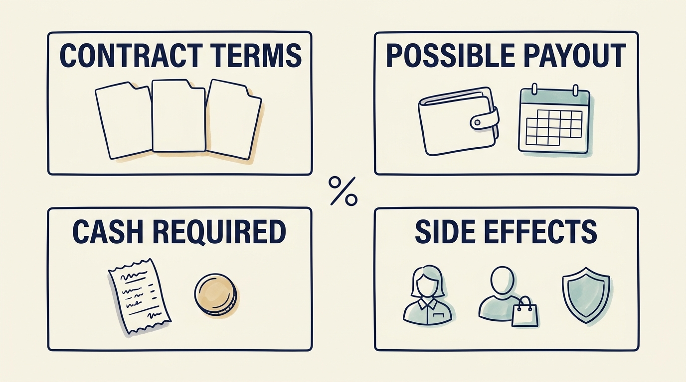

**Incentives are rewards and consequences that influence choices.** A fund (investors’ pooled money, run by a fund manager) that buys into a company adds shares for its leaders, an expected sale date for its holding (the exit) and the manager’s own pay. Executives, the fund, employees and customers gain and lose different things, on different timetables.

**Figure 1:** *Test the actual payout terms and the behavior the reward encourages.*

**Management equity** is the shares (units of company ownership), or rights tied to their value, that company leaders hold. What a percentage pays depends on who is paid first, when rights are earned, how many new shares are issued and what happens if the holder leaves. In a fictional plan, 5% of sale money above a €100 million threshold pays €2 million at €140 million, not 5% of the whole. The fund manager’s **carried interest**, or carry, is separate: a share of the fund’s profits under the fund agreement ([[fund-economics]]). Fund investors’ published principles on managers’ rewards do not cover every employee or customer concern. [S02: ILPA principles](https://ilpa.org/wp-content/uploads/2019/06/ILPA-Principles-3.0_2019.pdf)

**A target needs the measure it could damage beside it.** A fictional bonus for 25% growth in revenue, money earned from sales, counts only contracts earning more in their first year than they cost to serve. It is paired with **gross revenue retention**, kept at or above 90%: what last year’s customers pay this year, leaving out extra sales to them, divided by what they paid last year. New customers’ waiting time is checked too; failing either withholds that quarter’s growth payment. Salespeople’s commission, their pay per sale, is cut or delayed on loss-making contracts. Measuring the damage cannot fix a payout rule that rewards it.

**One fictional closure shows the four bets.** Larkspur’s board proposes closing a second support location within nine months, saving about €600,000 yearly. If each euro of lasting yearly saving adds €10 to the sale price, with debt and cash unchanged, shareholders’ value rises by about €6 million. Past its €100 million threshold, the 5% plan’s executive gains about €300,000. The fund, holding 70%, gains about €4 million. The manager’s carry comes from that: about €800,000 if the fund has already paid its investors everything its agreement puts first, so further profit splits 80/20. A profitable fund short of that point pays none yet.

**Eleven of fourteen employees** learn now that their jobs will end. Thirty customer contracts come up for renewal within six months, as specialists may resign and the handover begins. Larkspur instead closes in two stages: six leave at month six, five at month twelve, and three specialists are paid to stay. Before each stage, the chief executive checks renewals and support waiting time, and can pause. The board approves €550,000 of planned spending, €200,000 above the faster plan, plus up to €30,000 for a pause. Without a pause, the full saving starts in month thirteen. The eleven’s loss remains, and the record says so.

Review a decision’s quality, execution and result separately. Reward early reports of failed assumptions; pay or exit expectations can distort judgments of leaders ([[fix-decisions-before-hiring]]). Next: [[investor-under-pressure]].
