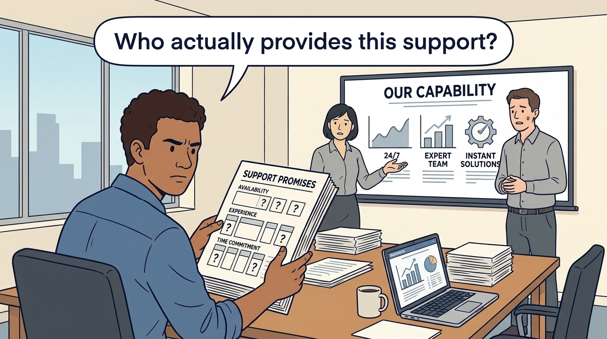
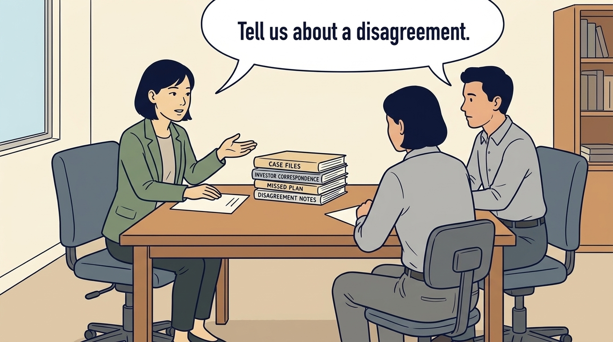
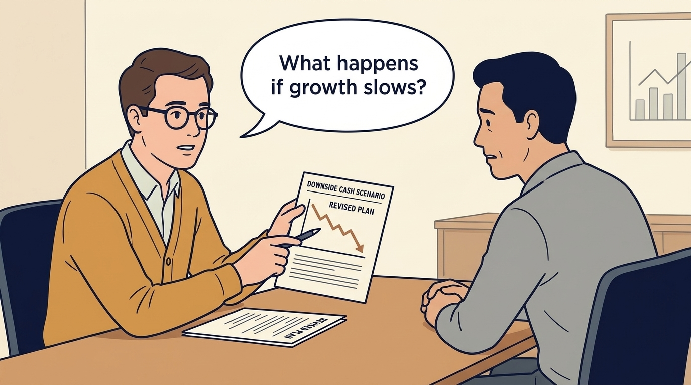
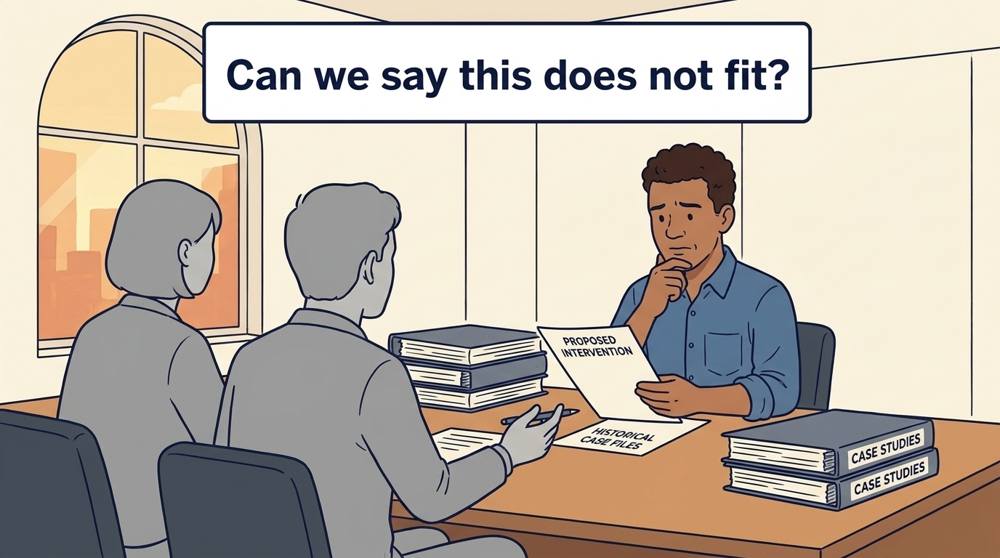
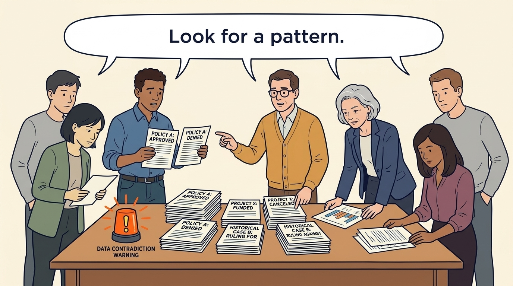
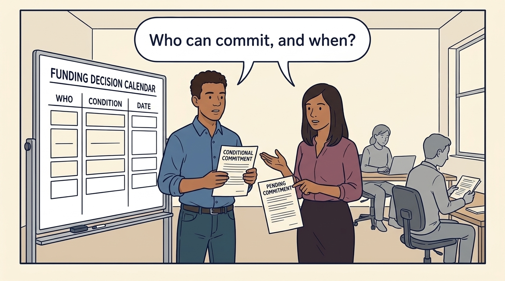

<!-- comic-style
{
  "cast": "MORGAN: a thoughtful investor technology adviser with short dark hair and a green jacket, used in the fund scenarios. ALEX: a practical CTO with curly hair and blue rolled-up sleeves. SAM: a CFO with round glasses and an amber cardigan. PRIYA: a product leader with straight dark hair and plum sleeves. INES: a CEO with short grey hair and a navy jacket. All are fictional; none represents a person in a real case.",
  "style": "Clean editorial explainer comic, dark ink outlines, restrained green, blue, and amber accents on warm white, generous space, readable short speech bubbles, expressive people and simple physical metaphors. No photorealism, logos, dense charts, or title text. Keep the same character appearances throughout the journal."
}
-->

**Comic.** Most product and engineering leaders never sign the term sheet, the document in which an investor proposes its terms for putting money into a company. But their plan depends on how the investor behaves after a missed quarter (three months of the financial year). The panels put two fictional offers through the same questions: Investor A, with a broad network of in-house experts, and Investor B, with one experienced operator, someone who has run this kind of work before. They end with the choice Ines makes and the dependency Alex changes for an investor already in place.

Three terms recur. An investment firm invests from a **fund**, a pool of money promised by the fund’s own investors, and a committee inside the firm approves each investment. A **follow-on** is more money from the same investor after its first investment. A **pilot** is a small trial; Larkspur’s pilot automates part of setting up new customers on its software.

Morgan is an investor’s adviser in the fund scenarios. Ines is Larkspur’s chief executive; Alex leads technology, Priya leads product, and Sam leads finance. All are fictional. Comparative scenarios use separate assumptions. Historical cases are discussed through documents; the scenes do not reenact real events.

<!-- comic-panel
{
  "id": "01-scene",
  "status": "generated",
  "asset": "assets/images/07-investor-under-pressure/comic-01-scene.jpeg",
  "aspect_ratio": "16:9",
  "prompt": "Panel 1 of an explainer comic. Alex reviews Investor A's presentation full of capability promises. Use one speech bubble with the exact words: \"Who actually provides this support?\" Convey: Investor A promises a broad support platform: a network of in-house experts and services. A promise of support needs a named person, relevant experience and time; the presentation names nobody for Larkspur yet.",
  "alt": "Comic panel: Alex reviews Investor A's presentation full of capability promises.",
  "caption": "Investor A promises a broad support platform: a network of in-house experts and services. A promise of support needs a named person, relevant experience and time; the presentation names nobody for Larkspur yet.",
  "generation": {
    "model": "gemini-3-pro-image-preview",
    "reference_id": "owned-cast-20260913",
    "sha256": "b30b2736d117012be85cd6b10ba8106e0b9cd0800d67ebbf1e840f084f02cce3"
  }
}
-->

**Panel 1:** Investor A promises a broad support platform: a network of in-house experts and services. A promise of support needs a named person, relevant experience and time; the presentation names nobody for Larkspur yet.

*Dialogue:* “Who actually provides this support?”

<!-- comic-panel
{
  "id": "02-scene",
  "status": "generated",
  "asset": "assets/images/07-investor-under-pressure/comic-02-scene.jpeg",
  "aspect_ratio": "16:9",
  "prompt": "Panel 2 of an explainer comic. Morgan asks a reference for a story about a difficult engagement. Use one speech bubble with the exact words: \"Tell us about a disagreement.\" Convey: Ask each investor’s references, people who have worked with it, about a plan that went wrong. Investor B’s reference reports short-term funding provided within six weeks, and that company’s finance chief replaced in the same quarter.",
  "alt": "Comic panel: Morgan asks a reference for a story about a difficult engagement.",
  "caption": "Ask each investor’s references, people who have worked with it, about a plan that went wrong. Investor B’s reference reports short-term funding provided within six weeks, and that company’s finance chief replaced in the same quarter.",
  "generation": {
    "model": "gemini-3-pro-image-preview",
    "reference_id": "owned-cast-20260913",
    "sha256": "284d40ef6d67a5b8cbdc22c009befb0d055ac3f4e9d630d8a603d69f280a9814"
  }
}
-->

**Panel 2:** Ask each investor’s references, people who have worked with it, about a plan that went wrong. Investor B’s reference reports short-term funding provided within six weeks, and that company’s finance chief replaced in the same quarter.

*Dialogue:* “Tell us about a disagreement.”

<!-- comic-panel
{
  "id": "03-scene",
  "status": "generated",
  "asset": "assets/images/07-investor-under-pressure/comic-03-scene.jpeg",
  "aspect_ratio": "16:9",
  "prompt": "Panel 3 of an explainer comic. Sam reviews a downside cash scenario with the investor. Use one speech bubble with the exact words: \"What happens if growth slows?\" Convey: Sam asks both investors what happens if results are worse than planned. With Investor A, a request for a follow-on goes to a committee whose criteria are not written down. Investor B’s fund is in its seventh year of ten. That length can be extended and sets no sale date, and age alone does not show what is left, so Ines asks. B says most of the fund’s remaining money is earmarked for companies it already owns, and that it will probably want to sell within about five years.",
  "alt": "Comic panel: Sam shows the investor a sheet labeled downside cash scenario, a forecast of the company’s cash if results are worse than planned.",
  "caption": "Sam asks both investors what happens if results are worse than planned. With Investor A, a request for a follow-on goes to a committee whose criteria are not written down. Investor B’s fund is in its seventh year of ten. That length can be extended and sets no sale date, and age alone does not show what is left, so Ines asks. B says most of the fund’s remaining money is earmarked for companies it already owns, and that it will probably want to sell within about five years.",
  "generation": {
    "model": "gemini-3-pro-image-preview",
    "reference_id": "owned-cast-20260913",
    "sha256": "96a57ffeb1797d79c004e8eb8aca64b8cd32795543e12591faed74488382f433"
  }
}
-->

**Panel 3:** Sam asks both investors what happens if results are worse than planned. With Investor A, a request for a follow-on goes to a committee whose criteria are not written down. Investor B’s fund is in its seventh year of ten. That length can be extended and sets no sale date, and age alone does not show what is left, so Ines asks. B says most of the fund’s remaining money is earmarked for companies it already owns, and that it will probably want to sell within about five years.

*Dialogue:* “What happens if growth slows?”

<!-- comic-panel
{
  "id": "04-scene",
  "status": "generated",
  "asset": "assets/images/07-investor-under-pressure/comic-04-scene.jpeg",
  "aspect_ratio": "16:9",
  "prompt": "Panel 4 of an explainer comic. Alex considers declining an offered intervention. Use one speech bubble with the exact words: \"Can we say this does not fit?\" Convey: Ask both investors what happens if Larkspur declines a proposed service. Investor A describes a process; Investor B names the operator who would stop. The answers show how much choice the company keeps.",
  "alt": "Comic panel: Alex considers declining an offered intervention.",
  "caption": "Ask both investors what happens if Larkspur declines a proposed service. Investor A describes a process; Investor B names the operator who would stop. The answers show how much choice the company keeps.",
  "generation": {
    "model": "gemini-3-pro-image-preview",
    "reference_id": "owned-cast-20260913",
    "sha256": "21ec3e755b0fffb5da0a4a7661d066285212d7c26f41fea564d1a5cc9a0bb037"
  }
}
-->

**Panel 4:** Ask both investors what happens if Larkspur declines a proposed service. Investor A describes a process; Investor B names the operator who would stop. The answers show how much choice the company keeps.

*Dialogue:* “Can we say this does not fit?”

<!-- comic-panel
{
  "id": "05-scene",
  "status": "generated",
  "asset": "assets/images/07-investor-under-pressure/comic-05-scene.jpeg",
  "aspect_ratio": "16:9",
  "prompt": "Panel 5 of an explainer comic. A warning light appears beside repeated unexplained reversals. Use one speech bubble with the exact words: \"Look for a pattern.\" Convey: One difficult story is context, not a verdict. A second former executive with the same account of Investor B replacing management would call for investigation, and for negotiating who approves management changes before signing; a count alone is not a verdict.",
  "alt": "Comic panel: A warning light appears beside repeated unexplained reversals.",
  "caption": "One difficult story is context, not a verdict. A second former executive with the same account of Investor B replacing management would call for investigation, and for negotiating who approves management changes before signing; a count alone is not a verdict.",
  "generation": {
    "model": "gemini-3-pro-image-preview",
    "reference_id": "owned-cast-20260913",
    "sha256": "d3f5dc349c72b67d085598697e8e929481a121632955fc745db4b87ee5f583d6"
  }
}
-->

**Panel 5:** One difficult story is context, not a verdict. A second former executive with the same account of Investor B replacing management would call for investigation, and for negotiating who approves management changes before signing; a count alone is not a verdict.

*Dialogue:* “Look for a pattern.”

<!-- comic-panel
{
  "id": "06-scene",
  "status": "generated",
  "asset": "assets/images/07-investor-under-pressure/comic-06-scene.jpeg",
  "aspect_ratio": "16:9",
  "prompt": "Panel 6 of an explainer comic. Priya and Alex place two investor messages beside a single funding decision calendar. Use one speech bubble with the exact words: \"Who can commit, and when?\" Convey: Ines chooses Investor B. B’s own fund would owe a €1.5 million follow-on if the pilot evidence meets the agreed conditions and Larkspur asks in time. The clause is to be written into the investment agreement, the binding contract, which is not yet signed; even signed, it is a right to request money, not cash. For an investor already in place, Alex moves the June hire to a dated July decision and labels unconfirmed support. Interest is not committed money.",
  "alt": "Comic panel: Priya and Alex place two investor messages beside a single funding decision calendar.",
  "caption": "Ines chooses Investor B. B’s own fund would owe a €1.5 million follow-on if the pilot evidence meets the agreed conditions and Larkspur asks in time. The clause is to be written into the investment agreement, the binding contract, which is not yet signed; even signed, it is a right to request money, not cash. For an investor already in place, Alex moves the June hire to a dated July decision and labels unconfirmed support. Interest is not committed money.",
  "generation": {
    "model": "gemini-3-pro-image-preview",
    "reference_id": "owned-cast-20260913",
    "sha256": "03abc45d1ac8170a59e2eeee05c248452a30a13f88066841bcbcb4bd4b8f8372"
  }
}
-->

**Panel 6:** Ines chooses Investor B. B’s own fund would owe a €1.5 million follow-on if the pilot evidence meets the agreed conditions and Larkspur asks in time. The clause is to be written into the investment agreement, the binding contract, which is not yet signed; even signed, it is a right to request money, not cash. For an investor already in place, Alex moves the June hire to a dated July decision and labels unconfirmed support. Interest is not committed money.

*Dialogue:* “Who can commit, and when?”
