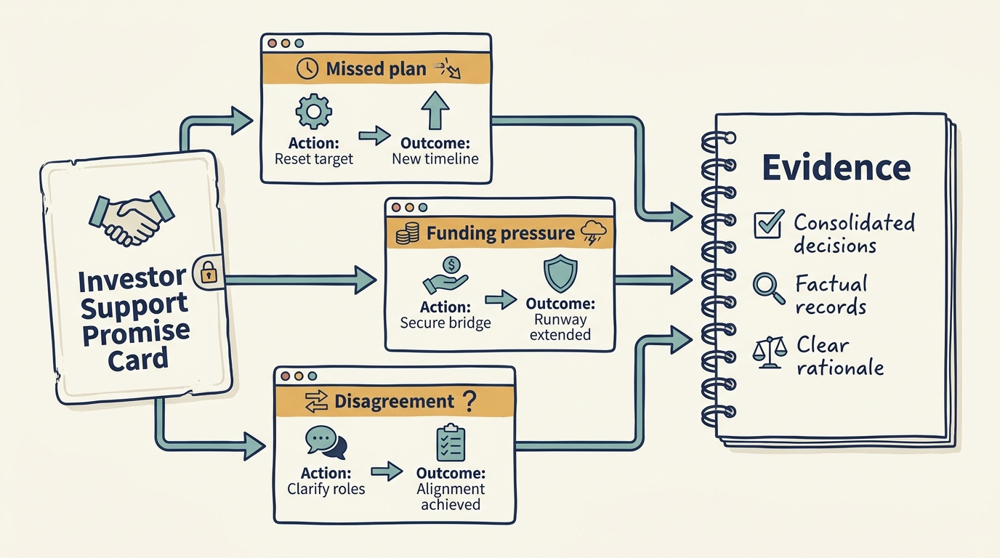
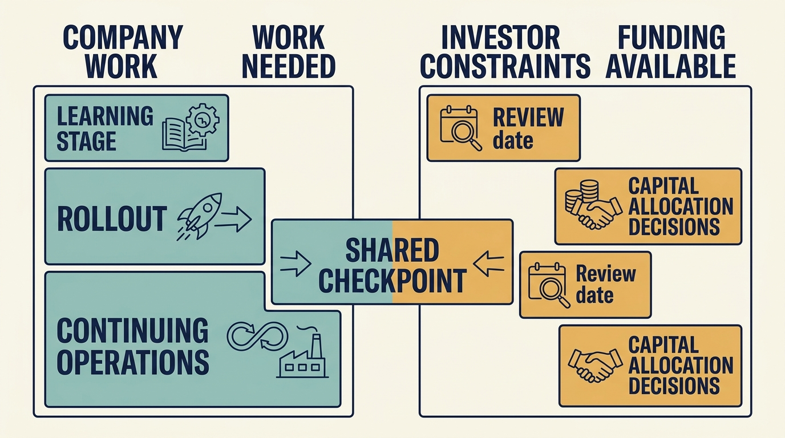

> **IN THIS SECTION, YOU WILL:** Learn to judge an investor by evidence of behavior when a plan missed, compare two offers on that evidence, and change one dependency when the investor is already in place.

> **WHY INVESTORS CARE:** A follow-on written into the investment agreement binds the fund’s own money and removes its committee’s discretion. Investors accept that when the condition is measurable, because it spares both sides a funding request in the middle of a missed plan; an investor that declines to write its conditions is keeping that discretion, and the company should plan as if the money is not there.

> **WHY YOU SHOULD CARE:** A plan built on an investor’s promised patience or support fails when the promise does. Past decisions help test promises of support; current terms and available resources determine which promises your plan can rely on.

> **KEY POINTS:**
>
> * Assess **behavior under pressure**. Concrete decisions and difficult references reveal more than promises of patience, expertise or partnership, and the evidence changes which uncertainty you choose to carry.
> * Match support to the **company’s next decisions**. Establish the people, time, cost and authority behind an offer before a plan depends on it, and label what remains unconfirmed.
> * **If the investor is already in place**, use the assessment to change one dependency: the funding date, the approval route or the support commitment. Reassess as the business changes.

 
Ines, the chief executive of the fictional software company Larkspur, has two **term sheets** on her desk: documents setting out proposed investment terms. Both investors promise patient ownership and practical support. To compare them, she needs examples of how those promises worked when a company missed its plan.

**Investor fit** means how well an investor’s terms, resources and behavior match what the company needs. A reassuring description is a starting point for investigation.

Most product and engineering leaders aren’t asked to sign a term sheet. They’re asked to deliver a plan whose feasibility depends on the investor’s behavior: whether funding continues after a missed quarter, whether support arrives in a usable form, and whether a delay is treated as a problem to solve or a reason to change management. If the investor is already in place, use this assessment to change one dependency in your plan: the funding date, the approval route or the support commitment. This chapter shows both uses: the comparison Ines makes between the two offers, and the change Alex, the CTO, makes to the operating plan once the evidence is in.

The purpose isn’t to find a universally good investor. It’s to find out whether this partnership can support what Larkspur actually has to do next. The same firm can be a strong fit for one situation and a poor fit for another.

## Begin With the Work the Company Needs

Before assessing an investor’s capabilities, write a short account of the company’s next difficult decisions and what the investor would need to contribute to each: capital, expertise, customer access, hiring support, governance or patience. This stops “operating support” from staying an attractive but undefined phrase. For Larkspur:

| Next decision | What Larkspur needs from the investor |
| --- | --- |
| Automate onboarding, starting with a pilot | Someone who has seen an onboarding automation done; patience through a pilot that may show the assumptions were wrong |
| Enter a second country | Follow-on capital about a year out, on conditions known now; hiring support in the new market |
| Replace the retiring founder’s customer relationships and knowledge | Time for a transition through at least two release cycles, and a board that does not treat the founder’s departure as a reason to change the rest of management |

A firm can advertise a broad support platform. KKR Capstone, for example, describes capabilities across growth, digital work, operations and external experts. Such descriptions establish the services a firm says it can offer, not their availability, effectiveness or suitability for a specific company. [S22: KKR Capstone description](https://www.kkr.com/approach/capstone) The assessment has to move from the brochure to the three rows above.

## Ask for the Difficult References

References drawn only from enthusiastic current CEOs give a restricted view. Where access is available and appropriate, seek former executives, leaders of companies that missed their plans, and leaders who declined or ended a proposed intervention. Explain the questions in advance and respect confidentiality.

| Question | Evidence it seeks | An answer needing a follow-up |
| --- | --- | --- |
| Describe a plan that proved wrong. What changed afterward? | Ability to revise an investment thesis | "The plan was fine, execution was the problem." |
| When did the investor fund additional work during a miss? | Conditional capital support and its limits | "It never came up." |
| What happened when management disagreed with an operating expert? | Actual decision rights | "We aligned pretty quickly." |
| Which support did you stop using, and why? | Freedom to reject low-value help | "We used everything they offered." |
| What did you report that the investor did not want to hear? | Response to inconvenient evidence | A general description of the reporting process, without an example. |
| What remained unfinished at exit? | Willingness to disclose inherited obligations | "Nothing material." |

Answers like these leave the behavior unclear, so ask for a specific example or another source. An executive may have had few relevant incidents, may be unable to share confidential details, or may be giving an incomplete account. The gap calls for follow-up, not an automatic negative judgment.

A single difficult story isn’t a verdict. **Look for repeated mechanisms** and consider alternative explanations. A dismissed executive may have an understandable grievance. A successful CEO may attribute too much to the current owner. Both can still offer concrete observations worth checking.

**Figure 1:** *Ask how the investor behaved when the original plan stopped working.*

## Make the Support Offer Reviewable

Suppose an investor promises help with **artificial intelligence (AI)** and with building engineering teams in other countries. Ask what the first engagement would involve: who is available, for how many days, with what relevant work behind them, who pays for specialists and implementation, who has authority to decide, and what would stop the engagement. A reasonable answer can be modest. One experienced operator with a trusted specialist network can be more useful than an extensive catalogue without available capacity.

Don’t confuse advice with funding. A recommendation to modernize a platform is incomplete until the company has the capacity and money to do it. Here, the support offer is evidence about the investor; once a company need is agreed, finding suitable help and writing the engagement charter are Part IV’s work: [[help-that-changes-capability]] and [[useful-engagement]].

## Test the Funding Horizon

Ask for a comprehensible account of the transaction’s use of proceeds and the company’s post-deal obligations. Which money reaches the business? What are the debt maturities and material restrictions? What financial scenario funds the product plan? What happens if growth arrives a year late?

At fund level, identify the investment’s place in the fund lifecycle and the process for follow-on decisions. A fund’s term, commonly ten years, is not a sale date: fund agreements usually allow extensions with the approval of the fund’s investors, and the ILPA principles, which are recommendations rather than binding terms, suggest limiting them to two extensions of one year each, each approved by the fund’s investors. A fund late in its term does, however, have less money and less patience left. [S02: ILPA principles](https://ilpa.org/wp-content/uploads/2019/06/ILPA-Principles-3.0_2019.pdf) Ask, too, whether money the investor describes as “reserved” for follow-ons is a commitment to this company or an allocation inside the fund that its committee can redirect. Don’t ask for an absolute promise that the company will never be sold early or that more capital will always be available. Ask how those decisions will be made and which conditions matter. The return sensitivity in [[three-different-returns]] can structure the conversation: if the plan requires both unusually rapid earnings growth and a higher exit multiple, ask how it performs without the multiple increase.

**Figure 2:** *Fit depends on whether the work can be funded and supported for the time it needs.*

## Compare Both Investors Against the Same Needs

Now the two term sheets, in a fictional scenario with its own assumptions: the round, the valuations and the follow-on belong to this chapter alone and do not appear in the shared Larkspur ledger that Part III onward uses, although the onboarding pilot whose evidence the follow-on depends on is the pilot those chapters measure. Investor A is a larger firm offering €5 million for a minority stake at the higher valuation, with a broad support platform. Investor B is a smaller firm offering €4.5 million at a lower valuation, one experienced operator, money reserved in its fund for follow-on investments, and a willingness to turn some of that reserve into a commitment. Ines puts both through the same three needs.

| | Investor A | Investor B |
| --- | --- | --- |
| Evidence obtained | Three references, all current CEOs supplied by the firm, all positive. One former CFO reached independently: when her company missed its plan, the follow-on went to the firm’s investment committee and took four months; the promised AI team turned out to be a two-day workshop. Asked what would happen if Larkspur declined a proposed service, A described an internal process. | Two references, one a CEO whose plan slipped by a year: B funded a €600,000 bridge within six weeks and, in the same quarter, replaced the CFO. B’s operator, formerly head of operations at a scheduling-software company, has run two onboarding automations and can give ten days a quarter. Asked the same question, B named the operator, who would stop. |
| Remaining uncertainty | The criteria for a follow-on when a plan misses, and which named person, if any, would work with Larkspur. | Whether the CFO change was the pattern or the exception. B’s fund is in the seventh year of a ten-year term. The term fixes no sale date and can be extended with its investors’ approval, but a fund at that stage has less money left for follow-ons and less patience for a second country than one in its second year. |
| Effect on Larkspur’s next decisions | The second-country expansion could not depend on A’s follow-on within a year. Onboarding would rely on Larkspur’s own people. | The founder transition and a second country would run against B’s exit clock. The onboarding pilot would have a credible outside contributor. |
| Negotiated commitment | A named operating partner for the first ninety days; A declined to put follow-on criteria in writing. | A €1.5 million follow-on from the same fund, conditional on pilot evidence, to be written into the investment agreement (the terms are set out below); ten named operator days a quarter, reviewed at week six. |

The follow-on needs precision, because “reserved” is where a promise slides into a plan. B’s fund holds money back for further investments in its existing companies. That reserve is B’s internal allocation, spent at the discretion of B’s investment committee, and Larkspur has no claim on it. What Ines negotiated is narrower and more useful: a clause in the **investment agreement**, the binding contract that follows the term sheet, under which the same fund that makes the €4.5 million investment, not a successor fund and not a co-investor, must subscribe a further €1.5 million at the round’s share price when Larkspur calls it; B has confirmed in writing that the fund’s uncalled commitments cover the amount. Larkspur may call it once the onboarding pilot shows effort per implementation of 65 hours or less, with customer waiting time no worse than the baseline, across a measured cohort of at least eight customers, by the method the pilot plan sets and confirmed by the board; the right lapses fifteen months after closing. The bar is deliberately lower than the 60 hours at which the board’s own pilot rule treats the step as ready to expand ([[roadmap-to-revenue]], [[first-hundred-days]]): the clause tests whether the step works at all, so a result of 62 hours with waiting time unchanged, the shared pilot’s amber outcome, keeps the follow-on callable while the board decides whether to expand. The pilot result is the only performance condition; the usual conditions that Larkspur is not insolvent or in breach of the agreement remain. Until the investment agreement is signed, the term sheet binds nobody, so the plan carries the follow-on as “agreed in the term sheet, not yet signed” and changes the label at closing. Even signed, the clause is a right to call B’s money, not cash: nothing is spent against it until the call is made and paid.

Either investor could be the right choice. The evidence did not rank the firms; it changed which uncertainty Larkspur would carry. With A, the uncertainty sits on the most time-sensitive decision, second-country funding, and A would not write it down. With B, the written follow-on narrows the next funding decision to a measurable condition. It does nothing for the other two uncertainties: neither term sheet contains a rule on management changes, and no clause lengthens a fund’s life. B’s management-change practice, known from one account, and its exit pressure from year seven remain risks the board accepts, subject to the further references below. B’s explicit funding condition against A’s undisclosed committee is the trade Ines is making, not a removal of risk. The comparison covers support and conditional funding only; the ownership percentages each valuation implies are left out here, and the dilution arithmetic is a separate part of the term-sheet review.

The decision, recorded. Chosen option: Investor B, €4.5 million at closing and a €1.5 million follow-on that B’s fund owes once the investment agreement is signed and the pilot condition is met. Alternatives rejected: Investor A, whose higher valuation left Larkspur’s most time-sensitive dependency resting on an undisclosed committee process; and delaying the round, because the founder’s retirement date does not move. Risks accepted: B’s practice on management changes and its exit pressure from year seven of a ten-year term, neither addressed by a term. Scarce capacity: Ines’s and Priya’s time in the first quarter, and the operator’s ten days. Authorized: Larkspur’s board, with the shareholder consents the existing agreement requires. Evidence that would change the decision: a second former executive with the same story about B replacing management, which would send Ines back to negotiate the approval route for management changes into the shareholders’ agreement before signing; or A putting its follow-on criteria in writing, which would reopen the comparison.

## When the Investor Is Already in Place

The same assessment changes one dependency for a leader who did not choose the investor. In a separate fictional Larkspur round, the lead investor will provide more money only if another investor joins. The existing investor is supportive but hasn’t committed. Priya’s expansion depends on both. Alex’s operating plan had the second-country engineering lead starting in June on the assumption that the follow-on would close.

After the assessment, the plan changes in one place. The June hire becomes a dated decision at the July board meeting, taken after the co-investor has committed or declined. The onboarding pilot proceeds from operating cash and no longer depends on the round. The existing investor’s offer of help with AI is labelled unconfirmed until a named person and a number of days exist. Two encouraging conversations still don’t equal a funded plan; what changed is that no delivery date rests on them.

A corporate investor’s request for a feature available only through its channel is a separate commercial decision, to be tested for its effect on other customers, future partnerships and support costs rather than treated as part of the ownership relationship. If you inherited the arrangement, focus on changes within reach: **one approval route for the operating plan**, a dated funding decision, a narrower support assignment or a clear way to escalate conflicting requests. Record what can’t be changed and reflect it in the commitments you make. Investor fit is also the continuing work of making an imperfect relationship usable.

## When the Evidence Is Missing

References may be unavailable, and fund information may not be shared. Missing evidence should become an explicit uncertainty in the plan, not an endless request for more information. Three moves keep the method usable. Label the support as unconfirmed in the operating plan. Make no customer or hiring commitment that depends on unconfirmed funding or support. Set a review date at which the label is confirmed, removed or escalated.

Larkspur’s plan reads accordingly, with the two scenarios kept apart. In the term-sheet scenario: Investor B’s follow-on, “€1.5 million from B’s fund, callable at 65 hours or less with waiting time no worse; agreed in the term sheet, not yet signed; lapses fifteen months after closing”. In the inherited-investor scenario: the existing investor’s AI help, “unconfirmed: no named person, no days”. In both, no customer promise depends on the labelled item, and the label is confirmed, removed or escalated at the October board meeting.

## Observations to Investigate, and One Reassessment Process

Some observations deserve investigation before reliance deepens: a refusal to discuss downside scenarios; a demand for benchmark conformity without comparable companies; reporting definitions that change whenever performance deteriorates; instructions to staff that bypass executives; repeated promises of help without a named delivery owner; confidential coaching used unexpectedly in performance assessments. None is proof of misconduct. Each is a reason to clarify the operating arrangement.

Some practices that feel uncomfortable at first can be productive. A new shareholder may insist on cash reporting, challenge a favored project or question whether an executive’s capabilities fit the company’s needs. The distinction is whether the challenge uses evidence, produces a legitimate decision and recognizes consequences. Discomfort alone doesn’t separate discipline from interference.

Fit is not settled at signing. People change, the company changes, and the original thesis may fail. A periodic partnership review asks what support created value, what burden it imposed and which expectations need revision. When a problem emerges, start with a concrete decision rather than a general complaint: document the competing objectives and the evidence, offer feasible options, take them to the forum authorized to decide ([[decide-who-decides]]), and record the decision and its consequences. If the disagreement concerns a material obligation or contractual right, involve the relevant qualified advisers. The investor’s technology adviser can help translate these conversations but can’t make every conflict disappear. Sometimes honest disagreement reveals that a role or partnership should change.

Part II has connected changed authority, incentives and the working relationship. With Investor B’s commitments in writing, €4.5 million at closing, €1.5 million owed on pilot evidence once the agreement is signed, and ten operator days a quarter, the next question is which of Larkspur’s own initiatives that money and capacity can fund at once: [[part-3]] and [[cannot-fund-everything]].

## Questions to Consider

1. *What are your company’s next three difficult decisions, and what would you need the investor to contribute to each: capital, expertise, access or patience?*
2. *Whom have you spoken to who worked with your investor when a plan went wrong? What did the investor do?*
3. *Which of your commitments depend on funding or support that is not yet confirmed? Are they labelled as such, and when is the review date?*
4. *If you inherited the arrangement, what single change within reach would make it more workable: one approval route, a dated funding decision or a narrower support assignment?*

## To Probe Further

- **[Venture Deals: Be Smarter Than Your Lawyer and Venture Capitalist](https://www.venturedeals.com/)** — Brad Feld and Jason Mendelson, Wiley, 4th edition, 2019. *Two venture investors explain how fund lifecycle and reserves shape an investor's behavior after signing, the background for this chapter's "test the funding horizon" questions.*
- **[How to Evaluate if a VC is Founder-Friendly Before Raising](https://www.crv.com/content/how-to-evaluate-if-a-vc-is-founder-friendly-before-raising)** — CRV, February 2026. *One venture firm's guide to reverse reference checks, including how to find founders the investor did not put forward, which overlaps directly with this chapter's reference table.*
- **[The Operational Consequences of Private Equity Buyouts](https://corpgov.law.harvard.edu/2016/07/28/the-operational-consequences-of-private-equity-buyouts/)** — Shai Bernstein and Albert Sheen, Review of Financial Studies, 2016; free summary on the Harvard Law School Forum on Corporate Governance. *A study of US restaurant chains bought by private equity firms between 2002 and 2012, using health-inspection records: operating improvement was larger in deals led by partners with prior operating experience, particularly in restaurants. A relationship in one sector and period, not a guaranteed effect of assigning an experienced adviser, but a reason to ask who is behind a support offer.*
- **[Making Sense of Corporate Venture Capital](https://hbr.org/2002/03/making-sense-of-corporate-venture-capital)** — Henry Chesbrough, Harvard Business Review, March 2002. *A framework separating strategic corporate investments from financial ones, which fits the situation in which a corporate investor asks for a channel-specific feature.*
