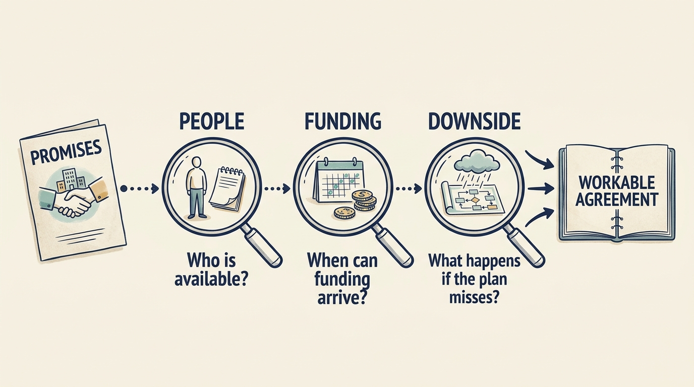

Assess an investor through its **behavior under pressure** and its ability to support this company’s next decisions; promises need evidence before plans rely on them. Most product and engineering leaders never sign the term sheet, the document setting out an investor’s proposed terms, yet their plan depends on the investor’s behavior after a missed quarter (three months).

**Figure 1:** *Three questions test a promise of support: Who is available? When can funding arrive? What happens if the plan misses?*

Begin with the company’s next decisions. Fictional Larkspur has three. A pilot (a small trial) of automating onboarding, the setup of new customers, needs experienced help. A second country needs a follow-on, more money from the same investor later, on conditions known now. A retiring founder needs time. A support brochure does not prove suitability. [S22: KKR Capstone description](https://www.kkr.com/approach/capstone)

Seek references, people who worked with the investor, who saw difficulty: a failed plan, a disagreement, a funding request. Look for patterns. **Make the support offer reviewable**: who is available, for how long, who pays, who decides. An investment firm invests from a fund, a pool of other investors’ money with an agreed length, often ten years; the firm’s investment committee approves each investment. That length is not a sale date, and age alone shows neither remaining money nor patience.

**The evidence changes the choice**, in a separate fictional scenario. Investor A offers €5 million and a broad support network. An independent reference reports more money took four months after a missed plan; A will not write its committee’s criteria down. Investor B offers €4.5 million and one operator who has run two onboarding automations. When a reference’s plan slipped, B provided short-term funding within six weeks and replaced that company’s finance chief. B’s fund is in year seven of ten; B will probably want to sell within about five years.

Either could be right. Ines, the chief executive, chooses B because its next funding decision can be written down. Money B has “reserved” stays under its committee’s control. The signed investment agreement would require the same fund to pay a €1.5 million follow-on, subject to verified pilot results and other agreed conditions, within thirty days of a valid request. Larkspur may ask until fifteen months after closing, when the deal completes and money and shares change hands.

The term sheet here does not yet oblige B to invest; the signed agreement would. Even then **committed funding is not cash**: the second country waits until the money arrives. No term addresses B’s readiness to replace managers or its wish to sell. Larkspur’s board, which oversees its major decisions, accepts both; a second such account reopens the negotiation.

**For an investor already in place**, change one dependency. In another scenario, Alex, the technology chief, moves a June hire that assumed an uncommitted second investor to a July board decision. Without evidence, label support unconfirmed, make no dependent commitment and set a review date.

Refusing to discuss worse-than-planned scenarios, or bypassing executives, warrants investigation, not accusation. Reassess fit periodically; take conflicts to the forum authorized to decide ([[decide-who-decides]]). Once the first money arrives, ask which initiatives it can fund: [[cannot-fund-everything]].
