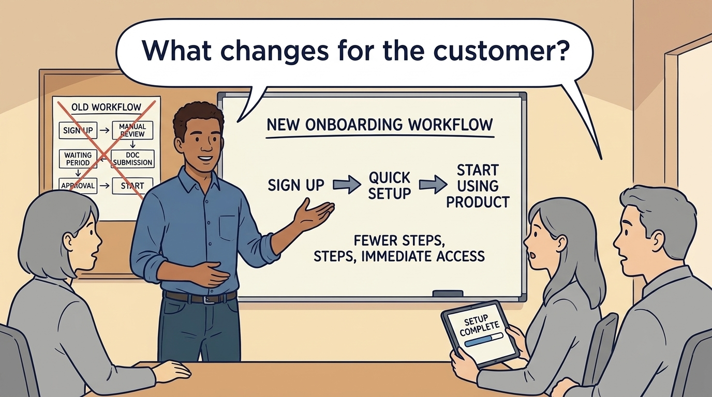

<!-- comic-style
{
  "cast": "MORGAN: a thoughtful investor technology adviser with short dark hair and a green jacket, used in the fund scenarios. ALEX: a practical CTO with curly hair and blue rolled-up sleeves. SAM: a CFO with round glasses and an amber cardigan. PRIYA: a product leader with straight dark hair and plum sleeves. INES: a CEO with short grey hair and a navy jacket. All are fictional; none represents a person in a real case.",
  "style": "Clean editorial explainer comic, dark ink outlines, restrained green, blue, and amber accents on warm white, generous space, readable short speech bubbles, expressive people and simple physical metaphors. No photorealism, logos, dense charts, or title text. Keep the same character appearances throughout the journal."
}
-->

**Comic.** Morgan is an investor’s adviser in the fund scenarios; Alex leads technology, Priya leads product, and Sam leads finance. All are fictional. Comparative scenarios use separate assumptions. Historical cases are discussed through documents; the scenes do not reenact real events.

<!-- comic-panel
{
  "id": "01-scene",
  "status": "generated",
  "asset": "assets/images/08-product-value/comic-01-scene.jpeg",
  "aspect_ratio": "16:9",
  "prompt": "Panel 1 of an explainer comic. Alex presents a faster onboarding workflow. Use one speech bubble with the exact words: \"What changes for the customer?\" Convey: Onboarding is the setup needed before a customer can use the product. Start by identifying what the proposed change makes easier.",
  "alt": "Comic panel: Alex presents a faster onboarding workflow.",
  "caption": "Onboarding is the setup needed before a customer can use the product. Start by identifying what the proposed change makes easier.",
  "generation": {
    "model": "gemini-3-pro-image-preview",
    "reference_id": "owned-cast-20260913",
    "sha256": "b1f2f25f6f2711e40b16a61c824c124e66ea57909f55c93a41c9c39e10457016"
  }
}
-->

**Panel 1:** Onboarding is the setup needed before a customer can use the product. Start by identifying what the proposed change makes easier.

*Dialogue:* “What changes for the customer?”

<!-- comic-panel
{
  "id": "02-scene",
  "status": "generated",
  "asset": "assets/images/08-product-value/comic-02-scene.jpeg",
  "aspect_ratio": "16:9",
  "prompt": "Panel 2 of an explainer comic. A customer reaches a usable product with fewer handoffs. Use one speech bubble with the exact words: \"They reach value sooner.\" Convey: Fewer setup steps may help customers begin useful work sooner. Check whether that result actually occurs.",
  "alt": "Comic panel: A customer reaches a usable product with fewer handoffs.",
  "caption": "Fewer setup steps may help customers begin useful work sooner. Check whether that result actually occurs.",
  "generation": {
    "model": "gemini-3-pro-image-preview",
    "reference_id": "owned-cast-20260913",
    "sha256": "5db768872b66e3311043cd7c12c279cfd39ce3e33ded9d8d8d9dca85778420e0"
  }
}
-->

**Panel 2:** Fewer setup steps may help customers begin useful work sooner. Check whether that result actually occurs.

*Dialogue:* “They reach value sooner.”

<!-- comic-panel
{
  "id": "03-scene",
  "status": "generated",
  "asset": "assets/images/08-product-value/comic-03-scene.jpeg",
  "aspect_ratio": "16:9",
  "prompt": "Panel 3 of an explainer comic. Sam sees freed hours but unchanged payroll. Use one speech bubble with the exact words: \"Capacity is not cash yet.\" Convey: Freed staff time is capacity for other work. If payroll and other spending remain unchanged, it is not yet a cash saving.",
  "alt": "Comic panel: Sam sees freed hours but unchanged payroll.",
  "caption": "Freed staff time is capacity for other work. If payroll and other spending remain unchanged, it is not yet a cash saving.",
  "generation": {
    "model": "gemini-3-pro-image-preview",
    "reference_id": "owned-cast-20260913",
    "sha256": "6ec20263eaaedcd0fa7ffca1efe3afb819f31ee80d0889284d3e80e22e4c9f68"
  }
}
-->

**Panel 3:** Freed staff time is capacity for other work. If payroll and other spending remain unchanged, it is not yet a cash saving.

*Dialogue:* “Capacity is not cash yet.”

<!-- comic-panel
{
  "id": "04-scene",
  "status": "generated",
  "asset": "assets/images/08-product-value/comic-04-scene.jpeg",
  "aspect_ratio": "16:9",
  "prompt": "Panel 4 of an explainer comic. Morgan separates product change from a pricing change. Use one speech bubble with the exact words: \"What else changed this quarter?\" Convey: To judge the effect of the change, compare similar customers and examine other changes, such as a new price.",
  "alt": "Comic panel: Morgan separates product change from a pricing change.",
  "caption": "To judge the effect of the change, compare similar customers and examine other changes, such as a new price.",
  "generation": {
    "model": "gemini-3-pro-image-preview",
    "reference_id": "owned-cast-20260913",
    "sha256": "43b5f92f4464a67b9c4de32bb084d886ba3a9ccf7dcf552d6130c444d443426c"
  }
}
-->

**Panel 4:** To judge the effect of the change, compare similar customers and examine other changes, such as a new price.

*Dialogue:* “What else changed this quarter?”

<!-- comic-panel
{
  "id": "05-scene",
  "status": "generated",
  "asset": "assets/images/08-product-value/comic-05-scene.jpeg",
  "aspect_ratio": "16:9",
  "prompt": "Panel 5 of an explainer comic. Alex adds implementation and ongoing costs to the proposal. Use one speech bubble with the exact words: \"Count the whole intervention.\" Convey: Include the money and effort needed to build, introduce and maintain the improvement before claiming a net benefit.",
  "alt": "Comic panel: Alex adds implementation and ongoing costs to the proposal.",
  "caption": "Include the money and effort needed to build, introduce and maintain the improvement before claiming a net benefit.",
  "generation": {
    "model": "gemini-3-pro-image-preview",
    "reference_id": "owned-cast-20260913",
    "sha256": "c740fb8c3803b849c5910ff3234a1c11a70494dad70b8ce9a575abbd2b65ef46"
  }
}
-->

**Panel 5:** Include the money and effort needed to build, introduce and maintain the improvement before claiming a net benefit.

*Dialogue:* “Count the whole intervention.”

<!-- comic-panel
{
  "id": "06-scene",
  "status": "generated",
  "asset": "assets/images/08-product-value/comic-06-scene.jpeg",
  "aspect_ratio": "16:9",
  "prompt": "Panel 6 of an explainer comic. Priya compares an introduced prospect’s request with existing customer needs and the work it would displace. Use one speech bubble with the exact words: \"Does this serve the market we chose?\" Convey: An investor introduction creates a learning opportunity. Test demand and the cost of exclusivity before changing the roadmap for a corporate channel.",
  "alt": "Comic panel: Priya compares an introduced prospect’s request with existing customer needs and the work it would displace.",
  "caption": "An investor introduction creates a learning opportunity. Test demand and the cost of exclusivity before changing the roadmap for a corporate channel.",
  "generation": {
    "model": "gemini-3-pro-image-preview",
    "reference_id": "owned-cast-20260913",
    "sha256": "0802ccb2924f7cf2f4cf3c72b3fd1b51758403750ad9c92634ab90bc4e0bc0c8"
  }
}
-->

**Panel 6:** An investor introduction creates a learning opportunity. Test demand and the cost of exclusivity before changing the roadmap for a corporate channel.

*Dialogue:* “Does this serve the market we chose?”
