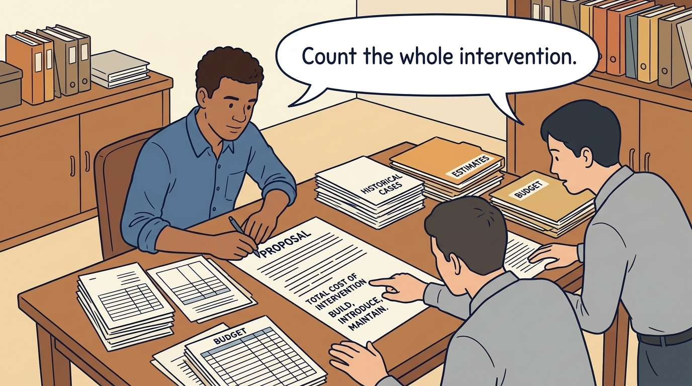

<!-- comic-style
{
  "cast": "MORGAN: a thoughtful investor technology adviser with short dark hair and a green jacket, used in the fund scenarios. ALEX: a practical CTO with curly hair and blue rolled-up sleeves. SAM: a CFO with round glasses and an amber cardigan. PRIYA: a product leader with straight dark hair and plum sleeves. INES: a CEO with short grey hair and a navy jacket. All are fictional; none represents a person in a real case.",
  "style": "Clean editorial explainer comic, dark ink outlines, restrained green, blue, and amber accents on warm white, generous space, readable short speech bubbles, expressive people and simple physical metaphors. No photorealism, logos, dense charts, or title text. Keep the same character appearances throughout the journal."
}
-->

**Comic.** A product leader normally has to show that a change is useful. An investor may expect the change to support a particular growth, margin or retention target; the panels follow one roadmap item along the chain from work to result, testing each link, because that chain is the part most often asserted rather than shown, and end on what the pilot’s day-90 cohort showed.

Morgan is an investor’s adviser in the fund scenarios; Alex leads technology, Priya leads product, and Sam leads finance. All are fictional. Comparative scenarios use separate assumptions. Historical cases are discussed through documents; the scenes do not reenact real events.

<!-- comic-panel
{
  "id": "01-scene",
  "status": "generated",
  "asset": "assets/images/08-roadmap-to-revenue/comic-01-scene.jpeg",
  "aspect_ratio": "16:9",
  "prompt": "Panel 1 of an explainer comic. Alex presents a faster onboarding workflow. Use one speech bubble with the exact words: \"What changes for the customer?\" Convey: Onboarding is the setup needed before a customer can use the product. Start by identifying what the proposed change makes easier.",
  "alt": "Comic panel: Alex presents a faster onboarding workflow.",
  "caption": "Onboarding is the setup needed before a customer can use the product. Start by identifying what the proposed change makes easier.",
  "generation": {
    "model": "gemini-3-pro-image-preview",
    "reference_id": "owned-cast-20260913",
    "sha256": "b1f2f25f6f2711e40b16a61c824c124e66ea57909f55c93a41c9c39e10457016"
  }
}
-->

**Panel 1:** Onboarding is the setup needed before a customer can use the product. Start by identifying what the proposed change makes easier.

*Dialogue:* “What changes for the customer?”

<!-- comic-panel
{
  "id": "02-scene",
  "status": "generated",
  "asset": "assets/images/08-roadmap-to-revenue/comic-02-scene.jpeg",
  "aspect_ratio": "16:9",
  "prompt": "Panel 2 of an explainer comic. A customer reaches a usable product with fewer handoffs. Use one speech bubble with the exact words: \"Do customers reach value sooner?\" Convey: Fewer setup steps may help customers begin useful work sooner. That is a hypothesis until a cohort shows it; in the day-90 cohort, waiting time did not change.",
  "alt": "Comic panel: A customer reaches a usable product with fewer handoffs.",
  "caption": "Fewer setup steps may help customers begin useful work sooner. That is a hypothesis until a cohort shows it; in the day-90 cohort, waiting time did not change.",
  "generation": {
    "model": "gemini-3-pro-image-preview",
    "reference_id": "owned-cast-20260913",
    "sha256": "30575baaeedba4c0dce5d55cff987ff6296b8e72be0a1d3638c013256b24de5c"
  }
}
-->

**Panel 2:** Fewer setup steps may help customers begin useful work sooner. That is a hypothesis until a cohort shows it; in the day-90 cohort, waiting time did not change.

*Dialogue:* “Do customers reach value sooner?”

<!-- comic-panel
{
  "id": "03-scene",
  "status": "generated",
  "asset": "assets/images/08-roadmap-to-revenue/comic-03-scene.jpeg",
  "aspect_ratio": "16:9",
  "prompt": "Panel 3 of an explainer comic. Sam sees freed hours but unchanged payroll. Use one speech bubble with the exact words: \"Capacity is not cash yet.\" Convey: Freed staff time is capacity for other work. If payroll and other spending remain unchanged, it is not yet a cash saving.",
  "alt": "Comic panel: Sam sees freed hours but unchanged payroll.",
  "caption": "Freed staff time is capacity for other work. If payroll and other spending remain unchanged, it is not yet a cash saving.",
  "generation": {
    "model": "gemini-3-pro-image-preview",
    "reference_id": "owned-cast-20260913",
    "sha256": "6ec20263eaaedcd0fa7ffca1efe3afb819f31ee80d0889284d3e80e22e4c9f68"
  }
}
-->

**Panel 3:** Freed staff time is capacity for other work. If payroll and other spending remain unchanged, it is not yet a cash saving.

*Dialogue:* “Capacity is not cash yet.”

<!-- comic-panel
{
  "id": "04-scene",
  "status": "generated",
  "asset": "assets/images/08-roadmap-to-revenue/comic-04-scene.jpeg",
  "aspect_ratio": "16:9",
  "prompt": "Panel 4 of an explainer comic. Morgan separates product change from a pricing change. Use one speech bubble with the exact words: \"What else changed this quarter?\" Convey: To judge the effect, compare like groups and name the differences that remain: who chose the pilot customers, the same specialist serving both groups, a new price or a busier quarter.",
  "alt": "Comic panel: Morgan separates product change from a pricing change.",
  "caption": "To judge the effect, compare like groups and name the differences that remain: who chose the pilot customers, the same specialist serving both groups, a new price or a busier quarter.",
  "generation": {
    "model": "gemini-3-pro-image-preview",
    "reference_id": "owned-cast-20260913",
    "sha256": "43b5f92f4464a67b9c4de32bb084d886ba3a9ccf7dcf552d6130c444d443426c"
  }
}
-->

**Panel 4:** To judge the effect, compare like groups and name the differences that remain: who chose the pilot customers, the same specialist serving both groups, a new price or a busier quarter.

*Dialogue:* “What else changed this quarter?”

<!-- comic-panel
{
  "id": "05-scene",
  "status": "generated",
  "asset": "assets/images/08-roadmap-to-revenue/comic-05-scene.jpeg",
  "aspect_ratio": "16:9",
  "prompt": "Panel 5 of an explainer comic. Alex adds implementation and ongoing costs to the proposal. Use one speech bubble with the exact words: \"Count the whole intervention.\" Convey: Count the €180,000 build commitment (about €90,000 incurred by day 100) and the €30,000 a year of maintenance that starts next financial year before claiming a net benefit, and say which conversion of the released time actually happened.",
  "alt": "Comic panel: Alex adds implementation and ongoing costs to the proposal.",
  "caption": "Count the €180,000 build commitment (about €90,000 incurred by day 100) and the €30,000 a year of maintenance that starts next financial year before claiming a net benefit, and say which conversion of the released time actually happened.",
  "generation": {
    "model": "gemini-3-pro-image-preview",
    "reference_id": "owned-cast-20260913",
    "sha256": "c740fb8c3803b849c5910ff3234a1c11a70494dad70b8ce9a575abbd2b65ef46"
  }
}
-->

**Panel 5:** Count the €180,000 build commitment (about €90,000 incurred by day 100) and the €30,000 a year of maintenance that starts next financial year before claiming a net benefit, and say which conversion of the released time actually happened.

*Dialogue:* “Count the whole intervention.”

<!-- comic-panel
{
  "id": "06-scene",
  "status": "generated",
  "asset": "assets/images/08-roadmap-to-revenue/comic-06-scene.jpeg",
  "aspect_ratio": "16:9",
  "prompt": "Panel 6 of an explainer comic. Priya and Sam at the day-100 board review: a simple board shows hours per setup falling from 80 to 62, beside a customer queue that is still the same length. Use one speech bubble with the exact words: \"We saved hours; we have not yet served more customers.\" Convey: The setup step released 18 hours per implementation, but customers still waited for their own data, so the queue did not move. The board funds one €40,000 data-quality step from the reserve, keeps hiring and expansion deferred, and stops if the next cohort is not at 50 hours or less with waiting time down.",
  "alt": "Comic panel: Priya and Sam at the day-100 review, hours down from 80 to 62 beside an unchanged customer queue.",
  "caption": "The setup step released 18 hours per implementation, but customers still waited for their own data, so the queue did not move. The board funds one €40,000 data-quality step from the reserve, keeps hiring and expansion deferred, and stops if the next cohort is not at 50 hours or less with waiting time down.",
  "generation": {
    "model": "gemini-3-pro-image-preview",
    "reference_id": "owned-cast-20260913",
    "sha256": "0848b1e082661a0cedc5f82d04d58ece05f044f56af3cd8a48cf2ad09fe5af8b"
  }
}
-->

**Panel 6:** The setup step released 18 hours per implementation, but customers still waited for their own data, so the queue did not move. The board funds one €40,000 data-quality step from the reserve, keeps hiring and expansion deferred, and stops if the next cohort is not at 50 hours or less with waiting time down.

*Dialogue:* “We saved hours; we have not yet served more customers.”
