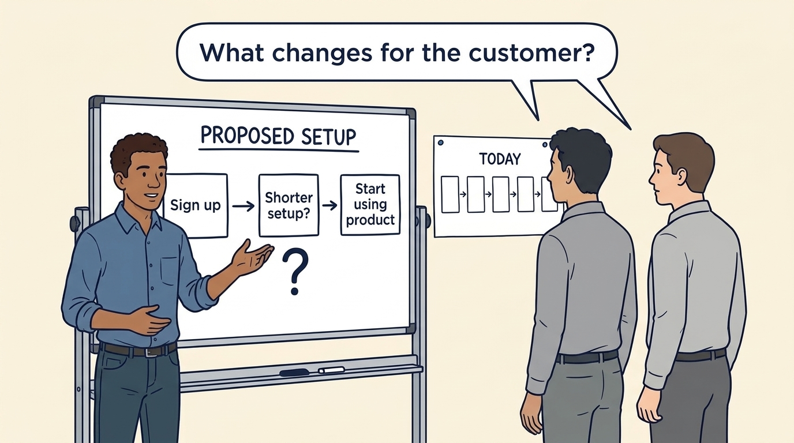
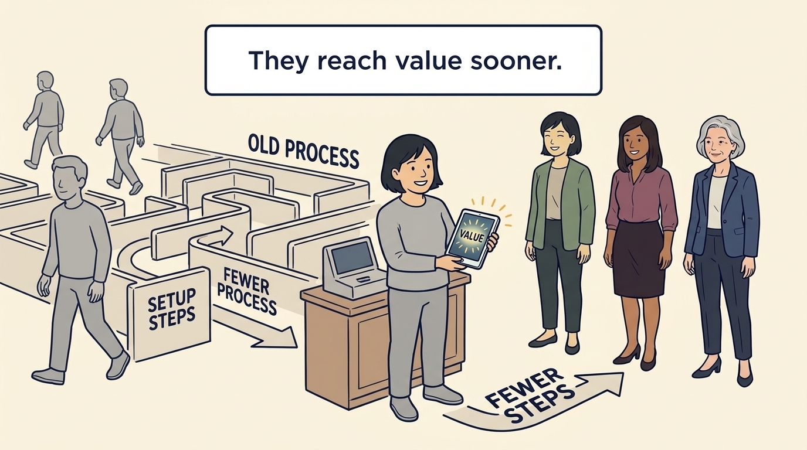
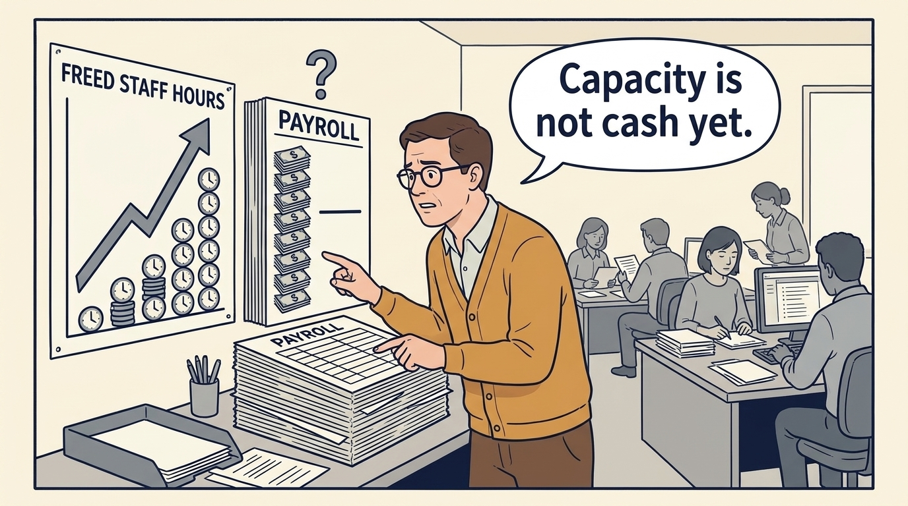
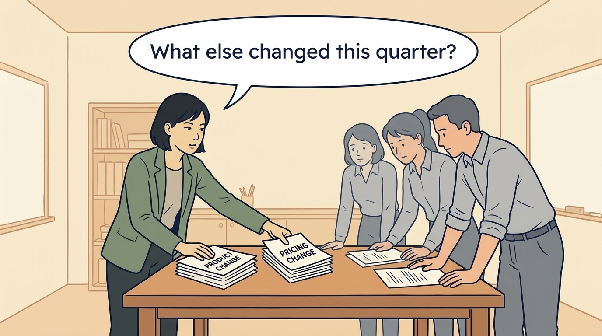
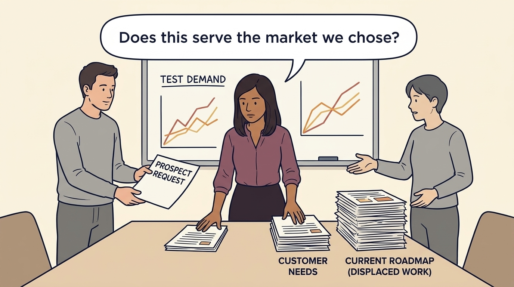

<!-- comic-style
{
  "cast": "MORGAN: a thoughtful investor technology adviser with short dark hair and a green jacket, used in the fund scenarios. ALEX: a practical CTO with curly hair and blue rolled-up sleeves. SAM: a CFO with round glasses and an amber cardigan. PRIYA: a product leader with straight dark hair and plum sleeves. INES: a CEO with short grey hair and a navy jacket. All are fictional; none represents a person in a real case.",
  "style": "Clean editorial explainer comic, dark ink outlines, restrained green, blue, and amber accents on warm white, generous space, readable short speech bubbles, expressive people and simple physical metaphors. No photorealism, logos, dense charts, or title text. Keep the same character appearances throughout the journal."
}
-->

**Comic.** A product leader normally has to show that a change is useful. An investor, who has put money into the company for a share of it, may expect more: that the change supports a target such as more sales, a larger share of sales kept as profit, or more customers staying. The panels follow one planned product change along the chain from work to result and test each link, because a proposal must demonstrate that chain, not assume it. They end on what a pilot, a limited trial with a first group of eight customers, showed at day 90.

Morgan is an investor’s adviser in the fund scenarios; Alex leads technology, Priya leads product, and Sam leads finance. The board is the group of directors who oversee the company’s major decisions. All are fictional. Comparative scenarios use separate assumptions. Historical cases are discussed through documents; the scenes do not reenact real events.

<!-- comic-panel
{
  "id": "01-scene",
  "status": "generated",
  "asset": "assets/images/08-roadmap-to-revenue/comic-01-scene.jpeg",
  "aspect_ratio": "16:9",
  "prompt": "Panel 1 of an explainer comic. Alex stands beside a whiteboard and presents a PROPOSED change to customer setup to two unnamed colleagues in grey. The whiteboard is headed with the exact words \"PROPOSED SETUP\" and shows three boxes joined by arrows, labelled exactly \"Sign up\", \"Shorter setup?\" and \"Start using product\", with one large question mark beside the middle box. A smaller sheet pinned next to it is headed exactly \"TODAY\" and shows a longer row of five plain unlabelled boxes; it is NOT crossed out. Nothing in the scene says or implies that setup is already faster: no words such as immediate, instant, quick, complete or done, no tablet, no progress bar, no tick marks, and no other lettering. Use one speech bubble with the exact words: \"What changes for the customer?\" Convey: Onboarding is the setup needed before a customer can use the product. The whiteboard shows a proposal, not a result: “Shorter setup?” is the question the trial has to answer. Start by asking what the change would make easier for the customer.",
  "alt": "Comic panel: Alex points to a whiteboard headed “Proposed setup”: Sign up, then “Shorter setup?” with a large question mark, then Start using product. A sheet headed “Today” shows a longer row of steps. Two colleagues ask what changes for the customer.",
  "caption": "Onboarding is the setup needed before a customer can use the product. The whiteboard shows a proposal, not a result: “Shorter setup?” is the question the trial has to answer. Start by asking what the change would make easier for the customer.",
  "generation": {
    "model": "gemini-3-pro-image-preview",
    "reference_id": "owned-cast-20260913",
    "sha256": "b6defe7bfb65e7f13bbfbb93491ffa0827910fcbc5cbf2f9e6fcc16465b16386"
  }
}
-->

**Panel 1:** Onboarding is the setup needed before a customer can use the product. The whiteboard shows a proposal, not a result: “Shorter setup?” is the question the trial has to answer. Start by asking what the change would make easier for the customer.

*Dialogue:* “What changes for the customer?”

<!-- comic-panel
{
  "id": "02-scene",
  "status": "generated",
  "asset": "assets/images/08-roadmap-to-revenue/comic-02-scene.jpeg",
  "aspect_ratio": "16:9",
  "prompt": "Panel 2 of an explainer comic. A customer reaches a usable product with fewer handoffs. Use one speech bubble with the exact words: \"Do customers reach value sooner?\" Convey: Fewer setup steps may help customers begin useful work sooner. That is an expectation to test, not a result. In the first group of eight trial customers, measured at day 90, the customers’ waiting time did not change.",
  "alt": "Comic panel: A customer holds a box labelled “Product”. Alex, holding a sheet of steps that ends in the word “Value”, asks whether customers reach value sooner. Priya stands beside him; other customers wait behind.",
  "caption": "Fewer setup steps may help customers begin useful work sooner. That is an expectation to test, not a result. In the first group of eight trial customers, measured at day 90, the customers’ waiting time did not change.",
  "generation": {
    "model": "gemini-3-pro-image-preview",
    "reference_id": "owned-cast-20260913",
    "sha256": "30575baaeedba4c0dce5d55cff987ff6296b8e72be0a1d3638c013256b24de5c"
  }
}
-->

**Panel 2:** Fewer setup steps may help customers begin useful work sooner. That is an expectation to test, not a result. In the first group of eight trial customers, measured at day 90, the customers’ waiting time did not change.

*Dialogue:* “Do customers reach value sooner?”

<!-- comic-panel
{
  "id": "03-scene",
  "status": "generated",
  "asset": "assets/images/08-roadmap-to-revenue/comic-03-scene.jpeg",
  "aspect_ratio": "16:9",
  "prompt": "Panel 3 of an explainer comic. Sam sees freed hours but unchanged payroll. Use one speech bubble with the exact words: \"Capacity is not cash yet.\" Convey: Freed staff time is capacity for other work. If payroll and other spending remain unchanged, it is not yet a cash saving.",
  "alt": "Comic panel: Sam sees freed hours but unchanged payroll.",
  "caption": "Freed staff time is capacity for other work. If payroll and other spending remain unchanged, it is not yet a cash saving.",
  "generation": {
    "model": "gemini-3-pro-image-preview",
    "reference_id": "owned-cast-20260913",
    "sha256": "6ec20263eaaedcd0fa7ffca1efe3afb819f31ee80d0889284d3e80e22e4c9f68"
  }
}
-->

**Panel 3:** Freed staff time is capacity for other work. If payroll and other spending remain unchanged, it is not yet a cash saving.

*Dialogue:* “Capacity is not cash yet.”

<!-- comic-panel
{
  "id": "04-scene",
  "status": "generated",
  "asset": "assets/images/08-roadmap-to-revenue/comic-04-scene.jpeg",
  "aspect_ratio": "16:9",
  "prompt": "Panel 4 of an explainer comic. Morgan separates product change from a pricing change. Use one speech bubble with the exact words: \"What else changed this quarter?\" Convey: To judge the effect, compare like groups and name the differences that remain: who chose the pilot customers, the same specialist serving both groups, a new price or a busier quarter.",
  "alt": "Comic panel: Morgan separates product change from a pricing change.",
  "caption": "To judge the effect, compare like groups and name the differences that remain: who chose the pilot customers, the same specialist serving both groups, a new price or a busier quarter.",
  "generation": {
    "model": "gemini-3-pro-image-preview",
    "reference_id": "owned-cast-20260913",
    "sha256": "43b5f92f4464a67b9c4de32bb084d886ba3a9ccf7dcf552d6130c444d443426c"
  }
}
-->

**Panel 4:** To judge the effect, compare like groups and name the differences that remain: who chose the pilot customers, the same specialist serving both groups, a new price or a busier quarter.

*Dialogue:* “What else changed this quarter?”

<!-- comic-panel
{
  "id": "05-scene",
  "status": "generated",
  "asset": "assets/images/08-roadmap-to-revenue/comic-05-scene.jpeg",
  "aspect_ratio": "16:9",
  "prompt": "Panel 5 of an explainer comic. Alex adds implementation and ongoing costs to the proposal. Use one speech bubble with the exact words: \"Count the whole intervention.\" Convey: “The whole intervention” means the whole change: building it, introducing it and keeping it running. Count all of that cost before claiming a benefit. The company has agreed to spend €180,000 on the build. About €90,000 of that work had been received by day 100, which is not the same as cash paid. Upkeep adds €30,000 a year from the company’s next accounting year. Then say what the freed staff time was actually used for.",
  "alt": "Comic panel: Alex and two colleagues work through a proposal whose last lines read “Total cost of intervention: build, introduce, maintain”. Folders labelled “Estimates”, “Budget” and “Historical cases” lie on the table. The speech bubble says to count the whole intervention.",
  "caption": "“The whole intervention” means the whole change: building it, introducing it and keeping it running. Count all of that cost before claiming a benefit. The company has agreed to spend €180,000 on the build. About €90,000 of that work had been received by day 100, which is not the same as cash paid. Upkeep adds €30,000 a year from the company’s next accounting year. Then say what the freed staff time was actually used for.",
  "generation": {
    "model": "gemini-3-pro-image-preview",
    "reference_id": "owned-cast-20260913",
    "sha256": "c740fb8c3803b849c5910ff3234a1c11a70494dad70b8ce9a575abbd2b65ef46"
  }
}
-->

**Panel 5:** “The whole intervention” means the whole change: building it, introducing it and keeping it running. Count all of that cost before claiming a benefit. The company has agreed to spend €180,000 on the build. About €90,000 of that work had been received by day 100, which is not the same as cash paid. Upkeep adds €30,000 a year from the company’s next accounting year. Then say what the freed staff time was actually used for.

*Dialogue:* “Count the whole intervention.”

<!-- comic-panel
{
  "id": "06-scene",
  "status": "generated",
  "asset": "assets/images/08-roadmap-to-revenue/comic-06-scene.jpeg",
  "aspect_ratio": "16:9",
  "prompt": "Panel 6 of an explainer comic. Priya and Sam at the day-100 board review: a simple board shows hours per setup falling from 80 to 62, beside a customer queue that is still the same length. Use one speech bubble with the exact words: \"We saved hours; we have not yet served more customers.\" Convey: In the trial comparison each setup took 18 fewer staff hours, although the comparison cannot prove that the new step alone was the cause. Customers still waited for their own data to be ready, so the queue did not move. The board funds one €40,000 step to check and correct customer data, from money held back for later decisions, and keeps hiring and expansion deferred. If the next group of customers does not average 50 hours or less with a shorter wait, the board approves no further stage. Payments already agreed are handled separately.",
  "alt": "Comic panel: Priya and Sam at the day-100 review, hours down from 80 to 62 beside an unchanged customer queue.",
  "caption": "In the trial comparison each setup took 18 fewer staff hours, although the comparison cannot prove that the new step alone was the cause. Customers still waited for their own data to be ready, so the queue did not move. The board funds one €40,000 step to check and correct customer data, from money held back for later decisions, and keeps hiring and expansion deferred. If the next group of customers does not average 50 hours or less with a shorter wait, the board approves no further stage. Payments already agreed are handled separately.",
  "generation": {
    "model": "gemini-3-pro-image-preview",
    "reference_id": "owned-cast-20260913",
    "sha256": "0848b1e082661a0cedc5f82d04d58ece05f044f56af3cd8a48cf2ad09fe5af8b"
  }
}
-->

**Panel 6:** In the trial comparison each setup took 18 fewer staff hours, although the comparison cannot prove that the new step alone was the cause. Customers still waited for their own data to be ready, so the queue did not move. The board funds one €40,000 step to check and correct customer data, from money held back for later decisions, and keeps hiring and expansion deferred. If the next group of customers does not average 50 hours or less with a shorter wait, the board approves no further stage. Payments already agreed are handled separately.

*Dialogue:* “We saved hours; we have not yet served more customers.”
