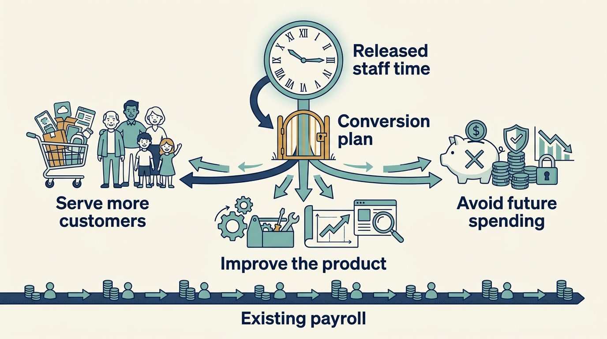
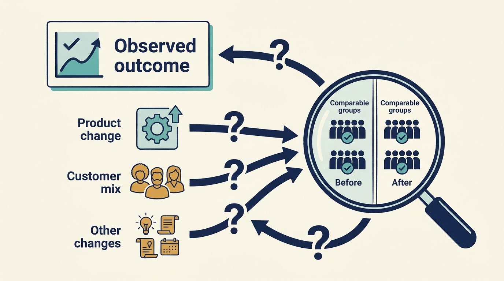

> **KEY POINTS:**
>
> * Explain **what the change enables**. A feature, a more reliable service or a simpler process needs a connection to useful customer or business outcomes.
> * Distinguish **freed time from money saved**. If the same people are still paid, less effort may create capacity for other work without reducing spending.
> * Check the **full chain of results**. Include implementation cost, continuing maintenance and other changes that could explain the outcome.

 
A product team proposes making customer setup faster. That sounds useful, but what is the benefit? Customers might start using the product sooner. Staff might serve more customers. The company might collect payment earlier. Each possibility needs a different piece of evidence.

A **product roadmap** sets out intended product changes and priorities. A roadmap item describes work; its business case explains the useful result expected from it. This chapter follows one item from the proposed change to its possible financial effect.

A product leader normally has to show that a change is useful. Under investors, the change also has to reach a financial result the investment case depends on: revenue growth, margin or retention within the period before the next review or a sale. The chain from work to that result is the part investors and their advisers will examine, and the part most often asserted rather than shown.

The example uses Larkspur, a fictional company selling scheduling software. **Onboarding** is the setup and help a customer needs before using that software successfully. The **value mechanism** is the sequence by which a change to onboarding produces a benefit.

[[cannot-fund-everything]] compared competing uses of money and team capacity. Here we look more closely at one selected product change: how could the work produce a useful customer and business result? Later chapters apply the same reasoning to engineering, costs, security, artificial intelligence and people.

## Follow the Steps From Change to Outcome

An **investment thesis** explains why the owner expects the investment to succeed, and so identifies which result matters most. A thesis built on expansion needs evidence the product can win and serve more customers at acceptable cost; one built on established earnings needs evidence those earnings survive maintenance and reinvestment ([[valuation-is-an-estimate]]). Both depend on a product that works.

Consider the fictional Larkspur onboarding initiative. New customers need substantial engineering help before they can use the scheduling product. **Reusable configuration** means settings and setup steps that can serve several customers, reducing the custom work each time. The hypothesis is that reusable configuration will shorten implementation, reduce effort and let more customers become productive.

The proposed chain is:

---begin mermaid---
flowchart LR
  A[Reusable configuration] --> B[Less implementation effort]
  B --> C[More customers ready to use the product]
  C --> D[Earlier billing and useful product use]
  D --> E[Sales, customers staying, and cash]
  A --> F[Development and maintenance cost]
  F --> E
---end mermaid---

Each arrow is a hypothesis. Faster implementation may not increase sales if demand is weak. Earlier billing may not keep customers who don't receive value. Reduced effort may free staff capacity without reducing cash spending. A configuration feature may create maintenance obligations that absorb part of the benefit.

**Read each arrow as a question to test**. If engineering effort falls but customer activation stays unchanged, find out what else is keeping customers waiting.

## Six Kinds of Benefit to Examine

Three terms help distinguish the benefits. **Retention** means keeping customers or their revenue over a stated period. **Margin** is a specified profit measure divided by revenue. **Contribution** is revenue from an activity less the costs included in serving it; say which costs are included, because this isn't necessarily the company’s final profit.

| Mechanism | Example intervention | Evidence to seek |
| --- | --- | --- |
| Revenue growth | Remove a product constraint in an attractive segment | Potential customers the change can help, actual purchases, usage and additional contribution |
| Retention | Improve a workflow associated with customer failure | Renewals in comparable customer groups, reasons for leaving and useful customer outcomes |
| Margin | Reduce manual implementation or service effort | Effort per unit, quality, fully loaded delivery costs |
| Cash generation | Shorten contract-to-activation and collection | When invoices can be issued, unpaid invoices and actual cash received |
| Risk reduction | Improve recoverability of a critical service | Tested controls, exposure scenarios, recovery performance |
| Strategic flexibility | Separate a product boundary needed for expansion | New choices made possible, the cost of using them and the time required |

These mechanisms overlap, but **their financial effects should not simply be added**. Earlier billing can accelerate cash without increasing lifetime contract revenue. A retained customer may already be in a revenue forecast. An acquisition benefit can appear both in cost savings and in the acquired company's earnings measure unless reconciled.

## The Arithmetic, Worked Through

For this **separate, smaller pilot example**, assume Larkspur performs 100 customer implementations a year. We are testing the benefit of one reusable setup step, not costing the entire €1 million program discussed earlier. Each implementation uses 80 hours of work at a **fully loaded planning cost** of €75 per hour, including pay and the employment overheads in this model: €600,000 of annual capacity. An intervention reduces effort to 50 hours, making the modelled capacity requirement €375,000. The difference is €225,000, or 3,000 hours.

That is a capacity estimate. If staffing and external invoices stay unchanged, cash hasn't fallen by €225,000. The company could use the capacity to serve more customers, reduce overtime, improve quality or eventually avoid hiring. Each outcome has a different economic interpretation.

Suppose this pilot costs €180,000 to build and €30,000 a year to maintain. Reporting €225,000 of recurring profit without showing those costs, and whether the capacity was converted into an economic result, would mislead. So would dismissing the work because payroll didn't immediately fall. Serving additional profitable demand can be the more valuable use of the freed capacity.

A usable proposal therefore includes a **conversion plan**: how the released capacity will produce a customer or business benefit. Priya checks whether customers are waiting who can use the improved setup. Alex establishes which work the 3,000 hours could actually support. Sam tests when additional receipts or avoided supplier payments would reach the cash forecast.

**Figure 1:** *Time saved becomes useful capacity through a plan; it does not automatically reduce the payroll bill.*

## An Investor Introduction Is a Lead, Not a Product Strategy

In a fictional venture-funded Larkspur, an investor introduces three potential customers. Priya uses the conversations to test the same unmet need and willingness to pay she would examine with any other prospect. Building three unrelated demonstrations could impress the investor while producing little evidence of a repeatable product.

Under a growth plan, she asks whether onboarding and support can serve the next group of customers with comparable quality and effort. Under a corporate investment, she also separates demand from the investor’s own group from demand in the wider market. An exclusive integration may be worthwhile, but its return must include the customers and partnerships the company gives up.

The leadership decision is which opportunity belongs on the roadmap. Document the customer group, expected behavior, evidence still missing and maximum commitment before reviewing it. If an investor wants a different priority, **make the displaced work** and the proposed commercial benefit explicit. Access to an owner’s network can improve learning; it doesn't substitute for it.

## Test Whether the Product Serves a Useful Need

A company can efficiently build features customers don't need. It can reduce infrastructure cost for a product whose market is shrinking. It can improve delivery speed while commercial teams promise incompatible custom work. Product strategy decides where capability should be applied.

Begin with the customers and segments the company intends to serve. What progress are they paying for? Why do they choose this product? Which needs remain poorly served? Which requests look attractive individually but undermine a repeatable product?

Under ownership pressure, product management can become an intake process for investor, sales and acquisition requests. The remedy isn't to reject those voices but to apply a consistent economic and customer test. A requested feature should carry a hypothesis about demand and contribution, not just the name of the executive who asked for it.

**DORA**, a research program studying software delivery and organizational performance, emphasizes user focus and stable priorities in its 2024 account of software performance. Its survey-based relationships give useful direction, but they don't establish the monetary value of a specific company's roadmap. [S15: DORA 2024 report](https://dora.dev/research/2024/dora-report/)

## Check Whether the Change Explains the Result

A **baseline** records the starting situation used for comparison. Establish it before implementation when you can. Define which customers are included, the time period, exclusions and how costs are calculated. A **cohort** is a defined group tracked over time, such as customers starting in the same quarter. Keep raw counts alongside percentages. Overall retention can rise because the company has more customers from a segment that already renews reliably, even if retention within each segment is unchanged. Compare like groups so a change in customer mix isn't mistaken for a product improvement.

Where practical, compare a staged rollout with a comparable group. If that isn't possible, document the timing and competing explanations: price changes, new sales incentives, acquisitions, seasonality or a different customer mix. Use interviews to explain mechanisms, but don't treat an enthusiastic testimonial as a financial calculation.

A claim can be useful without proving sole causation. “The intervention plausibly contributed to lower onboarding effort, with these measurements and limitations” is stronger than an unsupported precise attribution. **Attribution** means assigning a result to its cause; **contribution** here means a qualified claim that the change helped, a different use of the word from the financial measure above. A **counterfactual** is an estimate of what would have happened without the change. Finance can check the calculation, but it can't supply a missing comparison by reviewing the numbers.

Visma provides a useful reality check in [[visma]]. Its disclosures describe product investment alongside acquisitions and growth. [S32: Visma annual-report announcement](https://www.visma.com/newsroom/visma-releases-annual-and-sustainability-reports-for-2024-7f5c9f37) That is evidence of activity and aggregate performance; the incremental product-value question still needs customer and intervention-level evidence. Treat an encouraging company story as the beginning of that investigation.

**Figure 2:** *An observed improvement needs a comparison that can reveal other explanations.*

## Protect the Product You Have Not Built Yet

A margin improvement that depends on postponing necessary maintenance carries a future bill. A retention result that relies on customers being unable to leave can be fragile. A faster release process that degrades reliability transfers costs to users and support teams.

For each major intervention, choose a few indicators that could reveal damage. For onboarding, these might include early customer abandonment, error rates, support demand and time to the customer's first useful outcome. The indicators should follow the mechanism, not a universal template.

Product and engineering leaders should keep the whole chain understandable to investors and teams: why the technical dependency matters, what changes for customers and how that can affect the business. An investor’s adviser can help test and communicate the reasoning. The evidence should support changing or stopping the initiative when its customer or economic hypothesis no longer holds.

For each proposal, explain the change, the capability it enables, the result expected and the cost of achieving it. Then identify the evidence needed at each step. Useful benefits include service continuity and reduced exposure to harm as well as growth and savings.

The next question is what the underlying software and engineering team must be able to do to deliver that change. We examine it in [[can-the-team-deliver]].

## Questions to Consider

1. *For your most important roadmap item, can you draw the chain from the change to the business result, with each arrow stated as a hypothesis you could test?*
2. *Which of the six benefit mechanisms does your proposal claim: revenue, retention, margin, cash, risk reduction or flexibility? Are overlapping benefits being added together?*
3. *When your team saves effort, what is the conversion plan? Will the freed capacity serve more customers, avoid hiring, improve quality or quietly disappear?*
4. *Do you have a baseline, a cohort definition and a list of competing explanations for the last improvement you reported?*
5. *Which requests on your roadmap arrived with a hypothesis about demand and contribution, and which arrived only with the name of the person who asked?*
6. *What indicators would reveal that a current initiative is producing its result by shifting cost to customers, support teams or the future?*

## To Probe Further

- **[Escaping the Build Trap](https://melissaperri.com/book)** — Melissa Perri, O'Reilly, 2018. *A case for judging product work by outcomes rather than shipped features, which is the chain this chapter asks you to draw for one roadmap item.*
- **[Product vs Feature Teams](https://www.svpg.com/product-vs-feature-teams/)** — Marty Cagan, Silicon Valley Product Group, 2019. *Names the failure mode this chapter warns about, where product management becomes an intake process for whoever asks loudest instead of a team handed outcomes.*
- **[Impact Mapping: Making a Big Impact with Software Products and Projects](https://www.impactmapping.org/book.html)** — Gojko Adzic, 2012. *A drawing technique for the goal-to-deliverable chain that gives you a practical way to write down the arrows in this chapter's onboarding example before work starts.*
- **[Trustworthy Online Controlled Experiments: A Practical Guide to A/B Testing](https://www.cambridge.org/core/books/trustworthy-online-controlled-experiments/D97B26382EB0EB2DC2019A7A7B518F59)** — Ron Kohavi, Diane Tang and Ya Xu, Cambridge University Press, 2020. *The fullest treatment of the staged rollout with a comparable group this chapter recommends, written at very large scale, so scale the methods down rather than copying them.*
- **[The Magenta Book](https://www.gov.uk/government/publications/the-magenta-book)** — HM Treasury, 2020 edition with later updates. *Annex A works through the counterfactual methods, such as difference-in-differences, that let you judge whether a change caused a result when a controlled comparison is not possible.*
