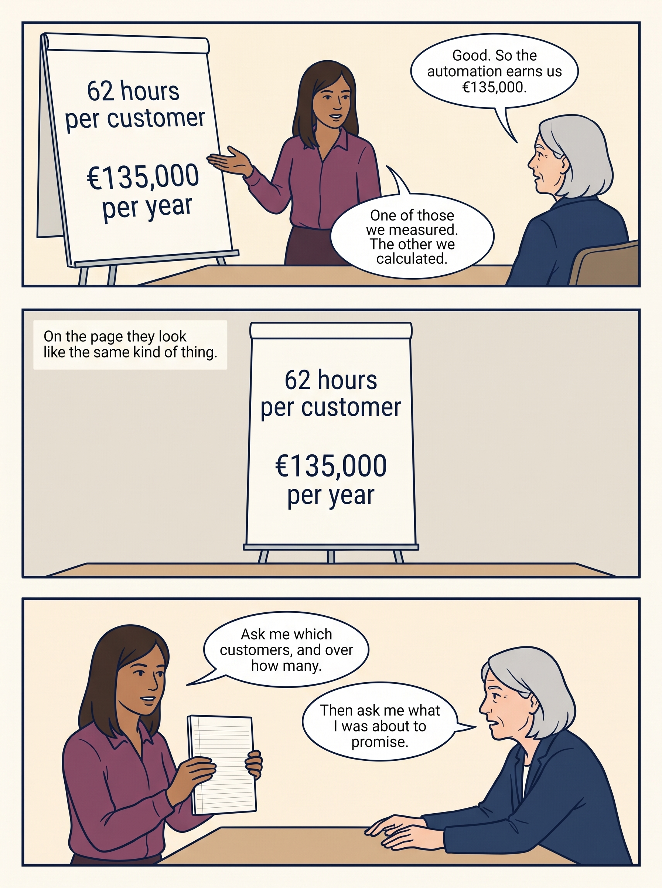
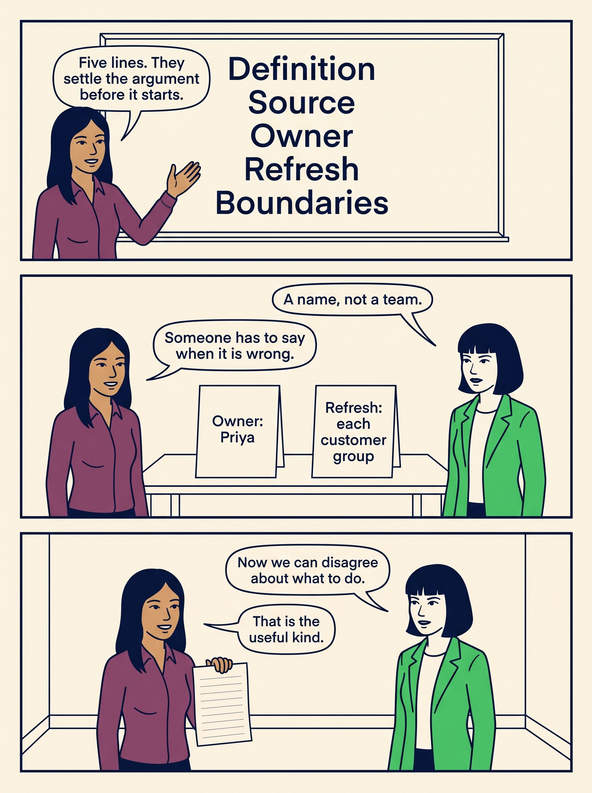

<!-- comic-style
{
  "cast": "MORGAN: a thoughtful investor technology adviser with short dark hair and a green jacket, used in the fund scenarios. ALEX: a practical CTO, a brown-skinned man with short, tight dark curls close to his head and blue rolled-up sleeves. SAM: a CFO, a man with short brown hair, round glasses and an amber cardigan. PRIYA: a product leader with straight dark hair and plum sleeves. INES: a CEO with short grey hair and a navy jacket. All are fictional; none represents a person in a real case.",
  "style": "Clean editorial explainer comic pages, each one image of three stacked full-width strips: navy ink outlines, restrained green, blue and amber accents on warm ivory, generous space, expressive people and simple physical props. Dialogue, short labels and the supplied amounts are lettered in the artwork, exactly as scripted. Money bags, coins and banknotes are plain and undecorated; the euro sign appears only inside supplied text, and arrows, documents and screens carry plain lines, never lettering. No photorealism, logos, titles or unsupplied text. Keep the same character appearances throughout the journal.",
  "reference": "_research/comic-cast-20260913.jpeg",
  "identity": {
    "Morgan": "MORGAN is a light-skinned WOMAN with a short, straight, JET-BLACK bob cut level with her jaw and a straight fringe across her forehead (never brown hair, never a side parting), and a bright green jacket over a white top, first person in the reference; her face must match the reference sheet exactly.",
    "Alex": "ALEX is a medium-brown-skinned MAN with a masculine face, broad shoulders and a straight masculine build, SHORT tight dark curls close to his head (not a large afro), a blue rolled-sleeve shirt and blue jeans, second person in the reference; fill his face, neck and hands with the same brown skin color in every strip.",
    "Sam": "SAM is a light-skinned MAN with a masculine face and SHORT brown hair cropped above his ears (never a bob, never chin-length hair, never a woman), round glasses and an amber cardigan over a white shirt, third person in the reference.",
    "Priya": "PRIYA is a brown-skinned WOMAN with straight shoulder-length dark hair and a plum blouse, fourth person in the reference.",
    "Ines": "INES is a light-skinned OLDER WOMAN with a short GREY bob (grey hair, never dark) and a navy jacket, fifth person in the reference."
  },
  "short": {
    "Morgan": "a light-skinned woman with a jet-black jaw-length bob and fringe, in a bright green jacket",
    "Alex": "a brown-skinned man with short tight dark curls, in a blue rolled-sleeve shirt",
    "Sam": "a light-skinned man with short brown hair and round glasses, in an amber cardigan over a collared white shirt",
    "Priya": "a brown-skinned woman with straight shoulder-length dark hair, in a plum blouse",
    "Ines": "an older light-skinned woman with a short grey bob, in a navy jacket"
  }
}
-->

**Comic.** Six pages follow one number through a board meeting — the meeting of the directors who oversee the company. Larkspur, a fictional software company, has been automating part of **onboarding**, the setup work before a new customer can use its product. The eight customers set up during the pilot averaged 62 hours each, against about 80 hours for the customers set up before it. Someone asks what that is worth, and the papers say €135,000 a year. Both figures are correct; together they mislead, because one is a measured result and the other is arithmetic about a future that has not happened.

Ines is Larkspur's chief executive, Sam runs its finances, Priya leads product, and Morgan is the investor's technology adviser. All are fictional, and so is every figure. The comic ends with the small record that keeps the two kinds of number apart.

<!-- comic-page
{
  "id": "01-the-same-typeface",
  "title": "Printed the same, meaning different things",
  "asset": "assets/images/08a-data-foundations-for-alignment/comic-page-01-the-same-typeface.jpeg",
  "aspect_ratio": "3:4",
  "cast": [
    "Ines",
    "Priya"
  ],
  "strips": [
    {
      "scene": "A board table seen from the side. One large sheet stands upright on a stand, facing the reader, carrying exactly two lines of large lettering one above the other, in identical plain lettering and identical size. Priya stands at the left of the stand, clear of the sheet, with an open hand raised toward it. Ines sits at the right. No head, hand or bubble covers the lettering.",
      "labels": [
        "62 hours per customer",
        "€135,000 per year"
      ],
      "label_notes": "The two labels are the only lettering on the standing sheet, one above the other, in the same size and style, facing the reader.",
      "bubbles": [
        {
          "who": "Ines",
          "text": "Good. So the automation earns us €135,000."
        },
        {
          "who": "Priya",
          "text": "One of those we measured. The other we calculated."
        }
      ]
    },
    {
      "scene": "The same standing sheet, unchanged and drawn identically, now alone on a bare table against a plain wall. These are the only things in the strip. No people.",
      "labels": [
        "62 hours per customer",
        "€135,000 per year"
      ],
      "label_notes": "The same two labels, drawn identically to the strip above, the only lettering in the strip.",
      "narration": "On the page they look like the same kind of thing."
    },
    {
      "scene": "Priya stands at the left holding up a plain notebook so that its face turns toward the reader, with only ruled lines and no lettering on it. Ines sits at the right, leaning forward with a questioning expression. A bare table separates them and nothing else is on it.",
      "bubbles": [
        {
          "who": "Priya",
          "text": "Ask me which customers, and over how many."
        },
        {
          "who": "Ines",
          "text": "Then ask me what I was about to promise."
        }
      ]
    }
  ],
  "alt": "Comic page in three strips: a board sheet shows 62 hours per customer and €135,000 per year in identical lettering; the sheet alone on a table; Priya and Ines agreeing to question both figures.",
  "caption": "Larkspur's board papers carry a measured result and a projection in the same lettering. Onboarding is the setup work before a new customer can use the product.",
  "status": "generated",
  "generation": {
    "model": "gemini-3-pro-image-preview",
    "reference": "_research/comic-cast-20260913.jpeg",
    "sha256": "7057760e6173437c7fc9069ae90c78f7e054c06bcfe9ddff99b7fef5c8603a64"
  }
}
-->

**Page 1: Printed the same, meaning different things.** Larkspur's board papers carry a measured result and a projection in the same lettering. Onboarding is the setup work before a new customer can use the product.

- *Strip 1.* **Ines:** “Good. So the automation earns us €135,000.” **Priya:** “One of those we measured. The other we calculated.”
- *Strip 2.* *Narration:* On the page they look like the same kind of thing.
- *Strip 3.* **Priya:** “Ask me which customers, and over how many.” **Ines:** “Then ask me what I was about to promise.”

<!-- comic-page
{
  "id": "02-what-was-measured",
  "title": "What was actually measured",
  "asset": "assets/images/08a-data-foundations-for-alignment/comic-page-02-what-was-measured.jpeg",
  "aspect_ratio": "3:4",
  "cast": [
    "Priya",
    "Morgan"
  ],
  "strips": [
    {
      "scene": "A wide table with exactly eight identical plain cards laid side by side in one row with clear gaps between them, each card blank except for a numeral on its face; the numerals read 1 to 8 from left to right. Priya stands behind the table at the left, gesturing with an open hand from the side. Morgan stands behind the table at the right. Nothing else is on the table.",
      "labels": [
        "8 customers",
        "496 hours measured"
      ],
      "label_notes": "Two printed cards stand upright behind the row, facing the reader, clear of the eight numbered cards and of both people.",
      "bubbles": [
        {
          "who": "Morgan",
          "text": "Where does the 62 hours come from?"
        },
        {
          "who": "Priya",
          "text": "Eight customers. Four hundred and ninety-six hours of real work."
        }
      ]
    },
    {
      "scene": "A plain whiteboard hangs high on a wall above everyone's heads, carrying three large lines of lettering one under another. Priya stands well to the left of it with an open hand raised from the side. Morgan stands at the right. No head, hand, marker or bubble covers the lettering.",
      "labels": [
        "496 hours",
        "8 customers",
        "62 hours on average"
      ],
      "label_notes": "The three labels are the only lettering on the whiteboard, on three separate lines, large and clear.",
      "bubbles": [
        {
          "who": "Priya",
          "text": "The arithmetic is on the board. You can check it."
        }
      ]
    },
    {
      "scene": "Morgan stands at the left holding up one plain sheet so that its face turns toward the reader, bearing only ruled lines. Priya stands at the right. A bare floor and a plain wall are behind them, with nothing else in the strip.",
      "bubbles": [
        {
          "who": "Morgan",
          "text": "One group, fewer hours. That is a difference, not a trend."
        },
        {
          "who": "Priya",
          "text": "Agreed. Sales chose those eight, and the papers say so."
        }
      ]
    }
  ],
  "alt": "Comic page in three strips: eight numbered customer cards in a row labelled 8 customers and 496 hours measured; a whiteboard showing 496 hours over 8 customers is 62 hours on average; Morgan noting that one group with fewer hours is a difference, not a trend.",
  "caption": "The measured figure is traceable: 496 hours across eight customers, an average of 62 against about 80 before. One group averaging fewer hours is an observed difference, not a trend, and sales chose which customers went first, so the papers say so.",
  "status": "generated",
  "generation": {
    "model": "gemini-3-pro-image-preview",
    "reference": "_research/comic-cast-20260913.jpeg",
    "sha256": "290404e0f36935cc0bec2532e646e24080ade7eecd43326a819fe57134f0a634"
  }
}
-->

**Page 2: What was actually measured.** The measured figure is traceable: 496 hours across eight customers, an average of 62 against about 80 before. One group averaging fewer hours is an observed difference, not a trend, and sales chose which customers went first, so the papers say so.

- *Strip 1.* **Morgan:** “Where does the 62 hours come from?” **Priya:** “Eight customers. Four hundred and ninety-six hours of real work.”
- *Strip 2.* **Priya:** “The arithmetic is on the board. You can check it.”
- *Strip 3.* **Morgan:** “One group, fewer hours. That is a difference, not a trend.” **Priya:** “Agreed. Sales chose those eight, and the papers say so.”

<!-- comic-page
{
  "id": "03-what-was-calculated",
  "title": "What was calculated",
  "asset": "assets/images/08a-data-foundations-for-alignment/comic-page-03-what-was-calculated.jpeg",
  "aspect_ratio": "3:4",
  "cast": [
    "Sam",
    "Priya"
  ],
  "strips": [
    {
      "scene": "A plain whiteboard hangs high on a wall above everyone's heads, carrying one large line of lettering across it. Sam stands well to the left, gesturing with an open hand from the side. Priya stands at the right. No head, hand, marker or bubble covers the lettering.",
      "labels": [
        "100 x 18h x €75",
        "= €135,000"
      ],
      "label_notes": "The two labels are the only lettering on the whiteboard, written large on two lines, the sum on the first line and the result on the second.",
      "bubbles": [
        {
          "who": "Sam",
          "text": "That is the €135,000. We chose two numbers and assumed the third holds."
        }
      ]
    },
    {
      "scene": "A bare table against a plain wall holds exactly four identical plain upright cards standing side by side in one row with clear gaps between them, each carrying one short line of lettering facing the reader. These cards are the only things on the table. Priya stands to the left of the table, clear of all four cards, with an open hand raised from the side.",
      "labels": [
        "18 fewer hours: measured",
        "100 a year: assumed",
        "€75 an hour: assumed",
        "Same 18 next year: assumed"
      ],
      "label_notes": "One label per card, left to right in the order given, the only lettering in the strip.",
      "bubbles": [
        {
          "who": "Priya",
          "text": "One measurement, carried by three assumptions."
        }
      ]
    },
    {
      "scene": "Sam stands at the left with both hands open and empty, palms up. Priya stands at the right. Between them, on a bare floor against a plain wall, stands one plain closed cashbox with no lettering on it and nothing else in the strip.",
      "bubbles": [
        {
          "who": "Sam",
          "text": "So is the money in the box?"
        },
        {
          "who": "Priya",
          "text": "No. It is time staff would stop spending, if the 18 holds."
        }
      ]
    }
  ],
  "alt": "Comic page in three strips: a whiteboard showing 100 times 18 hours times €75 equals €135,000; four cards reading 18 fewer hours measured, 100 a year assumed, €75 an hour assumed, and same 18 next year assumed; Sam and Priya at an empty cashbox agreeing the money is not there.",
  "caption": "The projection multiplies the measured 18-hour reduction by an assumed 100 setups a year and an assumed €75 an hour, the planning cost of staff time — and assumes the 18-hour difference seen in eight customers will hold for the next hundred. Freed hours are projected capacity, if that difference holds, not money already in the account.",
  "status": "generated",
  "generation": {
    "model": "gemini-3-pro-image-preview",
    "reference": "_research/comic-cast-20260913.jpeg",
    "sha256": "2969c4617a5e2bd434d0e9e3048a7d5bacf359faad6467395bd7bf51e2606f15"
  }
}
-->

**Page 3: What was calculated.** The projection multiplies the measured 18-hour reduction by an assumed 100 setups a year and an assumed €75 an hour, the planning cost of staff time — and assumes the 18-hour difference seen in eight customers will hold for the next hundred. Freed hours are projected capacity, if that difference holds, not money already in the account.

- *Strip 1.* **Sam:** “That is the €135,000. We chose two numbers and assumed the third holds.”
- *Strip 2.* **Priya:** “One measurement, carried by three assumptions.”
- *Strip 3.* **Sam:** “So is the money in the box?” **Priya:** “No. It is time staff would stop spending, if the 18 holds.”

<!-- comic-page
{
  "id": "04-capacity-becomes-cash",
  "title": "When capacity becomes cash",
  "asset": "assets/images/08a-data-foundations-for-alignment/comic-page-04-capacity-becomes-cash.jpeg",
  "aspect_ratio": "3:4",
  "cast": [
    "Sam",
    "Ines"
  ],
  "strips": [
    {
      "scene": "A bare table against a plain wall holds exactly three identical plain upright cards standing side by side with clear gaps between them, each carrying one short line of lettering facing the reader. Sam stands to the left of the table, clear of all three cards, with an open hand raised from the side. Ines stands at the right.",
      "labels": [
        "A payment avoided",
        "Planned salaries never paid",
        "Extra receipts above costs"
      ],
      "label_notes": "One label per card, left to right in the order given, the only lettering in the strip.",
      "bubbles": [
        {
          "who": "Sam",
          "text": "Cash improves only when a payment is avoided or extra receipts exceed costs."
        },
        {
          "who": "Ines",
          "text": "Our contract specialist runs to month twelve. Nothing to cancel yet."
        }
      ]
    },
    {
      "scene": "Ines stands at the left holding up one plain sheet so that its face turns upright toward the reader, bearing only ruled lines and no lettering. Sam stands at the right with his hands at his sides. A bare floor and a plain wall are behind them; nothing else is in the strip.",
      "bubbles": [
        {
          "who": "Ines",
          "text": "I nearly committed that €135,000 to the hiring plan."
        },
        {
          "who": "Sam",
          "text": "Which is why finance leaves it out of the loan repayments."
        }
      ]
    },
    {
      "scene": "A plain whiteboard hangs high on a wall above everyone's heads, carrying two large lines of lettering one under the other. Ines stands well to the left of it, clear of the lettering. Sam stands at the right. No head, hand, marker or bubble covers the lettering.",
      "labels": [
        "Measured: 62 hours",
        "Projected: €135,000"
      ],
      "label_notes": "The two labels are the only lettering on the whiteboard, on two separate lines, large and clear.",
      "narration": "One word in front of each number would have prevented it."
    }
  ],
  "alt": "Comic page in three strips: three cards reading A payment avoided, Planned salaries never paid, and Extra receipts above costs, the two ways freed time becomes cash, an outgoing payment avoided or extra incoming receipts above their costs, each counting only on the date it falls, with Ines noting the contract specialist runs to month twelve; Ines admitting she nearly committed the projection to the hiring plan; a whiteboard separating a measured figure from a projected one.",
  "caption": "Freed staff time becomes money in two ways: on the date an outgoing payment is actually avoided — a contract not extended, the salaries of a planned hire never paid — or when extra customers pay in more than serving them costs. Deciding not to hire changes nothing in the bank that day. Larkspur's contract specialist runs to month twelve, so nothing could be cancelled by day 100. Labelling each figure as measured or projected is what prevents the mistake.",
  "status": "generated",
  "generation": {
    "model": "gemini-3-pro-image-preview",
    "reference": "_research/comic-cast-20260913.jpeg",
    "sha256": "a1fae48bddb495646a3bb49d17639822f7ac6ef9b4c0baf4f2b1628ba964468a"
  }
}
-->

**Page 4: When capacity becomes cash.** Freed staff time becomes money in two ways: on the date an outgoing payment is actually avoided — a contract not extended, the salaries of a planned hire never paid — or when extra customers pay in more than serving them costs. Deciding not to hire changes nothing in the bank that day. Larkspur's contract specialist runs to month twelve, so nothing could be cancelled by day 100. Labelling each figure as measured or projected is what prevents the mistake.

- *Strip 1.* **Sam:** “Cash improves only when a payment is avoided or extra receipts exceed costs.” **Ines:** “Our contract specialist runs to month twelve. Nothing to cancel yet.”
- *Strip 2.* **Ines:** “I nearly committed that €135,000 to the hiring plan.” **Sam:** “Which is why finance leaves it out of the loan repayments.”
- *Strip 3.* *Narration:* One word in front of each number would have prevented it.

<!-- comic-page
{
  "id": "05-agree-the-thresholds-first",
  "title": "Agree the thresholds first",
  "asset": "assets/images/08a-data-foundations-for-alignment/comic-page-05-agree-the-thresholds-first.jpeg",
  "aspect_ratio": "3:4",
  "cast": [
    "Morgan",
    "Priya",
    "Ines"
  ],
  "strips": [
    {
      "scene": "A plain whiteboard hangs high on a wall above everyone's heads, carrying three large lines of lettering one under another. Three people stand well below it in this left-to-right order: first Morgan, then Priya, then Ines, all clear of the lettering with their hands at their sides. No head, hand, marker or bubble covers the lettering.",
      "labels": [
        "Under 60: may request more",
        "60 to 70: data step",
        "Over 70: reopen plan"
      ],
      "label_notes": "One label per line on the whiteboard, top to bottom in the order given, the only lettering in the strip.",
      "bubbles": [
        {
          "who": "Morgan",
          "text": "We agreed these before anyone measured anything."
        }
      ]
    },
    {
      "scene": "A bare table against a plain wall holds one plain upright card standing alone, carrying one short line of lettering facing the reader. It is the only thing on the table. Priya stands to the left of the table, clear of the card, with an open hand raised from the side. Ines stands at the right.",
      "labels": [
        "62 hours"
      ],
      "label_notes": "The label is the only lettering in the strip.",
      "bubbles": [
        {
          "who": "Priya",
          "text": "Sixty-two. That is the middle band."
        },
        {
          "who": "Ines",
          "text": "Then the recommendation is already settled."
        }
      ]
    },
    {
      "scene": "Ines stands at the left with an open hand raised. Morgan stands at the right. Between them on a bare floor against a plain wall stands one plain upright card carrying one short line of lettering facing the reader, and nothing else is in the strip.",
      "labels": [
        "Board approves €40,000"
      ],
      "label_notes": "The label is the only lettering in the strip.",
      "bubbles": [
        {
          "who": "Ines",
          "text": "No argument about the number. We disagreed in advance instead."
        },
        {
          "who": "Morgan",
          "text": "The rule chose the step. The board still approves the money."
        }
      ]
    }
  ],
  "alt": "Comic page in three strips: a whiteboard of three agreed thresholds in average onboarding hours per customer, reading Under 60: may request more, 60 to 70: data step, and Over 70: reopen plan; a card reading 62 hours placing the result in the middle band; Ines and Morgan at a card reading Board approves €40,000, agreeing the rule chose the step and the board approved the money.",
  "caption": "The bands on the board are average onboarding hours per customer, agreed before anything was measured: under 60, Priya may request a further stage; 60 to 70, a data step that checks and corrects each customer's data before setup begins; over 70, reopen the plan. Thresholds agreed in advance turn a potential argument into an arithmetic check. At 62 the rule settles the recommendation; the board still decides whether to spend the €40,000 on that step from its reserve, the money it holds back for later decisions.",
  "status": "generated",
  "generation": {
    "model": "gemini-3-pro-image-preview",
    "reference": "_research/comic-cast-20260913.jpeg",
    "sha256": "5362097f60d3b7342e9fd01c3acaed313df4b380830a08cc68ac496e40f24123"
  }
}
-->

**Page 5: Agree the thresholds first.** The bands on the board are average onboarding hours per customer, agreed before anything was measured: under 60, Priya may request a further stage; 60 to 70, a data step that checks and corrects each customer's data before setup begins; over 70, reopen the plan. Thresholds agreed in advance turn a potential argument into an arithmetic check. At 62 the rule settles the recommendation; the board still decides whether to spend the €40,000 on that step from its reserve, the money it holds back for later decisions.

- *Strip 1.* **Morgan:** “We agreed these before anyone measured anything.”
- *Strip 2.* **Priya:** “Sixty-two. That is the middle band.” **Ines:** “Then the recommendation is already settled.”
- *Strip 3.* **Ines:** “No argument about the number. We disagreed in advance instead.” **Morgan:** “The rule chose the step. The board still approves the money.”

<!-- comic-page
{
  "id": "06-the-record",
  "title": "The record that travels with the number",
  "asset": "assets/images/08a-data-foundations-for-alignment/comic-page-06-the-record.jpeg",
  "aspect_ratio": "3:4",
  "cast": [
    "Priya",
    "Morgan"
  ],
  "strips": [
    {
      "scene": "A plain whiteboard hangs high on a wall above everyone's heads, carrying five large lines of lettering one under another. Priya stands well to the left of it, clear of the lettering, with an open hand raised from the side. No head, hand, marker or bubble covers the lettering.",
      "labels": [
        "Definition",
        "Source",
        "Owner",
        "Refresh",
        "Boundaries"
      ],
      "label_notes": "One label per line on the whiteboard, top to bottom in the order given, the only lettering in the strip.",
      "bubbles": [
        {
          "who": "Priya",
          "text": "Five lines. They settle the argument before it starts."
        }
      ]
    },
    {
      "scene": "A bare table against a plain wall holds exactly two identical plain upright cards standing side by side with a clear gap between them, each carrying one short line of lettering facing the reader. These are the only things on the table. Priya stands to the left of the table and Morgan stands to the right, both clear of the cards.",
      "labels": [
        "Owner: Priya",
        "Refresh: each customer group"
      ],
      "label_notes": "One label per card, left to right in the order given, the only lettering in the strip.",
      "bubbles": [
        {
          "who": "Morgan",
          "text": "A name, not a team."
        },
        {
          "who": "Priya",
          "text": "Someone has to say when it is wrong."
        }
      ]
    },
    {
      "scene": "Priya stands at the left holding up one plain sheet so that its face turns upright toward the reader, bearing only ruled lines and no lettering. Morgan stands at the right with her hands at her sides. A bare floor and a plain wall are behind them; nothing else is in the strip.",
      "bubbles": [
        {
          "who": "Morgan",
          "text": "Now we can disagree about what to do."
        },
        {
          "who": "Priya",
          "text": "That is the useful kind."
        }
      ]
    }
  ],
  "alt": "Comic page in three strips: a whiteboard listing definition, source, owner, refresh and boundaries; two cards naming Priya as owner and each customer group as the refresh; Priya and Morgan agreeing the remaining disagreement is the useful kind.",
  "caption": "The measure record travels with the figure. Shared evidence does not end disagreement; it moves it from what is true to what to do.",
  "status": "generated",
  "generation": {
    "model": "gemini-3-pro-image-preview",
    "reference": "_research/comic-cast-20260913.jpeg",
    "sha256": "b4ca8b141f6e6da7cc99e2bf666fb330fb7afcbeb33839f683d16d943b13e756"
  }
}
-->

**Page 6: The record that travels with the number.** The measure record travels with the figure. Shared evidence does not end disagreement; it moves it from what is true to what to do.

- *Strip 1.* **Priya:** “Five lines. They settle the argument before it starts.”
- *Strip 2.* **Morgan:** “A name, not a team.” **Priya:** “Someone has to say when it is wrong.”
- *Strip 3.* **Morgan:** “Now we can disagree about what to do.” **Priya:** “That is the useful kind.”
