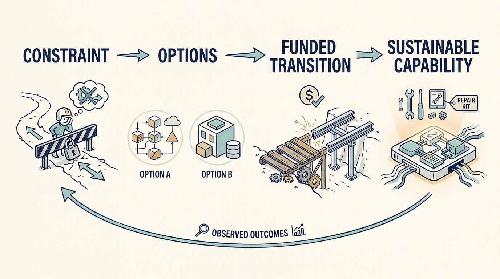

An engineering investment earns its place by **changing a business constraint**. That holds whether the systems are built in-house, bought from suppliers, or both. An old system is not automatically the binding constraint, and a new one is not automatically a useful outcome. In normal operations, constraints are handled as they arise. An investment case fixes the destination and timetable in advance, so the engineering leader's job becomes testing whether the promised plan is feasible and what it would cost to make it so.

**Figure 1:** *Choose the technical commitment through the business constraint.*

The valuation thesis helps identify the priority. Expected growth may require faster learning and easier customer onboarding. An emphasis on EBITDA, earnings before interest, taxes, depreciation and amortization, may direct attention to sustainable operating costs. Both require investment and reliable service; neither chooses a technical option automatically.

Start with a decision the company cannot execute reliably: onboarding a larger customer, making a safe change, restoring service, integrating an acquisition, or changing a supplier. Trace the obstacle through work, ownership, system structure, and knowledge. The answer may be a smaller interface change or a clearer decision boundary rather than a platform replacement.

**Technical debt** is future effort or risk arising from earlier technical choices or postponed work. Evaluate it through those consequences, rather than treating it as a literal loan balance. Explain which changes become slower, riskier, or more expensive if the obligation remains. Include its uncertainty. A count of debt tickets does not establish the cost of carrying them, and eliminating all debt is not a credible investment objective.

Engineering effectiveness needs several views. The **SPACE** research framework examines several dimensions of developer productivity. **DORA**, a software-delivery research program, measures delivery performance. Neither provides a simple ranking of individual employees. [S13: SPACE framework](https://www.microsoft.com/en-us/research/publication/the-space-of-developer-productivity-theres-more-to-it-than-you-think/) [S14: DORA metrics guide](https://dora.dev/guides/dora-metrics/) Use measures to investigate how work reaches customers, with definitions and context that remain stable enough to interpret.

A useful improvement proposal connects a specific constraint to an intervention and an observable result. Faster change may support more learning, shorter customer commitments, or lower recovery exposure. Those benefits require product choices and operating behavior beyond the engineering intervention itself. Do not book hypothetical additional releases as revenue.

Large migrations **consume capacity before they release it**. Separate existing payroll from additional cash spending so it is not counted twice. Include running old and new systems together, training, compatibility, moving customers, a route back if the change fails, and the work postponed during the transition. Define an incremental benefit and a point at which the company can stop safely if the expected value does not appear.

Match the technical commitment to the **next funding decision**. In an uncertain market, a bounded interface may let fictional Larkspur learn before another round. With confirmed expansion funding, the company may instead need a repeatable capability. Borrowing can make overlapping transition costs decisive; corporate ownership can introduce required group interfaces. State what works at each stage and what future cost the choice creates, rather than letting the owner’s label choose the design.

Company leaders should challenge an unsupported rewrite and an unsupported refusal to reinvest with **the same discipline**. Advisers can help compare options; the company needs a funded transition and a result its team can sustain.
