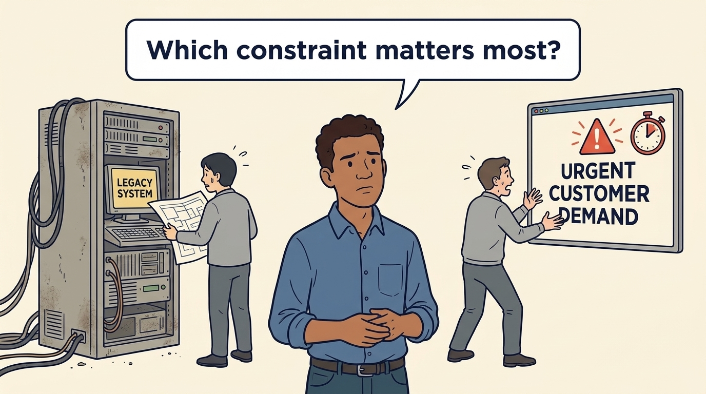
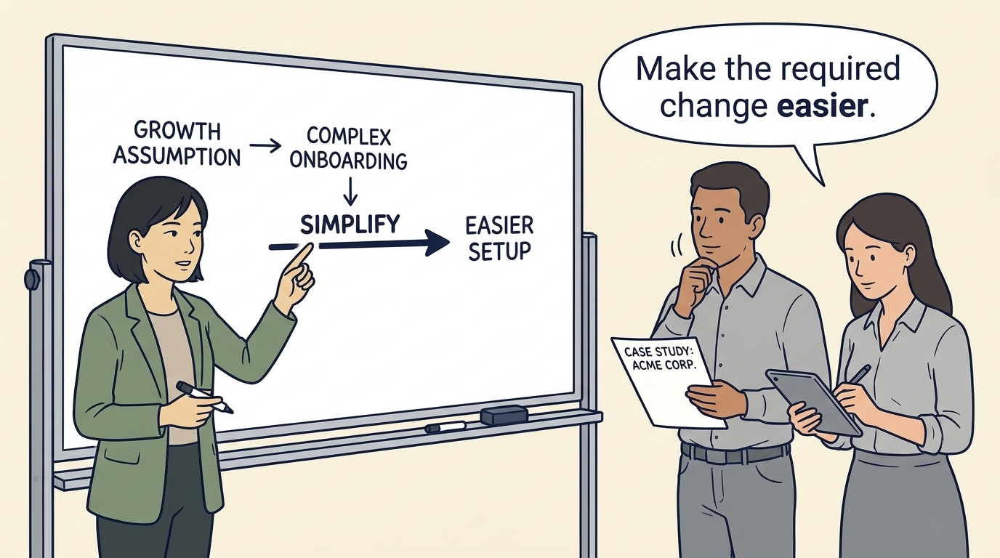
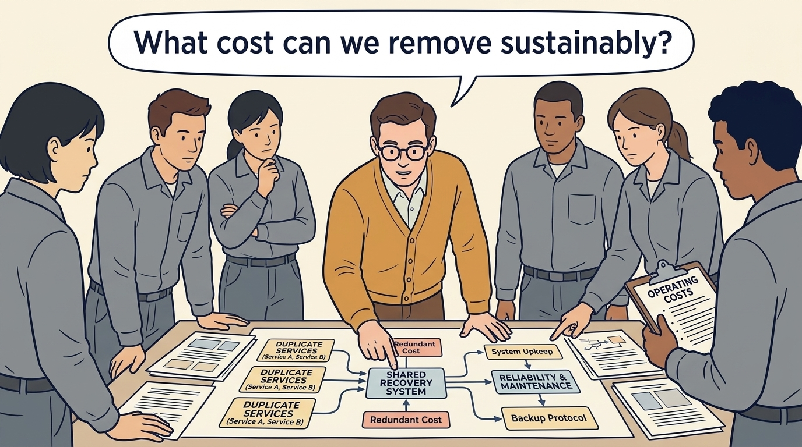
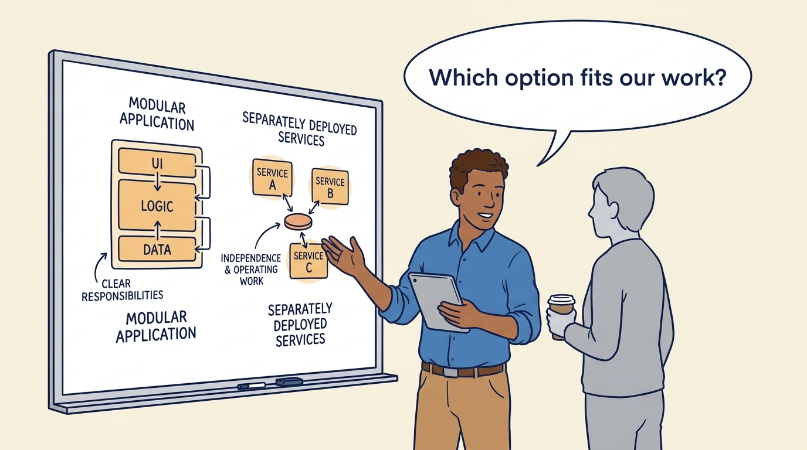
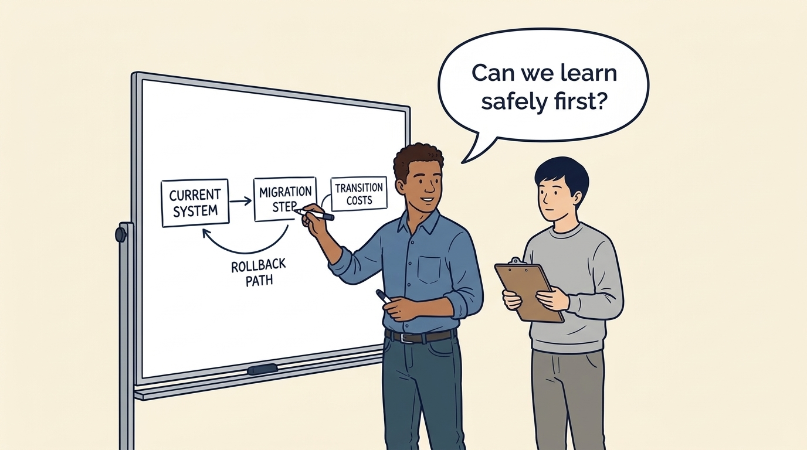
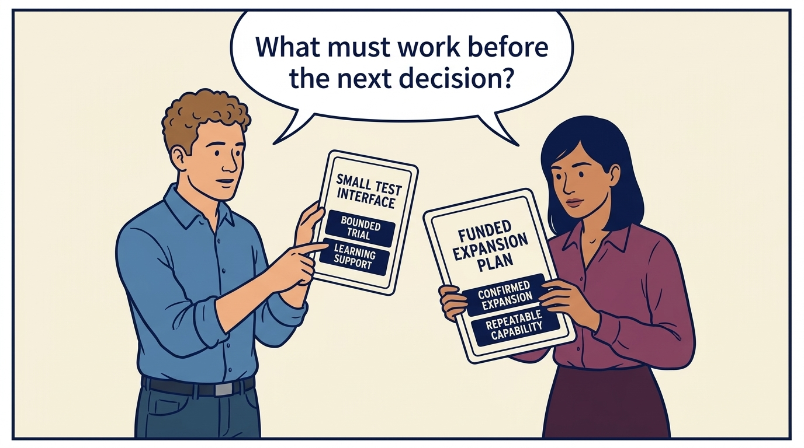

<!-- comic-style
{
  "cast": "MORGAN: a thoughtful investor technology adviser with short dark hair and a green jacket, used in the fund scenarios. ALEX: a practical CTO with curly hair and blue rolled-up sleeves. SAM: a CFO with round glasses and an amber cardigan. PRIYA: a product leader with straight dark hair and plum sleeves. INES: a CEO with short grey hair and a navy jacket. All are fictional; none represents a person in a real case.",
  "style": "Clean editorial explainer comic, dark ink outlines, restrained green, blue, and amber accents on warm white, generous space, readable short speech bubbles, expressive people and simple physical metaphors. No photorealism, logos, dense charts, or title text. Keep the same character appearances throughout the journal."
}
-->

**Comic.** Morgan is an investor’s adviser in the fund scenarios; Alex leads technology, Priya leads product, and Sam leads finance. All are fictional. Comparative scenarios use separate assumptions. Historical cases are discussed through documents; the scenes do not reenact real events.

<!-- comic-panel
{
  "id": "01-scene",
  "status": "generated",
  "asset": "assets/images/09-engineering-and-architecture/comic-01-scene.jpeg",
  "aspect_ratio": "16:9",
  "prompt": "Panel 1 of an explainer comic. Alex sees an old system beside an urgent customer need. Use one speech bubble with the exact words: \"Which constraint matters most?\" Convey: Judge the company’s systems against the work the business needs, rather than against their age.",
  "alt": "Comic panel: Alex sees an old system beside an urgent customer need.",
  "caption": "Judge the company’s systems against the work the business needs, rather than against their age.",
  "generation": {
    "model": "gemini-3-pro-image-preview",
    "reference_id": "owned-cast-20260913",
    "sha256": "312f179833703d130b8a4dbe2b3a2d49b81a8fdc434ce8d70204af8fdcfdacbb"
  }
}
-->

**Panel 1:** Judge the company’s systems against the work the business needs, rather than against their age.

*Dialogue:* “Which constraint matters most?”

<!-- comic-panel
{
  "id": "02-scene",
  "status": "generated",
  "asset": "assets/images/09-engineering-and-architecture/comic-02-scene.jpeg",
  "aspect_ratio": "16:9",
  "prompt": "Panel 2 of an explainer comic. Morgan translates a growth assumption into easier customer onboarding. Use one speech bubble with the exact words: \"Make the required change easier.\" Convey: If growth needs faster customer setup, investigate which system changes make that work easier.",
  "alt": "Comic panel: Morgan translates a growth assumption into easier customer onboarding.",
  "caption": "If growth needs faster customer setup, investigate which system changes make that work easier.",
  "generation": {
    "model": "gemini-3-pro-image-preview",
    "reference_id": "owned-cast-20260913",
    "sha256": "3afde8abba65847fad63c02dbf3dbbe96fc4328c8db6b01fc72a6c2f58efdcd8"
  }
}
-->

**Panel 2:** If growth needs faster customer setup, investigate which system changes make that work easier.

*Dialogue:* “Make the required change easier.”

<!-- comic-panel
{
  "id": "03-scene",
  "status": "generated",
  "asset": "assets/images/09-engineering-and-architecture/comic-03-scene.jpeg",
  "aspect_ratio": "16:9",
  "prompt": "Panel 3 of an explainer comic. Sam traces operating costs through duplicate services and a shared recovery system. Use one speech bubble with the exact words: \"What cost can we remove sustainably?\" Convey: Simplifying repeated work may reduce costs. Include the reliability and maintenance needed to keep the service useful.",
  "alt": "Comic panel: Sam traces operating costs through duplicate services and a shared recovery system.",
  "caption": "Simplifying repeated work may reduce costs. Include the reliability and maintenance needed to keep the service useful.",
  "generation": {
    "model": "gemini-3-pro-image-preview",
    "reference_id": "owned-cast-20260913",
    "sha256": "afa0b84e05927ac3dd235a5c6bef4e2c82899955561095f7cc0712d31a787ffd"
  }
}
-->

**Panel 3:** Simplifying repeated work may reduce costs. Include the reliability and maintenance needed to keep the service useful.

*Dialogue:* “What cost can we remove sustainably?”

<!-- comic-panel
{
  "id": "04-scene",
  "status": "generated",
  "asset": "assets/images/09-engineering-and-architecture/comic-04-scene.jpeg",
  "aspect_ratio": "16:9",
  "prompt": "Panel 4 of an explainer comic. Alex compares one modular application with separately deployed services. Use one speech bubble with the exact words: \"Which option fits our work?\" Convey: Modularity gives software parts clear responsibilities. Running those parts as separate services adds independence and operating work; compare both.",
  "alt": "Comic panel: Alex compares one modular application with separately deployed services.",
  "caption": "Modularity gives software parts clear responsibilities. Running those parts as separate services adds independence and operating work; compare both.",
  "generation": {
    "model": "gemini-3-pro-image-preview",
    "reference_id": "owned-cast-20260913",
    "sha256": "64d66786e4c1834f8f66f26f4150a7f69aaa59d658697f5b5948d633511ec475"
  }
}
-->

**Panel 4:** Modularity gives software parts clear responsibilities. Running those parts as separate services adds independence and operating work; compare both.

*Dialogue:* “Which option fits our work?”

<!-- comic-panel
{
  "id": "05-scene",
  "status": "generated",
  "asset": "assets/images/09-engineering-and-architecture/comic-05-scene.jpeg",
  "aspect_ratio": "16:9",
  "prompt": "Panel 5 of an explainer comic. Alex sketches a migration step with a rollback path and transition costs. Use one speech bubble with the exact words: \"Can we learn safely first?\" Convey: Technical debt is future effort or risk from past choices or postponed work. Addressing it needs a funded transition and a usable route back if needed.",
  "alt": "Comic panel: Alex sketches a migration step with a rollback path and transition costs.",
  "caption": "Technical debt is future effort or risk from past choices or postponed work. Addressing it needs a funded transition and a usable route back if needed.",
  "generation": {
    "model": "gemini-3-pro-image-preview",
    "reference_id": "owned-cast-20260913",
    "sha256": "d866499b264cb23004e3a3ced015fc1e4bdc948620c07e4140b8b19f308810e0"
  }
}
-->

**Panel 5:** Technical debt is future effort or risk from past choices or postponed work. Addressing it needs a funded transition and a usable route back if needed.

*Dialogue:* “Can we learn safely first?”

<!-- comic-panel
{
  "id": "06-scene",
  "status": "generated",
  "asset": "assets/images/09-engineering-and-architecture/comic-06-scene.jpeg",
  "aspect_ratio": "16:9",
  "prompt": "Panel 6 of an explainer comic. Alex and Priya compare a small test interface with a funded expansion plan on two separate scenario cards. Use one speech bubble with the exact words: \"What must work before the next decision?\" Convey: A bounded trial can support learning before another round; confirmed expansion can need a repeatable capability. State what each stage supports and what remains to fund.",
  "alt": "Comic panel: Alex and Priya compare a small test interface with a funded expansion plan on two separate scenario cards.",
  "caption": "A bounded trial can support learning before another round; confirmed expansion can need a repeatable capability. State what each stage supports and what remains to fund.",
  "generation": {
    "model": "gemini-3-pro-image-preview",
    "reference_id": "owned-cast-20260913",
    "sha256": "847878239834fb117a839d6406dc33d89f3361ab5ece260e5379b0f6e44c2887"
  }
}
-->

**Panel 6:** A bounded trial can support learning before another round; confirmed expansion can need a repeatable capability. State what each stage supports and what remains to fund.

*Dialogue:* “What must work before the next decision?”
