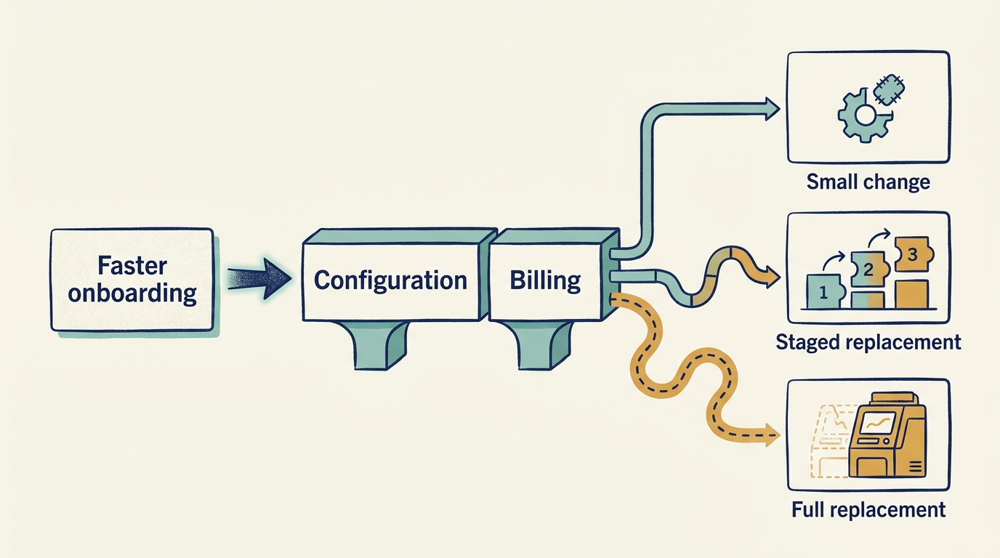
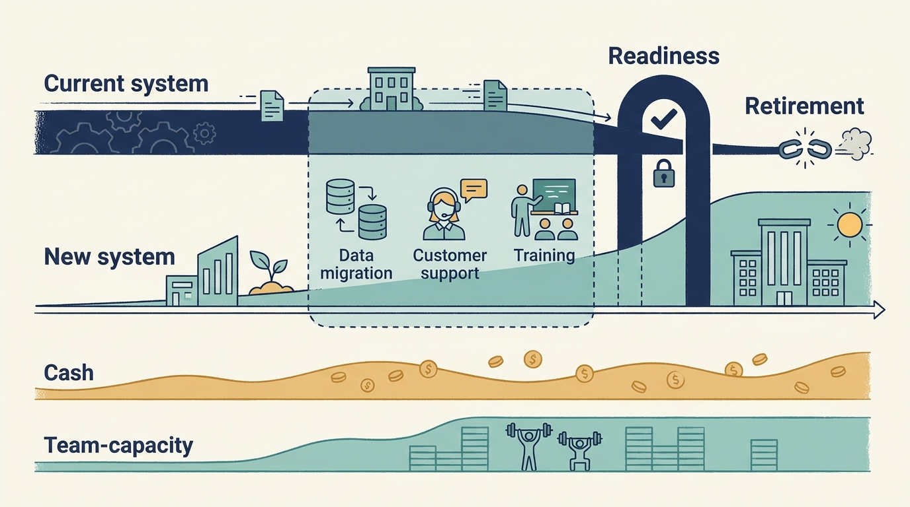

> **KEY POINTS:**
>
> * Begin with **what the company needs to do**. Identify the changes, scale and reliability the business plan requires.
> * Judge the technology by **its consequences for that work**. A fashionable technology or an old system is not, by itself, a good or bad investment.
> * Fund the **path from the current system** to the proposed one. Include running both systems, moving customers and maintaining service along the way.

 
Larkspur, the fictional scheduling-software company, wants to serve customers in a second country. Its software assumes one set of tax rules, its contracts cover one market, and its support team works in one language. Which changes are needed before expansion can succeed?

Answering that takes more than a look at the software. It takes a view of what the company’s technology and the people who run it can currently do, what changing them would cost, and how much of that can be known before committing money. The systems may be built in-house, bought from suppliers, or assembled from both; the assessment is the same.

In normal operations, engineering constraints are handled as they arise. An investment case fixes the destination, and often the timetable, in advance, sometimes before anyone has examined the technology closely. The engineering leader’s job then changes from choosing the next improvement to testing whether the promised plan is feasible with the systems and people the company has, and saying what it would cost to make it so.

[[product-value]] explained how to connect a proposed change to customer and business results. This chapter asks what the underlying systems and team must be able to do. We move from the business constraint to technical debt, delivery evidence and the cost of changing systems. The implementation choices that follow from such an assessment are the subject of [[valuation-and-design]].

## Translate the Business Plan Into Required Capabilities

A **valuation** estimates what the business or an ownership interest is worth. Investors may emphasize revenue growth, established earnings, or future cash generation when making that estimate. The method is not a design specification: it tells the technology team which assumptions need investigation. [[valuation-and-architecture]] introduces the financial terms and worked examples.

If the investment case depends heavily on growth, the product may need cheaper experiments, faster onboarding or entry into another market. Useful technical work might keep country rules in a distinct part of the software, configure them in a system the company buys, make those settings safer to change, or improve **deployment**, the process of releasing software so people can use it. An expensive redesign that delays customer learning can defeat that purpose even if it promises more flexibility later.

If the case emphasizes **EBITDA**, earnings before interest, taxes, depreciation and amortization, management may focus more closely on sustainable operating costs. Removing unused infrastructure, automating support work or retiring duplicate systems can help. The investment case must still show transition spending and continued product development, including which costs are expensed and which are capitalized. EBITDA alone does not show their full cash requirements.

These priorities overlap. Reliable deployment can reduce both the cost of failure and the time needed to experiment. A simpler estate can support both margin and change. A useful technical decision describes the capability required and the trade-offs, rather than selecting a technology from the financial target alone.

**Figure 1:** *Start with the constraint the company needs to remove, then compare ways to remove it.*

## Start With a Constraint, Not a Score

Return to Larkspur’s plan to enter a second country. A generic technical review might report **tight coupling**: parts of the system depend on one another so closely that changing one requires changing others. The investment-relevant finding is sharper: market entry depends on coordinated changes to billing, legal work, support and product configuration. Engineering can change the software; it cannot complete the legal and support work on its own.

The constraint could justify significant technical change. It does not establish that the entire system should be replaced. Compare the smallest coherent options that can support the business need, including the possibility that the market-entry plan itself is premature.

Assessment should also **record strengths**. A stable core, deep domain knowledge, a trusted operational team, or a simple deployment model can be valuable. A diligence report that lists only defects encourages a new owner to dismantle capabilities it does not yet understand.

## Technical Debt Is a Decision About Future Work

**Technical debt** describes future effort or risk created by earlier technical choices or postponed work. It is a metaphor, rather than money owed to a lender. It becomes less useful when every disliked design choice is included without a connection to work the company needs to perform.

Describe a material item through its consequences: which changes become slower, which incidents become more likely, what knowledge is scarce, and what the options cost. Avoid calculating a total “debt balance” by adding estimates with incompatible assumptions. The obligation does not have to sit in code the company wrote. A heavily customized supplier system, an ageing integration layer, or a version no longer supported creates the same kind of future work.

A **module** is a part of the software with a particular responsibility. Larkspur’s invoicing module makes the distinction concrete. It is fragile enough that the same two specialists review every pricing change, which takes about three weeks. If the growth plan depends on frequent pricing experiments, that three-week wait prevents the company from quickly learning what customers will pay. If pricing will stay stable, the more urgent problem is that those two people are the only ones who understand the module. What needs to improve depends on the company’s plan.

Addressing technical debt competes with other engineering investments. That does not mean it should always lose. It means its case should include avoided disruption, lower change cost, and preserved options, with uncertainty stated. “We must modernize” is weaker than an explanation of which business decisions are becoming infeasible.

## Engineering Effectiveness Has Several Dimensions

**Engineering effectiveness** means the ability to deliver useful, reliable work and sustain that ability. The SPACE research framework examines several dimensions of developer productivity: satisfaction and well-being, performance, activity, communication and collaboration, and efficiency and flow. Its paper argues that developer productivity cannot be represented by a single activity measure or dimension. [S13: SPACE framework](https://www.microsoft.com/en-us/research/publication/the-space-of-developer-productivity-theres-more-to-it-than-you-think/) This is especially relevant when an owner asks whether a company has too many engineers. Headcount divided by revenue is a cost ratio; it is not a complete measure of the organization's effectiveness.

**DORA**, the research program on software delivery and organizational performance, provides another perspective. Its metrics guidance, consulted in September 2026, uses five delivery metrics and emphasizes application or service context. It warns against disparate comparisons and metric gaming. [S14: DORA metrics guide](https://dora.dev/guides/dora-metrics/) A portfolio benchmark should therefore not rank a regulated transactional service against a newly launched marketing application without explaining the difference.

For a specific company, begin with the work customers and the business need. Examine how long changes wait, how often released work causes disruption, and how much effort is spent understanding dependencies. Pair delivery evidence with product outcomes and the team's ability to sustain the work. Where most delivery is configuring and integrating supplier systems rather than writing software, these particular measures may not apply, but the questions behind them survive: how long a needed change waits, how often it causes disruption, and how much depends on a single supplier or a single person.

Interviews help explain **telemetry**, the records and measurements collected from systems. A long **lead time**, the time from starting a change to delivering it, may reflect a shared approval queue, unclear product decisions, or an unreliable **test environment**, a separate setup used to check changes before customers receive them. More developers do not necessarily resolve any of those constraints.

## Match the Commitment to the Next Funding Decision

In one fictional Larkspur scenario, demand for a new market remains uncertain and another funding round is nine months away. Alex proposes an interface that allows a small customer trial, with known limits and a review after actual use. Starting a complete platform replacement would consume the time needed to learn whether the market matters.

In another scenario, funding is already committed to a proven expansion plan. The temporary interface could become a bottleneck; Alex now compares the work needed to make the capability repeatable. In a debt-constrained scenario, the same replacement needs a cash plan for running both systems and a useful stopping point. Under a corporate parent, the question may be which group interfaces are mandatory and which product decisions remain local.

The underlying engineering obligation is to make the commitment understandable: what works at each stage, who maintains it, how customers move, and which later cost the current choice creates. Funding uncertainty can justify limiting scope. It does not justify hiding the cost of completing or safely maintaining the result.

## A Rewrite Needs a Funded Transition

A proposed replacement must account for the period in which old and new systems coexist. This applies whether the company is rewriting software it owns, replacing a core supplier system, or moving to a different enterprise platform: the transition costs behave the same way. For a separate fictional proposal, Alex, Larkspur’s technology leader, considers replacing its scheduling engine over eighteen months. This is a different project from the onboarding pilot in the previous chapter:

| Transition cost | € |
| --- | ---: |
| Additional engineering capacity, 4 people × 18 months | 900,000 |
| Running both platforms in parallel | 240,000 |
| Customer data migration and exception handling | 160,000 |
| **Total before benefits begin** | **1,300,000** |

These are additional cash requirements; existing payroll and maintenance remain in the operating baseline. If current employees do some of the work, distinguish their capacity commitment from extra cash spending so their pay is not counted twice.

The annual model in [[cash-and-constraints]] leaves €0.5 million after its stated payments. That does not establish whether an eighteen-month transition costing €1.3 million can be funded. Alex and Sam need a dated spending plan, available cash balances and any additional financing. Staging the work, deferring it or seeking new funding each has consequences to compare before approval.

The plan should define which capability migrates first, how value appears before the whole program is complete, and what happens if the program stops. A staged approach is useful only if intermediate states can operate safely. Dividing an inseparable replacement into nominal phases does not reduce the underlying risk.

Also identify **the retirement condition**. If customers remain indefinitely on the old product, the expected maintenance savings may never arrive. If forced migration loses valuable customers, the saving may be economically negative. Technical choices and product commitments need a single account of the transition.

**Figure 2:** *The investment includes the path to the new system and the cost of keeping customers served along the way.*

## Standardization Helps at the Right Boundary

Common security expectations, incident definitions, or financial reporting can make coordination easier. Common ways of recording code changes and preparing software for release may reduce repeated work within a company. Requiring unrelated portfolio companies to use the same technologies to build and run their applications needs a much stronger case.

The important distinction is the economic boundary. This is the question **enterprise architecture** exists to answer: which decisions are made once for the whole group, and which stay with the individual business. Products serving different customers can need different structures. Acquired businesses can preserve useful local knowledge. Conversely, a group selling one integrated customer experience may need deeper coordination than an autonomy slogan allows.

A proposed standard should state the problem it solves, the cost of compliance, the exceptions process, and **the person who funds the transition**. If no one can explain the customer or operating benefit, uniformity is being treated as an end in itself.

## Fund Learning Before Scaling the Intervention

A practical improvement plan begins with a baseline and a bounded change. Reduce one source of waiting. Improve one critical deployment path. Remove a dependency that blocks a specific customer need. Evaluate both the delivery effect and any new burden.

The goal is not to make every program small. Some changes require substantial coordinated investment. The goal is to discover whether the proposed mechanism works before extrapolating its benefit across the company or portfolio.

An investor’s adviser can bring patterns and specialists, but company engineers need to participate in diagnosis. Their knowledge of the system is part of the capability any funding or ownership plan depends on. An assessment that treats their explanations as resistance can lose the information needed to make the investment work.

A useful engineering case names the business constraint, compares feasible options and includes the cost of moving between them. For example, “pricing changes take three weeks, but the growth plan requires weekly experiments” tells decision-makers what needs to improve.

We can now bring the financial and technical explanations together. The next chapter follows a valuation assumption through to a concrete implementation choice: [[valuation-and-design]].

## Questions to Consider

1. What does your company’s business plan require the technology and the team to do: which changes, at what scale, with what reliability? Have you written that down before assessing the systems?
2. For the constraint that most limits your plan, have you compared the smallest coherent options for removing it, including the possibility that the plan itself is premature?
3. Which technical debt items in your organization are described through their consequences for specific work, and which are simply designs the team dislikes?
4. If a rewrite or platform replacement is proposed, what is the full transition cost: additional people, parallel running, migration and the retirement condition?
5. Which standards imposed across your group solve a stated problem with a named funder for the transition, and which are uniformity for its own sake?
6. What strengths in your current systems and team would a diligence report listing only defects fail to record?
