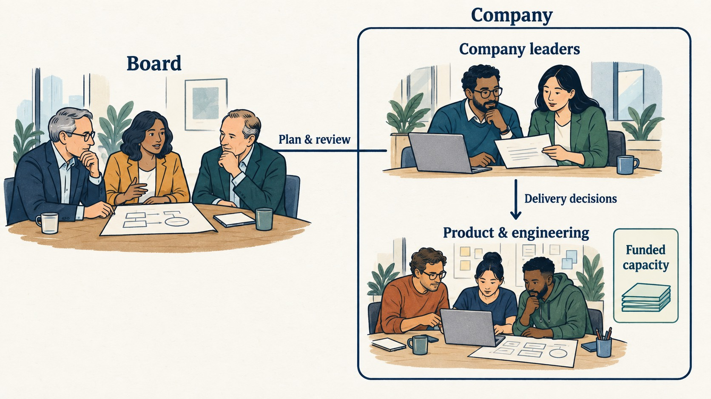
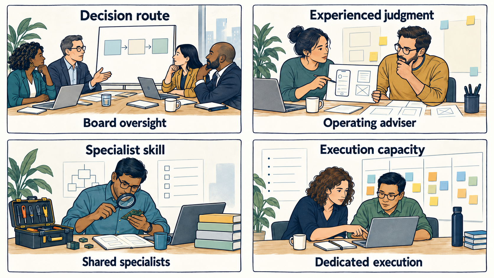

> **IN THIS SECTION, YOU WILL:** Match business priorities to four ways of working with an investor, connect them to the company’s internal organization, and write a blueprint that makes authority, capacity and review explicit.

> **KEY POINTS:**
>
> * **Choose the arrangement from the work and the missing capability.** Management may need a decision, experienced judgment, specialist expertise or someone with time to lead execution. Each calls for a different contribution.
> * **Design investor involvement and company organization separately, then connect them.** Shared investor expertise can support locally managed businesses. A company can centralize a service while its investor works mainly through the board.
> * **A usable blueprint includes commitments from both sides.** Name who decides, who supplies people and funding, what company work makes room, and when the arrangement will be reviewed or ended.

 
Suppose an investor — someone who has put money into the business expecting a financial return — offers its company “the full operating platform”: access to a technology partner, a pricing specialist, an acquisition team and a standard reporting package. The **chief executive officer**, the person who leads the company overall, welcomes the help. The **chief technology officer**, the executive responsible for technology, sees four new streams of work arriving for the same engineers. Before anyone adds them to a **roadmap** — the list of product work the company has planned and when it expects to do it — the company needs to establish which work the offer will make possible and how the people involved will decide what happens.

An **operating model** is the arrangement of people, responsibilities, decisions, work and information through which a business carries out its strategy. A **blueprint** makes that arrangement specific enough to discuss and test. It describes the work people will do together, including the resources and authority on which it depends.

This chapter offers a selection guide and four proposed blueprints for a product or technology leader working with investors. Most of the published evidence comes from **private equity (PE)**: a kind of ownership investment made outside the public stock market, where shares in listed companies are bought and sold. PE firms buy ownership stakes in companies that are not listed there, using money pooled from other investors in a **fund**. The businesses a fund has invested in are its **portfolio**, and each one is a **portfolio company**. The designs are the book’s synthesis, intended for adaptation; they are neither a standard industry classification nor a ranking of investors. The closing chapter of Part III, [[tech-operating-partner]], explains one important function within them. Here the subject is the wider working arrangement.

## Connect Two Designs

The first design concerns **how the investor works with the company**. It covers oversight, advice, specialist support and any responsibility assigned to people who join execution. The second concerns **how the company organizes its own work**: which decisions remain with product or business-unit leaders, which standards are common, and which services or teams operate across units.

The investor also has an internal operating model for running its own investment business — keeping the fund’s records and accounts, reporting to the people whose money it holds, and running its own systems. McKinsey’s October 2018 study of operational complexity concerns those internal functions. That is a different assignment from improving a portfolio company’s delivery capability. [S92: McKinsey, operational complexity](https://www.mckinsey.com/industries/private-capital/our-insights/how-private-equity-is-tackling-operational-complexity)

Start with the **investment thesis**, the explanation of why the investment should succeed, and the **value creation plan**, the intended business changes behind it. Translate each material assumption into company work. Growing an existing product, changing service costs and integrating acquisitions create different demands on product judgment, engineering capacity and management attention.

Bain’s February 2026 analysis argues for examining commercial, operational and technology opportunities together during **diligence**, the investigation an investor runs before committing money. Its case for greater operating improvement supplies context for this design problem; it does not establish which blueprint will work for a particular company. The company still needs to test the assumptions and fund the work. [S94: Bain, Welcome to a New Era in Private Equity](https://www.bain.com/insights/welcome-to-a-new-era-global-private-equity-report-2026/)

For each proposed improvement, identify what is missing. A decision blocked at the **board** — the group of directors that governs the company, oversees its direction and approves its largest decisions — needs an approval route. A technology officer facing an unfamiliar **acquisition**, the purchase of another business, may need experienced advice. Testing whether an **artificial intelligence (AI)** feature — software that performs tasks normally needing human judgment, such as reading a customer’s written complaint and proposing an answer — works well enough to put in front of customers may need a specialist. A company managing several integrations may need dedicated execution capacity. Describing the constraint makes the choice of support easier to defend.

**Figure 1:** *Choose investor support and company organization separately, then connect them through an explicit agreement about authority, people, funding and review. The figure’s fourth investor choice,* Embedded, *is the dedicated execution described in Blueprint 4: people assigned to work inside the company’s own teams.*

## Choose a Combination for the Business Priority

Use the business priority to identify the work, then choose support for the specific gap. This proposed guide connects both choices to the company’s internal design. The blueprint numbers refer to the arrangements explained below; each row offers a starting point to test.

Three measures recur in these rows, and they are not interchangeable. **Revenue** is the income a company earns by supplying its products or services, counted when the company delivers them rather than when the money arrives. **Profit** is what is left after the costs of earning that revenue. **Cash** is the money actually in the company’s bank account, which arrives and leaves on its own timetable. Revenue and cash receipts can separate in either direction: work delivered in March may not be paid for until June, while a customer who pays a year of subscription upfront hands over the cash long before the company has earned most of it. Both those sales are already commitments; only one has reached the bank account. Two operating measures also appear: **adoption**, how many customers start using a product or feature, and **retention**, how many keep using it — stated either as a count of customers or as the revenue they represent, so name which one you mean.

| Business priority | Choose investor involvement for the gap | Connect it to company work |
| --- | --- | --- |
| Grow the existing business | **1: Board oversight** when the team can execute. **2: An operating adviser** when product, pricing or market assumptions need experienced challenge. | Give the **chief product officer** (the executive responsible for product direction) and the technology officer clear investment and roadmap decisions. Fund the work of finding out what customers need and the work of building it; review adoption and retention alongside revenue. |
| Improve **profitability**, the ability to earn more revenue than the costs of earning it | **3: Shared specialists** for scarce pricing, purchasing or technology-cost expertise. **4: Dedicated execution** when implementation exceeds available management capacity. | Put each change with the executive who controls the work. Test full implementation and running costs, cash effects and service quality before expanding shared services. |
| Grow by buying other businesses | **2: An operating adviser** to help choose how deeply to combine the businesses. **4: Dedicated execution** when several of those combinations need sustained coordination. | Decide which benefits require common standards or shared services and which depend on local product teams. Fund the work of moving customers and systems across alongside continuing delivery. |
| Scale beyond founder dependence | **2: An operating adviser** to help establish delegation and leadership capability. **3: Shared specialists** for recruitment, security or other specific gaps. | Build permanent company ownership, clear product-team responsibilities and repeatable delivery practices. Review decision delays, leadership coverage and service reliability. |

The same growth goal could need an adviser to test a product decision, a specialist to evaluate an AI feature, or a temporary leader to cover a vacancy. Conversely, one specialist team could support both growth and cost work. Choose for the constraint, then confirm the people, authority, funding and review date before adding the work to the plan. If the required capacity cannot be committed, narrow or sequence the work.

## Four Blueprints for Investor Involvement

McKinsey’s November 2018 survey of 45 firms found varied operating-group compositions, including combinations of internal employees and external advisers. Its 2021 guidance for chief executives describes support through operating teams, functional experts, senior advisers and peer networks. These accounts support the existence of different arrangements. The four designs below turn that variety into practical choices for a company leader. [S91: McKinsey, operating groups](https://www.mckinsey.com/industries/private-capital/our-insights/private-equity-operating-groups-and-the-pursuit-of-portfolio-alpha) [S95: McKinsey, portfolio-company CEOs](https://www.mckinsey.com/industries/private-capital/our-insights/a-playbook-for-newly-minted-private-equity-portfolio-company-ceos)

A company can combine these arrangements across different work. A specialist assignment can end while the broader investor relationship continues. Review the combination as the business priority or capability gap changes.

### Blueprint 1: Management Delivery With Board Oversight

This fits a company whose leaders have the capability and capacity to execute an agreed plan. The investor contributes through the board, investment decisions and selected discussions. Product and technology leaders turn the plan into priorities, staffing and delivery through the company’s management structure.

**Figure 2:** *Board oversight works through an agreed plan and review. Company leaders retain delegated delivery decisions and need funded people to carry them out.*

**Authority and resources.** Record the decisions delegated to management and the matters requiring board or other approval. Include the route for spending outside the **budget** — the spending and income plan the board has approved for the year — along with significant changes of direction and senior appointments. The company needs a funded plan and people available to deliver it. A promise of access to the investor’s network becomes a resource only when someone accepts a specific assignment.

**Working practice.** Use an agreed set of performance information and a route for decisions between scheduled meetings. McKinsey’s May 2021 interviews describe private-equity boards that engage closely between meetings. That is compatible with management leading delivery, provided the decision route is understood. [S97: McKinsey, the private-equity learning curve](https://www.mckinsey.com/capabilities/strategy-and-corporate-finance/our-insights/climbing-the-private-equity-learning-curve)

For a product team, this might mean the board agrees the funded growth priorities and constraints, while the product and technology officers decide which experiments and engineering changes can meet them. They bring evidence back when the assumptions fail or the required spending exceeds their authority.

**Review and change.** Look at customer and operating results, the quality of forecasts and whether required decisions arrive in time. Repeated late decisions call for a better approval route. A recurring technical gap may justify an adviser or specialist. Persistent lack of execution capacity requires a change to the work or resources. Diagnose the cause before adding another layer of oversight.

### Blueprint 2: Management Delivery With an Operating Adviser

This fits a bounded need for experience or challenge when the company can supply implementation capacity. An adviser might help a first-time technology officer assess an acquisition, help a product officer examine a product investment, or coach a leadership team through a change it has not made before.

**Figure 3:** *The adviser contributes experience and challenge to a company decision. Management keeps the agreed authority and commits the people needed for implementation.*

**Authority and resources.** Name the company executive responsible for the decision and the work. Agree the adviser’s **remit** — the scope and limits of what they are there to do — along with their availability, information access, costs and expected contribution. Make clear whether the person also assesses management for the investor. Advice, evaluation and formal approval have different consequences for the relationship. The written agreement recording all of that, the **charter**, belongs in [[useful-engagement]].

**Working practice.** Put the adviser alongside a real decision and a company counterpart. For example, the technology officer and an experienced adviser could compare ways of combining an acquired business using the same dependencies, customer commitments and available team capacity. The adviser supplies judgment and challenge; the company allocates people and decides within its authority. Their useful output is a supported decision and a team better able to carry it out.

A broad calendar invitation or a monthly presentation supplies little evidence of that contribution. Agree what the next review will examine: a resolved uncertainty, a better option, a capability learned or a decision ready for approval.

**Review and change.** Watch for recommendations accumulating faster than the company can implement them, or for teams treating the adviser’s suggestions as instructions. The response may be to narrow the assignment, fund specialist work or make a formal executive appointment. End the advisory work when the agreed need is met; establish any continuing coaching relationship separately. [[investors-adviser]] explains how to handle a change of role.

### Blueprint 3: Management Delivery With Shared Specialists

This fits recurring needs for expertise that each company cannot justify maintaining in full: checking security risks and protections, pricing analysis, executive recruitment, building and maintaining the systems that hold the company’s data, or testing whether an AI system works well enough for its intended use. Specialists may belong to the investor, a provider or another explicitly agreed service arrangement.

**Figure 4:** *Shared expertise becomes usable through a specific assignment. Agree people, dates and cost, with a named company lead and local capacity to use the work.*

**Authority and resources.** Secure named people and dates, not merely access to a team. Establish who prioritizes competing requests, who pays, what the company must contribute and who accepts the work. A specialist needs a company counterpart with time to supply context and use the result. If a common policy is mandatory, identify its authority and the process for exceptions.

**Working practice.** Distinguish a reusable method from a shared operational service. A standard set of tests for an AI system can be adapted locally. An **identity service** — the system that establishes who a user is and lets one sign-in reach more than one product — used by several businesses needs an owner, agreed service standards, help when it fails and a way to fund its continuing operation. Moving from occasional expertise to a continuing service changes the operating model.

Vista’s value-creation page, consulted in September 2026, describes in-house AI engineers working alongside portfolio companies, operating methods and peer learning. It provides a direct example of an investor offering shared capabilities. Its description does not establish that a particular company should adopt every element. [S93: Vista, Value Creation](https://www.vistaequitypartners.com/about/value-creation/)

For a **pilot** — a limited trial run before broader use — of an AI feature, shared specialists might design the tests and examine how it would connect to existing systems. The product officer still needs a customer or business purpose, and the technology officer needs people able to build and operate the resulting service. Agree data access for that assignment; common ownership alone is insufficient to assume that company or customer information may be pooled.

**Review and change.** Examine availability, work accepted by the company, total cost and the capability left behind. Queues, compulsory tools with weak company cases, or continuing dependence on unavailable experts are reasons to revisit the design. Options include a clearer service commitment, local hiring, another provider or stopping work that no longer justifies its cost.

### Blueprint 4: Dedicated Execution Inside the Company

This fits work that needs sustained coordination or leadership beyond the existing team’s available capacity. Examples include a major integration, a difficult systems transition or a temporary gap in an executive role. A dedicated **program leader** who coordinates related work, a delivery team **embedded** inside the company’s own teams, and an **interim** — temporary — executive are different assignments; choose and describe the one required. This is the arrangement Figure 1 labels *Embedded*.

**Figure 5:** *In this illustrative program assignment, the company agrees the reporting line, authority, people and budget. The diagram’s CEO is the chief executive officer. A planned handover keeps continuing ownership visible.*

McKinsey’s June 2026 article discusses additional transformation leadership inside portfolio companies and the burden of combining major change with running the business. Its **chief transformation officer**, an executive appointed to lead one substantial business-change program, is a different role from the chief technology officer, which the same abbreviation, CTO, is also used for. The case for dedicated capacity must be assessed for the assignment. [S99: McKinsey, five practices reshaping PE value creation](https://www.mckinsey.com/capabilities/transformation/our-insights/unlocking-full-potential-five-practices-reshaping-pe-value-creation)

**Authority and resources.** Specify the reporting line, budget, decisions delegated to the appointee and the work their people will do. A program leader may coordinate dependencies without controlling each function’s priorities. An interim technology officer may hold executive authority through a formal appointment. Establish how the chief executive resolves disputes and who remains responsible for existing customer services.

**Working practice.** Give the assignment one place in the company’s plan. Identify which employees are allocated, how continuing work is covered and which commitments move. Agree progress reviews around completed work, remaining dependencies and decisions needed. Investor reporting should use that evidence. [[can-the-team-deliver]] and [[fix-decisions-before-hiring]] help distinguish additional people from usable capacity.

**Review and change.** Set a review date and a condition for handover at the start. Look for delivery progress, service stability and whether the permanent organization can sustain the change. A **program office** — a small team that supports the planning and tracking of the work — that only collects updates leaves execution capacity unresolved. An interim leader who becomes indispensable without a succession plan leaves a continuing dependency. Extend, revise or end the assignment through the agreed authority route, with the cost and displaced work visible.

**Figure 6:** *Match the contribution to the missing decision route, judgment, expertise or execution capacity. Several arrangements can support different parts of the same plan.*

## Decide What the Company Will Share

The investor’s involvement does not determine how much the company should centralize. This choice becomes particularly visible when acquisitions create a group of businesses, but it also applies to product divisions within one company.

Keep the ownership boundary clear. **Several businesses in one investor’s portfolio are not necessarily subsidiaries of one operating group.** A **subsidiary** is a company controlled by a parent company, which can direct it; a set of such companies under one parent is a **corporate group**. Sharing an investor does not by itself establish a common operating management structure or give one portfolio company authority over another. Peer learning or negotiated supplier access across a portfolio differs from moving a function into a corporate group’s shared service. Both require explicit arrangements for costs, responsibility and information access.

The following company designs can coexist across different activities:

| Company design | Where work and decisions sit | What must be made explicit |
| --- | --- | --- |
| Local operation | Business units retain the activity, people and most decisions. | Required reporting, minimum controls and the decisions reserved elsewhere. |
| Common standards with local delivery | Units choose implementation within shared rules; this is often called a federated arrangement. | Who sets the rules, funds the work of following them, resolves exceptions and maintains the connection points between systems. |
| Shared service or integrated function | A group team performs a defined activity for several units. | Service ownership, funding, priority-setting, service quality and the authority left with unit leaders. |

Start with the benefit that requires sharing. Comparable reporting may need common definitions and a written agreement about who supplies which data, in what form and to what standard. A customer who has to move between two of the group’s products to get one job done may need compatible sign-in and compatible connection points between the systems. A cheaper price from a supplier may require a single joint contract covering several businesses. Each makes a different demand on the organization and its systems.

Assign accountability accordingly. If a group function controls a unit’s choices and spending on the underlying computing systems, the unit leader’s measures should distinguish the outcomes they can influence from the service they receive. The group service needs its own accountable owner. The choices about how far to combine acquired businesses, and what the transition costs, are developed in [[acquisition-adds-work-first]].

## Keep One Plan, With a Review Rhythm That Fits

Spencer Stuart’s account of the relationship between investors and chief executives recommends building the improvement plan together and agreeing measures and reporting requirements. That is useful support for making the working agreement explicit. The cadence below is the book’s suggested starting point for a reasonably stable company. [S96: Spencer Stuart, Partners in Value Creation](https://www.spencerstuart.com/research-and-insight/partners-in-value-creation-unlocking-the-vital-bond-between-investors-and-ceos)

A **weekly company review** can address delivery, service, customer and cash exceptions, along with decisions blocking priority work. A **monthly business review** can examine outcomes, the current forecast, implementation costs and decisions requiring board or investor input. A **periodic strategy review** can revisit the investment assumptions and the operating arrangement itself. Use existing forums where they already serve these purposes.

Keep three different numbers apart. The **budget** is the financial plan the board approved: what the company said it would earn and spend. The **forecast** is the current best estimate of what will actually happen, revised as evidence arrives. A **stretch target** is a more ambitious number that depends on extra actions succeeding or conditions turning favorable; it is a goal, not an expectation. Give material measures an owner and a definition. Show a financial result alongside the operating evidence that helps explain it: **recurring revenue** — the part the company earns again in each period from continuing arrangements such as subscriptions, rather than from one-off sales — with retention and adoption; the cost of running a service with the workload it carries and how dependably it runs; and spending with the commitments it creates.

Difficulty meeting payments as they fall due, or a serious failure of a service, may require more frequent decisions. McKinsey’s guidance for the **chief financial officer** — the executive responsible for the company’s money — emphasizes understanding three things where they are relevant: **cash flow**, the money coming in and going out over a period; the **balance sheet**, the statement of what the company owns and what it owes at one date; and **debt conditions**, the requirements a lender attaches to borrowed money, such as keeping earnings above an agreed level. Those are inputs to the operating plan. Keep the timing of available cash visible alongside proposed improvements; [[obligations-before-budget]] explains that distinction. [S98: McKinsey, the PE company CFO](https://www.mckinsey.com/capabilities/strategy-and-corporate-finance/our-insights/the-pe-company-cfo-essentials-for-success)

Agree escalation triggers before the routine breaks down: a funding delay, material service failure, unavailable specialist or assumption that no longer holds. Name who must respond and by when. A useful escalation states the consequence and the decision needed, with the current uncertainty visible.

## A Fictional Group Chooses a Combination

Consider an **independent fictional example**. An investor backs a group of three software businesses. The plan assumes they can sell a combined offer to larger customers. Each business has its own product leadership, customer commitments and release schedule. A proposal to build one common **platform** — a shared technical foundation all three products would sit on — arrives before anyone has tested how far the products actually need to be joined up.

The group chief executive and the company leaders first agree the customer problem in terms a customer would recognize: today a buyer using two of the group’s products signs in twice, with two accounts and two help desks, and wants one sign-in that reaches both products and one place to ask for help. The businesses keep their own roadmaps, agree common security and reporting requirements, and investigate a **shared identity service**: one system that checks who a user is and grants them access to both products. Rebuilding the products on a single technical foundation remains an option to evaluate later.

The selection guide starts them in the acquisition row. Their gaps are identity expertise and coordination capacity, so they combine shared specialists and dedicated execution under board oversight. A shared identity specialist is committed for six weeks. A company program leader receives a twelve-week assignment to coordinate the work, reports to the group chief executive and runs the pilot. Two named company engineers each reserve one day a week during the specialist’s six weeks — twelve engineer-days in total, six each. Their managers defer identified internal improvements to make room. The chief financial officer confirms funding for the specialist and for the expected cost of running the service before work starts; the program leader’s twelve weeks and the engineers’ reserved days are company salary cost already carried in the approved budget, released by the deferred improvements rather than by new spending.

The assignment records its limits. Product leaders keep their delegated roadmap decisions. The program leader can order the steps of the agreed pilot but must take conflicts over additional people or changed customer commitments to the group chief executive. Putting the service in front of real customers requires a separate approval, which this group gives to its **chief technology officer**, who signs off against the company’s security and service checks. That approval is a one-off decision to go live; it is distinct from the **service owner**, the named manager who is then accountable for running the service day to day, answering failures and funding it. This group requires that owner to be named before anything goes live. Another company could place the go-live approval elsewhere; what matters is that a person, not a process, holds it.

At the six-week review, the pilot supports the single sign-in for a small set of test accounts. Extending it to every customer of both products would mean **migrating** them — moving their existing accounts onto the new service — and that would take the same engineers the group has already promised to a customer release. The specialist’s six weeks are over and are not extended, so from week seven the group can take on only work its own engineers can do.

The group chief executive, within the agreed delegation, defers the wider migration and approves a smaller next step. Over weeks seven to ten, the two engineers keep the same one day a week each — eight more engineer-days — to run the single sign-in with two volunteer customers and measure what running it costs. Their managers hold the same internal improvements deferred for those four weeks. The program leader’s existing twelve-week assignment covers the coordination, and no new funding is requested: the service costs for two customers fall inside the amount already approved.

Because two named customers are now using the service for real, the group also settles how it is supported and how it stops. The named service owner is the manager of one product’s existing support team, and that team answers the two customers through its normal channel; the two engineers’ reserved days cover any fix that reaches the sign-in service itself. The trial is approved to week ten and no further. At week ten both customers return to their original two sign-ins — a step they made a condition of volunteering, which takes about one engineer-day and sits inside the same eight reserved days. Nothing after week ten depends on the later review: when the engineers’ reserved time ends, no customer is left on a service without support.

The board also receives the **revised forecast** — the current best estimate, replacing what the budget assumed. The combined offer had been planned to reach **general availability**, meaning it is open to every intended customer rather than the chosen few in a trial, in the fourth and final quarter of the group’s financial year. On the new estimate it reaches that point one quarter later, in the first quarter of the following financial year, so the revenue the budget expected to earn before the year-end now falls after it. That remains a forecast rather than a delivery promise: the wider migration is not funded, and the date depends on decisions the twelve-week review has not yet taken. The pilot’s technical result, what the two volunteer customers report and a full estimate of the cost of running the service determine the next proposal.

The blueprint made that revision possible: available people, decision rights and the work displaced were visible. Weeks eleven and twelve carry no build work and no customer service. The program leader spends them preparing the next proposal, with the people and money it would need, for the twelve-week review.

At that review, management can decide whether the program assignment should end, continue with a narrower scope, or be replaced by a permanent group capability. Restarting the service for customers would be one of those decisions, with its own approval and its own committed people and funding; nothing beyond week twelve is reserved in advance. The example proposes a sequence of decisions. It makes no claim about **revenue actually earned** — income earned from products or services already supplied, rather than income merely forecast — or about **investment returns**, the investor’s eventual gain or loss on the money it put in.

**Figure 7:** *The fictional pilot commits people for defined periods. The six-week review changes scope; the twelve-week review decides whether the assignment ends, continues or becomes a permanent capability. The diagram’s* Narrow rollout *is the smaller next step — extending the service to two volunteer customers rather than to everyone. That narrow rollout closes at week ten, when both customers return to their original sign-ins, so weeks eleven and twelve carry only the preparation of the next proposal.*

## Write the Blueprint You Can Actually Use

Start with a short record that the company and investor can both challenge. The following fields are a proposed specification, to complete alongside the engagement and initiative records in [[toolkit]]:

1. **Purpose and boundary.** The business priority, assumption to test or outcome to improve; the chosen combination of investor involvement and company design; the companies, functions and decisions covered.
2. **Work and ownership.** The accountable company executive, people doing the work, dependencies and continuing service owner.
3. **Authority.** Decisions each person can make, matters requiring consultation or approval, and the route for resolving disagreement. Check the record against actual delegations and governing arrangements.
4. **Resources and cost.** Investor commitments, company capacity, funding source, charges, implementation cost and the work displaced. Record when each contribution becomes available.
5. **Evidence and review.** Starting position, outcome measures, reporting definitions, review dates and triggers for escalation or a change of plan.
6. **Continuation or exit.** Handover requirements, capabilities to retain, dependencies to remove and who can extend or end the arrangement.

The cost field matters even when support is described as part of the investor’s platform. The investor guide published by the **U.S. Securities and Exchange Commission (SEC)**, the United States regulator for investments, identifies two areas where competing interests can arise: deciding which party bears a cost, and payments a portfolio company makes for services. A concrete case: the investor recommends a security provider, the company pays that provider, and the investor also earns a fee from it. The recommendation may still be the right one, but the company should know about the second interest before accepting it. Use that as a reason to inspect the specific charging arrangement and who benefits from it. [S01: SEC, Private Equity Funds](https://www.investor.gov/introduction-investing/investing-basics/investment-products/private-investment-funds/private-equity)

For AI work, add the permitted data sources, who is responsible for testing that the system works well enough, what a person checks before a result is used, the cost of running it and who operates the service. A shared specialist team can supply methods and scarce expertise; the company still needs an agreed business purpose and responsibility for the result. [[ai-strategy-three-questions]] and [[tech-operating-partner]] develop those choices.

Check the proposed arrangement against experience. Spencer Stuart’s survey of 1,015 senior leaders reports the importance respondents attach to culture and to the investment firm’s approach to partnership. It records stated preferences, rather than evidence that a blueprint improves performance. Ask people who have worked with the proposed team how decisions, availability and disagreements were handled in practice. [S100: Spencer Stuart, private equity and top leaders](https://www.spencerstuart.com/research-and-insight/private-equity-is-still-a-magnet-for-top-leaders)

## Adapt the Blueprint to the Ownership Arrangement

These choices also help frame other kinds of investment, but the label an investor carries cannot supply the authority map. **Venture** investment backs young businesses whose growth is uncertain but potentially large; **growth** investment helps an established business expand; a **buyout** is a purchase of control of a business, often financed partly with borrowed money. A **minority investor** — one holding less than half the ownership, though possibly with specific rights it negotiated — may offer an adviser or specialist without control over the company’s operating decisions. Several investors may have different rights and expectations. Establish whose approval is actually required and which commitments each party has made. [[decide-who-decides]] explains that work.

The work being financed also changes the review. When a venture-funded team is still testing whether anyone wants the product, what it has learned and its **runway** — how many months the cash it holds will last, given the money it expects to receive as well as the money it expects to pay out — may determine the next commitment. Use the shortfall that remains after receipts, not gross spending: a business holding 120,000 that pays out 30,000 a month while receiving 20,000 is consuming 10,000 a month, so it has about twelve months, not four. When a growth plan depends on repeatable sales and delivery, customer adoption and capacity may matter most. A buyout plan financed partly with borrowed money also has to respect the timing of available cash and the requirements the lender attached. These are illustrative conditions to establish, not fixed descriptions of every investor category.

Review the operating model when the assignment changes: a new acquisition, an executive appointment, a change in how the company is financed — new investment, new borrowing or a **refinancing**, which replaces an existing borrowing arrangement with a new one — a serious delivery constraint, or a handover to another owner. Carry forward the obligations and company capability that remain. The model has served its purpose when people can make the required decisions and perform the funded work, with evidence that supports what should happen next.

The blueprint establishes the working arrangement. The next chapter explores how the relationship can widen what company leaders know and whom they can ask, through shared knowledge, events, peer communities and visits: [[learn-through-investors-network]]. When the need for specific support is clear, [[help-that-changes-capability]] compares sources for that capability gap.

## Questions to Consider

1. *Which business priority are you pursuing, and which missing decision, skill or capacity would this investor involvement supply?*
2. *Which company activities benefit from common standards or shared delivery, and why?*
3. *What have the investor and the company each committed to provide, by when and at whose cost?*
4. *Who can change priorities when the proposed work conflicts with an existing commitment?*
5. *What evidence would make you continue, revise or end this arrangement?*

## To Probe Further

- **[McKinsey: Private equity operating groups](https://www.mckinsey.com/industries/private-capital/our-insights/private-equity-operating-groups-and-the-pursuit-of-portfolio-alpha)** — the 2018 survey’s account of differing operating-group arrangements (S91).
- **[Spencer Stuart: Partners in Value Creation](https://www.spencerstuart.com/research-and-insight/partners-in-value-creation-unlocking-the-vital-bond-between-investors-and-ceos)** — expectations, support and reporting in the investor–CEO relationship (S96).
- **[McKinsey: Five practices reshaping PE value creation](https://www.mckinsey.com/capabilities/transformation/our-insights/unlocking-full-potential-five-practices-reshaping-pe-value-creation)** — a June 2026 discussion of adaptation and dedicated execution capacity in private equity (S99).

The [[bibliography]] records the sources consulted and their limits. The blueprints, review rhythm and fictional example are the book’s proposals.
