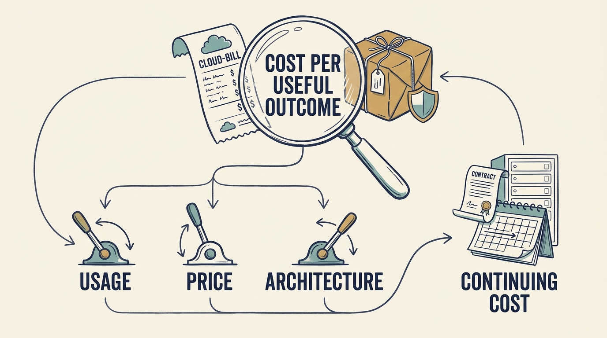

**Cloud services** are rented computing resources, storage and related services. A lower cloud bill can reflect efficiency, reduced demand, poorer service, or postponed obligations. The bill alone cannot distinguish them. In the fictional Larkspur scenario, the board-approved plan assumes flat cloud spending while volume grows by half, and the investor’s technology adviser has asked why last quarter’s bill rose 20%. The answer must explain what the bill means for the service customers receive.

**Figure 1:** *Compare useful delivery and continuing costs before claiming a cloud saving.*

Choose a **meaningful unit of delivered value** and examine cost alongside volume and quality. In a fictional example, a €100,000 bill for one million successful transactions costs €0.10 per transaction. A €120,000 bill for 1.5 million costs €0.08. The larger bill carries a lower cost per successful transaction: **unit economics**. Spending €80,000 for half a million transactions raises unit cost to €0.16.

**Put every figure on the same basis.** A number can be cash paid in the period, cost assigned to the period (upfront payments spread across the months they cover), a credit-reduced invoice, or usage of a prepaid commitment. Agree the basis first; the article uses cost assigned to the period.

**Separate usage, price, and architecture.** Removing unused resources changes consumption; negotiating rates changes price; redesigning the service changes its resource needs and may add transition costs. They are not simply additive. **FinOps**, the practice of managing technology value across finance, engineering and business teams, applies unit economics this way. [S16: FinOps unit economics](https://www.finops.org/framework/capabilities/unit-economics/)

A purchasing commitment can lower the nominal rate while increasing **exposure to unused capacity**. A €35,000 fixed commitment replacing a €50,000 flexible bill saves €15,000 a month at unchanged demand and costs €15,000 more if demand falls to €20,000. Larkspur decides by stating a demand range (€30,000 to €60,000 next year) and a funding condition (no new financing assumed for twelve months). It chooses a one-year commitment covering €30,000 of demand: €9,000 a month saved at every point in the range, €1,000 lost in the stress case, and no exposure beyond the funded horizon. The CTO proposes, the CFO confirms cash timing and contract terms, the CEO approves within her authority, and the decision is revisited if usage drops for two months or a transaction is proposed. A company with stable demand and multi-year funding might reasonably choose the larger commitment.

Credits, minimum spend, renewal and ownership-change terms all change the invoice without changing the resources consumed. In a separate fictional example, credits reduce a €30,000 monthly bill to €5,000 for six months; the later plan still needs the full cost. Check which entity signs, whether a minimum applies and whether a commitment transfers on a carve-out. Then keep **service quality** as the final test: successful work, latency, errors and recovery.

Track three things separately: the **opportunity** modelled, the **change implemented**, and the **observed net effect** reconciled with finance on the agreed basis. A run-rate projection is a labelled estimate with stated assumptions, not a further observation. The result is a contractual choice the company can explain and repeat, not a savings announcement.
