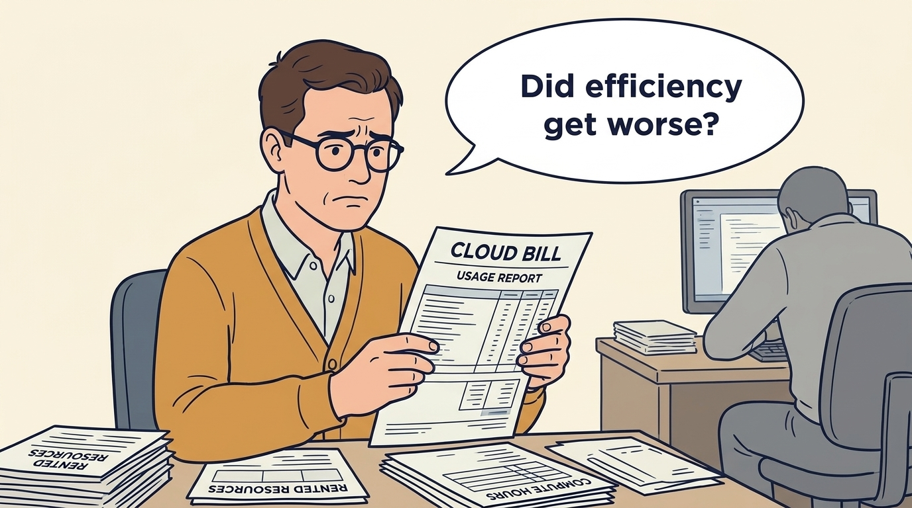
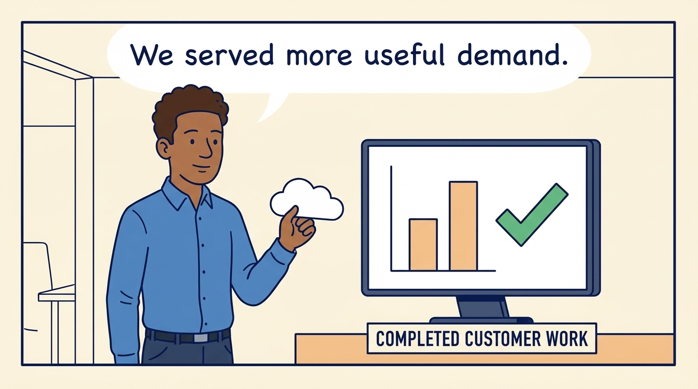
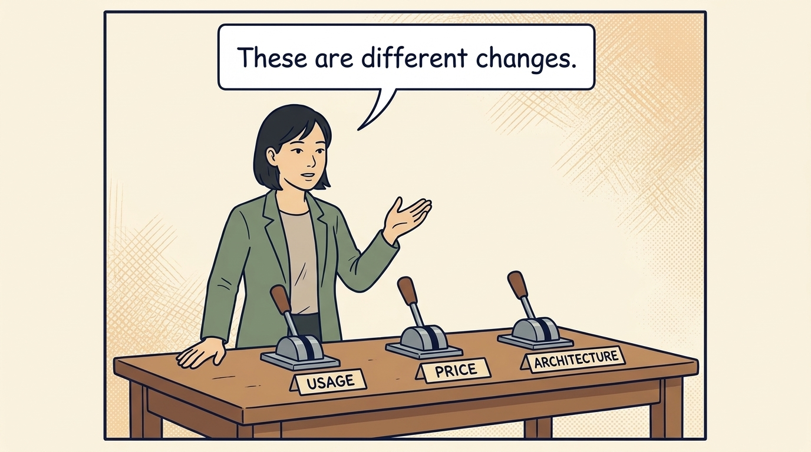
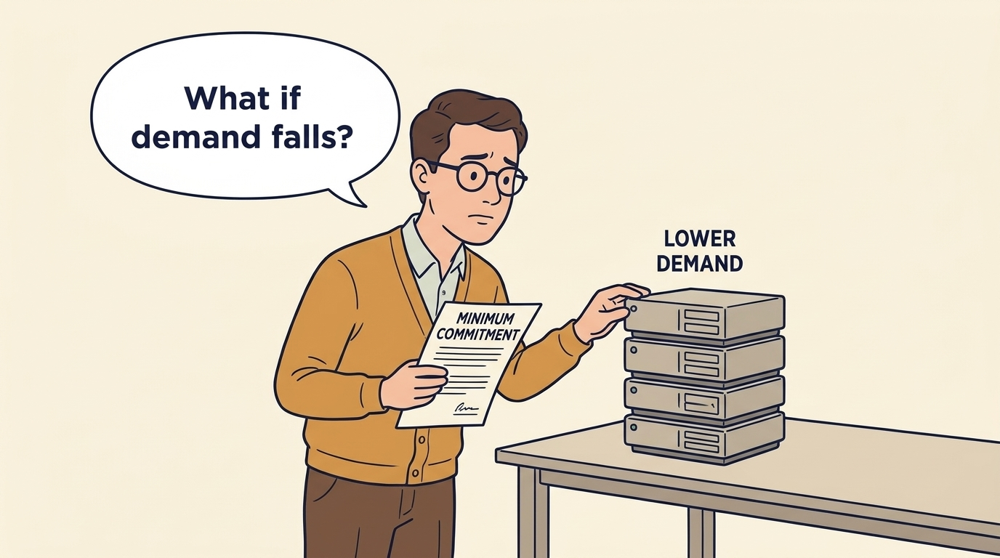
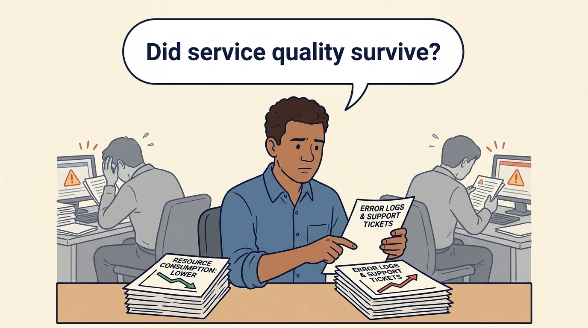
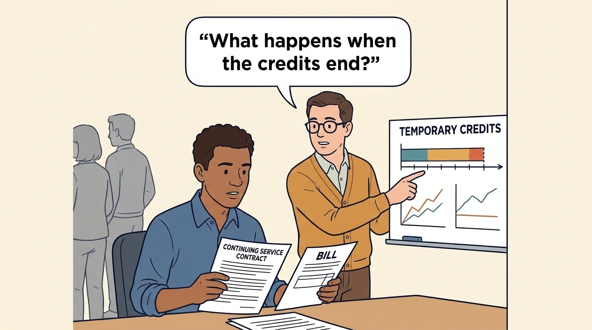

<!-- comic-style
{
  "cast": "MORGAN: a thoughtful investor technology adviser with short dark hair and a green jacket, used in the fund scenarios. ALEX: a practical CTO with curly hair and blue rolled-up sleeves. SAM: a CFO with round glasses and an amber cardigan. PRIYA: a product leader with straight dark hair and plum sleeves. INES: a CEO with short grey hair and a navy jacket. All are fictional; none represents a person in a real case.",
  "style": "Clean editorial explainer comic, dark ink outlines, restrained green, blue, and amber accents on warm white, generous space, readable short speech bubbles, expressive people and simple physical metaphors. No photorealism, logos, dense charts, or title text. Keep the same character appearances throughout the journal."
}
-->

**Comic.** Cloud spending draws investor attention because it is a large, adjustable cost whose reduction improves the earnings measures on which the company is valued. The panels show how the engineering team turns a cost target set from outside into a judgment about the service customers receive.

Morgan is an investor’s adviser in the fund scenarios; Alex leads technology, Priya leads product, and Sam leads finance. All are fictional. Comparative scenarios use separate assumptions. Historical cases are discussed through documents; the scenes do not reenact real events.

<!-- comic-panel
{
  "id": "01-scene",
  "status": "generated",
  "asset": "assets/images/10-cloud-economics/comic-01-scene.jpeg",
  "aspect_ratio": "16:9",
  "prompt": "Panel 1 of an explainer comic. Sam sees a larger cloud bill and frowns. Use one speech bubble with the exact words: \"Did efficiency get worse?\" Convey: Cloud services are rented computing resources. A larger bill alone does not show that the company has become less efficient.",
  "alt": "Comic panel: Sam sees a larger cloud bill and frowns.",
  "caption": "Cloud services are rented computing resources. A larger bill alone does not show that the company has become less efficient.",
  "generation": {
    "model": "gemini-3-pro-image-preview",
    "reference_id": "owned-cast-20260913",
    "sha256": "990cf9c7a8ef3bcbf802d64ab7be58c26db2a841043a734a5eff2598cc282b20"
  }
}
-->

**Panel 1:** Cloud services are rented computing resources. A larger bill alone does not show that the company has become less efficient.

*Dialogue:* “Did efficiency get worse?”

<!-- comic-panel
{
  "id": "02-scene",
  "status": "generated",
  "asset": "assets/images/10-cloud-economics/comic-02-scene.jpeg",
  "aspect_ratio": "16:9",
  "prompt": "Panel 2 of an explainer comic. Alex shows more successful customer transactions. Use one speech bubble with the exact words: \"We served more useful demand.\" Convey: Compare cost with useful work delivered. More successful customer transactions can reduce cost per transaction even when the total bill rises.",
  "alt": "Comic panel: Alex compares cloud usage with a monitor showing completed customer work.",
  "caption": "Compare cost with useful work delivered. More successful customer transactions can reduce cost per transaction even when the total bill rises.",
  "generation": {
    "model": "gemini-3-pro-image-preview",
    "reference_id": "owned-cast-20260913",
    "sha256": "05a7bb8f774f3da86e8f651b0eb43462f19a6b5da26b47311bebe44996fdd73c"
  }
}
-->

**Panel 2:** Compare cost with useful work delivered. More successful customer transactions can reduce cost per transaction even when the total bill rises.

*Dialogue:* “We served more useful demand.”

<!-- comic-panel
{
  "id": "03-scene",
  "status": "generated",
  "asset": "assets/images/10-cloud-economics/comic-03-scene.jpeg",
  "aspect_ratio": "16:9",
  "prompt": "Panel 3 of an explainer comic. Morgan separates usage, price, and architecture levers. Use one speech bubble with the exact words: \"These are different changes.\" Convey: Using fewer resources, paying a lower price and changing the software design are different changes with different costs and risks.",
  "alt": "Comic panel: Morgan examines three separate levers labeled usage, price and architecture.",
  "caption": "Using fewer resources, paying a lower price and changing the software design are different changes with different costs and risks.",
  "generation": {
    "model": "gemini-3-pro-image-preview",
    "reference_id": "owned-cast-20260913",
    "sha256": "a005ad00765e3fb4c22ec79ecfb9adaae743d8abfe6f948baa86cb3e77ea8ea1"
  }
}
-->

**Panel 3:** Using fewer resources, paying a lower price and changing the software design are different changes with different costs and risks.

*Dialogue:* “These are different changes.”

<!-- comic-panel
{
  "id": "04-scene",
  "status": "generated",
  "asset": "assets/images/10-cloud-economics/comic-04-scene.jpeg",
  "aspect_ratio": "16:9",
  "prompt": "Panel 4 of an explainer comic. Sam receives a discount tied to a heavy commitment. Use one speech bubble with the exact words: \"What if demand falls?\" Convey: A long contract may lower the rate while requiring payment for capacity the company no longer needs.",
  "alt": "Comic panel: Sam examines a minimum-commitment contract beside unused servers under a lower-demand label.",
  "caption": "A long contract may lower the rate while requiring payment for capacity the company no longer needs.",
  "generation": {
    "model": "gemini-3-pro-image-preview",
    "reference_id": "owned-cast-20260913",
    "sha256": "ea1845ba6250bc2492f828514ab2c3f9aef26ad23ec73ece95dcd0e89c6f6f57"
  }
}
-->

**Panel 4:** A long contract may lower the rate while requiring payment for capacity the company no longer needs.

*Dialogue:* “What if demand falls?”

<!-- comic-panel
{
  "id": "05-scene",
  "status": "generated",
  "asset": "assets/images/10-cloud-economics/comic-05-scene.jpeg",
  "aspect_ratio": "16:9",
  "prompt": "Panel 5 of an explainer comic. Alex checks errors beside lower resource consumption. Use one speech bubble with the exact words: \"Did service quality survive?\" Convey: A lower bill is an incomplete result if customers receive more errors or support teams inherit extra work.",
  "alt": "Comic panel: Alex checks errors beside lower resource consumption.",
  "caption": "A lower bill is an incomplete result if customers receive more errors or support teams inherit extra work.",
  "generation": {
    "model": "gemini-3-pro-image-preview",
    "reference_id": "owned-cast-20260913",
    "sha256": "4f6dfb7bd4fab7fa81091b880a9ec72bed000ec9e6c03135001ccbbd3bc247d0"
  }
}
-->

**Panel 5:** A lower bill is an incomplete result if customers receive more errors or support teams inherit extra work.

*Dialogue:* “Did service quality survive?”

<!-- comic-panel
{
  "id": "06-scene",
  "status": "generated",
  "asset": "assets/images/10-cloud-economics/comic-06-scene.jpeg",
  "aspect_ratio": "16:9",
  "prompt": "Panel 6 of an explainer comic. Sam points to the end of a temporary credit period while Alex reviews the continuing service. Use one speech bubble with the exact words: \"What happens when the credits end?\" Convey: Separate fictional credits example: a €30,000 monthly service bill falls to €5,000 for six months. The plan must still fund the cost after credits end and check any continuing contract.",
  "alt": "Comic panel: Sam points to the end of a temporary credit period while Alex reviews the continuing service.",
  "caption": "Separate fictional credits example: a €30,000 monthly service bill falls to €5,000 for six months. The plan must still fund the cost after credits end and check any continuing contract.",
  "generation": {
    "model": "gemini-3-pro-image-preview",
    "reference_id": "owned-cast-20260913",
    "sha256": "ee4cbe8250a11a57949a0275ae88fa257d8b38cafb42c60763e32414716844d3"
  }
}
-->

**Panel 6:** Separate fictional credits example: a €30,000 monthly service bill falls to €5,000 for six months. The plan must still fund the cost after credits end and check any continuing contract.

*Dialogue:* “What happens when the credits end?”
