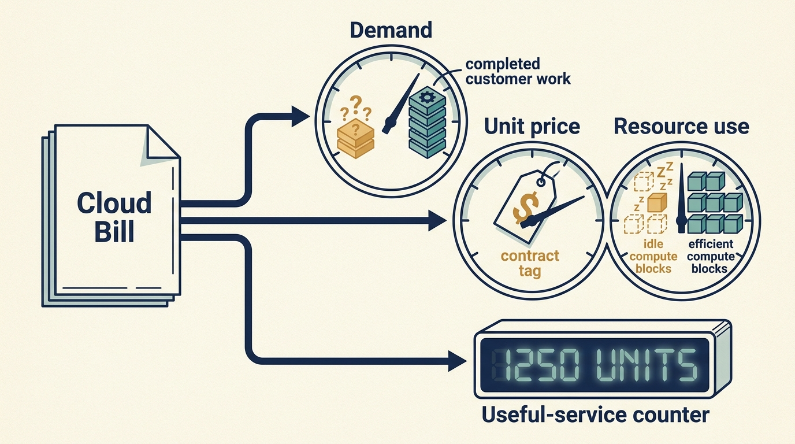
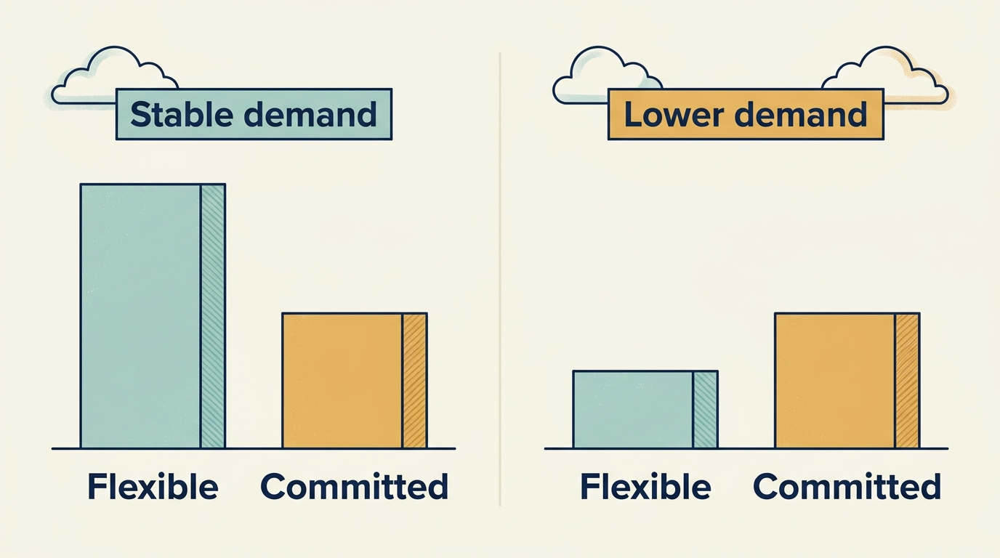

> **KEY POINTS:**
>
> * A smaller bill can have **several explanations**. Separate changes in demand, usage, prices and architecture before claiming an improvement.
> * Choose a **unit that reflects useful service**. Cost per completed transaction or comparable customer can reveal more than total spending alone.
> * **Savings must survive the full decision**. Include commitments, migration effort, service quality and the ability to change course when demand changes.

 
**Cloud services** provide computing resources, storage and related services rented from a supplier. A company’s cloud bill falls by 20%. Has its operation improved?

Perhaps unused resources were removed. Perhaps traffic fell because customers left. Perhaps spending moved into another account. Perhaps a large upfront commitment lowered the monthly invoice while increasing long-term exposure. The number is a starting observation, not a conclusion.

Cloud spending attracts investor attention because it is a large, visible and adjustable cost, and reducing it improves the earnings measures on which the company is valued. That makes a cost target easy to set from outside the engineering team and hard to refuse. The engineering leader’s contribution is to show what a cheaper bill means for the service customers receive, and whether a saving that looks good at the next review would still look good at a sale.

The previous chapter compared the earnings, cash and design views of one proposal. Here we apply that approach to cloud spending. We first choose a meaningful unit of service, then separate the reasons costs change, and finally check the saving alongside service quality.

**Unit economics** means examining revenue or cost for a meaningful unit of activity, such as a completed transaction or customer account. FinOps is the practice of managing technology's financial value through collaboration among engineering, finance and business teams. The FinOps Foundation's unit-economics guidance connects technology costs to organizational outcomes and distinguishes resource efficiency from business unit measures. [S16: FinOps unit economics](https://www.finops.org/framework/capabilities/unit-economics/) For a company leader, this provides a useful bridge between infrastructure work and the cash and margin questions discussed in [[cash-and-constraints]].

## Choose a Unit That Explains the Business

Cost per **virtual machine**, a software-defined computer running on shared hardware, can help an infrastructure team. Cost per completed customer transaction may help management understand delivery economics. Cost per active account may help a subscription product, provided accounts have sufficiently comparable usage. No single unit works for every product.

A fictional company spends €100,000 per month to process one million successful transactions: €0.10 each. After growth, spending rises to €120,000 while successful transactions rise to 1.5 million: €0.08 each. Aggregate cost rose 20%; unit cost fell 20%. Whether this is desirable also depends on revenue per transaction, quality, customer mix, and the investment needed to support the growth.

Now imagine the bill instead falls to €80,000 because transaction volume falls to 500,000. Unit cost rises to €0.16. A cost-saving headline would obscure a deterioration in the business's ability to spread its costs.

These simple examples show why a cost target should be attached to a service and demand assumption. They do not establish that all infrastructure costs vary proportionately with usage.

## Separate Usage, Rates and Architecture

Infrastructure improvement can come from using fewer resources for the same work, paying a different rate, or changing how the product performs the work. These mechanisms have different risks.

Removing unused resources can yield relatively direct savings. **Rightsizing** — matching provisioned capacity to actual demand — needs evidence about peaks and service requirements. Rate commitments can be valuable when demand is predictable, but flexibility has an economic value too. Architectural change can improve efficiency while introducing migration, reliability, and maintenance costs.

**Do not count the same saving twice**. If rightsizing reduces the volume eligible for a discounted commitment, the two headline opportunities are not necessarily additive. A model should apply changes in a stated order and calculate the combined result.

**Figure 1:** *Separate why the bill changed before deciding whether the service became more efficient.*

## A Multi-Year Commitment Changes Future Spending

A fictional service needs €50,000 of resources each month at flexible rates. A commitment promises a discount but obliges the company to pay for capacity over a fixed period. The correct comparison includes plausible demand paths, alternative architectures, acquisition plans, and the possibility of selling or separating the business.

For example, assume a fixed monthly commitment of €35,000 replaces the €50,000 flexible bill. At unchanged demand, the saving is €15,000 a month. If demand falls so that flexible spending would be €20,000, the same commitment costs €15,000 more a month, assuming it cannot be reduced or used elsewhere.

A discount on unused capacity is still an expense. A commitment that cannot transfer on a carve-out can become a **stranded cost**: one the company still owes but no longer benefits from. A contract that makes switching expensive can be reasonable, but the loss of flexibility should be visible when it is approved.

Product and engineering leaders should involve **procurement**, the people responsible for buying and negotiating supplier services, and finance early. Engineering understands usage and migration feasibility. Finance understands payment timing and accounting. Procurement and legal specialists interpret commercial terms. None of those views is sufficient by itself.

**Figure 2:** *Test the commitment against lower demand as well as the forecast that makes it attractive.*

## Prove the Saving Actually Arrived

Before a cost initiative starts, define the **baseline**, the starting costs and demand used for comparison. Estimate what spending would have been without the initiative, and state which costs are included. Distinguish three quantities:

- **Identified opportunity:** a model of what might be saved.
- **Implemented change:** resources or contracts actually changed.
- **Realized economic effect:** observed net expenditure or avoided expenditure, with costs and demand changes reconciled.

A capacity reduction may avoid a forecast increase rather than reduce this month's bill. That can be valuable, but the forecast and its uncertainty should remain visible. Similarly, reducing internal support effort does not automatically reduce payroll.

An initiative record should include implementation labor, specialist fees, tooling, the cost of running old and new services together, and ongoing maintenance. A payback calculation must include **the work required to capture savings**.

## Protect the Service the Customer Bought

The easiest way to reduce some costs is to reduce the service. Whether that is acceptable is a product decision. Less **redundancy**, meaning fewer spare components or alternative ways to keep operating, longer processing windows, or reduced support coverage can change the customer's experience and the company's risk.

Define service conditions alongside the cost target. Track successful work completed, **latency**, the time a user waits for a response, where it matters, error rates, recovery performance, and customer complaints. The exact measures should follow the product promise. A low-cost service that cannot complete a customer's essential workflow has poor economics even if the infrastructure dashboard looks efficient.

This is especially important after acquisitions. A group's aggregate purchasing power can reduce rates, while the cost of moving a small acquired company onto a common platform can outweigh the saving. Compare the full migration case rather than applying the group's negotiated discount to the acquired company's bill and calling the result a **synergy**, a benefit attributed to combining the businesses.

## Credits and Group Discounts Can Conceal the Continuing Cost

In a separate fictional Larkspur scenario, temporary cloud credits reduce a €30,000 monthly service bill to €5,000 for six months. The underlying service still consumes €30,000 of resources at the stated prices. A plan extending beyond the credits needs to show the later cash requirement. Compare customer economics with and without the subsidy before describing the service as profitable.

An investor may introduce a provider or a corporate parent may offer a group discount. Ask which entity signs, whether minimum spend applies and what happens if ownership changes or the product moves to another provider. The help can be useful while also creating a commitment the company must carry after the relationship changes.

For a team awaiting another funding round, a three-year purchase commitment deserves a different approval discussion from flexible spending on a small trial. For a funded expansion, stable demand may justify a commitment after a downside comparison. Include who benefits from the price reduction and who bears unused capacity. The investor’s procurement access is an input to the decision, not its conclusion.

## Portfolio Comparisons Need a Cohort

Cloud cost as a percentage of revenue mixes technical efficiency, pricing, product margin, service model, and company maturity. It can identify a question worth investigating. It rarely answers the question by itself.

A **cohort** is a group selected for comparison. A useful one matches business model, scale, workload, geography, accounting treatment, and the services included. Even then, a small portfolio offers limited statistical confidence. A company may spend more because its product performs more valuable work or because it is inefficient. Diagnosis must distinguish the two.

An investor’s peer network may help you find comparable services and people who have faced the same cost decision. Ask what you would learn and what participation would require from your team. Start with a small comparison that can change a decision, keeping company permissions and differences visible. Part IV develops that use of shared experience in [[investor-support]].

A useful cost improvement has an explanation the company can check: what changed, how demand affected the comparison, what the transition cost and whether service remained acceptable. The team should be able to repeat that assessment as conditions change.

Some spending protects against uncertain future harm instead of lowering a known bill. The next chapter explains how to assess security and recovery work on that basis: [[security-and-resilience]].

## Questions to Consider

1. What unit of useful service does your cost per unit describe, and would that unit make sense to your CFO and to your customers?
2. When your infrastructure bill last changed, how much came from usage, rates, architecture or demand? Were any savings counted twice?
3. Which of your commitments would become stranded cost if demand fell, the product moved or the company were separated from its owner?
4. For your last cost initiative, can you separate the identified opportunity, the implemented change and the realized economic effect?
5. Which service measures are tracked alongside your cost target, and who decides whether a cheaper service is still the service the customer bought?
6. What temporary credits or group discounts are concealing the continuing cost of your services, and what happens when they end?
