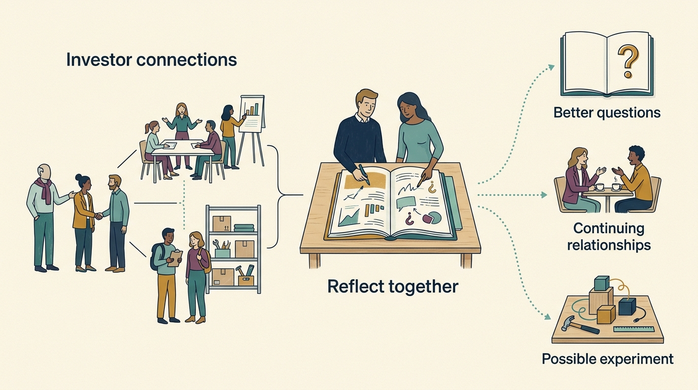
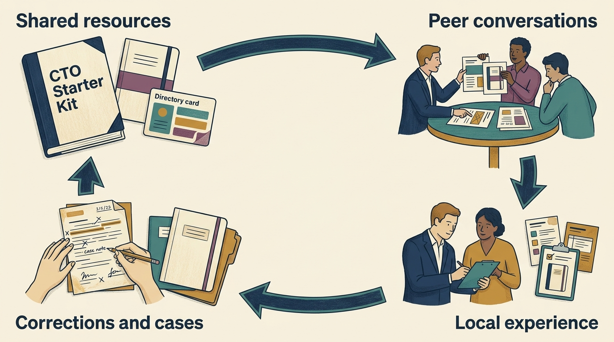

> **IN THIS SECTION, YOU WILL:** Learn to choose useful learning opportunities, build continuing relationships with peers and bring outside experience into your company with its context intact.

> **WHY INVESTORS CARE:** An investor puts money into businesses expecting a financial return, and often knows people across the businesses it has funded. Helping their leaders learn can strengthen those businesses and spread experience between them. Bringing people together also builds the investor’s relationships and reputation. Those interests can support useful learning, provided the participants have room to shape it.

> **WHY YOU SHOULD CARE:** Your company’s plans depend partly on what you know and whom you can ask. An investor’s network, the people and organizations it can introduce you to, can widen both, including in areas where you have not yet recognized which questions are worth asking.

> **KEY POINTS:**
>
> * **Make room for discovery.** Some learning answers an existing question; some reveals a possibility or assumption you had missed. Both deserve time and attention.
> * **Match the experience to the learning.** A seminar, a recurring peer group and a visit to an unfamiliar business setting offer different kinds of access. Consider who will be there, how deep it goes, how much time it takes and whether you can follow up.
> * **Bring the context and relationships home.** Share what you observed, examine what could transfer and keep useful conversations alive. Company leaders decide what becomes funded work.

 

In April 2026, Prosus, a global technology investor, took 20 founders of technology companies on a five-day visit to Shenzhen, Shanghai and Beijing. The purpose was to explore China’s ecosystem for artificial intelligence (AI): the connected companies, people and services around software that learns patterns from data and produces predictions, text or suggestions. Prosus’s account of the trip describes participants **reconsidering their assumptions** about how technology reaches everyday use, and **reflecting on their own companies**. [S101: Prosus, A Window on China. A Mirror on Ourselves.](https://www.prosus.com/news-insights/2026/a-window-on-china-a-mirror-on-ourselves)

On a trip like this, the organizer provides **access to unfamiliar people and practices**; the participants work out what those encounters might mean for them.

The leadership question is broader than whether to accept a particular invitation: **how can an investor help you learn something your existing routines would leave undiscovered?**

## Give Discovery a Place Alongside Problem Solving

When the steps your team follows to ship a software update keep failing, you can ask a peer how they improved theirs. The need is already visible. A visit to an unfamiliar business can work differently: watching how people use its software may reveal that your team has been asking too narrow a question.

**Learning for a decision** helps with a question already on the table. **Exploration** exposes you to possibilities and assumptions you do not yet know how to assess. **Building relationships** gives you people to return to when either kind of question develops. One event can serve all three, but its design should reflect the purpose.

For a purchasing decision, ask for relevant experience with the specific problem. For exploration, choose some encounters outside your usual sector or geography and leave time to make sense of surprises. For relationships, look for repeated conversation and the chance to contribute your experience. A promising connection may become useful long after the meeting that created it.

Agree how much time the company can give to learning without demanding a predetermined answer. A leader who must return with an immediate project may mistake the most impressive demonstration for the most relevant opportunity. A leader with permission to return with sharper questions can investigate before committing.

**Figure 1:** *Connections create opportunities to learn. Shared reflection can produce better questions, continuing relationships or an experiment; an encounter does not automatically produce a business result.*

## Understand What the Investor Can Contribute

An investor’s **portfolio** is the collection of businesses it has invested in. Across those businesses, people may have faced similar decisions at different stages. The investor may also have **relationships** with specialists, researchers, suppliers and companies outside its portfolio.

Someone recognizes a **shared question**, finds people with relevant experience, persuades them to participate and creates enough space for a useful conversation. Someone also keeps the connection alive afterward. A list of contacts helps less when nobody knows who is willing to speak or what they actually understand.

Ask for access in terms people can act on: “Could you introduce our product and support leads to someone who has put AI suggestions into a customer’s everyday work steps? We want to understand how users check and correct them.” For a more exploratory request, name the boundary you want to cross: “Our view comes mostly from software European organizations buy to run their work. We would like to see how businesses elsewhere put similar capabilities into everyday use.”

An investor may arrange this faster than you could alone. Professional associations, public conferences, open projects and your contacts remain useful routes. Compare relevance and access, and keep relationships beyond one investor’s circle. The network you develop should remain useful as roles and ownership change.

## Choose the Format for the Learning You Need

These formats overlap. The useful distinction is what participants can do within them and what it takes to carry the learning forward.

| Format | What it can make possible | What to look for |
| --- | --- | --- |
| **Knowledge sharing**: case notes, demonstrations, office hours (set times when an expert is available for questions) | Reuse a practical lesson and find someone to question about it | The problem, circumstances, failed attempts and a person who can explain the details |
| **Seminars and workshops** | Understand a topic; practise a method with guidance | Relevant expertise, time for questions and, for a workshop, an exercise using a realistic problem |
| **Investor summits** | Meet peers across companies and discover shared concerns | Small conversations alongside presentations, participant-led topics and a route to stay in contact |
| **Conferences** | Encounter wider developments and people outside the portfolio | A few purposeful meetings, time to explore and space to distinguish a demonstration from everyday use |
| **Peer communities** | Revisit difficult decisions with people who learn each other’s circumstances | Continuity, reciprocity (members give and receive help), candid discussion and members helping set the agenda |
| **Road trips and ecosystem visits** | Observe unfamiliar practices where they happen and question assumptions | Access to people doing the work, varied hosts and time between visits to reflect |

Balderton, an investor in European technology companies, describes a useful connection between formats. A discussion of engineering team structures in its forum for chief technology officers (CTOs), the executives responsible for a company’s technology, led to a virtual summit in May 2020 with 99 technology leaders, including small-group sessions. [S102: Balderton, Collective CTO Summit](https://www.balderton.com/news/the-balderton-collective-cto-summit-bringing-100-ctos-together-online/)

Insight Partners, a large investor in software companies, describes its Onsite Hour: a weekly online series of discussions and workshops, open to employees of its portfolio companies, with recordings available through the online platform it runs for those companies. These are the organizers’ descriptions of their offers, not independent measurements of effectiveness. [S103: Insight Partners, Onsite Hour](https://info.insightpartners.com/onsitehour.html)

An hour with a relevant practitioner can resolve a focused uncertainty. A longer visit may be justified when the purpose is to understand a setting you barely know. Match the commitment to the purpose; distance and prestige are weak guides to usefulness.

## Build a Community People Can Return To

A **community of practice** is a group whose members develop their ability to do something through continuing interaction. Etienne and Beverly Wenger-Trayner describe three elements: a shared area of concern, relationships that support learning and a developing body of practice. That helps explain why a directory or discussion channel needs active use to become a learning community. [S104: Wenger-Trayner, Communities of practice: a brief introduction](https://www.wenger-trayner.com/wp-content/uploads/2022/01/07-Brief-introduction-to-communities-of-practice.pdf)

For an investor-supported engineering community, begin with a few decisions members actually face. Invite someone to bring an unfinished problem or an approach that failed. Let the others ask about customers, team size, constraints and what happened next. Return to the issue later. Members learn whether the advice helped, and the person asking avoids explaining the whole company again.

**Reciprocity makes the relationships worth maintaining.** Share an experience, offer an introduction with the other person’s agreement or explain why a suggested approach did not fit. People a little further along in one area may need your experience in another. Senior leaders also benefit from peers with whom they can admit uncertainty without making every conversation an internal performance signal.

The investor can fund facilitation, connect participants and protect continuity while members help choose the agenda. Agree who attends, what may be quoted with a person’s name and what reaches the investor’s own staff who assess and manage its investments (its investment team). If a session includes assessment of company performance, make that purpose explicit; [[investors-adviser]] explains the different responsibilities involved. Avoid circulating customer information or identifiable employee details just because the companies share an investor.

Keep participation relevant and accessible. Online sessions, different time slots and appropriate written notes let more people contribute. Recordings suit some teaching sessions; candid peer discussions may need agreed summaries instead.

## Keep Learning Available Between Meetings

A short case note can preserve the original question, the company circumstances, what was tried, what happened and whom to contact. A small, maintained collection gives the next person a starting point. Date the material, name a reviewer and keep the conditions attached to any recommendation.

My project **CTO Starter Kit** is one example of organizing resources for engineering leaders. Its [public start page](https://ctostarter.com/start/index.html) brings guidance and tools together. Its project files are published in a public [GitHub repository](https://github.com/zeljkoobrenovic/cto-starter-kit). Those files include a directory of communities where engineering and product leaders can find peers. They also include dashboards: summary displays that rate a company’s security, management, operational and engineering controls. Controls are the practices and checks that keep a company’s work safe and reliable. The material for a leader’s first 90 days gives learning about the company an explicit place in that leader’s work. [S105: CTO Starter Kit](https://github.com/zeljkoobrenovic/cto-starter-kit)

An investor-supported community could use that approach to maintain a shared starting point, add cases from its members and connect people with relevant peers. That is a proposed application of the project, not a claim that an investor has adopted it. Company-specific adaptations would need their own evidence and review; a dashboard’s rating does not establish that a practice works.

A seminar can point to a resource; a peer discussion can expose a missing example; a member can contribute a correction after trying it. **The resource supports the conversation, and the conversation keeps the resource useful.**

**Figure 2:** *A proposed pattern for an investor-supported community: resources such as CTO Starter Kit support conversations, and members’ experience gives them useful cases and corrections to share.*

## Prepare to Learn, Then Examine What Transfers

Before accepting an invitation, write a few questions and identify who should participate. Include the people who would interpret or use the learning, where access permits. A product leader and an engineer may notice different things in the same demonstration; a customer-support colleague may see why customers would struggle to take it up, which both might miss.

Make the commitment visible through the company’s ordinary approval process. Establish who pays for travel and attendance, the time away, coverage of ongoing work and time for follow-through. If the investor pays some expenses, the company pays less, but the company still supplies substantial attention. Consider a recording, a smaller visit or a direct introduction when these provide the access you need. For exploration, reserve some unstructured time rather than scheduling every minute around a question you already have.

During a visit, distinguish **what you saw, what a host told you and what you conclude from it**. Ask to see how the work runs on an ordinary day, what fails and what had to be built first. The visible software may depend on prepared data, experienced staff or a route to customers that your company lacks. A demonstration can suggest a question without answering whether the approach is reliable in daily use.

An itinerary selects what you see. Talk with the people doing the everyday work as well as the founders and, where possible, customers and people whose experience differs. An impressive host represents one setting; you need more evidence before generalizing to an industry or a country.

Back at the company, discuss the observations with people who did not attend. Their objections can reveal a missing condition. Keep an intriguing idea open, investigate something the approach depends on, test a small part or decide that the practice does not fit. **Attendance authorizes learning; implementation follows the company’s usual decision process.**

## A Fictional Team Brings a Better Question Home

Northline is a fictional company. It makes inventory software, which tracks the goods a business holds in stock, for small wholesalers: businesses that buy goods in quantity and sell them on to shops and other businesses. Mira leads product, deciding what the software should do; Tomas leads engineering, the team that builds it. This is an independent example, separate from the book’s Larkspur budget and calendar.

The team is considering reorder suggestions generated by AI: the software would look at past sales and current stock levels and recommend which products to buy again and how many. Its investor offers a place on a broad five-day international tour, an online seminar or introductions for a two-day regional visit to businesses whose staff use similar systems every day. Mira and Tomas want to understand how those people decide whether to accept a suggestion during a busy working day.

They choose the regional visit because the hosts agree to show their everyday work steps and discuss exceptions. The seminar could introduce the topic, but it would offer less access to the people doing the work. The wider tour could support broader exploration; its itinerary gives less time to this question. If that access falls through, they will use the seminar and arrange a follow-up conversation instead.

The investor arranges the introductions without a programme fee. Northline’s chief executive approves up to **€1,200 from the existing learning budget** for travel and accommodation and **six person-days**, one person-day being one person’s working day: two days covering travel and visits plus one day of preparation and follow-through for each of the two leaders. These are illustrative limits. Existing paid time is reassigned; a review of a potential supplier moves back one week, with no customer delivery date changed.

At one host, Mira sees suggested orders reviewed inside the screen staff already use to manage stock. She initially attributes acceptance to the quality of the AI. The person who places the orders explains that reliable product records (correct product codes, pack sizes and stock counts), clear reasons for each suggestion and an easy way to change it matter as much in daily work. This is the host’s explanation, which the visitors have not independently tested.

**Figure 3:** *The fictional visit changes Northline’s question. The observed work steps, the host’s explanation and the varying records of Northline’s customers remain distinct; the next step is further inquiry with those customers.*

At their return discussion, Northline’s support lead points out that the product records of Northline’s customers vary considerably: some keep complete product codes and stock counts, others do not. The team reframes its question: “What information and control would our customers need to trust a reorder suggestion?” Mira adds that question to already scheduled customer interviews. Tomas asks the host for another conversation about handling poor records. They have not committed to a feature that places orders without a person approving each one, and they have not established any saving.

A month later, the learning review asks what the interviews clarified and whether the host’s experience still helps. It may lead to a small trial version of the feature (a prototype), more investigation or a decision to leave the idea alone. The first contribution of the visit was a more grounded question and someone willing to keep discussing it.

## Notice Value Without Forcing a Return Calculation

Not every learning activity needs a calculation of its financial payoff. For a focused seminar, ask whether participants can explain or use the method. For exploration, ask which assumptions changed, what remains uncertain and which new questions merit attention. For a community, look for people returning with real problems, useful replies and relationships continuing between organized sessions.

Attendance and satisfaction can help improve an event. Stronger evidence comes from following a particular contribution: a decision reconsidered, a practice adapted, a mistake recognized or a peer contacted when circumstances changed. If there is a later business result, describe the team’s work and other influences before crediting it to the investor’s programme. A useful connection does not make every subsequent improvement its result.

Keep the review light enough that people can be honest. Learning may confirm the current direction, expose a disappointing offer or produce no useful follow-through. Repeated irrelevance is a reason to change the format, participants or provider. A valuable unresolved question is a reason to stay curious.

## Write a Small Learning Brief

Use a few lines before and after the experience: **what we want to understand; who should participate; the time and cost; what we observed; what might transfer; whom we will stay in touch with; and what we will revisit next**. Leave room for surprises. [Tool 14 in the practical toolkit](toolkit.html#tool-14) provides a reusable version.

The previous chapter, [[operating-model-blueprints]], established the working arrangement with the investor. Learning through that relationship may reveal a need for more specific help. Continue with [[help-that-changes-capability]] to compare sources for that need, then [[useful-engagement]] to agree any assignment. [[tech-operating-partner]] explains how a wider investor-side team can sustain these connections; [[ai-strategy-three-questions]] helps separate the investment decisions that an AI encounter may prompt.

## Questions to Consider

- Which assumption about your customers, technology or organization has never been tested outside your usual circle?
- What access could your investor arrange, and which alternative route is also worth trying?
- Who should participate so the learning reaches the people doing the work?
- Can peers discuss uncertainty candidly, and do they know how their contributions will be shared?
- What would you want to revisit in a month even if the immediate result were only a better question?

## To Probe Further

The Prosus, Balderton and Insight Partners sources above describe their own learning activities. Wenger-Trayner provides the conceptual account of communities of practice. CTO Starter Kit is the author’s resource project. [[bibliography]] records the consulted scope of S101–S105. The learning brief, format comparison and Northline example are proposed ways to reason about participation, not validated programmes or measured outcomes.
