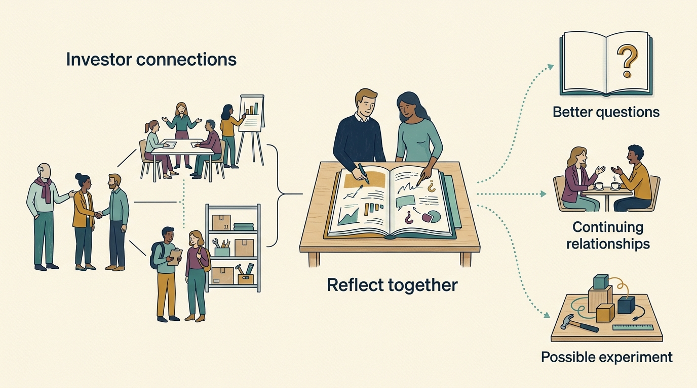
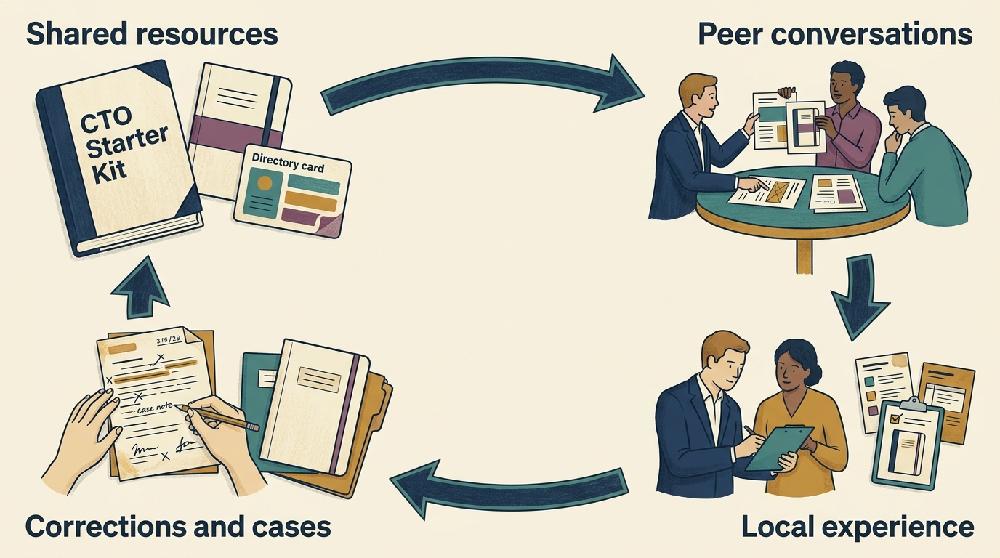

> **IN THIS SECTION, YOU WILL:** Learn to choose useful learning opportunities, build continuing relationships with peers and bring outside experience into your company with its context intact.

> **WHY INVESTORS CARE:** An investor puts money into businesses expecting a financial return, and often knows people across the businesses it has funded. Helping their leaders learn can strengthen those businesses and spread experience between them. Bringing people together also builds the investor’s relationships and reputation. Those interests can support useful learning, provided the participants have room to shape it.

> **WHY YOU SHOULD CARE:** Your company’s plans depend partly on what you know and whom you can ask. An investor’s network, the people and organizations it can introduce you to, can widen both, including in areas where you have not yet recognized which questions are worth asking.

> **KEY POINTS:**
>
> * **Make room for discovery.** Some learning answers an existing question; some reveals a possibility or assumption you had missed. Both deserve time and attention.
> * **Match the experience to the learning.** A seminar, a recurring peer group and a visit to an unfamiliar business setting offer different kinds of access. Consider who will be there, how deep it goes, how much time it takes and whether you can follow up.
> * **Bring the context and relationships home.** Share what you observed, examine what could transfer and keep useful conversations alive. Company leaders decide what becomes funded work.

> **[DYSFUNCTIONS THIS SECTION ADDRESSES](where-investment-goes-wrong.html):**
>
> * **The Dusty Address Book** — Turns access to events, peers and unfamiliar businesses into purposeful conversations and continuing relationships.
> * **Borrowed Brains** — Brings outside learning and its context back to the team instead of leaving it with one participant.

 

In April 2026, Prosus, a global technology investor, took 20 founders of technology companies on a five-day visit to Shenzhen, Shanghai and Beijing to see how artificial intelligence (AI) is built and used in China. They met the companies building AI, the people running them and the services that put AI in front of customers. Prosus's account of the trip says the founders came back **questioning their assumptions** about how quickly a technology moves from the lab into daily use, and **asking what that meant for their own companies**. [S101: Prosus, A Window on China. A Mirror on Ourselves.](https://www.prosus.com/news-insights/2026/a-window-on-china-a-mirror-on-ourselves)

On a trip like this, the investor opens doors: it gets founders into rooms with **companies, executives and practices they could not reach on their own**. What those meetings mean for each company is left to the founders. Nobody hands them conclusions; they have to work out which lessons apply at home and which do not.

The previous chapter, [[plan-investor-support]], agreed what the company asks of the investor and how the two sides work together. This chapter turns to a different use of the same relationship: **learning**. An investor's network of portfolio companies, peers and experts can teach a technology leader things no internal meeting will, provided the lessons are chosen deliberately and brought home with their context.

The leadership question is not just whether to say yes to a study trip, a peer roundtable or an introduction. It is broader: **how can an investor help you learn what your own routines would never surface?** Weekly reviews, customer calls and team retrospectives show you your own company. They rarely show you how other companies solved the problem you are about to face.

## Make Time to Explore, Not Only to Fix Known Problems

Some learning starts from a **known problem**. If releases keep breaking, you can ask a peer how they made theirs reliable: you know what you need, so you know whom to ask. Other learning starts from **curiosity**. Visiting a company in a different market and watching how its customers use its software may show you that your team has been solving the wrong problem. For example, you may be polishing a feature that customers there skip entirely. You would never have asked about it, because you did not know it was a question.

Investor-network learning serves three different purposes. **Learning for a decision** answers a question already on the table, such as which cloud provider to move to or how to structure an on-call rota. **Exploration** shows you ideas and assumptions you cannot yet judge, such as how AI agents are changing customer support elsewhere. **Building relationships** gives you people to call later, when either kind of question comes up. One event can serve all three, but each purpose needs a different setup: a decision needs the right expert and a prepared question; exploration needs time to look around; relationships need repeated contact.

Match the request to the **purpose**. For a decision, such as **choosing a vendor**, ask the investor for someone who has solved that exact problem, not a general expert. For **exploration**, pick some meetings outside your usual sector or country, and block time afterwards to make sense of what surprised you. For **relationships**, look for formats that bring the same people together more than once, and offer your own experience in return. A contact made this way may matter a year later, when a question arises that neither of you foresaw.

Agree with the CEO, before the trip, how much time you may spend on learning that does not have to produce an answer straight away, for example a few days a quarter. A leader who must come back with a ready-made project will be tempted to pick whatever looked most impressive in a demo, even if it does not fit the company. A leader allowed to come back with sharper questions can test an idea on a small scale first and commit only once it has proved relevant.

**Figure 1:** *Connections create opportunities to learn. Shared reflection can produce better questions, continuing relationships or an experiment; an encounter does not automatically produce a business result.*

## Understand What the Investor Can Contribute

An investor's **portfolio** is the set of companies it has invested in. Leaders in those companies have often faced the decisions you face now, such as a first security audit, a move to a new cloud setup or hiring a first head of data, sometimes a year or two before you. Beyond the portfolio, the investor also has **relationships** with specialists, researchers, suppliers and other companies it can introduce you to.

**A network does not run itself**. Someone, usually a person on the investor's platform team, has to notice that several companies share a **question**, such as how to price an AI feature. They then find the people who have real experience with it, persuade them to take part and set up a session long enough for an honest conversation. Afterwards, someone has to **keep the contacts in touch**. A bare list of names helps little when nobody knows who is willing to talk or what each person actually knows.

Make requests **specific enough** that the investor's team can act on them the same week. Name who should meet whom, about what, and what you want to learn: "Could you introduce our product and support leads to someone who has built AI suggestions into the daily tasks of their customers' staff? We want to understand how users check and correct those suggestions." For an exploratory request, name the blind spot you want to look past: "Almost everything we know comes from business software sold to European companies. We would like to see how companies in other markets have put similar AI features into everyday use."

An investor can often set up such a meeting in days where you might need months. It is **not the only route**, though. **Professional associations**, public **conferences**, open-source projects and your own contacts can reach people the investor does not know. For each question, compare which route gets you to the most relevant people fastest, and keep relationships outside the investor's circle. Investors sell their stakes and leaders change jobs; your network should still work when either happens.

## Pick the Format That Fits the Question, from Office Hours to Study Trips

Investors offer several learning formats, and they **overlap**: a summit may include workshops, and a peer community may organize a trip. Rather than sorting events by label, ask two practical questions of each: what can you actually do there (listen, practise, ask, compare notes), and what will it take afterwards to turn what you learned into a change at your company? The table below compares the common formats on those terms.

| Format | What it can make possible | What to look for |
| --- | --- | --- |
| **Knowledge sharing**: case notes, demonstrations, office hours (set times when an expert is available for questions) | Reuse a practical lesson and find someone to question about it | The problem, circumstances, failed attempts and a person who can explain the details |
| **Seminars and workshops** | Understand a topic; practise a method with guidance | Relevant expertise, time for questions and, for a workshop, an exercise using a realistic problem |
| **Investor summits** | Meet peers across companies and discover shared concerns | Small conversations alongside presentations, participant-led topics and a route to stay in contact |
| **Conferences** | Encounter wider developments and people outside the portfolio | A few purposeful meetings, time to explore and space to distinguish a demonstration from everyday use |
| **Peer communities** | Revisit difficult decisions with people who learn each other’s circumstances | Continuity, reciprocity (members give and receive help), candid discussion and members helping set the agenda |
| **Road trips and ecosystem visits** | Observe unfamiliar practices where they happen and question assumptions | Access to people doing the work, varied hosts and time between visits to reflect |

**Formats can feed each other**. Balderton, an investor in European technology companies, runs a forum for chief technology officers (CTOs), the executives responsible for a company's technology. When a forum discussion about how to structure engineering teams drew strong interest, Balderton turned it into a larger event: a virtual summit in May 2020 with 99 technology leaders, split into small-group sessions so people could talk, not just listen. A question raised in a small peer group became an event for a much wider circle. [S102: Balderton, Collective CTO Summit](https://www.balderton.com/news/the-balderton-collective-cto-summit-bringing-100-ctos-together-online/)

Some investors **make learning a regular habit** rather than a one-off event. Insight Partners, a large investor in software companies, runs **Onsite Hour**: a weekly online series of discussions and workshops open to anyone working at its portfolio companies. Sessions are recorded and posted on the online platform Insight runs for those companies, so people who miss one can watch it later. Both examples come from the investors' own descriptions; nobody has independently measured how much participants actually learn. [S103: Insight Partners, Onsite Hour](https://info.insightpartners.com/onsitehour.html)

Size the effort to the question. If you need to know how another company handled a database migration, an hour's call with the engineer who led it will usually settle it. A week-long trip is worth it only when you need to understand a market or way of working you barely know, where reading and calls cannot show you enough. A faraway destination or a famous host does not make a trip more useful; what matters is **whether it answers your question**.

## Build a Community People Can Return To

A **community of practice** is a group of people who get better at something by working on it together over time, such as CTOs who meet monthly to compare how they run engineering. Etienne and Beverly Wenger-Trayner, who developed the idea, name three ingredients: a **shared topic** the members care about, **relationships close enough** that people ask each other for help, and a **growing stock of shared practice**, such as tools, stories and ways of solving problems. This explains why a member directory or a chat channel is not yet a community: until people use it to work through real problems together, nobody learns much from it. [S104: Wenger-Trayner, Communities of practice: a brief introduction](https://www.wenger-trayner.com/wp-content/uploads/2022/01/07-Brief-introduction-to-communities-of-practice.pdf)

If you help run an engineering community in your investor's network, start from a few decisions members are actually facing, such as whether to split a monolith or how to introduce on-call. At each session, ask one member to bring an unsolved problem or an approach that failed. Let the others **ask about the context first**: the customers, the team size, the constraints and what happened next. Then come back to the same problem at a later session. Everyone learns whether the advice worked, and the member who raised it does not have to explain their company from scratch again.

**Relationships last when help flows both ways.** Give as well as take: share what happened when you tried something, introduce a contact (after checking they agree) or explain why an approach someone suggested did not work for you. A peer who is a year ahead of you on hiring may be a year behind you on security, so each of you has something the other needs. Senior leaders also need peers outside their company, where they can admit "I don't know what to do here" without it being read as weakness by their own team, CEO or board.

Split the roles. The investor can pay for a **facilitator**, introduce participants and keep the group going when members change jobs; the members decide what to discuss. Before the first session, agree three rules: **who may attend**, what may be **repeated outside the room** with a person's name attached, and **what, if anything, is passed on to the investment team**, the investor's staff who judge and manage its investments. People speak less openly if they suspect their struggles will end up in an investment review. If a session is meant to assess how a company is performing, say so upfront; [[clarify-adviser-role]] explains why judging and advising are different jobs. Do not share customer data or details that identify employees just because the companies have the same investor.

Make it easy for the **right people to join**, not just those who can travel or are free at one fixed hour. Offer online sessions, rotate time slots across time zones and write short notes for those who could not attend. Record teaching sessions, such as a workshop on cost monitoring, so others can watch later. Do not record frank peer discussions about failures; people will hold back if they know a recording exists. Instead, agree a short written summary that the participants approve.

## Keep Learning Available Between Meetings

Write down what the group learns as short case notes, one page each. A **note records** five things: the **question** asked, the company's **situation** (size, customers, constraints), what was **tried**, what **happened**, and whom to **contact** for more. A small collection of such notes, kept up to date, saves the next person from starting at zero. Date every note, name someone responsible for reviewing it, and keep the conditions next to each recommendation. "This worked for a 40-person team with one product" is useful; "do this" on its own can mislead a company in a different situation.

My project **CTO Starter Kit** shows what such a shared collection can look like for engineering leaders. Its [public start page](https://ctostarter.com/start/index.html) gathers guidance and tools in one place, and all its files are open in a public [GitHub repository](https://github.com/zeljkoobrenovic/cto-starter-kit). Three parts are relevant here. A directory of communities helps engineering and product leaders find peer groups to join. A set of dashboards lets a leader rate their company's controls, the practices and checks that keep work safe and reliable, across security, management, operations and engineering, and see the gaps at a glance. A plan for a leader's first 90 days sets aside explicit time for learning how the company works before changing it. [S105: CTO Starter Kit](https://github.com/zeljkoobrenovic/cto-starter-kit)

A community in an investor's network could work the same way: keep one **shared set of guides and checklists** as a starting point, **add case notes** from its own members and use the directory to connect people facing similar questions. When a company adapts that material to its own situation, it still has to test whether the change works there and have someone review it. A high score on a dashboard shows only that a practice is in place, not that it actually makes the company safer or faster.

The shared material and the live sessions should feed each other. A **seminar** on incident response can send attendees to the relevant checklist. A **peer discussion** can reveal that the checklist lacks an example for small teams. A member who tried the checklist can report what did not work, and the checklist gets fixed. The material gives the conversations a **starting point**, and the conversations keep the material accurate.

**Figure 2:** *A proposed pattern for an investor-supported community: resources such as CTO Starter Kit support conversations, and members’ experience gives them useful cases and corrections to share.*

## Prepare To Learn, Check What Applies Back Home

Before saying yes to an invitation, **write down three or four questions** you want answered and **decide who should go**. Where the host allows it, bring the people who would act on what you learn, not only yourself. In the same product demo, a product leader notices what the feature does for customers and an engineer notices how it is built. A customer-support colleague may spot why real customers would struggle to use it, which both of the others might miss.

Get any learning commitment, whether a trip, a summit, a multi-day workshop or a recurring peer group, approved like any other company expense, so its **full cost is visible**: tickets, hotels and fees; the hours or days participants spend away; who covers their work meanwhile; and the time afterwards to write up and act on what they learned. If the investor pays the fees or travel, the cash cost drops, but the company still gives up senior people's time. Before committing, check whether a recording, a shorter session or a direct introduction would give you the same access more cheaply. If the purpose is exploration, leave some time unplanned rather than filling every slot with questions you already have.

During a visit, keep three things apart in your notes: **what you saw** with your own eyes, **what the host told you** and **what you concluded** yourself. Ask to see how the work runs on an **ordinary day**, not just in the demo, and ask what breaks and what they had to build before the impressive part worked. The software on show may rely on years of cleaned-up data, a team of specialists or a sales channel your company does not have. A good demo tells you what to investigate; it does not tell you whether the approach works reliably day after day.

Remember that someone chose what you would see. Hosts and organizers pick their **best showrooms** and **most articulate speakers**. To balance that, talk to the **people who do the everyday work**, not only the founders, and where possible to customers and to people whose experience differs, such as a competitor or a user who stopped using the product. One impressive company shows you one company. Before you claim "this is how the industry works" or "this is how China does it", you need evidence from many.

Back at the company, walk colleagues who did not attend through what you saw. Their skeptical questions ("Do we even have that data?", "Who would maintain it?") often expose a condition the host had and you lack. Then choose one of four next steps for each idea: **park it** and **revisit later**, **investigate** something it depends on, run a small **test**, or decide it **does not fit**. Going on a trip gives you **permission to learn, not to launch**; any real change still goes through the company's normal decision process, with the same business case and approvals as any other proposal.

## Bringing Better Questions Home

To see these steps together, take Northline, a fictional company. It sells inventory software, which tracks what goods a business has in stock and where, to small wholesalers: firms that buy goods in bulk and resell them to shops and other businesses. Mira heads product and decides what the software should do; Tomas heads engineering and leads the team that builds it.

Northline is considering an AI feature that suggests reorders: the software would look at past sales and current stock and recommend which products to buy again and in what quantity. Its investor offers three options: a seat on a five-day **international tour** covering AI in general, an **online seminar** on the topic, or introductions for a **two-day regional visit** to wholesalers whose staff already use similar suggestions every day. Mira and Tomas have one specific question: when a warehouse buyer is busy, how do they decide whether to accept a suggested order, change it or ignore it?

They pick the regional visit, because the hosts have agreed to let them **watch buyers at work** and to talk through the **cases where a suggestion was wrong**. The seminar would explain how reorder suggestions work in general, but it would not let them watch real buyers. The international tour would show more of the AI landscape, but its packed schedule leaves little time for their one question. As a fallback, if the hosts withdraw, they will join the seminar and ask the speaker for a follow-up call with a customer who uses the feature.

The investor makes the **introductions free of charge**. Northline's chief executive approves two things. The first is up to €1,200 from the **existing learning budget** for travel and hotels. The second is six **person-days** (one person-day is one person's working day): for each of the two leaders, two days for travel and visits plus one day to prepare beforehand and write up afterwards. These figures are illustrative, not a benchmark. No one is hired or paid extra; Mira and Tomas move existing work aside. The only knock-on effect is that a planned review of a possible supplier slips by one week, and no date promised to a customer moves.

At one host, Mira watches buyers review suggested orders on the same screen they already use to manage stock, without opening a separate tool. Her first thought is that buyers accept the suggestions because the AI is very good. The buyer who places the orders corrects her. Three other things matter just as much: clean product records (correct product codes, pack sizes and stock counts), a one-line reason shown with each suggestion, such as "sales up 30% over four weeks", and a quick way to change the quantity before ordering. This is the host's account; Mira and Tomas have not tested it themselves.

**Figure 3:** *The fictional visit changes Northline’s question. The observed work steps, the host’s explanation and the varying records of Northline’s customers remain distinct; the next step is further inquiry with those customers.*

At the **debrief back home**, Northline's support lead raises a problem: Northline's own customers keep product records of very uneven quality. Some have complete product codes and accurate stock counts; many do not. If the host is right, suggestions built on messy records will not be trusted. The team changes its question from "Is the AI good enough?" to "What information and control would our customers need before they trust a reorder suggestion?" Mira adds that question to customer interviews already on the calendar. Tomas asks the host for a second call about how they cope when records are poor. Nothing has been promised yet: they have not committed to a feature that places orders automatically without a person approving each one, and they have not claimed any time or money saved.

A month later, Mira, Tomas and the support lead meet to **review what they have learned**. They ask two questions: what did the customer interviews show about record quality and trust, and does the host's experience still look relevant to Northline's customers? The answer leads to one of three outcomes: build a small trial version of the feature (a prototype) for a few customers, investigate further, or drop the idea. Either way, the visit has **already paid off** in two concrete ways: a **sharper question** grounded in real use, and a **contact at the host** who is willing to keep talking.

## Track What Learning Changed, Without Forcing an ROI Figure

Most learning does not pay off in a way you can put in euros a month later, and **forcing a number invites made-up figures**. Use simpler checks that fit each format instead. After a seminar, ask whether participants can **explain the method** to a colleague or use it on real work. After exploration, write down which **assumptions changed**, what is still uncertain and which new questions are worth pursuing. For a peer community, look for signs it is **alive**: members bring real problems, others give useful answers, and people contact each other between the organized sessions.

**Participation numbers** and **feedback scores** tell organizers how to run the next event better, but they say little about value to your company. Better evidence comes from **tracing one specific effect back to the event**: a decision you revisited, a practice you adapted, a mistake you caught early or a peer you called when your situation changed. If a business result follows later, such as fewer stock-outs for customers, list what else contributed, such as your team's own work, a new hire or market changes, before crediting the investor's programme. A useful introduction does not make every later improvement its result.

Keep the review **short and informal**, a few lines in a shared note, so people feel free to say "that was a waste of time". Learning can end in several honest ways: it may **confirm** you were already on the right track, show that an investor's offer was **weaker** than promised or lead nowhere at all. If the same kind of event keeps proving **irrelevant**, change something: the format, who attends or who runs it. If an event left you with an important question still unanswered, that is not a failure; keep following it up.

## Write a Small Learning Brief

To keep all this manageable, write one short note per learning event, half before and half after. Before the event, answer three questions: **What do we want to understand?** (for Northline: "How do buyers decide whether to trust a suggested order?") **Who should go?** (Mira, Tomas) **What will it cost?** (€1,200 and six person-days). After the event, answer four more: **What did we actually see?** **What might work for us, and under what conditions?** **Whom will we stay in touch with?** **When will we check back, and what will we decide then?** Add one line for surprises; they are often the most useful part. [Tool 14 in the practical toolkit](toolkit.html#tool-14) gives a ready-to-use template.

Often, learning through the investor's network shows that you **need more specific help**, such as an expert to review your data setup before building a feature like Northline's. When that happens, read [[choose-right-help]] to compare where to get it (the investor's team, a consultant, a peer or a new hire), then [[set-terms-of-help]] to agree the scope, cost and duration of any engagement. [[technology-operating-partners]] explains how a technology team on the investor's side can keep these connections going over time. If a visit has sparked enthusiasm for AI, [[clarify-ai-strategy]] helps you sort which resulting decisions need real investment and which are small experiments.

## Questions to Consider

- Which assumption about your customers, technology or organization has never been tested outside your usual circle?
- What access could your investor arrange, and which alternative route is also worth trying?
- Who should participate so the learning reaches the people doing the work?
- Can peers discuss uncertainty candidly, and do they know how their contributions will be shared?
- What would you want to revisit in a month even if the immediate result were only a better question?

## To Probe Further

The Prosus, Balderton and Insight Partners sources above describe their own learning activities. Wenger-Trayner provides the conceptual account of communities of practice. CTO Starter Kit is my resource project. [[bibliography]] records the consulted scope of S101–S105. The learning brief, format comparison and Northline example are proposed ways to reason about participation, not validated programmes or measured outcomes.
