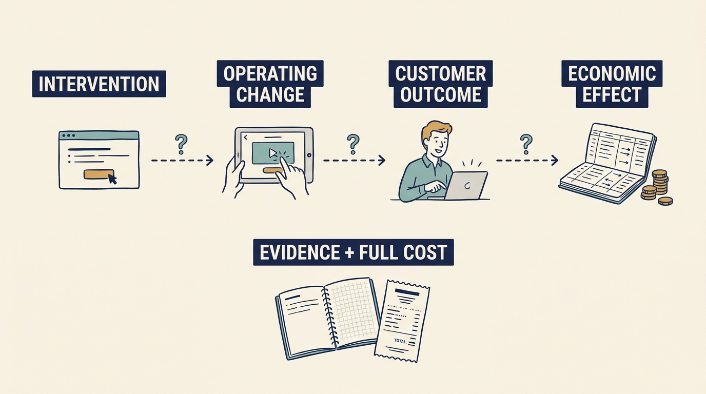

Product work creates business value only when it **changes what customers do, or what the business earns and spends**. A **roadmap** item describes proposed work, not its benefit. An investor, who has put money into the company for a share of it, may expect a change to support a target: more sales, a larger share of sales kept as profit, or more customers staying. Write that expectation down, then demonstrate the chain from work to result.

**Figure 1:** *Test each link from product work to customer and economic outcomes. “Intervention” is the product change; “operating change” is the change in daily work; “economic effect” is the effect on money.*

**Start with a need worth serving.** At fictional Larkspur, paying customers wait for **onboarding**, the setup needed before they can use the product. Most depend on one specialist entering settings by hand, yet the growth plan assumes more customers with the same staff. A customer an investor introduces is someone to test, not proof of demand. [S15: DORA 2024 report](https://dora.dev/research/2024/dora-report/)

**Make the chain explicit** and test every link.

**Distinguish freed time from cash.** The model assumes 100 setups a year at 80 staff hours each, at €75 an hour (pay plus employment costs): €600,000 of staff time. At the hoped-for 50 hours, 3,000 hours are freed, worth €225,000. That is time, not cash: the same people are still paid. A plan must say how the time becomes a result: serving waiting customers, or avoiding a supplier’s invoice or a hire. Count the build (€180,000 agreed) and upkeep (€30,000 a year) before claiming benefit.

**Check what explains the result.** The pilot, a limited trial, compared its first eight customers with the previous twelve. Sales chose the pilot customers, and one specialist served both groups. The setup step plausibly helped; it was not proved the cause.

**The measured result.** At day 90 the eight averaged 62 hours, not 50. Across eight customers, that is 144 fewer staff hours than the baseline: 8 × (80 − 62). The yearly 1,800 hours and €135,000 are estimates assuming 100 comparable setups. About 40% of remaining hours traced to poor customer data. The median wait from contract to first real use stayed at about ten weeks. With eight waits ordered shortest to longest, the median is halfway between the fourth and fifth.

**The spending.** By day 100 about €90,000 of the agreed €180,000 of work had been received, which does not mean paid. No contract had been cancelled; no cash benefit had appeared.

**The next decision.** At day 100 the board, the directors overseeing the company, applied its pre-agreed rule for results of 60 to 70 hours. It funded one step to check and correct customer data before setup: €40,000 and four engineer-weeks (each one engineer’s work for a week), from money held back for later decisions. The reason is the measured obstacle, not money already spent. At month six a second group of eight must average 50 hours or less, counting all data work, bought-in help included. Its median wait must be eight weeks or less. Unfinished customers stay in the count. Otherwise the board approves no further stage.

The chain broke between freed effort and customers served; measurement changed the next commitment.
