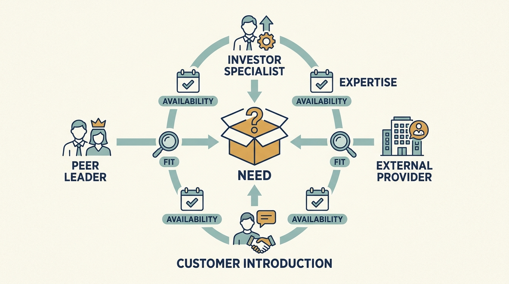

> **IN THIS SECTION, YOU WILL:** Learn to name a capability gap, compare the investor’s people and networks with the help available elsewhere, and write the request for a first step.

> **WHY INVESTORS CARE:** A **fund manager**, the firm that pools other people’s money into a fund and decides where to invest it, often promises practical help to the companies it invests in. It makes that promise both to the people whose money it manages and to the founders it hopes to back. That help earns its cost only when it changes what the company can do, so the investor needs the request to be specific.

> **WHY YOU SHOULD CARE:** Accepting the help that is on offer, rather than the help the gap needs, consumes scarce team time and can leave a dependence nobody planned. Comparing routes is what makes the help useful.

> **KEY POINTS:**
>
> * Ask for the help a **specific company problem** requires. Describe the missing capability through the work that fails or takes too long, and say which kind of request you are making.
> * **Compare the investor’s access with the alternatives.** An investor may reach relevant people faster; a peer, an independent specialist or a hire may fit better. Judge each route by availability, company effort, cost and relevant experience.
> * **Borrow experience with its context attached**, and make any continuing dependence explicit. Finish with a written request that names the result, the source and the accountable company leader.

 
Larkspur has money to improve customer onboarding, the setup required before a new customer can use its software. It **lacks experience** in designing a repeatable process for it. Hiring a permanent leader would take months, while asking the same engineers to invent the process alongside their existing work could delay it further. Two later chapters, [[can-the-team-deliver]] and [[fix-decisions-before-hiring]], show how to find such a gap by tracing the setup work through the company; here the gap is taken as given.

An investor may give Larkspur **faster access to relevant people and experience**. To judge whether that access is worth having, compare it with the help the company could obtain elsewhere, including the time and obligations each route brings.

A **stronger company is worth more**, which raises the value of the investor’s holding, the ownership stake it bought and will one day sell. But a firm that runs a shared team of advisers also wants that team busy enough to **justify its cost**, the goodwill of the other companies it has invested in, and a reputation that attracts the next founder. The offer is genuine, but it is not disinterested, and neither fact makes it the best route.

The earlier chapter [[operating-model-blueprints]] connected the investor–company working arrangement with the company’s own organization, authority and resources. The previous chapter, [[learn-through-investors-network]], explored learning that can reveal new possibilities and needs. This chapter is about sourcing help. It starts with the company’s need, sets out four kinds of request, then compares credible sources for the same need, including sources outside the investor’s network. It ends with a written request, which the chapter [[useful-engagement]] turns into a **charter**: the short written agreement that fixes what the helper will do, for how long, at what cost and under whose direction.

## Name the Capability You Need

A **capability** is something the company can reliably do, such as understanding a customer need, releasing software safely or hiring for a specialist role. Describe the gap through the work that currently fails or takes too long.

“We need help with onboarding” is hard to act on. The finding from **due diligence** — the investigation the investor ran on Larkspur before deciding to invest, described in the chapter [[diligence-corrects-the-plan]] — is not. It recorded two separate things about five sampled **implementations**, meaning five individual customers’ setups:

- In **three of the five**, the configuration work needed the same implementation specialist’s manual attention. One person was a bottleneck.
- Across **all five**, the average total team effort was **about 80 hours per customer**. That figure counts everything from signed contract to the customer going live — configuration, cleaning up the customer’s data, sessions with the customer and rework — not the specialist’s configuration alone.

The useful help might teach the customer team to run one standard setup path, remove a repeated manual step or change how customer data is taken in. An introduction to a large outsourcing provider does not, by itself, establish that the provider can do any of those things; it might be able to, and the only way to know is to compare it on the same terms as every other route.

Distinguish four possible requests: help to understand the problem, help to make a decision, people to carry out work and help developing the company’s own skills. One engagement can involve several, but agreeing which are needed stops advice being mistaken for delivery capacity. Larkspur’s request is mostly the third and fourth: someone to work alongside its engineer on one setup path and leave the team able to repeat it.

## Map the Possible Sources of Help

An investment firm’s **operating team**, where it has one, helps companies improve how they work. Its **portfolio** is the whole collection of businesses it has invested in, and those businesses are its **portfolio companies**. A **peer network** connects leaders in comparable roles who can exchange relevant experience. Support may also come from outside specialists, suppliers or people introduced through the firm’s relationships. A **corporate investor** — an operating company that has invested in another business rather than a fund — may add a service its own group already runs, or a **sales channel**, a ready-made route to reach customers. Both come with commercial conditions attached.

KKR’s description of Capstone is one public example: it describes collaboration with company management, operating specialists, external partners and services spanning technology, growth and people. That establishes what the firm says it offers, not its effectiveness or availability to any particular company. [S22: KKR Capstone description](https://www.kkr.com/approach/capstone)

Use the map as possibilities to investigate, not a promised service catalogue:

| Company need | Help to explore | What to establish first |
| --- | --- | --- |
| Understand a new customer problem | Introductions to potential customers, experienced product leaders or research specialists | Are these people relevant to the market you intend to serve, or to the investor’s existing relationships? |
| Start a capability the company lacks | A temporary specialist, a peer example and practical training | Who in the company will learn the work and be accountable for it afterward? |
| Improve engineering delivery | Experienced engineering leaders, focused assessments or reusable tools | Which constraint should change, and what company effort is needed? |
| Hire for a critical role | Recruiting support, candidate introductions and help defining the job | Who selects the candidate, pays the costs and manages the person? |
| Develop leaders and teams | Coaching, training, mentoring and peer learning | Which capability should improve, and how are coaching and assessment kept apart ([[investors-adviser]])? |
| Make a supplier or expansion decision | **Procurement** expertise (finding, checking and contracting with suppliers), introductions to potential customers or partners, or experience in another market | Are the terms and experience relevant to this company’s actual needs? |
| Use a group shared service or channel (corporate investor) | Technical, security or sales capability the **parent** — the company that controls this one — already runs and shares across its businesses | Who else sees the data, what the service costs to leave, and what continues after an ownership change |
| Combine or separate businesses | People with experience of the particular transition | Can they help the company operate through the change, within agreed responsibilities? |

The best route may be outside the investor’s network. Assess the support against the same company need whoever introduced it.

**Figure 1:** *Start with the capability the company needs, then compare credible sources of help.*

## Peer Communities Are One Source

[[learn-through-investors-network]] develops the broader role of continuing peer relationships and exploratory learning. Here, the immediate question is how a peer can help with the capability gap already identified.

A community of leaders across the investor’s portfolio can provide experience a company would struggle to assemble alone. It can also become an event series organized around the manager’s need to demonstrate activity. Judge a peer session by whether it starts from decisions the participants actually face: a conversation comparing how two companies made customer setup repeatable, what went wrong and what had to exist first is worth an hour; a session in which every **chief technology officer** — the senior leader responsible for technology, often written CTO — presents the same set of performance charts is not.

Information sharing needs a boundary: an anonymized case can still identify a company in a small portfolio, and customer data, employees’ pay and plans for deals such as a sale or acquisition don’t become reusable because the audience shares an owner. And a practice that worked elsewhere should arrive with its context: customers, scale, architecture and the leadership that made it work. Capture those conditions with the practice rather than adopting a playbook.

## Compare Credible Alternatives for the Same Need

About a week after the board adopted the plan, Priya, accountable for the onboarding pilot, and Alex, who must find the engineering time, compare four routes to the same result: one setup path made repeatable by the end of a six-week assignment.

**Closing** is the day the investment legally completes and the money changes hands. Within days of it the Larkspur board met and adopted the operating plan, and in this example that meeting is day 0, the start of the first hundred days; every date below counts from it. The plan **committed** €180,000 and 12 engineer-weeks to the onboarding **pilot** ONB-1 — a limited trial before any wider commitment, named so it can be followed through later reviews. Committed means agreed to spend, which is not the same as spent. An **engineer-week** is one engineer’s working time for a week, so 12 engineer-weeks is three months of one engineer, or six weeks of two.

Still ahead are two checkpoints: at day 90 Priya measures the **cohort** — the eight pilot customers whose setups are measured together — and at day 100 the **board**, the directors who oversee the company and approve its major decisions, reviews what that measurement shows. The comparison is fictional and uses the figures from the shared Larkspur chain; the categories are what to compare, not a claim about what any investor offers.

| Route | Availability | Company effort | Relevant experience | Verdict |
| --- | --- | --- | --- | --- |
| Peer conversation with a technology leader at another portfolio company who made setup repeatable | One hour, within two weeks | Half a day of preparation | Similar problem, larger customers; context needs checking | Take it first, as a check on the approach |
| Investor’s specialist, introduced by Morgan, the investor’s technology adviser | Ten days over six weeks, from day 21 to about day 63 | Six days of one engineer, plus two customer-team sessions | Said to have done this at two comparable companies; **references** — conversations with people who have seen the specialist’s previous work — not yet checked | Chosen first step, provisional on the start date and those reference checks |
| Independent specialist found by the company | Finding and contracting one takes seven to nine weeks, so a start about day 56 to 70 and an end about day 98 to 112 — five to seven weeks behind the investor’s specialist | The same engineering effort, plus the time to run the selection | Unknown until references are checked | Fallback, not started yet; see below |
| Permanent implementation specialist | Three to four months to start | Onboarding and management | Depends on the candidate | Deferred, pending pilot evidence |

The costs below are fictional **caps** — a maximum the company agrees to pay — rather than **quotes**, which are prices a provider has actually offered. The same table appears in the chapter [[useful-engagement]] so that the charter can be checked against the choice:

| Route | Fictional cost | Charged to | Company effort |
| --- | --- | --- | --- |
| Peer conversation | None beyond time | — | Half a day of preparation |
| Investor’s specialist | Capped at €1,500 a day; ten days = €15,000 at most | ONB-1 (€180,000 committed); sits inside the roughly €90,000 the pilot has **incurred** — received the work for, whether or not the invoice is paid — by day 100 | Six engineer-days, and two customer-team sessions. At the planning cost of €75 an hour — pay plus the other costs of employing someone — over eight-hour days, that values the six days at about €3,600. It is the allocated cost of staff time the company is already paying for, not additional cash |
| Independent specialist | Rate and availability not yet quoted; both are confirmed with the provider. References cover the quality of previous work, are checked separately and cannot confirm the price. For comparison only, the same €15,000 cap for ten days, plus selection time | ONB-1 | The same, plus selection |
| Permanent implementation specialist | About €150,000 a year per specialist — pay plus the other costs of employing them, on the same €75-an-hour basis as in [[roadmap-to-revenue]] — every year for as long as they are employed; the diligence response costed two such hires at €300,000 a year | The **operating budget** — the plan for the company’s ongoing running costs — rather than ONB-1, because the cost of employing that person continues after the pilot ends | Onboarding and management |

The decision, in short labelled parts:

**Chosen.** The investor’s specialist, for a bounded six-week assignment alongside a Larkspur engineer, preceded by the peer conversation.

**Not chosen, and why.** The independent specialist is slower, in a way that matters at day 100; the three paragraphs below headed “If the fallback is needed” work through what that costs. The permanent hire waits, because the board deferred hiring until the pilot shows how much effort the setup step actually removes.

**Funding.** Up to €15,000 of the €180,000 committed to ONB-1 in the chapter [[first-hundred-days]]. Sam, Larkspur’s finance leader, confirms the cap fits inside what the pilot is already allowed to spend and needs no draw on the **reserve**. The board’s **envelope** is the total money and engineering time it has authorized for the whole plan; the reserve is the part of that envelope deliberately held back for problems nobody has yet found, and only the board can release it.

**Scarce capacity.** Six engineer-days, which Alex takes from the customer-portal research. That work was research-only, so the pilot delays a question rather than a commitment.

**Who approves what.** Ines, the chief executive, holds the board’s delegated authority to approve spending inside the plan it adopted, and has delegated approval of a capped engagement of this size to Priya; Priya is accountable for the pilot’s result either way. Alex commits the engineer’s time. Because the money stays inside ONB-1’s existing commitment and touches no reserve, no new board decision is needed.

**Evidence that would change it.** The specialist’s start slipping beyond day 21; references showing experience only with much larger customers; or the peer conversation revealing that data intake, not the setup step, decided the outcome elsewhere.

**If the fallback is needed: what triggers it, and when it would run.** The independent route is not being run in parallel. No procurement is under way, because running two selections at once would spend the selection time twice. It starts only on a trigger: the investor’s specialist becoming unavailable or failing the reference check. Triggered on day 21, its seven-to-nine-week search and contracting would put the start at about day 70 to 84, and the six-week assignment would end about day 112 to 126 — past the day-100 board review entirely. Even a request made on day 7, before any trigger existed, would only end about day 98 to 112.

**What the board would get instead.** The problem is not that nothing could be tested by then; the engineer could try parts of a new path earlier. It is what the board agreed to read at day 100: the measured effort of a cohort of eight customers set up on the finished path. On the fallback, Priya would go to the day-100 review with an unfinished assignment, no cohort figure and a revised measurement date rather than a result.

**What the engineer does while waiting.** Between the trigger and the new start, Alex’s six engineer-days go back to the customer-portal research they came from. The **baseline** — the starting measurement that later results are compared against — is still taken at day 20 either way, because it is reconstructed from Larkspur’s own records and needs no specialist.

The calendar the two chapters share. Day 0 is the board meeting that adopted the plan, held within days of closing:

| Day | Event |
| --- | --- |
| 0 | Board adopts the plan; ONB-1 committed: €180,000 and 12 engineer-weeks |
| About 7 | Priya and Alex compare the four routes; Priya writes the request (this chapter) |
| By 14 | Peer conversation |
| 20 | Baseline measured from actual records — not the sample of five, but all twelve implementations of the previous two **quarters**, each quarter a three-month period. It also averages about 80 hours |
| 21 | Specialist starts; engagement week one |
| About 40 | Engagement week three: scope change, no cash change |
| About 63 | Engagement week six: review, handover test, engagement ends |
| 90 | Priya measures the cohort: the eight customers set up on the new path |
| 100 | Board review reads the cohort’s result; about €90,000 of ONB-1’s €180,000 has been incurred by then, the specialist’s €15,000 among it |

The possibility that data intake, rather than the setup step, is what decides the outcome is not idle; the chapter [[useful-engagement]] shows what happens when it turns out to be true.

## Use Connections With Care

An introduction can give a product team access it would otherwise struggle to get. It can help test a problem, understand a buying process or find a partner. It doesn’t establish demand.

Investors tend to introduce people from companies they already know, who may differ from the customers the product intends to serve. Interviews with larger portfolio companies might reveal useful scheduling needs that don’t match Larkspur’s smaller maintenance-business customers. Priya should compare the insights with evidence from the intended market before changing the roadmap, and a commercial introduction needs an accountable relationship owner and a view of the delivery work a sale would create. More opportunities can worsen the onboarding constraint the company is trying to fix.

An investor’s network may help identify candidates or someone who can assess a role. Begin with the work the company needs; a prestigious introduction isn’t evidence of fit. Hiring is also only one way to develop capability: coaching an existing leader or helping several teams practice a skill can be more appropriate than adding a senior role.

When the investor’s help is recruiting, three separate things stay with the company:

- **Assessment.** Candidates, from whatever network, are measured against the company’s own written description of the job and its requirements, and the company takes its own references — the conversations with former colleagues that check how someone actually worked.
- **Disclosed interests.** Anything that could pull the recommendation — a candidate the investor has worked with before, or a search firm the investor pays — is declared and written down, then assessed. A prior relationship is a potential conflict to weigh, not automatically a disqualification.
- **Accountability.** The company appoints the person, manages them and answers for the result. An introduction does not transfer that.

The chapter [[fix-decisions-before-hiring]] works an investor-proposed **chief product officer**, the senior leader responsible for what the product should become, through that test.

## Borrow Experience With Its Context Attached

Ask what assumptions travel with a reused practice. A tool developed for a much larger business may need administration your team can’t support. Shared purchasing terms may be attractive while the cost of changing suppliers outweighs the benefit.

Starting a new capability can combine temporary expertise with internal accountability. Judge the result through actual customer setups and **the team’s ability to repeat the work**; a presentation of what an improved process could look like is a different deliverable.

A company may sensibly keep buying a scarce specialist service. It should understand the continuing cost, availability and responsibilities rather than discover the dependence when the first assignment finishes. The engagement review in the chapter [[useful-engagement]] is where that choice is made explicit.

**Figure 2:** *Useful support leaves a capability the company can use or a continuing service it understands.*

## Write the Request

The search ends with a request short enough to be agreed in one conversation. Larkspur’s, written by Priya:

> Help our customer team make one setup path repeatable, using a specialist who can work alongside our engineer for six weeks; Priya will assess customer outcomes.

Behind the sentence sit the decisions made above: the result (one repeatable path, tested on actual customer setups), the source (the investor’s specialist from day 21, with an independent specialist held as the fallback), the company effort (six engineer-days and two customer-team sessions), the funding (up to €15,000 from the money already set aside for the ONB-1 pilot) and the accountable leader (Priya). What the sentence leaves open, on purpose, is the specialist’s exact days, the information they may see, who directs their work and how the engagement ends. The next chapter negotiates those commitments: [[useful-engagement]].

## Questions to Consider

1. *What capability does your company lack, described through the work that fails or takes too long, and which of the four requests are you making?*
2. *For that need, what would a peer conversation, an investor’s specialist, an independent provider and a hire each cost in time, money and company effort, and which would you choose first?*
3. *Which practices borrowed from another portfolio company arrived with their context attached, and which did not?*
4. *Where is your company already dependent on a specialist service that no one planned to keep funding?*

## To Probe Further

The first three sources concern **venture capital**: investment in young companies with growth potential, in exchange for a share of the ownership. A company that has taken such investment is **venture-backed**.

- **[Venture Capital and the Professionalization of Start-Up Firms: Empirical Evidence](https://doi.org/10.1111/1540-6261.00419)** — Thomas Hellmann and Manju Puri, The Journal of Finance, 2002. *Evidence from a sample of Silicon Valley start-ups — young companies still establishing themselves — that venture-backed companies adopt formal policies sooner and more often replace the founder in the chief executive role, showing the hiring and leadership support this chapter describes as a pattern with a less comfortable side.*
- **[The Impact of Venture Capital Monitoring](https://doi.org/10.1111/jofi.12370)** — Shai Bernstein, Xavier Giroud and Richard Townsend, The Journal of Finance, 2016. *Uses changes in travel time between venture investors and their companies to separate the effect of investor involvement from the effect of choosing good companies; a population-level estimate for venture-backed firms, not a way to judge whether one engagement like Larkspur’s worked.*
- **[How Smart Is Smart Money? A Two-Sided Matching Model of Venture Capital](https://doi.org/10.1111/j.1540-6261.2007.01291.x)** — Morten Sørensen, The Journal of Finance, 2007. *A model of how venture investors and young companies choose each other. Its measured outcome is narrow and specific: whether a company eventually becomes publicly traded, its shares bought and sold on a stock market. Companies backed by more experienced investors reach that outcome more often, but the paper separates two causes and finds that selecting stronger companies matters almost twice as much as anything the investor does afterwards — a caution against attributing a company’s results to its investor’s network.*
- **[Eleventh Annual Private Equity Leadership Survey](https://www.alixpartners.com/insights/private-equity-leadership-survey-2026/)** — AlixPartners, 2026. *This one is not about venture capital. It surveys **private equity**: buying ownership in businesses that are not listed on a stock market. The businesses involved are usually established and often substantial, not young companies. A consulting firm asked 174 leaders at investment firms and 253 senior executives of the companies those firms own, and reports the two groups’ views side by side — including how the support investors say they provide compares with what company leaders say they want. Survey responses about perceptions, not measurement of what the support achieved.*
