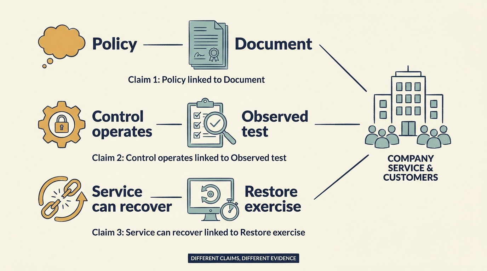

> **KEY POINTS:**
>
> * Start with the **business functions that must keep working**. Identify who would be affected by lost service, damaged information or access by unauthorized people before choosing protections.
> * Risk estimates are **uncertain decision inputs**. An estimate of lower future losses is not earned profit, and a completed checklist does not prove that service can survive disruption.
> * **Practice restoring service** before an emergency. Fund the work and agree who is responsible for risks that remain.

 
**Cybersecurity** protects systems and information against threats such as unauthorized access, theft or damage. **Resilience** is the ability to continue or restore essential work through disruption. **Recovery** is the work of restoring service after something goes wrong.

A company often has to fund these capabilities before suffering the loss they are intended to prevent. That creates two temptations: invent a precise amount of “risk avoided,” or retreat into a checklist that says little about business exposure.

Investor ownership sharpens both temptations. A security investment competes with growth work for the same limited cash and appears in the plan as cost without revenue, so it needs a stronger case than in a company under no pressure to show earnings. At the same time, a breach or a long outage during the ownership period can reduce what the company is worth, and technical diligence and buyer questionnaires will test the controls. The leader has to argue for the investment in terms an investment committee recognizes: exposure, obligations and who accepts the remaining risk.

A better approach treats security and resilience as decisions under uncertainty. The company identifies material failure scenarios, the controls and response capabilities that matter, the investment required, and who accepts the remaining risk. Some obligations must be met regardless of a simplified financial model.

The cloud chapter examined observed spending and service quality. Security also needs evidence, but part of its benefit is a lower chance or severity of future harm. We start with essential business functions, examine the evidence of protection and recovery, and then consider risk estimates and responsibility.

The US **National Institute of Standards and Technology (NIST)** provides Cybersecurity Framework 2.0. Published in February 2024, the framework groups security outcomes under six headings: Govern, Identify, Protect, Detect, Respond and Recover. It explicitly avoids prescribing one implementation for every organization. [S17: NIST CSF 2.0](https://nvlpubs.nist.gov/nistpubs/CSWP/NIST.CSWP.29.pdf) That makes it a useful reference for consistent questions while leaving room for company-specific answers.

## Begin With What Must Keep Working

Larkspur's customers are maintenance businesses that dispatch engineers each morning. If the scheduling service is unavailable at 6am, dispatchers may be unable to assign work or tell customers when an engineer will arrive. The security discussion starts with that consequence: the business functions customers depend on, and the people affected when they fail. A retailer's equivalents are payments, inventory and fulfillment.

For each critical function, ask what interruption, corruption, or unauthorized access would mean. How long can the business continue without it? Which customers face material harm? Which contracts, laws, or insurance conditions need specialist interpretation? What manual alternatives exist, and have they been tested?

An asset inventory is useful when it supports those questions. An inventory that counts systems without identifying their role in critical work can create an impression of completeness while missing **the most consequential dependency**.

## Match Each Claim to the Evidence That Supports It

A policy describes intended behavior. A **configuration record** shows how a system was set up at a point in time. A test shows what happened under particular conditions. An independent assessment can add another perspective but has a defined scope. None alone proves that the company will withstand every incident.

A **backup** is a stored copy of data used to recover from loss or damage. A **restore** puts that data back into use. In this fictional scenario, the investigation before investing in Larkspur found that backups had run without error for three years. No one had attempted a full restore in that time. When the team tried, it took eleven hours and stopped twice. The first obstacle was a missing **credential**, information needed to prove someone may access a system. The second was an unavailable version of the database software that organizes and stores the application’s data. Backups running is evidence about backups. Restoring the service is evidence about the business. Test the operating outcome, not the presence of a control.

A **certification** is a formal statement that specified requirements have been met under a particular assessment process. Read which organization, systems, requirements and period it covers. It is not a guarantee that every part of the company is secure today.

**Figure 1:** *Match the evidence to the capability you say the company has.*

## Put a Number on Risk Without Faking a Profit

Suppose a prolonged Larkspur outage would cost €4 million in contractual credits, remediation and lost customers, and the team estimates a 5% annual chance of one. The **expected annual loss** is the probability multiplied by the assumed loss: 5% × €4 million = €200,000. It is an average implied by the assumptions, not a prediction that the company loses that amount each year. A proposed control is estimated to cut the probability to 2%, leaving €80,000 — a €120,000 difference, before what the control costs.

The result depends on both the probability estimate and the assumed loss. If the probabilities are weak, so is the answer; state them as ranges and say what evidence would narrow them. The average alone is also insufficient when one event could cause several failures together or threaten the company’s survival: **a 2% chance of not surviving is not made acceptable by an affordable-looking average.**

State which scenarios the control addresses and which remain. Above all, do not add the €120,000 to recorded operating earnings. It is a modelled change in risk exposure, **not a booked operating gain**.

## Security Work Needs an Owner and Funding

An investigation finding such as “identity controls are inadequate” is incomplete. **Identity controls** determine how users prove who they are and what they may access. Which systems and people are exposed? What is the material scenario? What action is feasible now, and what needs a funded follow-up? If a transaction is approaching, what must be resolved before it closes? Who has authority and capacity to carry out each action?

The Principal can help obtain specialist judgment and communicate the implication to the investment team. The company needs accountable operating owners. The board needs to understand **residual risk**, the risk remaining after the chosen protections, and whether it is large enough to affect a company decision. A consultant's recommendation does not transfer responsibility for the business to the consultant.

Some findings may affect transaction conditions, price, insurance, or whether the deal proceeds. Others may be appropriately accepted with an action plan. The distinction should follow materiality and evidence, not the desire to keep all findings the same color.

## Incident Response Is an Operating Capability

An incident can require simultaneous technical work, customer communication, legal judgment, financial decisions, and coordination with the owner. A response plan should name the decision process before urgency compresses it.

A practical exercise can test a plausible scenario. Larkspur's: the scheduling service is returning wrong engineer assignments, nobody yet knows why, the largest customer wants an answer within the hour, and restoring from backup may destroy the evidence needed to find the cause. The exercise should reveal who can decide, which specialists are available, and how the team communicates uncertainty. It should not be staged merely to demonstrate that a plan exists.

Legal notification deadlines, sector requirements, and contractual duties vary and can change. In a live incident, the organization needs current advice for its jurisdictions and facts. This chapter supplies the operating questions; it does not substitute a universal deadline.

**Figure 2:** *Restoration is a capability to practice and verify, with clear responsibility throughout.*

## Funding Pressure Does Not Decide Who May Accept Risk

Suppose fictional Larkspur delays a recovery improvement because the next funding round is uncertain. Alex should identify the affected service, current recovery evidence, feasible minimum work and consequences of further delay. The authorized company decision-maker must address that exposure in the operating plan. A slide saying “deferred until funding” does not identify who accepted the consequences.

A minority investor may ask for customer data to help assess a risk. A corporate investor may offer a shared security platform. In both cases, establish the purpose, permitted access, separation from other companies and responsibility for an incident before moving information or systems. Ownership and a useful offer do not, by themselves, settle the access decision.

Use shared expertise where it makes the company more capable, and verify that the company can still **detect, communicate and recover** if the service or owner changes. The same test applies when a parent requires integration: budget for the local work needed to meet the group’s requirements, and keep any gap visible until it is resolved.

## Shared Support Can Spread Risk or Concentrate It

A shared specialist network and tested response process can give small companies access to scarce expertise. Relying on the same user-login service, system administrator or connection between systems can also give several companies a common point of failure. The support design should examine the new concentration it introduces.

Portfolio-level visibility does not require unrestricted access to customer data. Aggregate risk information, scoped evidence, and company-approved disclosures can support oversight. Access to live company systems should have a specific purpose and an explicit boundary.

Exit preparation should preserve the same discipline. Describe improvements with dates and test evidence. Disclose material unresolved issues through the appropriate process. An orderly **data room**, a controlled collection of documents shared with a prospective buyer, is helpful; it is not equivalent to a resilient product.

A sound proposal connects a harmful scenario to a protection or recovery capability, its cost and evidence that it works. The company also needs someone authorized to accept the remaining risk. A modeled reduction in future losses helps that decision; it is not a booked profit.

The next chapter applies careful evaluation to another uncertain area: the benefits, costs and competitive effects of artificial intelligence. Continue with [[ai-strategy-three-questions]].

## Questions to Consider

1. *Which business functions must keep working for your customers, and what would an hour, a day or a week without each of them mean?*
2. *When did your team last restore the service from backup under realistic conditions, and how long did it take?*
3. *For your largest security proposal, what harmful scenario does it address, what evidence shows it works and who accepts the risk that remains?*
4. *Has a modelled reduction in expected loss ever been presented in your company as if it were an operating gain?*
5. *If a material incident began now, who could decide to take the service down, notify customers or restore from backup? Has that been practiced?*
6. *Which shared services, logins or connections tie your company to other portfolio companies or a parent, and what would fail together?*

## To Probe Further

- **[Contingency Planning Guide for Federal Information Systems (SP 800-34 Rev. 1)](https://csrc.nist.gov/pubs/sp/800/34/r1/upd1/final)** — National Institute of Standards and Technology, 2010. *The standard method for this chapter's first step, a business impact analysis that names the functions that must keep working and how long each can be down.*
- **[Ransomware-resistant backups](https://www.ncsc.gov.uk/collection/ransomware-resistant-backups)** — UK National Cyber Security Centre, 2024. *Principles for backups that survive an attacker who targets them first, and the point behind this chapter's restore story that a backup is only evidence once tested.*
- **[Incident Response Recommendations and Considerations for Cybersecurity Risk Management (SP 800-61 Rev. 3)](https://csrc.nist.gov/pubs/sp/800/61/r3/final)** — National Institute of Standards and Technology, 2025. *The current incident response guidance, mapped onto the Cybersecurity Framework headings this chapter uses and treating response as a capability rather than a document.*
- **[CISA Tabletop Exercise Packages](https://www.cisa.gov/resources-tools/services/cisa-tabletop-exercise-packages)** — US Cybersecurity and Infrastructure Security Agency, living page. *Ready-made ransomware scenarios and templates for the kind of exercise this chapter describes, where the point is to find out who can decide.*
- **[How to Measure Anything in Cybersecurity Risk, 2nd edition](https://www.wiley.com/en-us/How+to+Measure+Anything+in+Cybersecurity+Risk,+2nd+Edition-p-9781119892304)** — Douglas Hubbard and Richard Seiersen, Wiley, 2023. *Extends this chapter's expected-loss arithmetic into a workable method of ranges, calibrated judgement and simple simulation, from authors who also sell consulting on it.*
- **[The Open FAIR Body of Knowledge](https://www.opengroup.org/open-fair)** — The Open Group, living page. *The standard taxonomy for quantified security risk, so the company's own estimate can be compared with an investor's adviser or insurer on the same definitions.*
