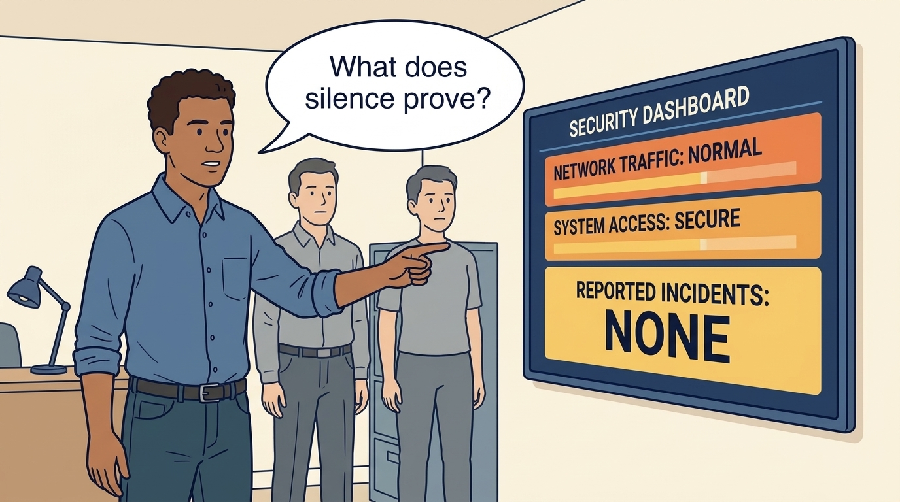
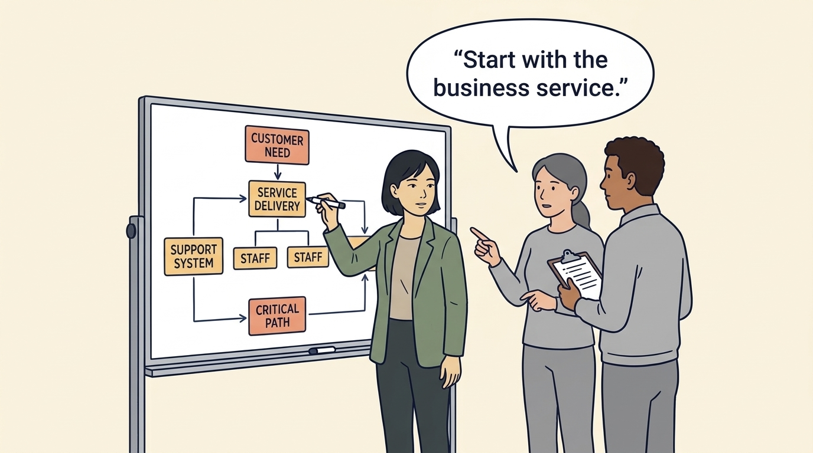
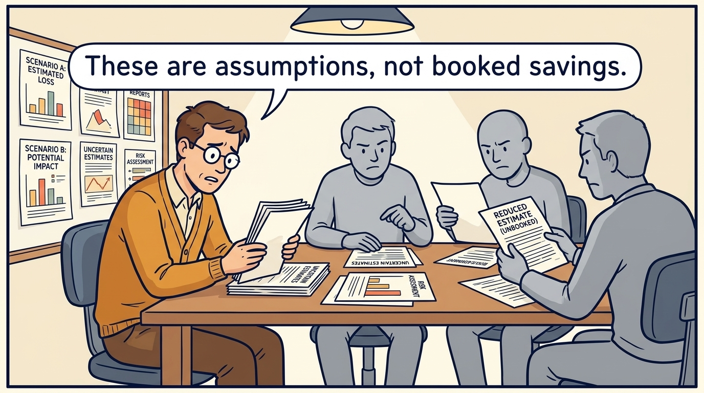
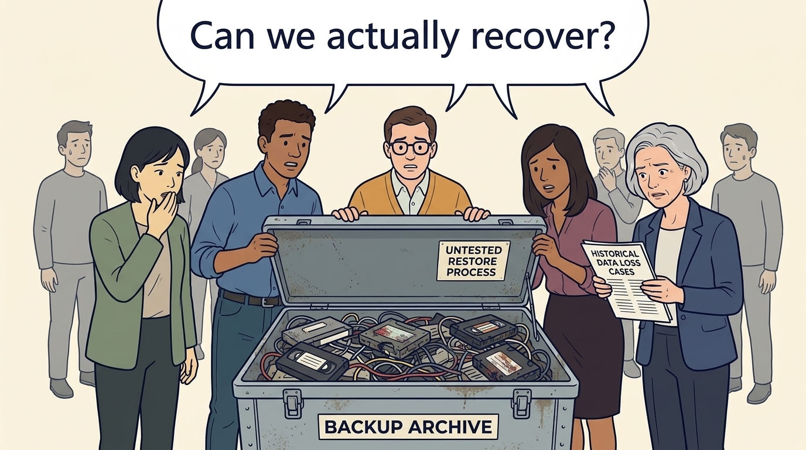
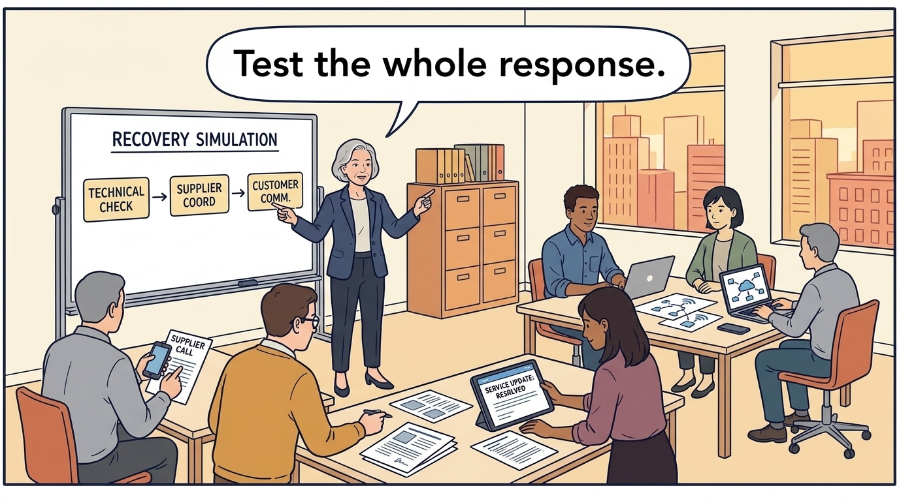
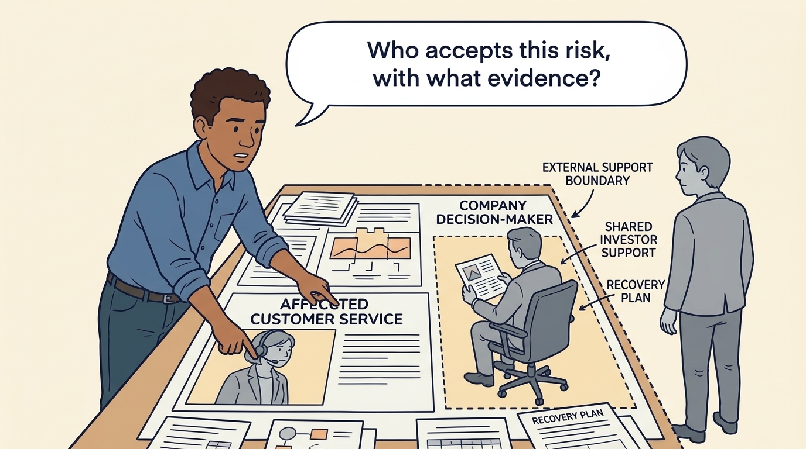

<!-- comic-style
{
  "cast": "MORGAN: a thoughtful investor technology adviser with short dark hair and a green jacket, used in the fund scenarios. ALEX: a practical CTO with curly hair and blue rolled-up sleeves. SAM: a CFO with round glasses and an amber cardigan. PRIYA: a product leader with straight dark hair and plum sleeves. INES: a CEO with short grey hair and a navy jacket. All are fictional; none represents a person in a real case.",
  "style": "Clean editorial explainer comic, dark ink outlines, restrained green, blue, and amber accents on warm white, generous space, readable short speech bubbles, expressive people and simple physical metaphors. No photorealism, logos, dense charts, or title text. Keep the same character appearances throughout the journal."
}
-->

**Comic.** Under investors, a security investment competes with growth work for limited cash and appears as cost without revenue, while a breach during the ownership period can reduce what the company is worth. The panels show how to argue for it in terms an investment committee recognizes.

Morgan is an investor’s adviser in the fund scenarios; Alex leads technology, Priya leads product, and Sam leads finance. All are fictional. Comparative scenarios use separate assumptions. Historical cases are discussed through documents; the scenes do not reenact real events.

<!-- comic-panel
{
  "id": "01-scene",
  "status": "generated",
  "asset": "assets/images/11-security-and-resilience/comic-01-scene.jpeg",
  "aspect_ratio": "16:9",
  "prompt": "Panel 1 of an explainer comic. Alex points to a dashboard with no reported incidents. Use one speech bubble with the exact words: \"What does silence prove?\" Convey: Security protects systems and information from harm. An absence of reported incidents does not prove that protection is adequate.",
  "alt": "Comic panel: Alex points to a dashboard with no reported incidents.",
  "caption": "Security protects systems and information from harm. An absence of reported incidents does not prove that protection is adequate.",
  "generation": {
    "model": "gemini-3-pro-image-preview",
    "reference_id": "owned-cast-20260913",
    "sha256": "6c4cb3a57b8a582718f9a1fec5e15641f576c876e5e78cff1f04d9647636e89d"
  }
}
-->

**Panel 1:** Security protects systems and information from harm. An absence of reported incidents does not prove that protection is adequate.

*Dialogue:* “What does silence prove?”

<!-- comic-panel
{
  "id": "02-scene",
  "status": "generated",
  "asset": "assets/images/11-security-and-resilience/comic-02-scene.jpeg",
  "aspect_ratio": "16:9",
  "prompt": "Panel 2 of an explainer comic. Morgan maps a critical customer service and the systems and people it requires. Use one speech bubble with the exact words: \"Start with the business service.\" Convey: Begin with a service customers need. Ask what happens if it fails and how long the business can continue without it.",
  "alt": "Comic panel: Morgan maps a critical customer service and the systems and people it requires.",
  "caption": "Begin with a service customers need. Ask what happens if it fails and how long the business can continue without it.",
  "generation": {
    "model": "gemini-3-pro-image-preview",
    "reference_id": "owned-cast-20260913",
    "sha256": "97816f13f612d3c10287be45b6b97f23f2714b0470deed5df88ae714957b7042"
  }
}
-->

**Panel 2:** Begin with a service customers need. Ask what happens if it fails and how long the business can continue without it.

*Dialogue:* “Start with the business service.”

<!-- comic-panel
{
  "id": "03-scene",
  "status": "generated",
  "asset": "assets/images/11-security-and-resilience/comic-03-scene.jpeg",
  "aspect_ratio": "16:9",
  "prompt": "Panel 3 of an explainer comic. Sam studies several uncertain loss scenarios. Use one speech bubble with the exact words: \"These are assumptions, not booked savings.\" Convey: Expected loss combines an estimated chance with an estimated consequence. A reduction in that uncertain estimate is not recorded profit.",
  "alt": "Comic panel: Sam studies several uncertain loss scenarios.",
  "caption": "Expected loss combines an estimated chance with an estimated consequence. A reduction in that uncertain estimate is not recorded profit.",
  "generation": {
    "model": "gemini-3-pro-image-preview",
    "reference_id": "owned-cast-20260913",
    "sha256": "c5f2a83f2bccb467a9d7593242416be1084afdce1abc10e140f23e3b271440c3"
  }
}
-->

**Panel 3:** Expected loss combines an estimated chance with an estimated consequence. A reduction in that uncertain estimate is not recorded profit.

*Dialogue:* “These are assumptions, not booked savings.”

<!-- comic-panel
{
  "id": "04-scene",
  "status": "generated",
  "asset": "assets/images/11-security-and-resilience/comic-04-scene.jpeg",
  "aspect_ratio": "16:9",
  "prompt": "Panel 4 of an explainer comic. A backup box opens to reveal an untested restore process. Use one speech bubble with the exact words: \"Can we actually recover?\" Convey: Resilience is the ability to continue or restore essential work. A stored backup alone does not demonstrate that the service can be restored.",
  "alt": "Comic panel: A backup box opens to reveal an untested restore process.",
  "caption": "Resilience is the ability to continue or restore essential work. A stored backup alone does not demonstrate that the service can be restored.",
  "generation": {
    "model": "gemini-3-pro-image-preview",
    "reference_id": "owned-cast-20260913",
    "sha256": "5c2f5d7eecec80f70a5d41a9fff6f05931c08ca16e1df25b5039246db1dc5388"
  }
}
-->

**Panel 4:** Resilience is the ability to continue or restore essential work. A stored backup alone does not demonstrate that the service can be restored.

*Dialogue:* “Can we actually recover?”

<!-- comic-panel
{
  "id": "05-scene",
  "status": "generated",
  "asset": "assets/images/11-security-and-resilience/comic-05-scene.jpeg",
  "aspect_ratio": "16:9",
  "prompt": "Panel 5 of an explainer comic. The team practices service restoration and customer communication. Use one speech bubble with the exact words: \"Test the whole response.\" Convey: Practice recovery with the technical team, suppliers and people communicating with customers. Check the whole service.",
  "alt": "Comic panel: The team practices service restoration and customer communication.",
  "caption": "Practice recovery with the technical team, suppliers and people communicating with customers. Check the whole service.",
  "generation": {
    "model": "gemini-3-pro-image-preview",
    "reference_id": "owned-cast-20260913",
    "sha256": "cbddee4bcea24e2f3f7bca9c87d89959260e22422c86ed4ec97fc51051ed1a54"
  }
}
-->

**Panel 5:** Practice recovery with the technical team, suppliers and people communicating with customers. Check the whole service.

*Dialogue:* “Test the whole response.”

<!-- comic-panel
{
  "id": "06-scene",
  "status": "generated",
  "asset": "assets/images/11-security-and-resilience/comic-06-scene.jpeg",
  "aspect_ratio": "16:9",
  "prompt": "Panel 6 of an explainer comic. Alex identifies the affected customer service, the company decision-maker and the external support boundary. Use one speech bubble with the exact words: \"Who accepts this risk, with what evidence?\" Convey: Delayed funding still requires an explicit decision about service risk. Shared investor support also needs agreed access and a recovery plan if the provider changes.",
  "alt": "Comic panel: Alex identifies the affected customer service, the company decision-maker and the external support boundary.",
  "caption": "Delayed funding still requires an explicit decision about service risk. Shared investor support also needs agreed access and a recovery plan if the provider changes.",
  "generation": {
    "model": "gemini-3-pro-image-preview",
    "reference_id": "owned-cast-20260913",
    "sha256": "594757d06da05bb91553cbee792a949be0dad3491ed45489c5de1e28cd2fe7a6"
  }
}
-->

**Panel 6:** Delayed funding still requires an explicit decision about service risk. Shared investor support also needs agreed access and a recovery plan if the provider changes.

*Dialogue:* “Who accepts this risk, with what evidence?”
