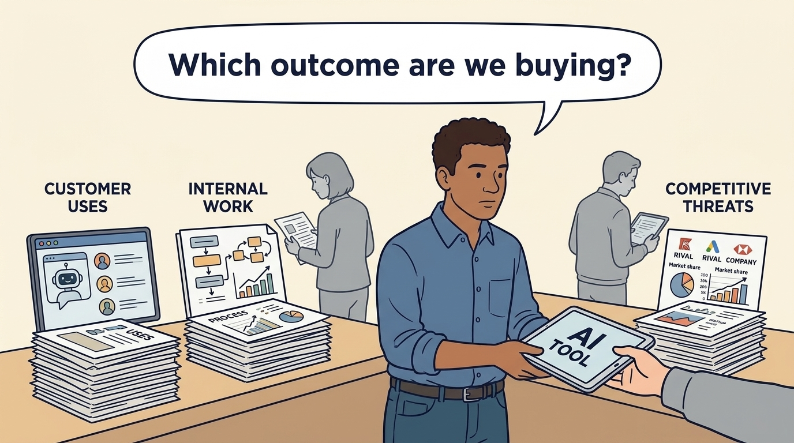
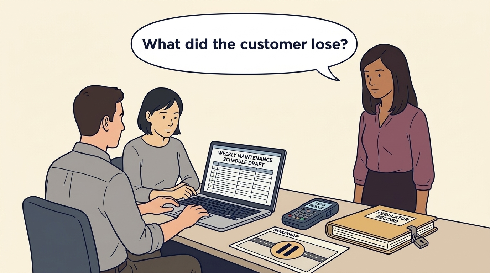
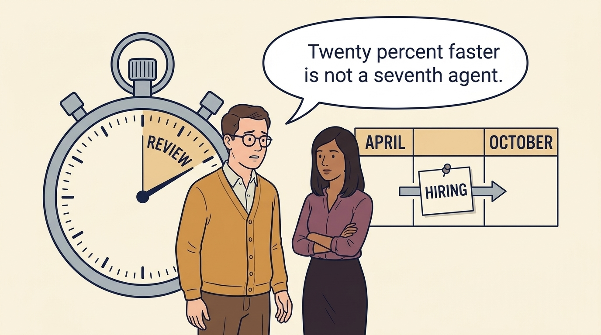
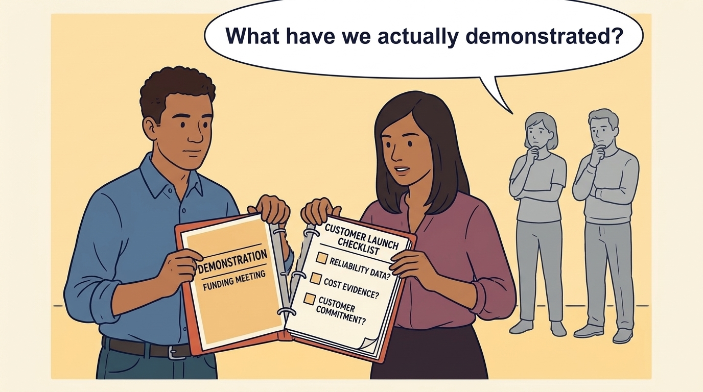

<!-- comic-style
{
  "cast": "MORGAN: a thoughtful investor technology adviser with short dark hair and a green jacket, used in the fund scenarios. ALEX: a practical CTO with curly hair and blue rolled-up sleeves. SAM: a CFO with round glasses and an amber cardigan. PRIYA: a product leader with straight dark hair and plum sleeves. INES: a CEO with short grey hair and a navy jacket. All are fictional; none represents a person in a real case.",
  "style": "Clean editorial explainer comic, dark ink outlines, restrained green, blue, and amber accents on warm white, generous space, readable short speech bubbles, expressive people and simple physical metaphors. No photorealism, logos, dense charts, or title text. Keep the same character appearances throughout the journal."
}
-->

**Comic.** An investor’s request for an AI strategy hides three investment questions: a product customers will pay for, internal work that changes spending, and a substitute for the product customers already buy. The panels separate the three, show why the evidence for each stays attached to its conditions, follow Larkspur’s three dated tests, and keep a funding demonstration apart from a product commitment.

Morgan is an investor’s adviser in the fund scenarios; Alex leads technology, Priya leads product, and Sam leads finance. All are fictional. Comparative scenarios use separate assumptions. Historical cases are discussed through documents; the scenes do not reenact real events.

<!-- comic-panel
{
  "id": "01-scene",
  "status": "generated",
  "asset": "assets/images/12-ai-strategy-three-questions/comic-01-scene.jpeg",
  "aspect_ratio": "16:9",
  "prompt": "Panel 1 of an explainer comic. Alex receives an AI tool beside three different work problems. Use one speech bubble with the exact words: \"Which outcome are we buying?\" Convey: Artificial intelligence, or AI, can classify, predict or generate from learned patterns. Separate the product, internal-work and substitution questions, and decide who is accountable for answering each.",
  "alt": "Comic panel: Alex receives an AI tool beside three different work problems.",
  "caption": "Artificial intelligence, or AI, can classify, predict or generate from learned patterns. Separate the product, internal-work and substitution questions, and decide who is accountable for answering each.",
  "generation": {
    "model": "gemini-3-pro-image-preview",
    "reference_id": "owned-cast-20260913",
    "sha256": "e28a229e407e9f52bbcd6d477da95fb5cedb25f3cef09f420b79997c2c2b7f30"
  }
}
-->

**Panel 1:** Artificial intelligence, or AI, can classify, predict or generate from learned patterns. Separate the product, internal-work and substitution questions, and decide who is accountable for answering each.

*Dialogue:* “Which outcome are we buying?”

<!-- comic-panel
{
  "id": "02-scene",
  "status": "generated",
  "asset": "assets/images/12-ai-strategy-three-questions/comic-02-scene.jpeg",
  "aspect_ratio": "16:9",
  "prompt": "Panel 2 of an explainer comic. Morgan compares two experiments in visibly different settings. Use one speech bubble with the exact words: \"These studies ask different questions.\" Convey: A productivity experiment describes particular people, tasks, tools and dates. Its result is not a universal staffing rule.",
  "alt": "Comic panel: Morgan compares folders labeled task study and workflow study, with a magnifying glass between them.",
  "caption": "A productivity experiment describes particular people, tasks, tools and dates. Its result is not a universal staffing rule.",
  "generation": {
    "model": "gemini-3-pro-image-preview",
    "reference_id": "owned-cast-20260913",
    "sha256": "8ba4c85d72259d6d399c258daf41e55afef7a157d92fce6b53f057ab52698f5d"
  }
}
-->

**Panel 2:** A productivity experiment describes particular people, tasks, tools and dates. Its result is not a universal staffing rule.

*Dialogue:* “These studies ask different questions.”

<!-- comic-panel
{
  "id": "03-scene",
  "status": "generated",
  "asset": "assets/images/12-ai-strategy-three-questions/comic-03-scene.jpeg",
  "aspect_ratio": "16:9",
  "prompt": "Panel 3 of an explainer comic. Priya watches a customer planner draft a weekly maintenance schedule with a general assistant on a laptop; beside them a technician's device and a locked regulator record folder stay unconnected, and a roadmap card marked with a pause symbol lies on the desk. Use one speech bubble with the exact words: \"What did the customer lose?\" Convey: A general assistant can draft the schedule; the test asks five customers what they lost: dispatch, live re-planning, the regulator’s records. Larkspur pauses its €120,000 suggestions feature until the 15 January 2027 decision to defend, partner, reprice or stop.",
  "alt": "Comic panel: Priya watches a customer planner draft a weekly schedule with a general assistant, beside an unconnected technician device, a locked record folder and a paused roadmap card.",
  "caption": "A general assistant can draft the schedule; the test asks five customers what they lost: dispatch, live re-planning, the regulator’s records. Larkspur pauses its €120,000 suggestions feature until the 15 January 2027 decision to defend, partner, reprice or stop.",
  "generation": {
    "model": "gemini-3-pro-image-preview",
    "reference_id": "owned-cast-20260913",
    "sha256": "8ec6a3ccae5e64494bc14faad0b86d158648753562ae1ca49fd7562c015d4bc3"
  }
}
-->

**Panel 3:** A general assistant can draft the schedule; the test asks five customers what they lost: dispatch, live re-planning, the regulator’s records. Larkspur pauses its €120,000 suggestions feature until the 15 January 2027 decision to defend, partner, reprice or stop.

*Dialogue:* “What did the customer lose?”

<!-- comic-panel
{
  "id": "04-scene",
  "status": "generated",
  "asset": "assets/images/12-ai-strategy-three-questions/comic-04-scene.jpeg",
  "aspect_ratio": "16:9",
  "prompt": "Panel 4 of an explainer comic. Sam and Priya stand beside a large stopwatch whose dial includes a segment labeled REVIEW, next to a plain wall calendar strip that shows only two labeled cells, APRIL and OCTOBER, with a pinned card labeled HIRING moved by an arrow from the APRIL cell to the OCTOBER cell. No other month names or dates. Use one speech bubble with the exact words: \"Twenty percent faster is not a seventh agent.\" Convey: Include review and correction in handling time. Three agents 20% faster supply 6.75 agents’ capacity, not seven; the seventh hire moves from April to October 2027 only if the rollout check and ticket volume hold, and €32,000 gross becomes about €22,000 net of licenses, review and rollout.",
  "alt": "Comic panel: Sam and Priya check a stopwatch that includes a review segment, beside a calendar where a hiring card has moved from April to October.",
  "caption": "Include review and correction in handling time. Three agents 20% faster supply 6.75 agents’ capacity, not seven; the seventh hire moves from April to October 2027 only if the rollout check and ticket volume hold, and €32,000 gross becomes about €22,000 net of licenses, review and rollout.",
  "generation": {
    "model": "gemini-3-pro-image-preview",
    "reference_id": "owned-cast-20260913",
    "sha256": "a5c89fded63822a531eefd068223f2c2cecdbb02af5571c8728bcc11a91a17b2"
  }
}
-->

**Panel 4:** Include review and correction in handling time. Three agents 20% faster supply 6.75 agents’ capacity, not seven; the seventh hire moves from April to October 2027 only if the rollout check and ticket volume hold, and €32,000 gross becomes about €22,000 net of licenses, review and rollout.

*Dialogue:* “Twenty percent faster is not a seventh agent.”

<!-- comic-panel
{
  "id": "05-scene",
  "status": "generated",
  "asset": "assets/images/12-ai-strategy-three-questions/comic-05-scene.jpeg",
  "aspect_ratio": "16:9",
  "prompt": "Panel 5 of an explainer comic. A data folder stops at a permission boundary. Use one speech bubble with the exact words: \"Can this data go there?\" Convey: Being technically able to access data does not establish permission to use it for a new purpose.",
  "alt": "Comic panel: A data folder stops at a permission boundary.",
  "caption": "Being technically able to access data does not establish permission to use it for a new purpose.",
  "generation": {
    "model": "gemini-3-pro-image-preview",
    "reference_id": "owned-cast-20260913",
    "sha256": "414b8889551f7364db8a2c09b87ae55e9746be32cbe7050bed531694462b0d91"
  }
}
-->

**Panel 5:** Being technically able to access data does not establish permission to use it for a new purpose.

*Dialogue:* “Can this data go there?”

<!-- comic-panel
{
  "id": "06-scene",
  "status": "generated",
  "asset": "assets/images/12-ai-strategy-three-questions/comic-06-scene.jpeg",
  "aspect_ratio": "16:9",
  "prompt": "Panel 6 of an explainer comic. Priya and Alex separate a demonstration card from a customer launch checklist. Use one speech bubble with the exact words: \"What have we actually demonstrated?\" Convey: A demonstration for a funding meeting does not establish a product customers will pay for. Agree the quality threshold, price and cost evidence a pilot must show before committing to launch; Larkspur’s paid pilot has a stop rule on 6 November and a release gate on 11 December 2026.",
  "alt": "Comic panel: Priya and Alex separate a demonstration card from a customer launch checklist.",
  "caption": "A demonstration for a funding meeting does not establish a product customers will pay for. Agree the quality threshold, price and cost evidence a pilot must show before committing to launch; Larkspur’s paid pilot has a stop rule on 6 November and a release gate on 11 December 2026.",
  "generation": {
    "model": "gemini-3-pro-image-preview",
    "reference_id": "owned-cast-20260913",
    "sha256": "a54991b2aee50434c9ebd7539845287f2f731e5b295c0e19d9f8be6870f1bdb1"
  }
}
-->

**Panel 6:** A demonstration for a funding meeting does not establish a product customers will pay for. Agree the quality threshold, price and cost evidence a pilot must show before committing to launch; Larkspur’s paid pilot has a stop rule on 6 November and a release gate on 11 December 2026.

*Dialogue:* “What have we actually demonstrated?”
