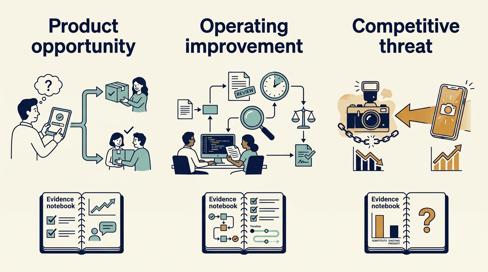

> **IN THIS SECTION, YOU WILL:** Learn to separate the three investment questions inside an AI strategy request and give each its evidence, cost, quality threshold and decision.

> **WHY INVESTORS CARE:** Investors ask for an AI strategy because it can change the product’s value, the cost base and the competitive position of their holding; they need the three answers separated to know which one they are funding.

> **WHY YOU SHOULD CARE:** An AI strategy request bundles a product bet, a productivity claim and a competitive threat into one word; funding them as one decision commits money to the wrong question.

> **KEY POINTS:**
>
> * An AI strategy request hides **three investment questions**: a product opportunity, an internal-work improvement and a competitive substitution. Each needs its own evidence, cost and decision, and someone accountable for holding the three answers together.
> * Measure the **complete workflow**: preparation, production, review, correction and operation. A tool in use is not a useful result, and capacity freed is not cash saved.
> * Keep **experimental results attached to their conditions**. Dated studies of coding assistants point in different directions; test the local effect before an estimate becomes a commitment.

 
An investor asks for an “AI strategy.” The product team hears a new customer feature, the finance team expects lower costs, and the CEO worries about a competitor replacing the product. These are **three different investment questions**: a product opportunity, an operating improvement and a competitive threat. Rolling them into a single adoption target **obscures the economics**. A company can use AI extensively without creating value, create value through one narrow use case, or face substitution even when its own experiments work well.

In the fictional Larkspur scenario used throughout this chapter, the request is specific. The growth investor’s thesis assumes three things: that a paid AI feature is in the product before the next financing round, that implementation and support cost per customer falls as volume grows, and that Larkspur’s scheduling product is not displaced by a general-purpose assistant. Those three assumptions arrive with Priya and Alex as one request, and a headline commitment can be made on the company’s behalf before anyone has examined the work. That is why AI gets a chapter of its own, even though the earlier chapters on product value, engineering, cloud economics and recovery supply most of the tools it uses. The attention around AI brings **hype, shifting vocabulary and claims that are hard to check**, so a way to sort the questions is worth more than another opinion about the technology.

Three terms recur. **Artificial intelligence (AI)** here means software that classifies information, makes predictions or generates content from learned patterns. **Generative AI** produces text, images or code. An **AI model** is the component that learns those patterns from data and produces the outputs; its output needs evaluating in the task where it will be used.

The chapter takes the three questions in turn. For each it states the decision to be made, the evidence required and one Larkspur example with costs, a quality threshold and the action that follows. It first settles who coordinates the answers, because the three questions cross functional boundaries. The value chain from [[roadmap-to-revenue]] and the uncertainty discussed in [[prove-you-can-restore]] stay useful throughout, and an investor’s adviser can help within the boundaries described in [[investors-adviser]]. The analysis is dated September 2026; the cited experiments describe particular earlier tools and populations.

**Figure 1:** *Separate the investment questions before choosing an experiment or making a commitment.*

## Decide Who Coordinates the Three Questions

One common pattern is that the request lands with the technology leader and the answer comes back as a feature roadmap and a coding-assistant pilot, while the rest of the company adopts whatever tools it finds. Yet the internal-work question can be largest outside product and engineering. Implementation, support, sales, legal and finance each run workflows shaped like the ones below: routine work, review, correction and a result somebody depends on, with risks a tool cannot see, such as a customer-facing error or a contractual limit on data use. An answer that covers only the product cannot satisfy an investor whose thesis assumes the whole company works differently, and cannot see a substitute arriving through the sales or service channel.

What this chapter proposes is proportionate coordination, not a new organization. Three decisions settle it:

- **Who coordinates.** At Larkspur, Ines makes Priya accountable for holding the three questions together and reporting on all three to the board, since two of them are product and market questions. Alex is accountable for the shared platform, the evaluation method and data permissions; Sam for the cost and expenditure tests.
- **Which functions participate.** At Larkspur the functions with the largest routine workflows are customer implementation, support and finance, so they join first. Sales and legal join when a question reaches them, for example a contract term on data use. Not every function needs a seat at the start.
- **Which decisions are shared.** Data permissions and vendor terms, the evaluation and review standard, the record of tools and dates, and the rule that a capacity claim becomes a cash claim only through an explicit spending decision. Everything else stays local to the function.

A participating function can name a **champion**: one person with protected time and the authority to run a local experiment and report what the evidence shows. That is an option where the workflow is large enough to justify it, not a requirement for every function; a champion without time or authority becomes a reporting layer rather than a source of decisions. The test of the arrangement is whether each participating function can state its goal, its accountable person and its evidence. A more formal structure, such as the management-system standard in the further reading, can come later if the evidence justifies it.

## Question 1: Is There a Product Customers Will Pay For?

**The decision** is whether to fund a customer-facing AI capability, on what evidence and at what price.

**Evidence required.** Start with the customer’s work, not the model. Compare the complete workflow with the current alternative: how many cases need correction, which errors are hard to detect, whether the customer trusts the output enough to act on it, whether the new workflow is still faster after review and exception handling, and whether the customer would pay. Estimate the **cost per successful outcome** rather than the cost per model request. **Inference**, running a trained model to produce an output, can be cheap while review is expensive, mistakes are common and the customer gains little.

Data is part of the evidence. A large dataset does not by itself give the company an advantage competitors will struggle to copy. Ask whether the company has the rights to use it for the proposed purpose, whether it represents the relevant population, and whether its quality and update process support the task. Separate access from ownership, and training rights from other processing rights: a company that may display information to a user may not hold every right needed to reuse it in a different AI service. Leave the contractual and legal questions to specialist review. The US National Institute of Standards and Technology (**NIST**) identifies risks and suggested management actions across the AI lifecycle in its 2024 Generative AI Profile; it is a voluntary reference, not evidence that a product is compliant or effective. [S18: NIST generative AI profile](https://nvlpubs.nist.gov/nistpubs/ai/NIST.AI.600-1.pdf)

A **demonstration for a funding meeting is different from a product commitment**. Larkspur’s investor wants an AI demonstration before the next meeting. Priya and Alex can agree a bounded demonstration while recording what it does not yet establish: customer demand, reliable performance, permission to use production data and the full cost of serving customers. The financing conversation should not silently turn the demonstration into a promised launch.

**Larkspur example (fictional).** Customers spend hours classifying incoming inspection documents before scheduling maintenance. Priya proposes an AI classification step. The pilot: three customers who agree in advance to a paid pilot and a price, €45,000 of external evaluation and model cost, and six engineer-weeks. The baseline is about four hours a week of manual classification per customer. The **quality threshold**: at least 95% of documents correctly classified on a sample the customer checks, every safety-relevant document routed to a person, and review effort below 1.5 hours a week; above that, the customer saves too little to pay. The decision at week ten: threshold met and two of three customers confirm the price, build for general release, a further ten engineer-weeks the board approves in the operating plan; quality below threshold, redesign as a review aid rather than automated classification; customers decline the price, stop and keep the demonstration as a demonstration.

Chosen: the paid three-customer pilot. Rejected: naming the feature in the financing narrative, which would convert a demonstration into a promise, and building for general release now, with no evidence of willingness to pay. Funding: €45,000 from the discretionary budget Sam holds. Scarce capacity: the six engineer-weeks displace part of the reporting work in the current quarter’s roadmap. Authorized by Ines within the board-approved envelope, with the board told the demonstration is a demonstration. Evidence that would change the decision: customers refusing the price, or review effort failing to fall below the current manual time.

## Question 2: Will Internal Work Improve Enough to Change Spending?

**The decision** is whether an internal productivity investment changes spending, and by which route: avoided hiring, reduced external spending, or more useful output at the same cost.

**Evidence required.** Define the economic mechanism before buying licenses or promising savings. Choose a defined group of tasks and participants and a credible comparison. Record task type, experience, tool and model version, time period and quality criteria. Include the cost of reviewing output and correcting errors. Track whether the experiment changes which work people choose, because **task substitution** can make a simple before-and-after comparison misleading. Decide in advance what would justify continuing, expanding, redesigning or stopping: if quality falls below the requirement, faster completion is not enough; if the team produces more useful work at the same cost, the result may be valuable without reducing headcount. A pilot should also reveal the operating burden: who updates evaluations when the model changes, who handles **regressions**, cases where an update makes previously acceptable behavior worse, and what happens when the provider is unavailable or changes its terms. A capability needs an accountable leader who outlasts the first demonstration.

Saved time is capacity, not cash. It becomes a saving only through a further operating change, such as avoiding a planned hire or cutting external spending, and revenue only if it enables work customers buy; [[roadmap-to-revenue]] works through that conversion plan. The AI-specific complications are that review and correction can absorb much of the saved time, that errors can be plausible and hard to detect, and that announcing a staffing reduction before demonstrating the mechanism can remove the people needed to evaluate the output.

> **Evidence box: what the coding studies show, with their dates and limits.** A **controlled experiment** compares outcomes under different conditions, such as doing a task with and without a tool. One run in 2022 and published by Peng and colleagues in 2023 asked developers to build a small web **server** in JavaScript; among participants who completed the task, those given GitHub Copilot took 55.8% less time on average. That supports a claim about that bounded task, not an equivalent cut in an engineering budget. [S19: Peng et al., Copilot experiment](https://arxiv.org/abs/2302.06590) **METR**, an AI evaluation research organization, ran an early-2025 **randomized study** with experienced developers working on their own open-source projects; tasks took 19% longer when AI was allowed, a different population, setting and tool period. [S20: METR early-2025 experiment](https://metr.org/blog/2025-07-10-early-2025-ai-experienced-os-dev-study/) In February 2026 METR reported that its follow-up had serious selection and measurement problems: developers and tasks were increasingly excluded from the measured sample, and running several AI agents at once complicated time measurement. The researchers’ own inference was that the excluded participants and tasks were likely to benefit more from AI; that is their judgment, not a measured property of the excluded cases. They called the new data a weak guide to the size of current effects. [S21: METR 2026 update](https://metr.org/blog/2026-02-24-uplift-update/) These studies are not competing universal laws. Their differences show why context, task selection, tool version and outcome definition belong in the decision, and a favorable coding result is only one step in delivery: product decisions, review, testing, release and customer adoption can become the limiting steps.

**Figure 2:** *Measure the complete local workflow and its output before converting a task result into a financial promise.*

**Larkspur example (fictional).** The investor’s thesis assumes support cost per customer falls. Larkspur’s six support agents handle about 1,200 tickets a month, and a seventh hire is planned for the second quarter as volume grows. The pilot: three agents use an assistant to draft responses for eight weeks while the other three continue unchanged as the comparison; licenses and evaluation cost about €6,000, plus one engineer-week to connect the knowledge base. Data permission is settled first: the assistant receives ticket text, not customer contract documents, until legal confirms the terms allow it. Measured: complete handling time including review and correction, the reopen rate when a customer comes back, and a sampled error check. The **quality threshold**: reopen rate and sampled error rate no worse than the comparison group. The decision rule: complete handling time at least 20% shorter with quality held, defer the seventh hire by two quarters, avoiding roughly €32,000 of a €64,000 annual cost in the year, the capacity route rather than a headcount reduction; less than 10% shorter, stop paying for licenses; in between, restrict the tool to the ticket categories where it helped.

Chosen: the eight-week pilot with a comparison group. Rejected: a company-wide license purchase with no local evidence, and telling the investor that support headcount will fall, which would remove the reviewers the pilot depends on. Funding: €6,000 from the operating budget Sam holds. Scarce capacity: one engineer-week. Authorized by the operations lead, with Priya coordinating and Sam testing the expenditure claim. Evidence that would change the decision: a rising reopen rate, or agents choosing simpler tickets while the tool is on.

## Question 3: Can a Substitute Replace the Product Customers Already Buy?

**The decision** is whether to defend, partner, reprice or stop a feature investment in the face of a substitute.

**Evidence required.** AI might make a feature easier for competitors to reproduce, reduce the customer’s need for a workflow or shift value toward a different interface. These are hypotheses. Testing them needs customer evidence and a view of **switching costs**, the money and effort needed to move to another product, along with access to customers, trust and the full task being performed. A product’s advantage may lie in reliable execution, specialized knowledge, regulatory integration, customer relationships or embedded workflow rather than in the difficulty of generating code. Conversely, an existing customer base does not guarantee that a new interface will preserve the company’s role.

**Larkspur example (fictional).** The customer task a substitute could perform: a customer’s planner produces next week’s maintenance schedule from an asset list and technician availability. A general-purpose assistant can already produce a plausible weekly schedule from a spreadsheet. What it cannot do today is push the schedule to technicians’ devices, re-plan when a job overruns, or keep the inspection record the customer’s regulator expects. That is the **switching constraint**: the dispatch integration and the records. Small customers with simple assets and no regulatory record have the least to lose by switching. The test: Priya asks five customers, two small and three regulated, to produce one week’s schedule with a general assistant and record what they lost; sales tracks renewal conversations with small customers for a quarter. Cost: €15,000 and two engineer-weeks to export the data the customers need for the test.

The evidence maps to four actions. If regulated customers lose records or live re-planning, **defend**: fund the compliance and dispatch depth. If small customers run a week without losing anything they value, **reprice**: move the price toward dispatch and records and drop the standalone schedule-generation tier. If customers want to keep their assistant and use Larkspur’s records, **partner**: offer an interface rather than compete with the assistant. If the planned “smart schedule suggestions” feature, €120,000 and eight engineer-weeks on the roadmap, would only replicate what the assistant does, **stop** it.

Chosen: pause the smart-suggestions feature pending the test, and run the test. Rejected: accelerating the feature to keep up, which would spend eight engineer-weeks competing on the substitute’s ground, and ignoring the threat because renewals look stable. Funding: €15,000 from the product research budget. Scarce capacity: two engineer-weeks. Authorized by Ines, with the board informed, because the pause changes a roadmap item the investor has seen. Evidence that would change the decision: a lost renewal citing an assistant, or the regulated customers finding an acceptable workaround for their records.

## Three Funded Decisions and Their Review Triggers

| Question | Decision taken | Funding and capacity | Accountable | Review trigger |
| --- | --- | --- | --- | --- |
| Product opportunity | Paid three-customer classification pilot | €45,000; 6 engineer-weeks | Priya | Week 10: quality threshold and price confirmation |
| Internal work | Eight-week support pilot with comparison group | €6,000; 1 engineer-week | Operations lead | Week 8: handling time and reopen rate |
| Competitive substitution | Pause the suggestions feature; customer substitution test | €15,000; 2 engineer-weeks | Priya | End of quarter: what customers lost; renewal signals |

Together the three decisions commit €66,000 and nine engineer-weeks from the same team that carries the roadmap and the recovery work; [[cannot-fund-everything]] shows how that trade is made explicit. Whatever the function, assess an AI investment through the complete task: what improves, how quality is checked, what the workflow costs and who maintains it as the technology changes. Record the tools and dates so later readers know which evidence still applies.

The sharpest version of that capacity collision arrives when a transaction adds a whole business’s workflows, systems and customers on top of the existing roadmap. The next chapter examines what an acquisition or a separation asks of the same people before it adds any value: [[acquisition-adds-work-first]].

## Questions to Consider

1. *When your investor asks for an “AI strategy”, which of the three questions are they asking, and who in your company is accountable for holding the three answers together?*
2. *For your most promising AI use case, what is the cost per successful outcome once review, correction, data preparation and monitoring are included, and what quality threshold was agreed before the pilot started?*
3. *If a productivity pilot saved 1,000 hours a quarter, which spending decision would turn that capacity into cash, and who is authorized to make it?*
4. *Which customer task could a general-purpose substitute perform today, what constrains switching, and which evidence would make you defend, partner, reprice or stop?*

## To Probe Further

- **[Generative AI at Work](https://www.nber.org/papers/w31161)** — Erik Brynjolfsson, Danielle Li and Lindsey Raymond, National Bureau of Economic Research working paper, 2023. *A study of 5,179 support agents given an AI assistant, which shows the internal-work question examined outside engineering with the full workflow measured rather than tool usage.*
- **[Navigating the Jagged Technological Frontier](https://www.hbs.edu/faculty/Pages/item.aspx?num=64700)** — Fabrizio Dell'Acqua and colleagues, Harvard Business School working paper, 2023 (later in Organization Science). *A field experiment with 758 consultants that supports the chapter's point that productivity results stay attached to the task, and shows what a bounded experiment looks like.*
- **[Large Firms With at Least 20 Employees Biggest AI Users](https://www.census.gov/library/stories/2026/05/ai-use-businesses.html)** — United States Census Bureau, May 2026. *A public baseline for AI adoption by company size and sector, useful when an investor's expectation seems out of step with what companies actually report.*
- **[Disruptive Technologies: Catching the Wave](https://hbr.org/1995/01/disruptive-technologies-catching-the-wave)** — Joseph Bower and Clayton Christensen, Harvard Business Review, 1995. *The article that introduced disruptive technology, which gives the chapter's substitution question a structure by asking which customers a substitute serves first.*
- **[ISO/IEC 42001:2023 — Artificial intelligence management system](https://www.iso.org/standard/81230.html)** — International Organization for Standardization and International Electrotechnical Commission, 2023. *A paid standard whose structure of policies, roles, risk assessment and supplier oversight is the more formal arrangement a company can compare against the proportionate coordination proposed in this chapter.*
